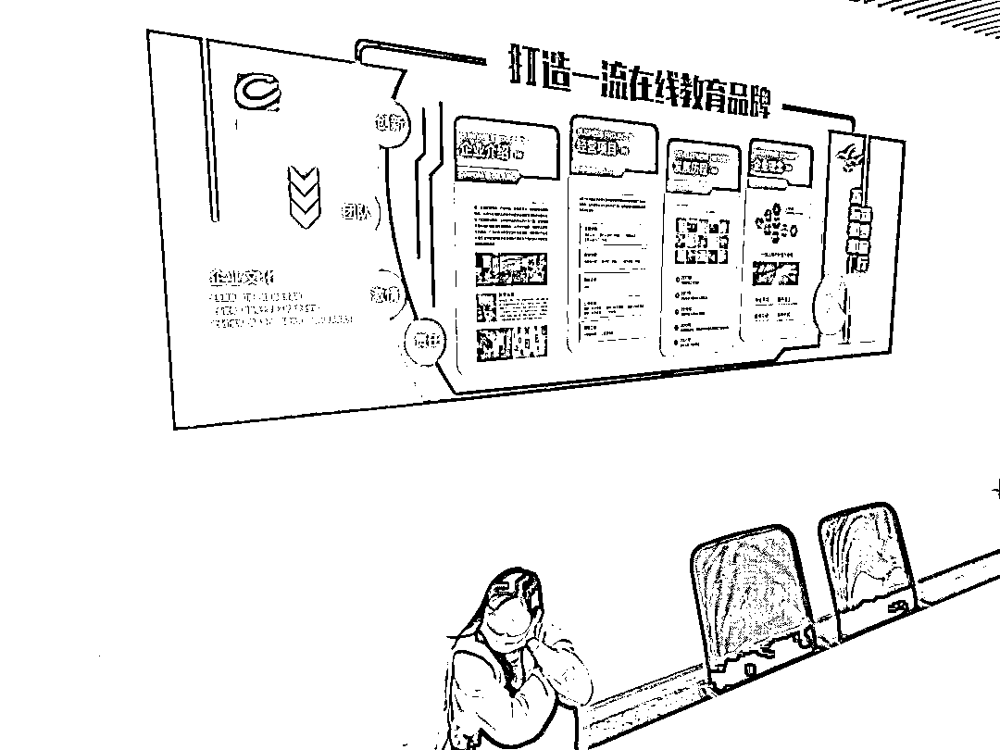
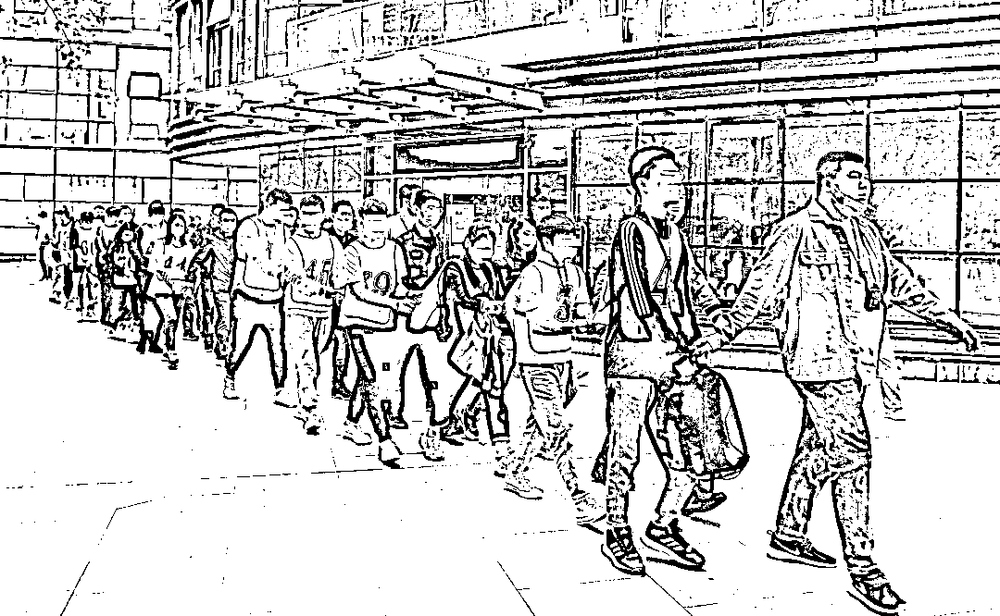

# “考证必过”？报名试试？小心被骗！

> 原文：[`mp.weixin.qq.com/s?__biz=MzIyMDYwMTk0Mw==&mid=2247513927&idx=7&sn=88d27e19611243b1773b629434bc49a2&chksm=97cb7c7fa0bcf569ecf33ce7830abf0d07610177b8800af7b7ac0854b9296cf3b75b79836a39&scene=27#wechat_redirect`](http://mp.weixin.qq.com/s?__biz=MzIyMDYwMTk0Mw==&mid=2247513927&idx=7&sn=88d27e19611243b1773b629434bc49a2&chksm=97cb7c7fa0bcf569ecf33ce7830abf0d07610177b8800af7b7ac0854b9296cf3b75b79836a39&scene=27#wechat_redirect)

“打造一流在线教育品牌”、“梦想从这里启航”、“帮助每个年轻人成就职业梦想”，这是北京市的一家在线教育培训机构企业文化墙上展示的标语，处处彰显着企业的追求与愿景……

然而，这家看似正规的教育企业，其背后却是一个电信网络诈骗团伙的窝点。

日前，辽源市公安局经过一个月的缜密侦查，重拳出击，一举掀开其华丽却虚假的外衣，将这个经营数年、涉案人员 84 名、涉案金额 5000 余万元的特大电信网络诈骗窝点成功捣毁。

交纳 9000 余元学费

两次考试均得零分

家住辽源市的小苏是一名银行职员，考取银行从业资格证书是其在银行工作以来的一个心愿。2020 年，小苏在网络上看到了一家在线教育培训机构的广告，登记信息后，业务人员随即致电称，他们机构的押题准确率特别高，并且与发证机关有内部渠道，能提供保过名额，只要报考，就能通过考试。小苏一时心动，便交纳了学费。 

 2020 年 10 月末，小苏第一次参加了银行从业资格考试，成绩出来后，却发现自己得了零分，于是赶紧和业务员联系。业务员称由于他们近日工作繁忙，忘记将其名额上报了，让其再参加一次考试，可当小苏第二次完成考试后，自己的成绩却还是零分。此时，业务员解释称，发证机构分配给他们的名额有限，小苏未能赶上，建议其续费升级到 VIP。此前小苏已分三次交纳了共计 9000 余元的学费，意识到自己可能被骗了，小苏要求退还之前的学费，几经投诉未果后，被对方拉了黑，失去了联系。

 2021 年 3 月 18 日，小苏来到辽源市公安局向阳分局报了案。

**机构组织严密**

**业务人员经过话术培训**

****

**** 警方接到报案后，通过进一步综合梳理研判案件信息。初步查明，这家在线教育培训机构的背后是以河北籍张某权、张某青、史某玉、武某飞等人为首的家族式犯罪团伙，他们利用“虚构保过”、“内部名额”等手段诱导考取各类职业资格证书的消费者上当，进行网络诈骗犯罪活动。****

****此后，辽源市公安局成立了由向阳分局、刑警支队、技侦支队、网安支队联合组成的专案组，对案件展开全面侦查。****

****专案组经过深入侦查，发现该机构公司化运营，结构清晰，组织齐全，人事、财务、市场、技术、客服等部门分工明确，考勤制度严谨，通过钉钉打卡、请假。公司以销售网课为主要业务，设有直通班、协议保障班、VIP 取证班，课程收费单科定价分别为 880 元、1380 元、2180 元，最高价者达到 6800 元。****

****“如何取得客户的信任，如何能够让客户下单，如何让客户购买高价产品。”对于新入职的员工，该机构安排专人进行系统培训，通过话术脚本演练，让新人尽快融入角色。****

****“我们的课程覆盖 95%的考点，有 80%的相似题，考试通过率 96%以上。”“我们与发证机构有关系，可提供内部资料，确保过考。”“协议保障、不过包退。”这些承诺性描述，是业务人员必不可少的话术技能。****

****虽然看上去这是一家正规的教育培训机构，但是细心的民警还是发现出其中隐藏的猫腻。首先该机构与消费者宣扬的各种承诺，都无法兑现，所谓的课程和押题试卷，均是从网上剽窃而来，经过简单加工，进行贩卖。其次是课程售价十分随意，虽然每科都有定价，但是业务人员的工位上，都会张贴着从 95 折到 6 折不等的价格明细表，由业务员根据客户的接受能力，伺机定价，“只要能成交，不在乎价格多少。”再次，当客户质疑业务员的身份时，则会通过微信发送一张他人的身份证照片，以示诚意。****

****先骗再赖****

****最后不灵就失联****

********

****先通过各种承诺骗取消费者的信任，一但受害者觉醒提出退费诉求，便一再推诿，以各种理由对其无法履行承诺的行为进行抵赖，利用考试的周期性长的特点，消磨受害者的维权意识。如再不行，机构则以学员未能完成 68 个小时的学时为由，认定学员违约在先，不予退款也成了“理所应当”。而实质上，该机构网站的后台人员，早已通过技术手段修改了学员的学时。最后若还是不成，那就切断一切联系。**** 

**** 为攫取更多的暴利，机构管理层加大业务提成，通过高薪诱惑，不断催使业务人员奋力开展业务，公司要求业务人员每日必须与客户有效通话时长达到 6000 秒，或者添加客户微信 10 人。经调查，该公司业务人员业绩优秀的月薪最高近 5 万元，普通的也能达到 2 至 3 万元。一方面是诈骗团伙成员凭着这些诈骗行径，赚足了腰包；而另一方面，全国各地成百上千的受害者，少则几千、多则数万的血汗钱被骗，纷纷叫苦不迭。****

******网上投诉不断******

******官方曾发布消费警示******

************

******在这家培训机构会议室的企业文化墙上，显著地标示着“打造一流在线教育品牌”的企业愿景。形成强烈反差的是，在网络上搜索这家在线教育培训机构，办案民警发现，2020 年以来，其在网络上名声早已是臭名昭著，网友怨声载道，在各种投诉平台上的投诉量及话题量常常是居高不下。******

************ 

******2021 年 2 月，北京的市场监管部门曾发布谨慎选择教育培训机构的消费警示：“2020 年 12 月 21 日至 2021 年 1 月 20 日内，有 9 家教育机构投诉数量大、解决率低。”这家培训机构名列其中。据公开资料显示及警方调查，这家公司已成立多年，曾多次变更企业名称，一经名声变臭，便更换名称继续经营。******

****150 余名民警奋战 60 小时****

****抓获 84 名嫌疑人****

********

**** 经过前期充分的侦查摸排，4 月 22 日早 6 时，专案组调集 150 余名警力，启程远赴该诈骗团伙窝点的所在地实施抓捕任务。****

******** 

****4 月 23 日上午 9 时，这家在线教育培训机构，像往常一样，领导和员工准时来到公司上班，喊口号、开早会，之后大家陆续沉浸在各自的岗位中。不经意间，一列整齐的队伍忽然冲进办公大厅。“我们是辽源公安，请大家双手抱头，不要乱动。”**** 

******** 

****随即，10 个抓捕小组以公司各职能部门为对象，迅速开展抓捕搜查工作。150 余名办案民警，近百名嫌疑人，挤在近 400 平方米的写字间内，现场却未显嘈杂，秩序一片井然。**** 

******** 

****身着便衣的民警，为了方便识别，首先为所有嫌疑人员穿上颜色醒目的马甲，然后采取强制措施；技术民警第一时间控制住嫌疑人的手机和电脑，对照人员张贴信息；填写法律文书、现场指认拍照、搜集各种证据、扣押涉案物品，现场各环节分工明确，有条不紊的展开。**** 

******** 

****4 月 23 日 14 时，现场抓捕搜查工作结束，按照事先制定好的审讯策略，专案组迅速开展第一轮审讯工作。然而接下来的审讯工作却并不顺利，等待民警的是一场智慧与耐心的对决。**** 

********

****几名头目悉数落网后，拒不配合调查，不断地与审讯民警周旋，将利用虚假承诺实施诈骗的违法行为推诿到下面业务人员身上，坚称是业务人员的个人行为。****

********

****面对团伙头目的抵赖行为，办案民警并未气馁，在审讯的同时，外围民警仔细地调取成千上万的钉钉、微信记录，以及公司内部海量的相关信息。经过 10 余小时的鏖战，在大量的铁证面前，狡猾的犯罪分子终于低下了头。****

********

**** 4 月 24 日 18 时许，84 名犯罪嫌疑人被押解回辽源，在进行核酸检测以及相关身体检查后，送至羁押场所。目前，专案组正在开展后续侦办工作。****

****来源：吉林警事，利箭在行动****

****************

****← 向右滑动与灰产圈互动交流 →****

********