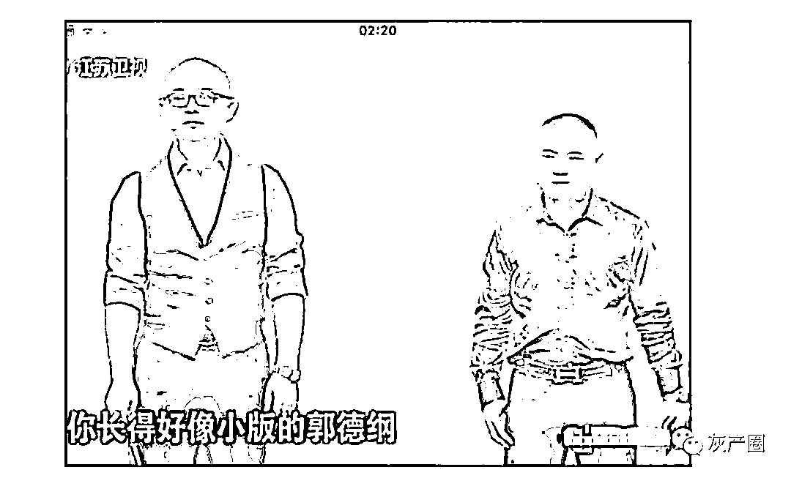
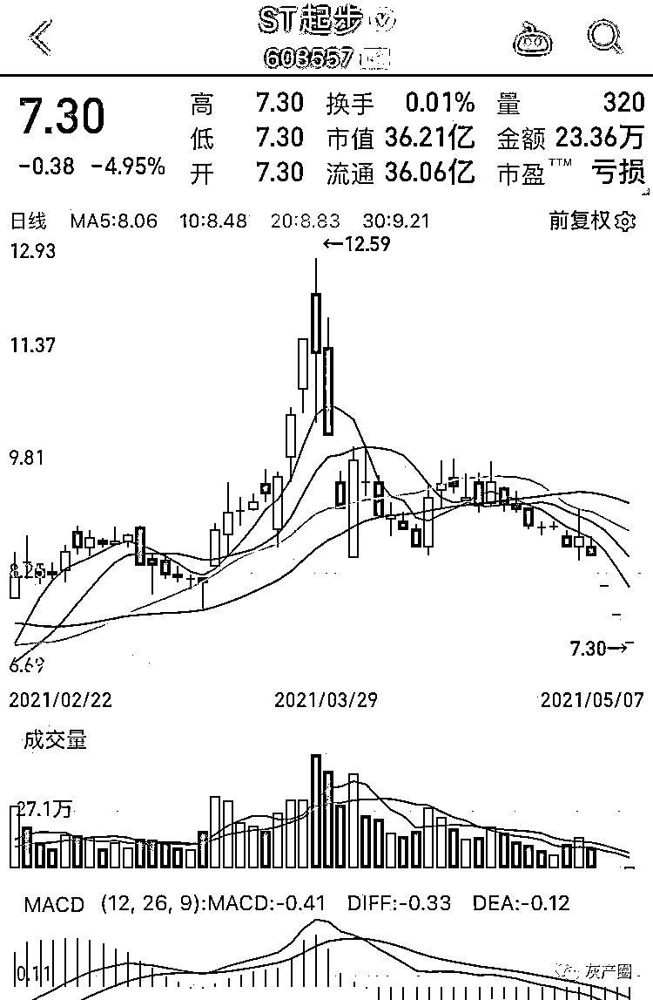
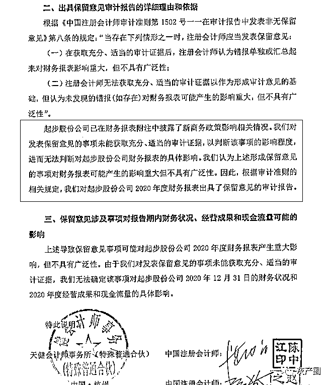
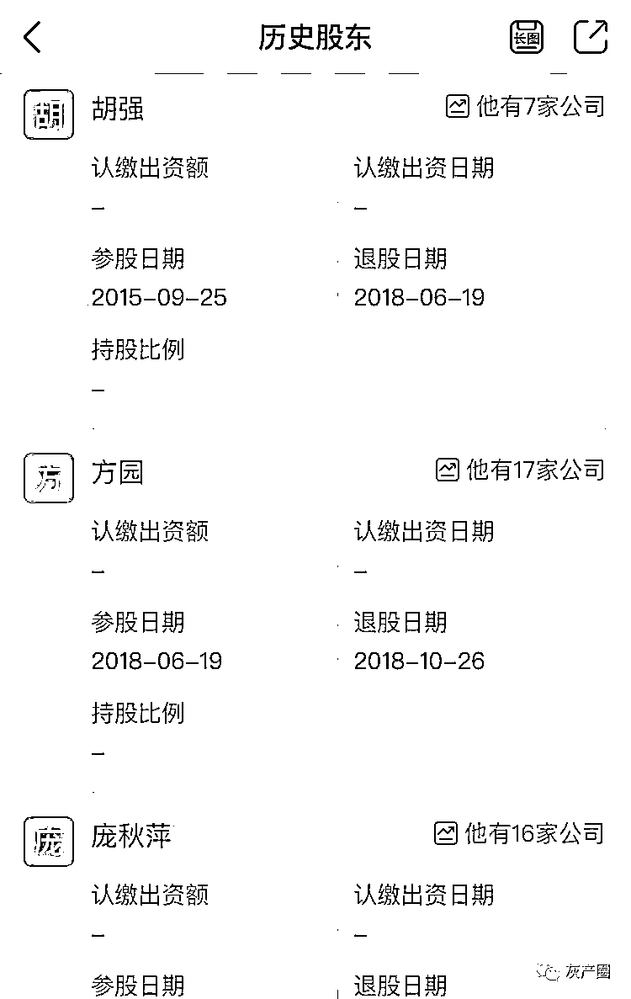
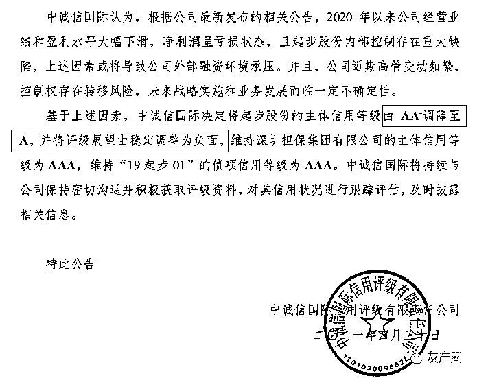

# 财经大 V 被封号！非法荐股，辛巴也被套牢，初中没毕业曾刷脸非诚勿扰

> 原文：[`mp.weixin.qq.com/s?__biz=MzIyMDYwMTk0Mw==&mid=2247513981&idx=1&sn=17f7032a7ecba0b131b3e96d32fd11a2&chksm=97cb7c45a0bcf55351bf2134bb60ad17c2bf27bce2c482510204b42f0a5890d8b2d2e36f3b90&scene=27#wechat_redirect`](http://mp.weixin.qq.com/s?__biz=MzIyMDYwMTk0Mw==&mid=2247513981&idx=1&sn=17f7032a7ecba0b131b3e96d32fd11a2&chksm=97cb7c45a0bcf55351bf2134bb60ad17c2bf27bce2c482510204b42f0a5890d8b2d2e36f3b90&scene=27#wechat_redirect)

财经大 V“重生小强”最近被封号了！其坐拥 56 万粉丝，在网络非法荐股，导致大批投资者被套牢。然后，他消失了……

“重生小强”本名胡强，四川绵阳人，初中未毕业。他上一次出名是在 2015 年，作为《非诚勿扰》男嘉宾上场，声称要找比自己高的漂亮女友，结果全场灯灭。

**胡强曾上非诚勿扰**

胡强这一次出名是被封号后消失了，但网络上还流传着他的传说：他以抖音财经大 V 的身份，诱导粉丝购买起步股份（603557.SH）这只“辛巴概念股”，导致粉丝巨亏。如今起步股份已经被 ST。

“重生小强”是想借辛巴效应荐股不料失败？还是和庄家联手割韭菜？目前还不得而知。

**今日，抖音安全中心相关负责人回应红星资本局称，“抖音禁止并坚决打击非法荐股行为，相关账号经用户举报后被封禁。”**

**抖音大 V 非法荐股翻船**

**抖音、微博账号都已清空**

****

****5 月 7 日，起步股份（股票简称“ST 起步”）开盘一字跌停，报 7.30 元，已经是第三个一字跌停，盘中逾 40 万手封单封死跌停，投资者欲逃无门。从目前换手情况看，还不知道何时才能打开跌停。****

********

******ST 起步股价连续跌停******

****在网络社交平台，被抖音财经大 V“重生小强”非法荐股忽悠买入该股的投资者，各种投诉、举报甚至哭诉比比皆是，但“重生小强”已经不知所踪。目前，其抖音号被封，个人微博也显示“因作者设置，暂无可见内容”。****

******“五一”小长假前的 4 月 28 日晚间，起步股份一口气披露了数十份公告，其中包括业绩暴雷、年报被非标、控制权存在不确定性、管理层发生动荡等。******

****起步股份年报显示，2020 年实现营收 7.73 亿元，同比下降 49.23%；净利润由盈转亏，亏损 2.80 亿元，同比减少 295.31%。公司将亏损归因于疫情，称在新冠疫情的影响下，线下销售渠道受创，导致线下渠道业绩下滑较多。同时，公司为支持经销商及附属门店渡过难关，推出租金补贴、装修补贴、疫情补贴等一系列扶持政策。该笔补贴费计入销售费用，导致净利润减少。****

****然而，这份年报却被天健会计师事务所出具了保留意见。其披露专项说明称：“起步股份已在财务报表附注中披露了新商务政策影响相关情况。我们对发表保留意见的事项未能获取充分、适当的审计证据，以判断该事项的影响程度，进而无法判断对起步股份公司财务报表的具体影响。”****

********

******此外，天健会计师事务所出具了否定意见的《2020 年度内部控制审计报告》，认为起步股份违反了《股票上市规则》、《上市公司信息披露管理办法》、《信息披露事务管理制度》的相关规定，****未按要求对关联方资金往来和对外担保事项及时履行信息披露。起步股份的内部控制未能防止或及时发现并纠正上述违规行为，存在重大缺陷。****** 

****由于存在上述重大缺陷及其对实现控制目标的影响，根据《股票上市规则》规定，起步股份股票将被实施其他风险警示。4 月 29 日，公司股票停牌一天，4 月 30 日起股票简称将改名为“ST 起步”，随后几个交易日公司股价暴跌，投资者损失惨重。****

****而在起步股份出年报之前，拥有 56 万粉丝的抖音财经大 V“重生小强”，一直大力鼓吹买入起步股份。**红星资本局查看多个流出的视频发现，其荐股行为极具煽动性和迷惑性，以所谓“内幕”“黑马”“成功率”不断神化自己。在其煞费苦心的表演之下，许多投资者放松了警惕，纷纷跟风买入起步股份票。******

****随后起步股份直接被 ST，其股价连续一字跌停。耐人寻味的是，即使眼下已经发生事实上的亏损，但仍有部分股民心存侥幸，不愿承认上当受骗，还对“重生小强”抱有幻想，甚至主动为其找理由开脱。****

******推荐起步股份并忽悠加仓******

******快手辛巴入股已经被套******

************

******受害者祁先生 5 月 6 日告诉红星资本局，自己关注“重生小强”时间并不长，开始也保持警惕，但看到他天天吹嘘自己炒股多么厉害，并且晒出以往的“战绩”让人仰慕。此外，之前布局的几个股票也赚了点小钱，慢慢取得了大家的信任，开始追加投资。**“很多人都跟我一样，信任后就加大了投资力度，这一次我损失了大约 6 万元，还卖不出去，希望其他人能早点醒悟。”********

****祁先生表示，他后来发现，“**重生小强”实际已经推荐过多只股票，比如 10 只股票总有一两只会大涨，然后就极力鼓吹这一两只大涨的股票**；而粉丝是不断新增或更新的，并不会去关注那些不涨甚至下跌的股票，所以具有很强的欺骗性。加之他近期确实有股票推荐成功的案例，不但让其人气猛增，也收获了很多粉丝的信任，认为他确实“很厉害”、“有内幕”。****

****红星资本局注意到，“重生小强”近期推荐的股票包括美邦服饰（002269.SZ），连续大涨后引来很多粉丝膜拜。不过他推荐的众信旅游（002707.SZ）、万东医疗（600055.SH）等个股则表现一般，甚至被称“找人接盘”。起步股份在“重生小强”推荐后跌跌不休，市场已经选择“用脚投票”后，中途也有多次离场机会，但“重生小强”却不停地鼓吹，说是技术性调整，让粉丝们坚定信心、耐心持有，结果这只股票从 12 元以上已经跌到 7 元多。****

****受害者徐先生表示，自己买入起步股份的成本是 9 元多，连续下跌后“重生小强”仍在大力鼓吹。“4 月以来，起步股份一直在 8.4-9.7 元左右震荡，小强忽悠大家说这是强烈洗盘，坚决拿住不要卖，这价格今后绝对买不到了。**总之就是‘老铁别走，加仓干！’”徐先生听从他的建议一路加仓，直到股票被 ST，自己也被彻底套牢。******

****有投资者认为，在“重生小强”的背后，可能有庄家利用部分投资者偏爱内幕消息、喜欢跟庄操作的心态，诱骗投资者限时、现价、全仓跟随买入，实际往往是为庄家出货接盘。****

****不过也有“重生小强”的粉丝认为，胡强只是想借起步股份“网红概念股”的关注度蹭人气，他历来喜欢蹭名人流量，这次想蹭辛巴这样的头部网红荐股，不料直接翻船。****

****起步股份是近年来有名的“网红概念股”，与包括快手最大带货主播辛巴在内的多名网红合作频繁。甚至辛巴的一举一动，也直接影响着起步股份股价的大幅波动。****

****2020 年 9 月，起步股份公告称，公司控股股东香港起步向广州辛选投资有限公司、张晓双分别转让起步股份 5%的股权，交易合计对价为 4.32 亿元。广州辛选投资正是带货主播辛巴旗下公司，由辛有志（辛巴原名)及其表妹计梦瑶于 2020 年 4 月成立，注册资本 1 亿元，其中辛巴占股 95%。张晓双则为辛选投资联合创始人。****

******通过股权穿透，辛巴实际则掌握了起步股份 10%的股权，同时也是起步股份的第二大股东。**蹭上网红热度后，沉寂已久的起步股份股价直接“起飞”，一口气收获了五个涨停板，最高达到了 17.55 元/股。****

****然而此后因辛巴售“假燕窝”事件影响，辛巴账号被封 60 天，导致起步股份股价一度跌停。辛巴账号复播后又因保安“封路”事件，让起步股份的股价连续两个交易日跌停，市值蒸发近 10 亿元。头部主播辛巴的影响力由此可见一斑。****

****按照 ST 起步 5 月 7 日最新的股价 7.30 元计算，辛巴也已经被套住，其持股市值下跌逾 20%，且短期还看不到止跌。****

******曾上《非诚勿扰》刷脸******

******喜欢晒自己与名人的合影******

************

********作为抖音财经大 V 的“重生小强”，其实在 6 年前的婚恋交友真人秀节目《非诚勿扰》中就火过一回。其本名胡强，节目中其自称来自上海，实际是四川绵阳江油人，1989 年出生，初中未毕业就出来“混社会”，18 岁做过包工头，23 岁做过北漂，中途还在成都呆过一段时间。2013 年，胡强到上海成立了一家投资公司。********

********胡强以《非诚勿扰》男嘉宾身份亮相时十分引人注目，其身材、发型、外貌都被认为是著名相声演员郭德纲的翻版。不过在第一轮女嘉宾投票时，24 盏灯就只剩下了 13 盏。胡强还淡定地调侃自己：“我本身都长成这样了，再没有一点自信和内心的强大怎么混啊。”而对于女友的要求，胡强宣称：“我就是想找一个漂亮的女朋友，最重要的还要比我高。”但最后全场灯灭，胡强黯然退场。********

**********在节目中胡强高调表示，自己在上海创立了一家金融公司，并结识了马云、马化腾、王健林、潘石屹、柳传志等名人。他自信地说，“赚钱对我来说，是一件很简单的事。我立志要成为像马云、潘石屹那样有影响力的人，做一个高大上的企业家。”**********

************

********胡强喜欢蹭名人合影********

******后来，胡强又多次参加过其他电视、网络真人秀活动，均未成功，却混了个脸熟。******

******然而，**红星资本局调查发现，胡强宣称的所谓结识的名人朋友，全是他“混圈子”和一些名人的合照。**从这些照片看，他开豪车、住豪宅、出入高档场所，酷爱混各种看起来高大上的圈子，包括马云、李连杰发起的太极禅，外滩游艇会，各种 EMBA 班，商会明星晚宴等，到处都能看到他蹭名人合照的身影。******

******事实上，在出席一些商业活动时，以粉丝身份蹭名人合影并非难事，这些名人在公众场合往往也不便拒绝。但胡强在网络上公开晒出这些合影，并宣称自己结识了马云、马化腾、潘石屹等名人，这对外人来说颇具迷惑性、欺骗性。**有投资者表示，自己就是轻信了胡强与名人的合影，以为他有很大能耐，没想到却是个“大忽悠”。********

********曾是 P2P 玩家早有案底********

********换个马甲以抖音财经大 V 自居********

****************

**********天眼查 APP 显示，胡强于 2015 年 9 月成立了上海域宏股权投资管理有限公司（以下简称“上海域宏”），自任董事长。这家公司宣称“人人财富增值，人人互利互惠”，为用户提供个人理财优质便捷的微型金融服务，其实质就是 P2P 业务，目前已经全面取缔、清退。**********

**********上海域宏因 2017 年涉嫌互联网金融诈骗，被投资者多次举报要求退钱，后来公司显示经营异常，上海域宏也因涉嫌 P2P 跑路，导致众多投资人血本无归。直到今天，网上还可见大量网友发帖：“域宏股权的理财产品真实吗？”“被域宏 APP 骗了的钱该如何追回？”“我被域宏平台骗了 5 万元，怎么办”等等。**********

**********面对这些各种疑问，当时担任上海域宏法人代表的胡强却在微博上公开回应：**“本公司从未开发此类理财 APP，诈骗公司冒名，请大家转发千万别上当，已经投资上当的赶紧报警。”************

**********2018 年 6 月，胡强退出上海域宏法定代表人和股东身份，此后该公司法定代表人走马灯式地更换，差不多每年都要换人。目前上海域宏仍有多达 45 条预警提醒。**********

****************

**********2018 年胡强退出上海域宏**********

********2019 年 9 月，胡强成立了上海遇红文化传媒有限公司，“遇红”的名字几乎与“域宏”同音。此后，胡强本人转到抖音开直播，“重生小强”由此而来，**其大玩圈层文化、人脉资源变现，渐渐以抖音财经大 V 自居。**********

********在抖音开直播期间，胡强故意把姿态放得很低，称自己只是资本圈的小朋友，也是“打不死的小强”。他还经常跑去怼一些网上的骗子，揭穿几个主播的老底，渐渐打造了自己的“正能量”人设，吸引了几十万粉丝的关注，每晚看他直播的人都很多。********

********由于自身专业知识欠缺，胡强往往缺乏常识，比如他在抖音直播中信口开河，宣称“全国都没有 5 张基金牌照，他就有本事能拿下一张”；还叫粉丝去考基金从业资格证，到时候去他公司上班。这些随口乱说的话看了让人哭笑不得，稍有一点财经常识即可识破，但一些缺乏辨别能力的人却信以为真，还吸引了大量粉丝追捧。********

**********当粉丝暴增之后，“重生小强”开始非法推荐一些股票，甚至还要向部分粉丝收取高额入会费，借以提示所谓的消息股、买卖点等。名为“推荐股票”，更像“杀猪盘”。此次极力鼓吹的起步股份就是其中典型，其在推荐时股价 9 元以上，如今连续跌停后只剩 7.30 元，且不知何时打开跌停。**********

**********“黑嘴”非法荐股**********

**********或构成诈骗罪**********

********************

************起步股份一季报数据披露，截至 2021 年 3 月 31 日，公司股东户数为 3.4 万户，较 2020 年四季度增加 4857 户，增幅达 16.65%，其股东户数也高于行业平均水平。************

************5 月 6 日晚间，起步股份又发布多个公告，其中，吴剑军因个人原因辞去公司副总经理职务，不再担任公司任何职务；公司同意聘任李云雷为公司副总经理。另一份公告则显示，公司已被中诚信国际调降主体信用等级。************

************中诚信国际认为，2020 年以来起步股份经营业绩和盈利水平大幅下滑，净利润呈亏损状态，且公司内部控制存在重大缺陷，上述因素或将导致公司外部融资环境承压。并且，公司近期高管变动频繁，控制权存在转移风险，未来战略实施和业务发展面临一定不确定性。**基于上述因素，中诚信国际决定将起步股份的主体信用等级由 AA-调降至 A，并将评级展望由稳定调整为负面。**************

********************

**********如今，起步股份卷入“杀猪盘”风波，又涉及抖音财经大 V“重生小强”非法荐股，是否联手庄家割韭菜？公司如何看待此事？红星资本局致电上市公司，但公开的电话一直无人接听。**********

************近年来，互联网“非法荐股”违法活动频发，严重扰乱证券市场秩序，损害投资者利益，监管部门也为此多次对外发声，让投资者警惕互联网“非法荐股”风险。从以往案例来看，部分股民听信所谓“专家、老师”的推荐，稀里糊涂买入推荐的股票，然后猝不及防遭遇惨重损失。************

********就在近期，北京证监局通报第七批《北京辖区不具备经营证券期货业务资质机构名单》，该名单共 18 个企业或平台名称，含微博“天津股侠”、微博“小红帽爱股票”、微博“王金生”、股海明灯网站等，上述微博“大 V”拥有数百万粉丝。北京证监局表示，这些场外配资或投资平台、财经自媒体存在极高风险，请广大投资者提高警惕，远离非法证券期货活动，避免财产损失。********

********泰和泰律师事务所律师卢怡表示，网上的所谓“专家、老师”，通过社交媒体账号发布与股票相关的信息，并且涉及到具体个股、概念板块的走势分析，已经涉嫌非法从事投顾咨询业务。如果投资者受到非法荐股活动的侵害，可向证监会和各地证监局举报，或向公安机关报案。同时，互联网公司作为平台的提供者，在非法荐股环节也负有一定的监管责任。********

********此前已有“黑嘴”因非法荐股，被法院判决构成诈骗罪。据裁判文书网披露，法院判决邹春桂、谭芝情、何建成三人组成的非法荐股团伙，以非法占有为目的，骗取他人财物，数额巨大，其行为已构成诈骗罪。即使向被害人退还了大部分违法所得，依然需要承担刑事责任。最终三名“黑嘴”被判处有期徒刑一年二个月至三年不等。********

********************************

********← 向右滑动与灰产圈互动交流 →********

****************