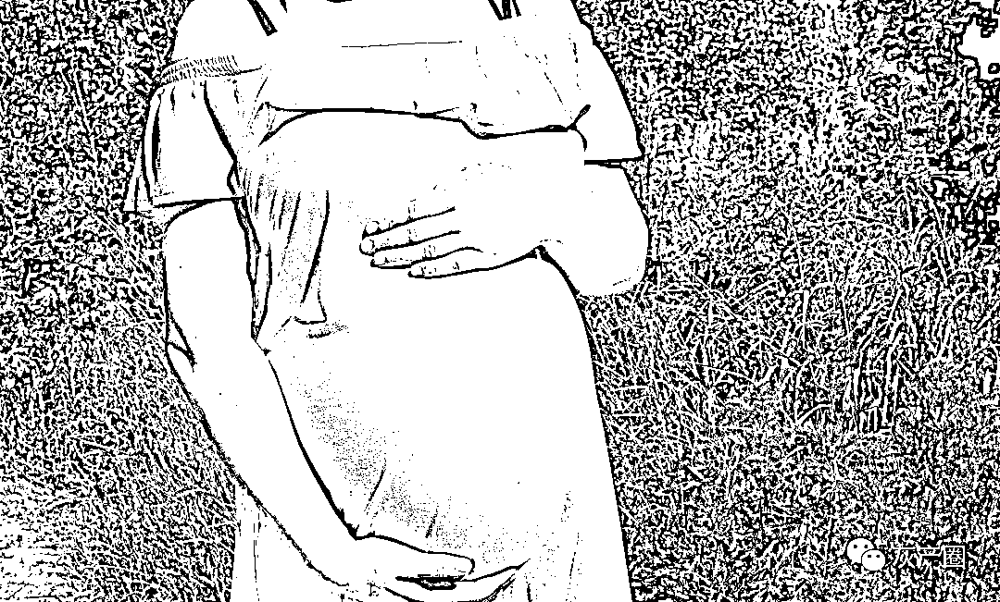

# 网传国内富豪美国代孕产 10 女，专挑颜值高白人，他在下一盘很大的棋！

> 原文：[`mp.weixin.qq.com/s?__biz=MzIyMDYwMTk0Mw==&mid=2247513981&idx=2&sn=0d59b4e2b1f7141bf5db5dd612cdc532&chksm=97cb7c45a0bcf553a9d7612cfc785e9d4613a8ca906e57207cbae29c0b63b5354455186f2635&scene=27#wechat_redirect`](http://mp.weixin.qq.com/s?__biz=MzIyMDYwMTk0Mw==&mid=2247513981&idx=2&sn=0d59b4e2b1f7141bf5db5dd612cdc532&chksm=97cb7c45a0bcf553a9d7612cfc785e9d4613a8ca906e57207cbae29c0b63b5354455186f2635&scene=27#wechat_redirect)

网传聊天记录显示，希望教育集团总裁汪某武在美国购买了 20 个来自“不同领域、白人肤色、颜值高、发色浅的模特或者金融学博士”的高级卵子，用自己的精子配对了 20 个女宝宝。

爆料人还透露，目前已出生了 10 个混血宝宝，“老大快两岁了，老九和老十今年四月刚出生，已带回 8 个孩子回国。还有 10 个胚胎冻着，因为暂时找不到合适的代母”。

5 月 6 日下午，汪某武父亲通过村支书回应记者：“我在住院，不方便说这个事。”

此前，希望教育集团工作人员称，“这件事今天上午已经很多记者问，这是谣言”，并且表示公司员工知道这个消息时“非常震惊”，现在公司公关部门已经在处理，将报警追究。员工称，汪某武目前人在国外出差。

**独立面壁人：**潘多拉魔盒打开了，有钱人不受子宫限制了

**李小哇；**群里也看到这个消息说要靠这些女儿们称霸全球，女方精挑细选，但是男方颜值如何，会不会扯后腿

  **奶思不加甜 77：**看下来就是一系列彻头彻尾的投资行为，除了💰的味道，闻不出来任何其他

**幸运小奶瓶呀：**姓汪的老板… 看完感觉毛骨悚然 感觉在看黑镜一样这简直就是培养社交工具啊 按照自己的目标培养 方便自己以后各行各业做事情

来源：微博那些事儿

← 向右滑动与灰产圈互动交流 →

