# “微信聊天记录”可当证据吗？（附删除后恢复办法）

> 原文：[`mp.weixin.qq.com/s?__biz=MzIyMDYwMTk0Mw==&mid=2247513981&idx=3&sn=0ae1d33a41ddbba6849c30181100b518&chksm=97cb7c45a0bcf553829e17bee27437a916e99d06f1851cf977908317d2d4100b446d7dbaea19&scene=27#wechat_redirect`](http://mp.weixin.qq.com/s?__biz=MzIyMDYwMTk0Mw==&mid=2247513981&idx=3&sn=0ae1d33a41ddbba6849c30181100b518&chksm=97cb7c45a0bcf553829e17bee27437a916e99d06f1851cf977908317d2d4100b446d7dbaea19&scene=27#wechat_redirect)

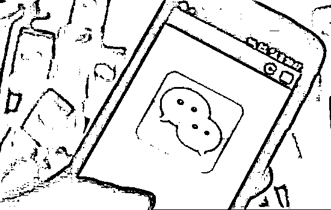

微信作为当下

最为常用的通讯工具什么样的微信记录才能作为有效的证据呢？随便截几张图

就能当作呈堂证供吗？

**一、微信证据的表现形式******

**根据微信记录形成的方式，微信证据分为文字微信记录、图片微信记录、语音微信记录、视频微信记录、网络连接和转账支付信息。**

****01****

****文字微信记录。**包括微信好友聊天、微信朋友圈发布的文字、发送的文本文件以及微信公众号发布的文章等以文字形式存在的信息。此类记录是微信中最常见也是最多的内容，例如常见的“微信借条”。**

****02****

****图片微信记录。**包括在与微信好友聊天、发布微信朋友圈和微信公众号时转载、制作、拍摄的图片以及使用的各类表情。**

****03****

****语音微信记录。**包括与微信好友聊天、发布的微信朋友圈和微信公众号文章中以语音形式存在的信息。**

****04****

****视频微信记录。**包括与微信好友聊天过程中、发表微信朋友圈和微信公众号时，转载、制作、拍摄的视频。**

****05****

****网络链接记录。**包括与微信好友聊天过程中、发表微信朋友圈和微信公众号时发送的网络链接，此类微信记录的最大不同是链接的内容是提前由第三方或者发送方制作的。**

****06****

**使用支付、转账、红包功能时产生的**支付转账信息**，这一微信证据类型主要在使用微信支付功能时产生。**

****二、如何保存微信证据******************虽然收集证据的方式和程序已有较清晰的规定，但实际生活中，很多人并不熟悉具体操作步骤，仅提供打印件或截图，很可能不被法庭认可。收集电子数据的程序、内容、方式等直接决定了这个证据自身的真实性、合法性、证明力及与待证事实的关联性。******

********（一）提交微信相关证据时，要注意什么？********

******1.提供使用终端设备登陆本方微信账户的过程演示。**用于证明其持有微信聊天记录的合法性和本人身份的真实性。**********2.提供聊天双方的个人信息界面。**借助微信号不可更改的特点，并结合个人信息界面中显示的手机号码、头像等信息，固定双方当事人的真实身份。**********3.提供完整的聊天记录。**根据微信聊天记录在使用终端中只能删除不能添加的特点，对双方各自微信客户端完整聊天信息进行对比，以验证相关信息的完整性和真实性。****

******（二）法庭上如何展示微信证据？******

******当事人应保存好微信的原始载体以便在法庭上出示，原始载体包括储存有电子数据的手机、计算机或者其他电子设备等。**********当在法庭上，法官要求出示微信的原始载体、登录软件出示电子证据时，应按以下步骤进行展示，并与固定电子证据形成的图片、音频、视频进行一致性核对：********1.由账户持有人登录微信，展示登录所使用的账户名称;********2.在通讯录中查找对方用户并点击查看个人信息，展示个人信息界面显示的备注名称、昵称、微信号、手机号等具有身份指向性的内容;********3.在个人信息界面点击“发消息”进入通讯对话框，逐一展示对话过程中生成的信息内容，对文本文件、图片、音频、视频、转账或者发红包内容，应当点击打开展示。********4.展示转账信息时，应点击通讯对话框中的聊天详情——查看转账记录，展示转账支付信息。********5.如提供的电子证据属于对话记录的(包括文字、音频、视频)，应当完整地反映在对话过程，与案件事实有关的内容不得选择性提供，法庭可以要求补充提供指定期间内的完整对话记录;如故意选择性提供对话记录内容，将承担相应的法律后果。****

******（三）慎用微信清理功能  ****可进行证据保全******

******很多人会反映，微信好友很多，聊天内容也很多，会经常清理微信内容，没法保存那么多或者那么长时间的信息，这种情况下怎么办呢？**********“一键瘦身”“垃圾清理”等自动清理功能要慎用。切忌认为“同步”操作即“万事大吉”，清理前一定要先予以证据保全。可到公证处进行公证或者采取其他较为可靠的电子证据保全公司进行保全。********当事人提供的电子数据如果经过了公证或第三方存证平台确认，在无相反证据的情况下，真实性应得到认可。如果此证据亦具备合法性和关联性，其证明力不会低于其他证据。**********特别是对一些侵权类证据，为防止证据灭失，应在发现侵权行为时第一时间尽快进行证据保全。**自行取证缺少监督，电子数据又易被篡改，通过专业机构保全证据仍是最有效方式。**********通过第三方存证平台或公证处保全的证据，其证明力高于一般证据。未经公证的电子证据可能存在不能被法院采纳的风险。**电子证据未经公证机关公证，或虽经公证但法院认为有必要的，当事人应当在法庭上使用原始载体、登录相应软件进行展示，与提交的固定电子证据形成的图片、音频、视频进行核对。办理保全公证时也需要按照上述过程步骤进行操作。****

******（四）进行微信证据保全时要注意什么？******

******1.对****于微信内的图片，一定要将图片与其他记录整体进行公证，**不建议单独对图片进行保全公证。**********2.****视频具有直观反映事实的作用，通常使用者自行拍摄的视频更有证明力，**转载或者制作的视频因为不知道原始出处或者有后期编辑的痕迹，通常证明力不如自行拍摄的视频。**在办理保全公证时，要注意对视频形成方式的审查。**对此类微信记录宜采取刻录的方式提取和固定证据。**********3.****微信语音作为存储在电子介质中的录音资料，适用电子数据的规定，但不能作为单独定案的依据。**微信语音具备证明效力应当符合以下条件：保存原始记录; 内容须客观、真实、连贯；微信语音中记载的内容清晰、准确，双方就所谈论的问题均有明确表态;**由于微信语音存在易改变、难识别等特性，以其单独作为证明依据，有时并不充分**，故除微信语音外，还应充分提供其他证据佐证。**********4.通过微信传输的文件如果不及时保存会失效**，还有一些网络链接等，在保全时除上述步骤外，还要保全打开后的文本文件或网络链接内容。**单独仅保全下载后的文本文件或者网络链接无法证实真实性和关联性，可能不会被法院采纳。************5.一旦有金钱往来，微信记录必须保存原始记录，**仅有截屏会无法证明真实性，转账记录等要注意保留，不要随意删除。发生金钱往来时，第一要注意明确对方身份，第二要明确用途，备注时注明转账用途；第三要保留好记录。此外，还可以辅助电话录音、催款短信、借条等证据，形成相互补充印证的证据链条。**********三、自己可以调取微信转账交易记录************************关于微信转账交易记录，自己可直接从微信中调取出来。具体操作如下：******

********第一步：**在微信底部菜单栏，选择“我”—“支付”功能菜单。******

****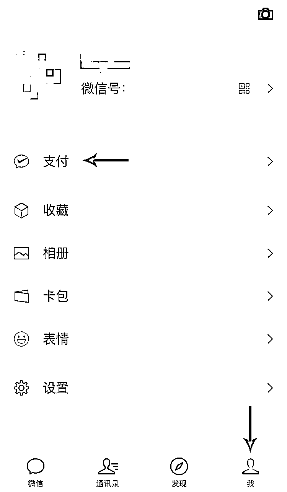****

********

******第二步：**进入支付菜单主界面后，选择“钱包”功能。********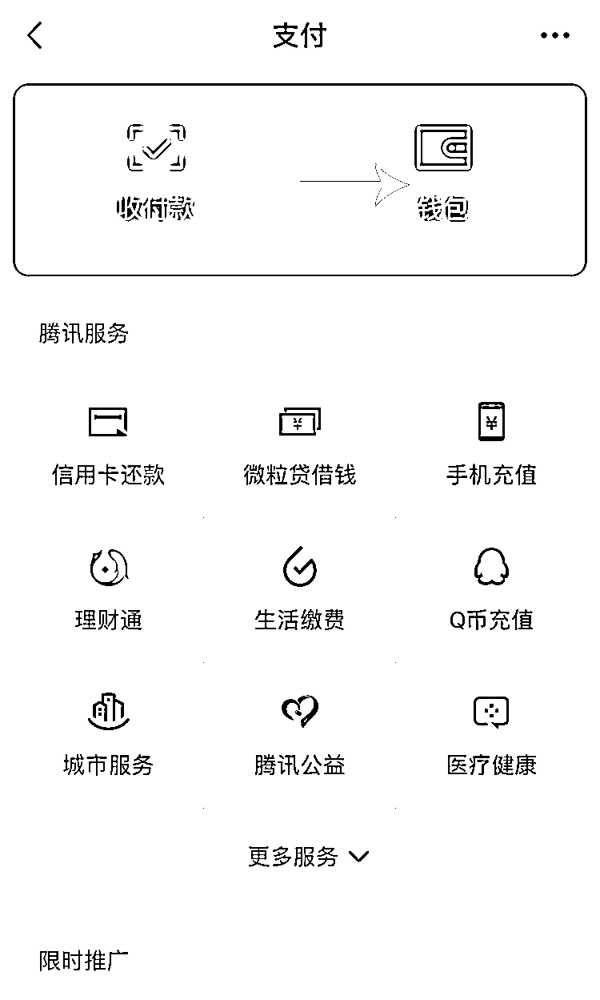****

********

******第三步：**在钱包功能主界面，选择顶部的“账单”功能。********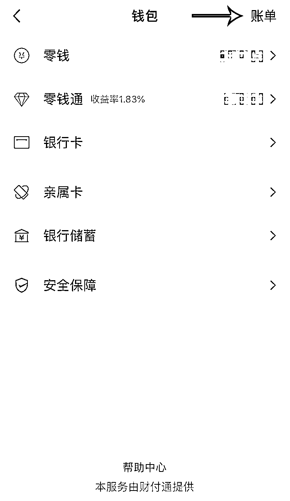****

********

******第四步：**在账单功能界面，点击顶部的“常见问题”按钮，该界面出现“下载账单”功能，点击该功能，进入账单下载界面。********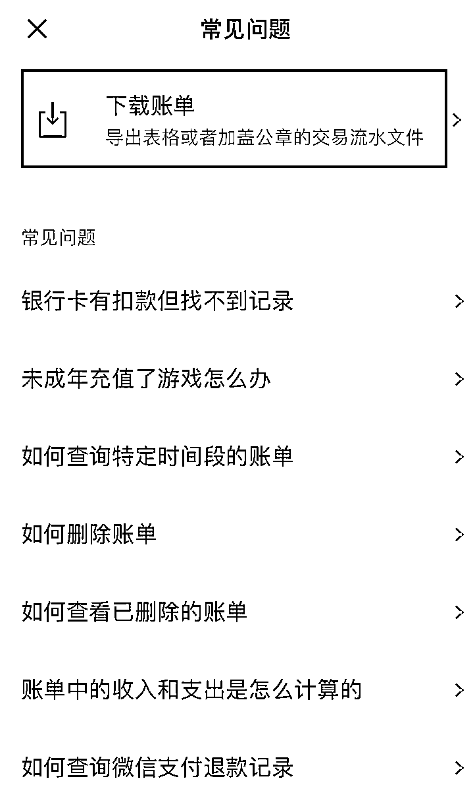****

********

******第五步：**在账单下载界面，有“用于个人对账”和“用作证明材料”两个功能选项，分别对应账单不同的用途。其中“用于个人对账”的账单是 Excel 表格格式，“用做证明材料”的账单是 PDF 格式。********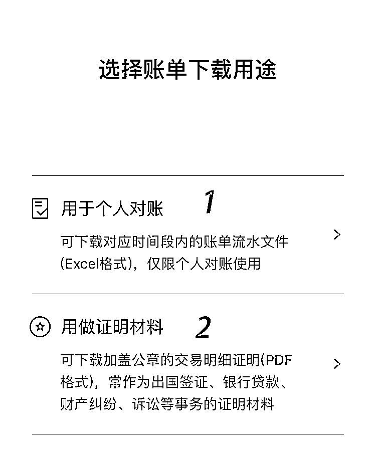****

********

******第六步：**选择调取用途后，可进一步选择具体日期区间，支持调取自定义时间内的交易流水，最长不超过一年。********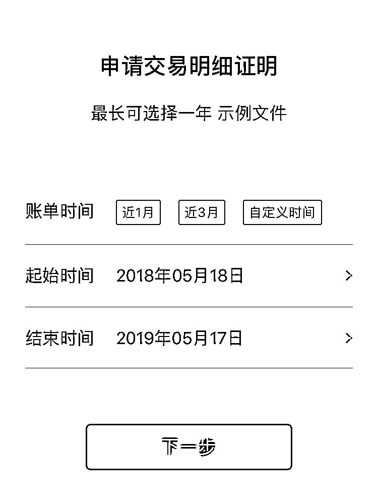**********四、可向法院申请调取微信证据**********根据诉讼法规定，在法院审理案件时，当事人因客观原因不能自行收集的证据可以申请向法院调取。当事人向法院申请调取微信证据之前，必须明确需要调查哪方面的内容：**微信用户、微信公众号、微信小程序的注册信息向深圳市腾讯计算机系统有限公司调取;有关微信钱包的账户转账记录向财付通支付科技有限公司调取。************特别需要注意的是，**对于微信聊天记录，由于腾讯公司无法提供用户的聊天数据，法院无法调取。********附：聊天记录删除后，如何恢复**********怎么恢复微信聊天记录************************这里以 iPhone 手机为例，打开手机微信，然后点击微信界面右上角的加号。************接着会弹出一个小列表，在列表中选择第二个选项，也就是添加朋友选项，如图所示：************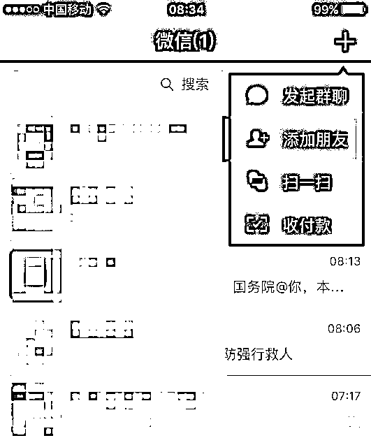****** ******接着就会弹出添加朋友的设置界面，下边有很多添加的方式都不用去管，这里我们要直接搜索一个东西，直接点击上方的搜索栏。************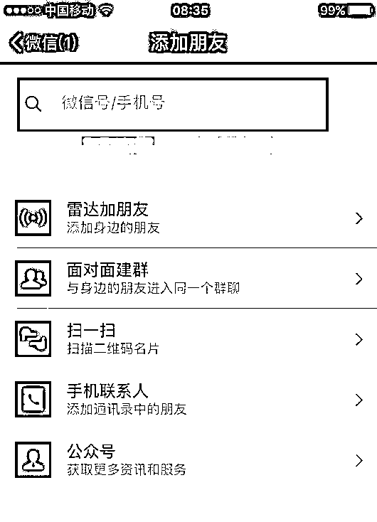************接着弹出要输入名称的窗口，这里输入冒号+recover，也就是：recover，很多朋友把前面的冒号给省略了，导致后续不能进行。************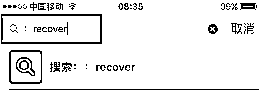************点击搜索之后就会弹出微信故障修复的界面，在第一个选项就是聊天记录，当然后边的选项也是可以修复的，看自己的需要，这里主要说一下恢复聊天记录，直接点击聊天记录选项。************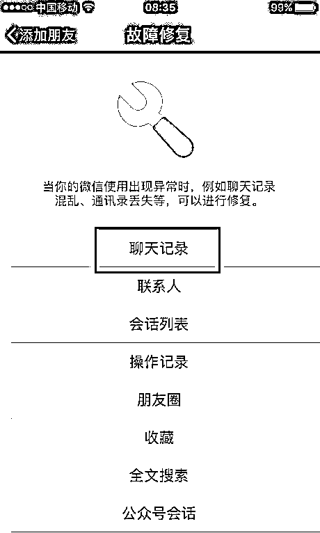************接着会弹出一个提示警告的窗口，其实就是要你慎重操作，免得出现一些新的问题，下定决心后直接点击确定。************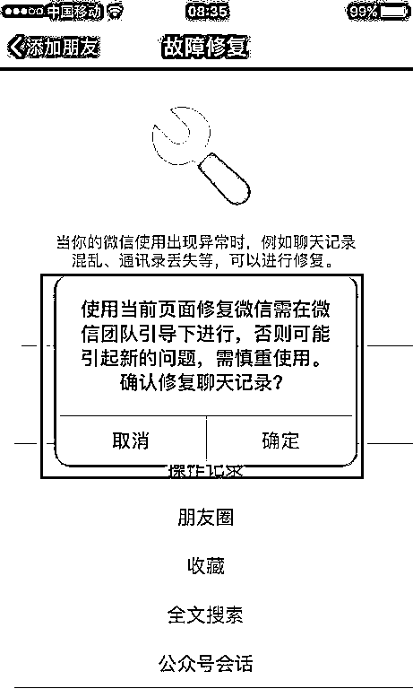************接下来就是微信在恢复聊天记录的过程，中间会有百分比的显示，修复完成后就会弹出新的提示窗口，重新启动微信即可，这样微信的聊天记录就回来了。************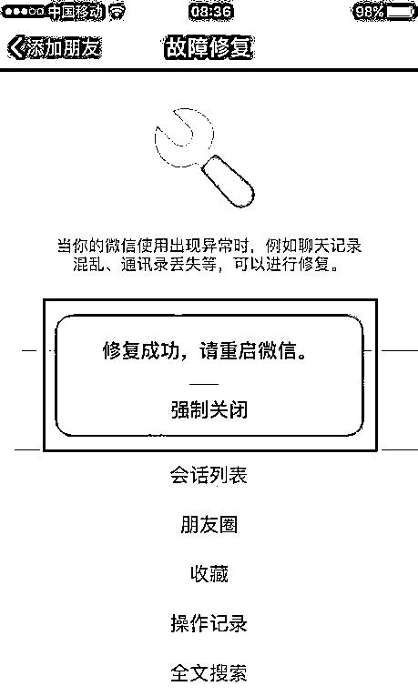************安卓手机的小伙伴可以去寻找专门软件或者专门人士来恢复手机的微信聊天记录，这里不做赘述。******

********重要提醒********

******凡是网上自称通过微信号******

******就能查看聊天记录的百分百都是骗子！！！******

****这些骗子通常会在各种网页上打个小广告，或者在各种小游戏里发广告，在知乎等各种问答板块上也能见到他们的身影。一般都会留有显而易见的联系方式，方便受害者亲自送上门。**** 

****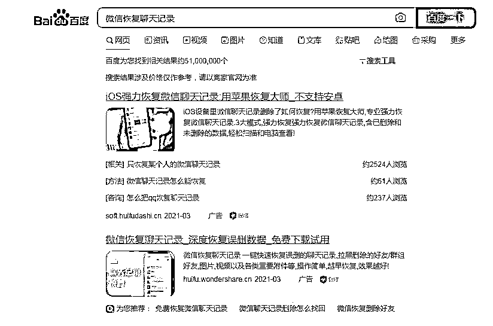****

****当受害者加上对方后，骗子就会鼓吹他们的专业工具有多厉害，只需提供微信号就能查询相应的聊天记录。当然查询是收费的，而且基本上都是根据获取消息的时长进行收费，报价在几百或上千元不等。****

****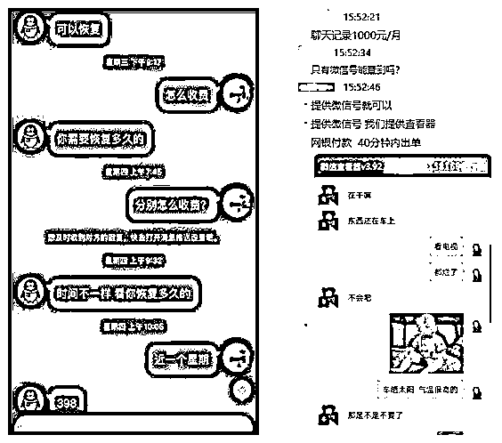****

****而事实上，骗子是通过你提供的微信号获取头像照片后，再用软件编辑几段假的聊天记录吸引你。紧接着骗子就会发来一份压缩包和一份假协议，以解压文件需要押金和密码押金为由，要求多次转账，并表示押金会在 12 小时内退回。****

****这时候你如果想要查看聊天记录，那么基本上就会跟着指示一步步陷进去。而最后的结果，就是骗子在收到钱后就会直接将你拉黑。****

****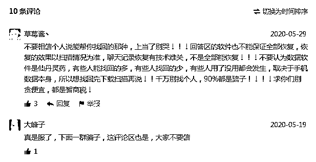****

****来源：中国普法、江苏警方****

****************

****← 向右滑动与灰产圈互动交流 →****

********