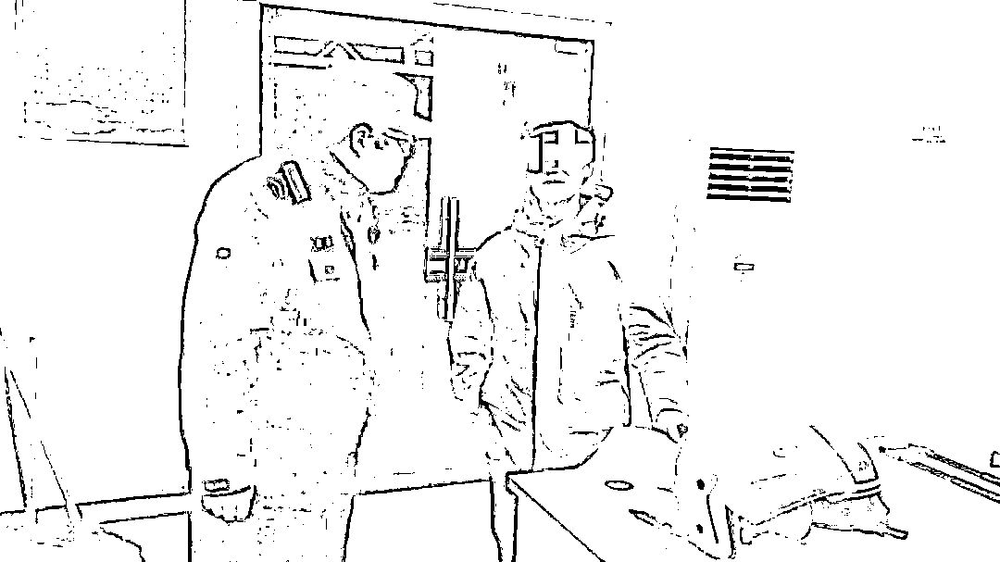
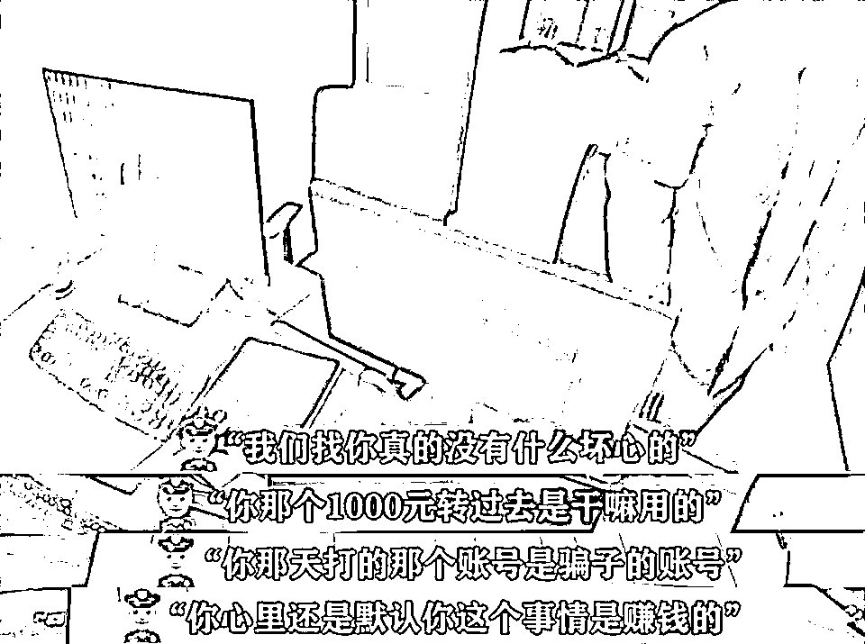
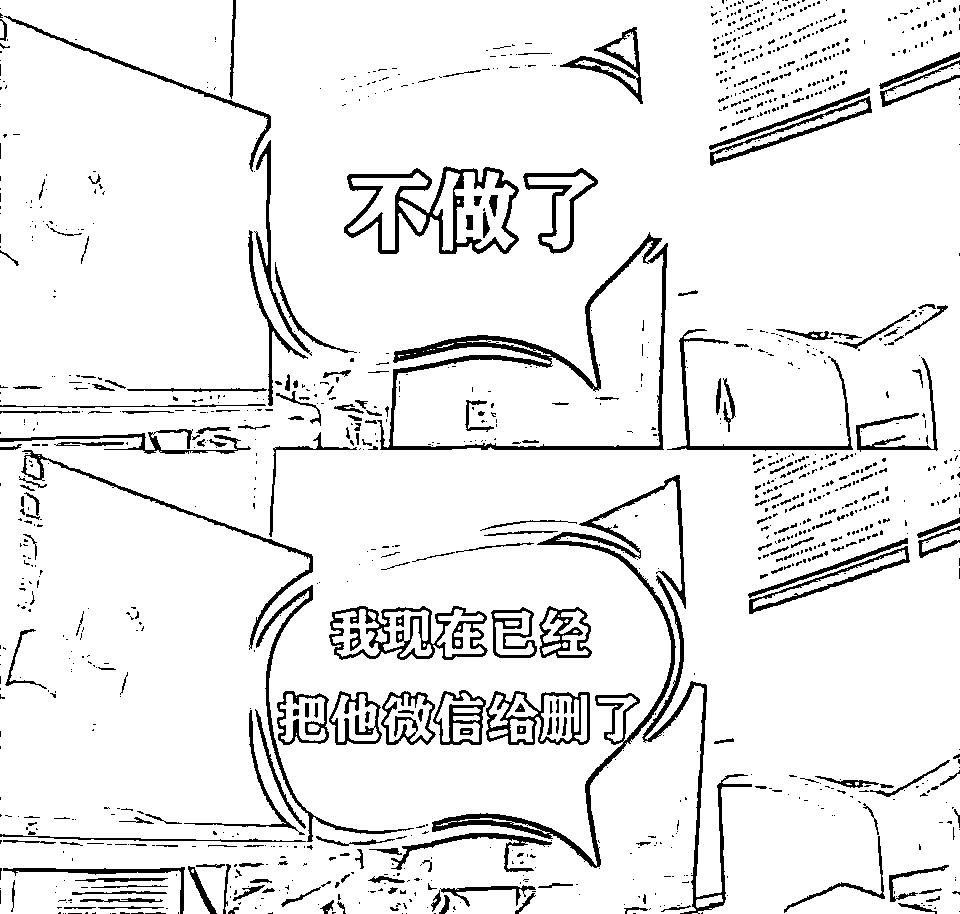

# 4 次劝说，执迷不悟：我没有被骗！投资还能获利...

> 原文：[`mp.weixin.qq.com/s?__biz=MzIyMDYwMTk0Mw==&mid=2247513981&idx=4&sn=0da0e2ec446c83ae167fa4edfee52905&chksm=97cb7c45a0bcf5535ef79d9d1883a6945ad0ca99f216a62831730bc56bd0c073e3e8b896ba48&scene=27#wechat_redirect`](http://mp.weixin.qq.com/s?__biz=MzIyMDYwMTk0Mw==&mid=2247513981&idx=4&sn=0da0e2ec446c83ae167fa4edfee52905&chksm=97cb7c45a0bcf5535ef79d9d1883a6945ad0ca99f216a62831730bc56bd0c073e3e8b896ba48&scene=27#wechat_redirect)

近日，常熟市公安局淼泉派出所社区辅警在上门防骗宣传时，发现辖区许先生（化名）可能正在遭遇“杀猪盘”诈骗，可本人坚信自己没有被骗，并能从中获利...

　　见许先生如此固执，社区辅警班长赶来，一边向许先生了解投资情况，一边跟他讲解“杀猪盘”的特点及典型案例。

可过程中

许先生态度依旧很敷衍......

回去后班长心里还是有点不踏实

于是第三次上门对许先生进行劝阻

见对方还是听不进去

干脆直接把许先生接到派出所

民警对许先生苦口婆心讲了半小时

最终

许先生放弃了再次投资的念头

并当面把投资软件删除

承诺不再进行投资

民警悬着的心这才放了下来

[`mp.weixin.qq.com/mp/readtemplate?t=pages/video_player_tmpl&action=mpvideo&auto=0&vid=wxv_1858653039599861766`](https://mp.weixin.qq.com/mp/readtemplate?t=pages/video_player_tmpl&action=mpvideo&auto=0&vid=wxv_1858653039599861766)

正是有了四次耐心的劝阻

才使得许先生醒悟过来

没有造成进一步的损失

****套路剖析：****

**1.诈骗分子先取得受害者的信任，然后抓住受害人想赚钱的心理开始发布、传播购买“外汇”可赚取高回报，高利润的信息引诱投资；**

**2.受害人在第三方平台进行投资后，刚开始让受害人获得些许利润，后引诱受害人继续加大投资额度或缴纳保证金。**

**3.待受害人继续交钱后，诈骗分子谎称“信用分不够”、“平台维护”等情况不予提现，随后通过后台操作致使受害人血本无归。**

**　　无论是陌生人还是熟人推荐的**“高回报率”**投资理财均不可信，骗子常常“自导自演”，以“低投入、高回报”形式吸引受害人进行投资，**而这些所谓的“高回报”，常常只是骗子的投资平台上显示的一个数字，受害人永远无法将余额提现到自己的银行卡内。****

****警方提醒：****

****　　1.对超高收益的投资要保持戒心，不要被暂时的高利润迷惑双眼，切勿相信只赚不赔的“买卖”，避免落入网络投资诈骗陷阱。**** 

****　　2.投资理财请选择正规途径，正规的 APP 均可通过官方应用商店下载，不要随意点击陌生人发送的链接、扫码下载投资理财类程序。****

****　　3.切勿随意提供自己的个人信息，保管好自己的银行卡密码和验证码。****

****　　4.如不幸被骗，立即收集证据，并拨打全国统一反诈热线 96110 止损。****

****一再唠叨劝阻，****

****只为守护群众的钱袋子！****

****点赞！****

**来源：常熟公安微警务、苏州公安微警务，利箭在出击**

********

**← 向右滑动与灰产圈互动交流 →**

****