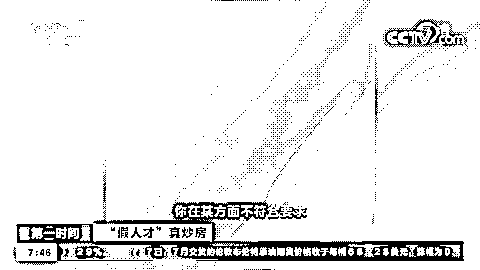
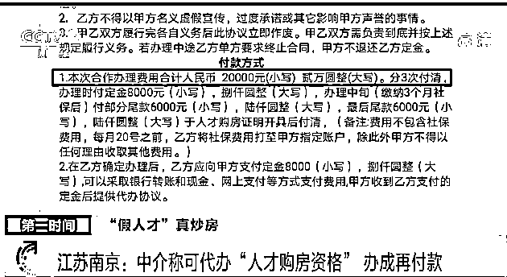
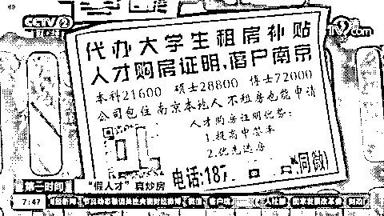
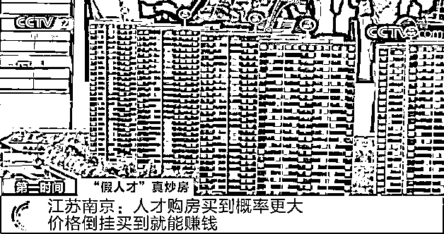
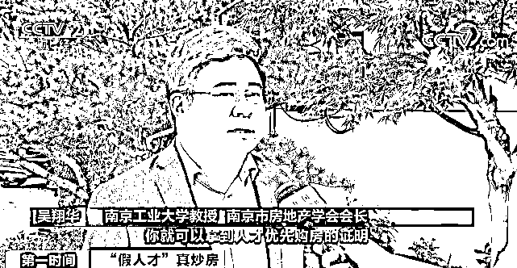
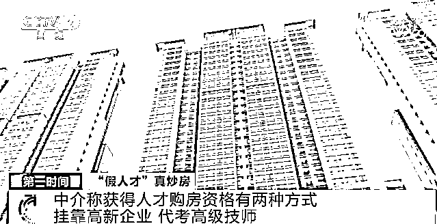
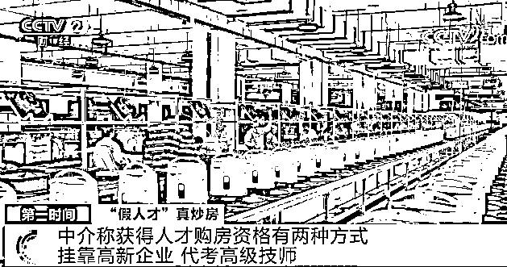
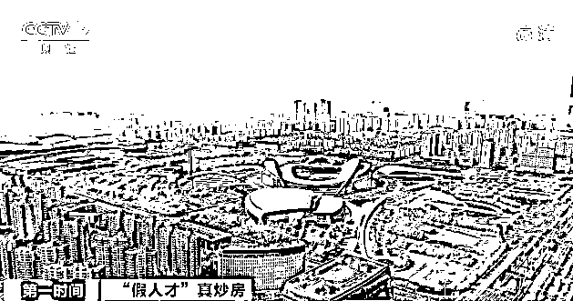
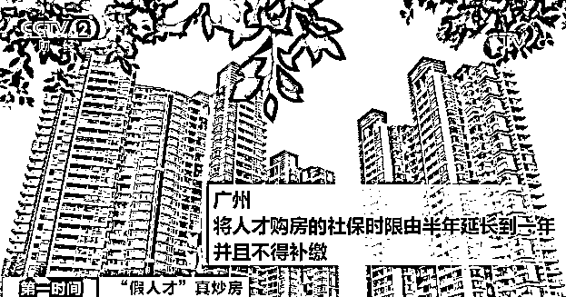
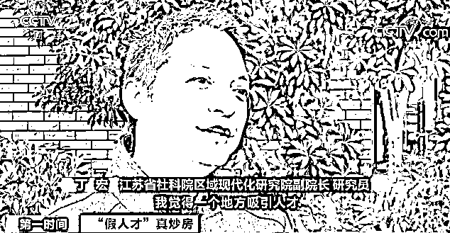

# 内幕曝光！2 万可买人才购房资格？买一套新房“净赚上百万”？

> 原文：[`mp.weixin.qq.com/s?__biz=MzIyMDYwMTk0Mw==&mid=2247513981&idx=5&sn=3c96700a0230ec58b21ab0ea0e4272bb&chksm=97cb7c45a0bcf5539cecb0ef83bed21ccefc5c5c5256896e2097c163cc65dc69051e8a45a715&scene=27#wechat_redirect`](http://mp.weixin.qq.com/s?__biz=MzIyMDYwMTk0Mw==&mid=2247513981&idx=5&sn=3c96700a0230ec58b21ab0ea0e4272bb&chksm=97cb7c45a0bcf5539cecb0ef83bed21ccefc5c5c5256896e2097c163cc65dc69051e8a45a715&scene=27#wechat_redirect)

这两年为了吸引人才，全国多地都实行了很多优惠政策。其中人才优先购房，更是多地吸引人才落户的一项重要政策。

然而前不久，有媒体记者在江苏南京调查发现，**不少房产中介机构通过不正当的手段，帮助不符合条件的购房者伪造“人才身份”，从中牟取利益。**

江苏南京：中介称可代办“人才购房资格” 办成再付款

[`mp.weixin.qq.com/mp/readtemplate?t=pages/video_player_tmpl&action=mpvideo&auto=0&vid=wxv_1860082086603194375`](https://mp.weixin.qq.com/mp/readtemplate?t=pages/video_player_tmpl&action=mpvideo&auto=0&vid=wxv_1860082086603194375)

△央视财经《第一时间》栏目视频

**中介：**你在某些方面不符合要求，我们手里刚好有这种资源，帮你对接包装一下，让你符合要求，你办好你们的事，我们赚取我们的佣金，就这么简单。 

在南京江宁大学城附近的这家代办中介，其中一名负责人向媒体记者提供一份合同，上面显示**花 2 万元就可以代办“人才购房资格”**。他还向记者表示，**从 2020 年起，他们就开展了这项“业务”，办成的很多，可以申请批下来再付款**。 

**中介：**那个月是开了七八个，基本上虽然没有七八个那么火，但是一个月两三个是有的。

记者在一些二手交易网站发现，也有不少中介明目张胆地打出代办“人才购房资格”的广告。在南京浦口区另一家地产中介，**员工也声称，可带记者到政务大厅现场办理，资质到手后付款**。 

**中介：**到时候我们带你去办，然后开出人才购房证明。 

**记者：**到哪里办啊？

**中介：**到政务中心，江北的或者奥体中心的都行。

**记者：**直接现场办就行了？

**中介：**对，我带着你去办。

调查中，不少购房者向记者表示，**受楼市调控政策影响，南京主城区不少地段的新房和周边二手房存在严重的“价格倒挂”**。**如果能买到一套新房，就意味着“净赚上百万”。而持有“人才购房资格”，买到的概率大得多。** 

**南京工业大学教授 南京市房地产学会会长 吴翔华：**满足一定条件就可以拿到人才优先购房的证明，参与优先摇号，人才优先摇号之后是无房户摇号，无房户摇号之后才是普通购房者摇号，人才如果没有摇到号，他还可以跟后面普通购房者在一起进行摇号，所以人才其实有两次机会来进行摇号。  

中介称获得“人才购房资格”有两种方式：

挂靠高新企业、代考高级技师

[`mp.weixin.qq.com/mp/readtemplate?t=pages/video_player_tmpl&action=mpvideo&auto=0&vid=wxv_1860066317764984835`](https://mp.weixin.qq.com/mp/readtemplate?t=pages/video_player_tmpl&action=mpvideo&auto=0&vid=wxv_1860066317764984835)

△央视财经《第一时间》栏目视频

记者了解到，2020 年，南京从新推出的商品房源中拿出 30%，优先保障人才购买。然而，这项优惠政策，却被一些不法中介和炒房者视为商机。他们是如何钻空子的？又该怎么堵上这个漏洞？ 

据介绍，中介帮助购房者获得“人才购房资格”，主要有两种途径：45 周岁以下的，帮助其挂靠三类符合规定的企业，并交满一年以上的社保；三类企业包括规模以上企业、高新技术企业、新型研发机构。记者在南京人才安居网查询发现，已注册的人才安居企业单位达 3000 家左右。而 45 周岁以上的，还可以代考取得高级技师证书，在资质认定上等同于博士学位。 

**南京工业大学教授 南京市房地产学会会长 吴翔华****：**比如，帮助获得高级技能人才的证明，中介就不一定跟某些企业，可能跟某些专门进行这种资格考试的一些机构相合作，你来我这考试，然后获得某种专业高级技能的证明，你也算是人才，也可以获得购房资格。 

这种虚构人才身份的方式，扰乱了市场交易秩序，也与出台“人才优先购房政策”的初衷背道而驰。不过专家表示，**也不能因此全盘否定人才购房政策，需要给政策一定时间做进一步调整**。 

****南京工业大学教授 南京市房地产学会会长 吴翔华：**我觉得人才政策要想完善，还要隔一段时间对它进行后评估，通过这样的政策，究竟吸引了多少，我们城市所需要的不同级别的人才，比如高端人才吸引了多少，中端、低端人才吸引了多少，这样才能对政策及时进行调整和修正，以达到吸引人才、留住人才的目的。 **

**** 

**实际上，**近期多个城市已经在调整人才购房、落户购房的政策。**广州 4 月 2 日出台政策，将人才购房限售时间从 2 年延长至 3 年。4 月 21 日，广州又再次调整，将人才购房的社保时限由半年延长到一年，并且不得补缴。杭州上月也出台规定，高层次人才家庭落户 5 年才能买二套房，这是当地针对人才购房进行的第三轮调整。南京在 1 月份也作出过调整，将此前 1 个月的社保或个税缴纳时限延长至硕士半年、本科一年。** 

**专家建议，在不断完善政策、堵住漏洞的同时，应当多措并举吸纳人才。 **

****

******江苏省社科院区域现代化研究院副院长 研究员 丁宏：**人才购房或者落户政策，只是其中很小的一个方面，我觉得一个地方吸引人才，最主要就是靠这个城市整个的文化、环境、产业，这个才是最根本的，如果没有一个好的产业，能够给人才提供非常好的创业、就业的岗位，再好的购房政策、落户政策，都不可能真正把人才吸引过来。 ****

****目前，针对媒体反映的问题，**南京市住房保障和房产局、人才安居办正会同公安、人社等多个部门展开调查核实工作，将严厉打击弄虚作假行为**。同时，将有针对性地加强政策研究，充分利用大数据等技术手段，做到防微杜渐。**** 

******堵牢漏洞 调控才能见实效******

 ******[`mp.weixin.qq.com/mp/readtemplate?t=pages/video_player_tmpl&action=mpvideo&auto=0&vid=wxv_1860067333877071875`](https://mp.weixin.qq.com/mp/readtemplate?t=pages/video_player_tmpl&action=mpvideo&auto=0&vid=wxv_1860067333877071875)

△央视财经《第一时间》栏目视频******

******近年来，一些城市出台的房地产调控措施，收到了一定成效。但类似代持、代缴、假结婚等“钻空子”炒房的现象还是层出不穷。这些手段看似高明，其实发现破绽并不难。

织牢落实房地产管理调控措施之网，就是要在薄弱环节下功夫。不能挂在嘴上、写在墙上，而要体现在行动和力度上。需要完善管理调控措施，加强住房限购限贷政策执行过程中的监督，探索搭建跨部门调控大数据平台，真正实现堵住政策“漏洞”，杜绝“钻空子”行为。******

******来源：央视财经（ID：cctvyscj）******

************************

******← 向右滑动与灰产圈互动交流 →******

************