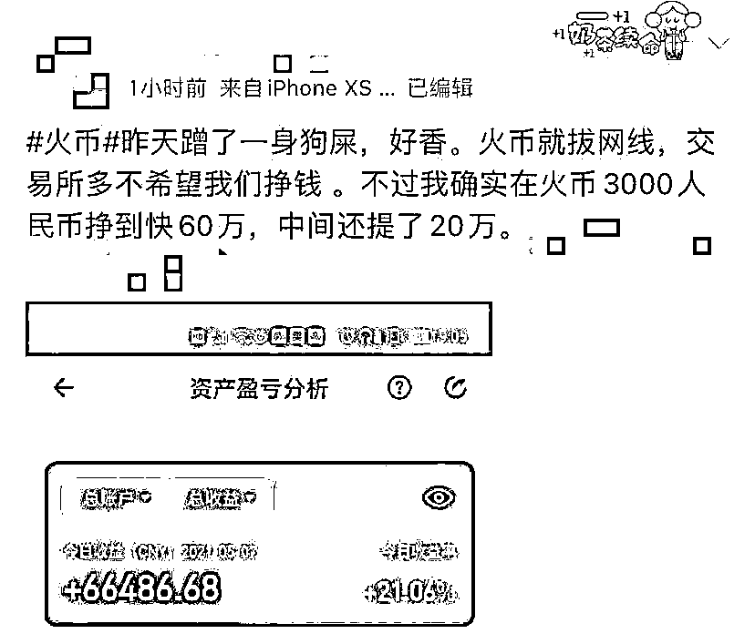

# 带火狗狗币后，马斯克又带火“shi”币：一天暴涨 500%！有投资者 3000 元狂赚 60 万

> 原文：[`mp.weixin.qq.com/s?__biz=MzIyMDYwMTk0Mw==&mid=2247514033&idx=2&sn=e938f86a3b75638acce07c183d34f9e0&chksm=97cb7c89a0bcf59fd9c03ad5919329e3a5d83f6842f047455c00023ea50060d746f2bf0a2416&scene=27#wechat_redirect`](http://mp.weixin.qq.com/s?__biz=MzIyMDYwMTk0Mw==&mid=2247514033&idx=2&sn=e938f86a3b75638acce07c183d34f9e0&chksm=97cb7c89a0bcf59fd9c03ad5919329e3a5d83f6842f047455c00023ea50060d746f2bf0a2416&scene=27#wechat_redirect)

从廉价的山寨币走向炙手可热的全球涨幅第一加密货币，柴犬币（Shib）仅用了 2 天。

5 月 9 日，**SHIB 柴犬币单日最高暴涨 500%，**两日上涨 3 倍，这是一种十分熟悉的味道。

5 月 8 日，柴犬币价格一度狂涨超 251％，交易量达 403 亿元，登上微博热搜。柴犬币超话甚至超过狗狗币，坐上币圈热度第二把交椅。

 有投资者甚至用 3000 元本金狂赚 60 万元，不由感慨：“在币圈，遍地都是机会。”

来源：微博 

马斯克出手

SHIB 坐上火箭

无论是比特币、狗狗币，还是柴犬币（SHIB）的暴涨，背后都有马斯克的身影，他仅用一两句话，就在币圈掀起腥风血雨。

当地时间 7 日，特斯拉独立董事、日本养老基金前首席投资官水野弘道(Hiromichi Mizuno)在社交媒体上表示：“投资者可以短线交易柴犬币，但不要这样对待自己的柴犬宠物狗。”

马斯克随即回应：“我正在寻找一只柴犬。”此前马斯克就曾称赞 SHIB，并购买了 SHIB。

同一日，一位名为“Shib Father”的用户透露，马斯克将在其主持的《周六夜现场》(Saturday Night Live)综艺节目上讨论柴犬币，并称其要涨到 1 美金。

随后，柴犬币短时一根超级大阳线，日内涨超 251%，暂报 0.0000183 美元，约合人民币 0.0001 元，登上各大交易所涨幅榜榜首。5 月 9 日，其更是最高暴涨至 500%，尽管随后回落，但也一度使各大交易平台遭遇短暂宕机。

国内网友瞬间炸了锅，有投资者熬夜至 3 点，只为赶上柴犬币的暴富行情；有投资者秀出自己的收益，也有投资者被套叫惨。

今年 3 月中旬，马斯克曾发布一条社交媒体表示，将为自己的家养一只柴犬，当时狗狗币价格没有上涨，但柴犬币却突然爆拉。

**狗狗币过气，柴犬币逆袭******

****资料显示，该项目叫作 Shiba Inu，是一个去中心化自发社区建设的实验，中文名为柴犬币，币圈人戏称为“屎币”。诞生于 2020 年 8 月，发行量为 1000 万亿。****

****在狗狗币创造暴富神话之后，该币种突然走红，号称自己是“狗狗币杀手”（DOGECOIN KILLER），将在短时间内超过狗狗币。****

********

****业内人士指出，柴犬币的热度能够从 3 月持续至今——****

******其一是因为其目前价格较低，**几美金便可拥有几十万个 SHIB，对于新用户来说，入场门槛较低。****

******其二则是由于牛市的 FOMO（Fear of Missing Out，害怕错过）情绪极高**，侥幸心理之下谁也不想错过任何一个有可能暴富的机会。****

******其三，与马斯克的“喊单”有关系**，毕竟有狗狗币的前车之鉴。****

****知名数字资产交易平台 OKEx 研究院指出，虽然柴犬币和狗狗币都具有强社区属性，但也有诸多不同。从代币机制上看，柴犬币有发行上限，也有销毁机制。此外，柴犬币基于以太坊发行，推出了自己的去中心化交易平台 ShibaSwap，而狗狗币只能用于推特、Reddit 打赏等应用场景。不过，柴犬币目前上线时间较短，共识不如狗狗币强，流通还不够充分，还有待时间检验。****

****会成为下一个比特币吗？************

******暴涨行情下，投资者真的赚钱了吗？******

******据中国证券报，一位柴犬币投资者表示：“牛市只要蹲对一个币的一次机会就足够了，这几天行情好柴犬币非常好赚钱，我用 2 万元本金做短线，快进快出。到了下午直接挣 7 倍翻到 14 万元，很恍惚，现在后悔买少了。”******

******但他也表示：“柴犬币毕竟不是比特币等主流币种，我没有长期持有的信心。就是玩儿，万一它复制狗狗币的发展轨迹，我不就一夜暴富了吗？”******

******尽管柴犬币此轮涨势凶猛，OKEx 研究院提醒投资者谨慎进场：“本轮柴犬币暴涨与狗狗币的拉升颇为相似，可以看作一种粉丝经济效应。但是，加密货币的筹码过于集中，很容易出现市场操纵风险，尤其是对于柴犬币这种实际应用价值较小的币种。**目前的价格暴涨更多来自于营销炒作，后期不排除持币大户抛售离场的可能，因此风险较大。**”******

******业内人士也指出：“柴犬币继承了狗狗币的风格，在喊单后会上涨，但上涨和下跌的幅度都特别大，难免会令市场变得躁动。其实，因柴犬币上涨而获得收益的投资者，势必远远小于因行情起伏不定而损失的投资者。”******

******来源：中国证券报等，21Tech******

************************

******← 向右滑动与灰产圈互动交流 →******

************