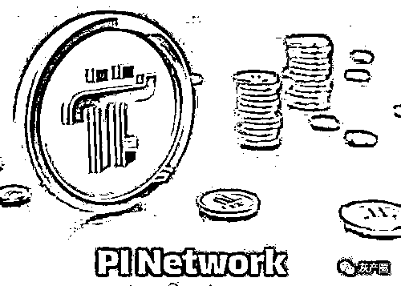
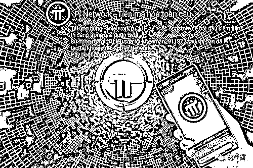

# 派币靠“画饼”圈了近两千万活跃用户！得到的是一地鸡毛！

> 原文：[`mp.weixin.qq.com/s?__biz=MzIyMDYwMTk0Mw==&mid=2247514033&idx=3&sn=e37a20809b107d43f0dc67626109ecb4&chksm=97cb7c89a0bcf59fe7f67332447f2dd2c33d99c01d64d55a5e4b290fb25abd5cb34914c1d7c4&scene=27#wechat_redirect`](http://mp.weixin.qq.com/s?__biz=MzIyMDYwMTk0Mw==&mid=2247514033&idx=3&sn=e37a20809b107d43f0dc67626109ecb4&chksm=97cb7c89a0bcf59fe7f67332447f2dd2c33d99c01d64d55a5e4b290fb25abd5cb34914c1d7c4&scene=27#wechat_redirect)

“间隔 24 小时点一点，手机就能免费挖矿，我能挖到一点币，你也能分到一点币！”

“现在每个派币(Pi)值 100 美元，现在我们挖的币就等于是原始股，以后的价格会和比特币看齐的。挖币需趁早！”

在一个“派币交流”微信群里，记者看到许多币友沉迷于手机挖派币。 

在比特币“造富神话”的刺激下，互联网平台催生出花样百出的各种虚拟币，它们被赋予“十倍币”“百倍币”的想象空间。许多人以为自己持有的是潜力股，但可能挖了好几年，得到的是一地鸡毛。

走入“派币群”

记者注册海外 ID 后下载的派币 App

派币，是其中一种比较特殊的存在，号称是可在手机上“挖矿”的加密数字货币。据派币中文布道者官网介绍，派币由斯坦福大学博士团队打造，是给普通人的一次赚钱机会。

相对于挖比特币需要足够多的矿机，挖派币的方式堪称币圈最简单。据派币中文布道者网站显示，币友只需要下载派币 App 就能免费挖矿，不耗电、不费流量，每天只需点击一次，就能挖到派币。

据该网站一位工作人员说，派币的全球活跃“矿工”超过 1800 万，国外易货共识价格大概为 100 美元/1 派币。

换句话说，现阶段 Pi Network 单纯靠“画饼”，就硬生生圈到了近两千万活跃用户。目前，派币的谷歌搜索结果达 6.52 亿条，接近比特币的 8.33 亿条搜索结果。

币圈有这么多一夜暴富的机会吗？这个“财富密码”到底是如何吹嘘出来的呢？

怀着好奇心，记者添加了派币安装助理的微信。记者在备用手机上注册了一个海外账号，才顺利下载了派币。

“你也可以买淘宝上的海外账号，但别人的账号只能使用一次。”这位安装助理手把手教记者如何注册海外账户，如何下载派币，再如何上传个人资料。“你设定一个手机闹钟，每天提醒自己进来，点击一次闪电挖矿。”

为了提高算力、增加挖币数量，他让记者多邀请朋友加入挖币。“每邀请一人，你就增加了 0.05 算力，挖的币就更多。”通过点击分享，就能拉更多手机通讯录的人进来一起挖矿。

在像游戏《黄金矿工》里的工具人一样挖了一天矿后，记者进了一个币友群。

没想到，这个矿友群很活跃，每天签到挖派币的人并不少。

有群友表示，自己努力挖矿两年了，为项目方贡献了不少流量。还有群友称，自己有 8000 个派币，是矿工里的富翁。

记者询问他们为何相信派币会变现时，有群友表示：“反正是 0 元薅羊毛，只要每天手机点一下，挖一挖也无妨，万一成真了呢？”

手机挖矿的“财富密码”

手机到底能不能“挖矿”？

香港中文大学(深圳)高等金融研究院研究员吴海峰博士表示，区块链、数字货币等新兴技术视算力为核心竞争力，加密货币挖矿需要消耗大量算力，占用大量存储。比如，比特币是根据特定的算法，通过大量的计算产生的。为了“挖矿”，许多区块链项目开始搭建超级计算机，算力提供者与需要者的地理距离、网络拥堵、信号碰撞都是分布式计算领域的挑战。

“如果像派币描述的那样，用手机能‘挖矿’，说明这个项目的算法底层是比较简单的，肯定不会像比特币、ETH 这样用心设计算法。后者的代码动辄超过百万行，都是靠超大算力的矿机维持‘挖矿’的。”

他否定了派币的应用价值，“挖一枚比特币消耗的电力非常大，付出的成本至少是电力价值。而手机也能不费存储挖币，说明成本非常低，边际成本可以忽略不计，注定他的市场价值非常低。”

他表示，加密货币出现的原因是为了保证安全性，因而对安全要求特别高的组织和个人才会考虑加密货币。派币的算法简单意味着可以被黑客攻破或解码，因而在币圈也缺乏公信力。

资深区块链行业专家、元界 DNA 创始人兼 CEO 顾颖告诉记者，手机挖矿与他对区块链的理念十分冲突，不过他对派币是否为“空气币”或传销不置可否。

那么，派币的“财富密码”是什么呢？2020 年 4 月，派币 APP 上线了意向广告调查，让几百万活跃用户决定投放的商业广告类型，以在广告收入和用户体验间取得平衡。

之后，派币开屏广告便层出不穷。以下是两则派币广告：

派币项目方每天都有广告收入进账，但对派币主网出台时间、交易所上线时间一直态度含糊。目前，派币的主网并没有上线，代码也没有开源，还是一个中心化的系统。

不少群友认为，每天挖矿是在给项目方贡献流量，让项目方变现。这种模式和“天天签到领积分”没有什么区别。通过不断让群友提高预期，吸引更多人来挖矿，派币项目方就能获得足够的商业广告收入。

是传销？还是空气币？

许多币圈人士看来，派币扩张的模式和传销很类似。

要判断一个项目是不是传销，通常需要看两个特征：第一，是否收入门费，是否需要花钱投资；第二，是否需要拉人头发展下线，上线是否从下线处获取利益，利益的层级关系是否超过两级。

据多位币友和派币中文布道者助理介绍，派币不需要做任何金钱投入。但这位助理表示，可以通过层级关系赚钱。“派币总有一天可以上交易所交易的，建议多邀请新人，建立联络群，等能够进行场外 OTC 交易时，为群里互相交易派币提供担保，从而得到担保费用。”他认为，随着派币价格水涨船高，组织者就能将手中的派币变现。

从派币的挖币模式看，确实有“拉人头”嫌疑。用户邀请的人越多，活跃用户越多，挖矿速度就越快。比如一名用户邀请了 10 个人且都活跃，那么邀请奖励=10×25%×(基础速度+安全圈加成)。

有币友认为，派币早期设置了很高的挖币奖励，少数人囤积了大量派币。后期派币数量快速减半，挖矿难度大大增加。当派币可以交易时，囤积了大量派币的早期玩家可能造成砸盘套现的风险，这类模式和“空气币”非常类似。

**这类“空气币”几乎都炮制了雷同的商业套路：**

一是造币，创始团队在避税天堂注册一个空壳公司，依靠业内通用的技术方案完成白皮书并花几个月调试代码；

二是包装，通过朋友圈、讲座、知名人士站台将项目吹得天花乱坠；

三是拉私募，通过内部私募和找外部投资者，然后花费一些上币费在特定交易所上市；

四是拉升价格，对外宣传暴涨行情，吸引投资者进入；

最后早期玩家大批量出货。

尽管派币是否为“空气币”还未尘埃落定，但记者查阅发现，派币的美国官网并未备案，在 GitHub 上也找不到开源代码，这并不符合区块链的去中心化特征。

根据区块链安全公司 PeckShield(派盾)的数据显示，2020 年与虚拟货币相关的诈骗事件达到 151 起，较 2018 年增长了 37 倍，较 2019 年增长了 4 倍，造成损失逾 32 亿美元。在这其中少不了“空气币”的身影，被官方判定或调查的案例最典型有五行币、亚欧币、维卡币、英雄链 HEC 等。

中国通信工业协会区块链专委会轮值主席于佳宁表示，“空气币”主要通过发币、多层级拉人头、宣传让散户投资者接盘、项目方大量抛售筹码“割韭菜”来获得盈利。宣传中势必就会出现无数吸引玩家的高收益案例，项目方会通过假冒早期投资者、顶级投资机构等，来制造各种赚钱的假象，吸引受害者进行投资。这实际就是网络投资诈骗的另一种模式，只是换上了区块链的外衣。

一位资深币圈人士表示，派币组织使用了“庞氏模型”层压式推销派币，上层组织可以不断赚新加入成员的钱。

这位币圈人士认为，许多虚拟货币复制起来很简单，只需对比特币的代码参数进行简单修改就能开发出来。许多虚拟货币在生产、交易、运营的各个环节，已经成为一个产业链。“派币组织只是在不断炒作概念，吸引更多‘信徒’。投资者通过吸引新的投资者付费，通常在短时间内获利。但随着更多人加入，资金流入不足时，最下线的投资者就会蒙受损失。”

穿透迷雾认清本质

吴海峰表示，在币圈，这样的币种“多如牛毛”，存活下来的几率非常小，而且后期加入的投资者可能遭遇“砸盘”风险。

“我了解到正在挖的虚拟币起码有几十万种，但是真正能在交易所买卖的只有几种。”他说，许多币没等到交易所上市就黄了，“还有的币持有到一定数量后，规则制定者会说违反了某项规定，把币强行清零，导致投资者花了大量精力挖矿，最后手里的币一文不值。”

他提醒交易者，许多币都是“借用马斯克对比特币的信心忽悠投资者的”，用比特币的价格推高投资者预期，比如说自己的币有国际认证、马上就可以交易等，从而让许多投资者购买了并不能变现的“空气币”。

目前这类虚拟数字货币层出不穷，吴海峰担心，用手机“挖矿”将导致用户隐私处于“裸奔地带”。他表示，币圈的 App 大部分是靠海外 ID 才能在手机应用市场下载，借用别人的 ID 可能会上传自己手机内的文件。这些虚拟货币 App 在使用过程中也可能上传用户隐私信息，让用户隐私在网络世界里裸奔。

他建议：“一般卸载 App 或断开自身的算力节点后，用户的隐私信息就无法上传了。”

于佳宁提醒投资者，少数披着区块链外衣的诈骗在早期会给用户设定非常低的进入门槛，包括低操作门槛和免费资金门槛，并通过拉人头奖励模式和大量宣传为项目提升热度。在这一阶段，本质上是为了构建一个多级分销的体系。等到了第二阶段，也就是项目方开始宣布该虚拟币能够转账或交易，存在资金流通的可能，就将为项目方抛售代币提供了机会，风险也会大大增加。还有部分项目是通过区块链的名义进行用户的隐私信息收集，或能通过个人数据的倒卖来获利。

那么，投资者如何避雷呢？于佳宁总结了几大关键问题：

一是警惕无风险、高回报的区块链项目，加密资产价格暴涨暴跌频繁，“空气币”在极端情况下可能归零。

二是避开靠拉人头、多层级返佣方式变现的项目，这类传销式营销风险极大。

三是学会看 GitHub 的开源程序，可在区块链浏览器上查到其参数和运作方式，关于资产的发行量、流通量、转账记录等全部准确信息。

四是对采用场外交易或特定交易所交易的区块链项目需要谨慎甄别，极可能价格被高度操纵且无法自由充提。

多位数字支付领域人士表示，许多所谓的虚拟货币往往鱼龙混杂，存在着研发者圈钱跑路、非法集资、庄家控制价格等风险。在这个“灰色地带”，监管应尽快建立虚拟货币监督管理系统，制定规范虚拟货币的相关法规。

来源：上海证券报，利箭在行动

← 向右滑动与灰产圈互动交流 →

