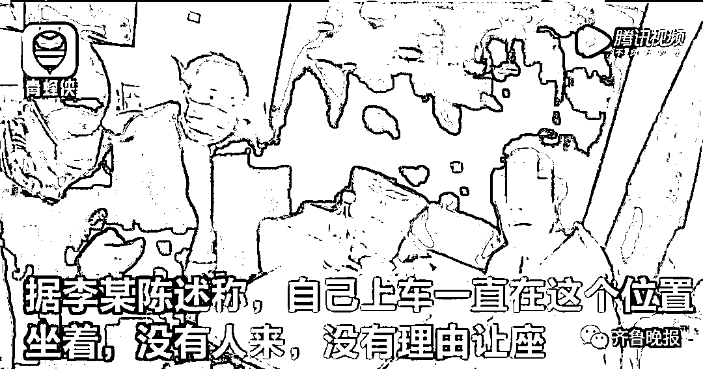
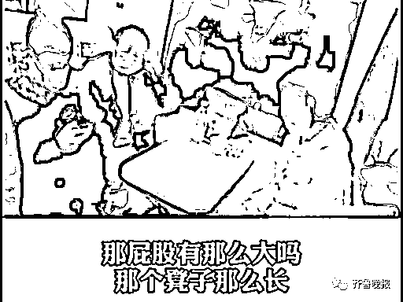
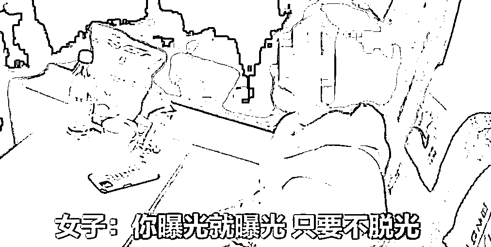
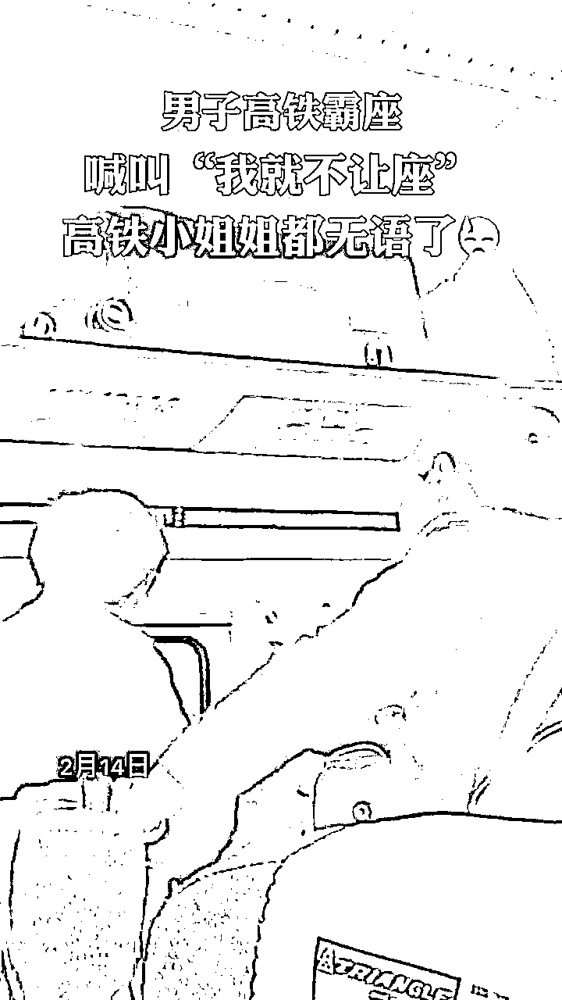
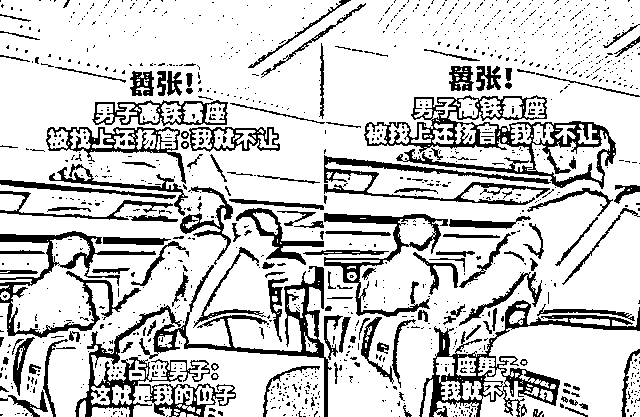
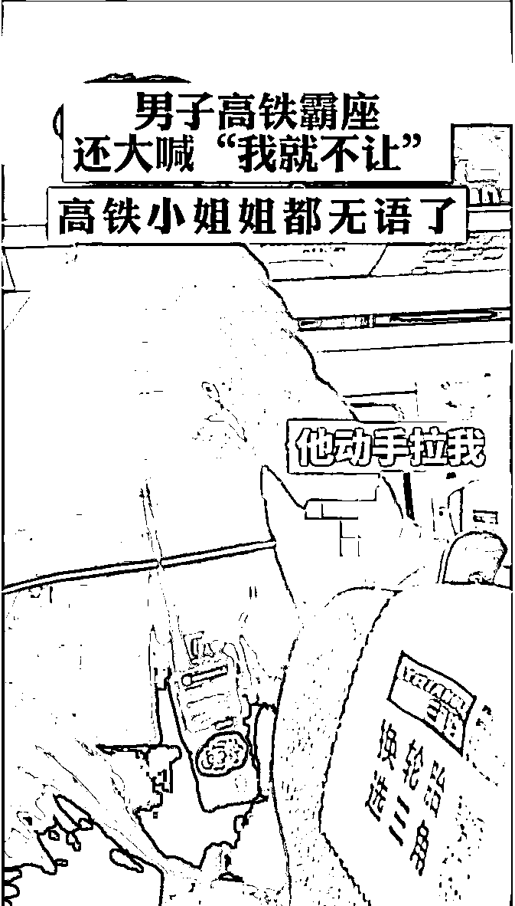

# “曝光就曝光，只要不脱光！”

> 原文：[`mp.weixin.qq.com/s?__biz=MzIyMDYwMTk0Mw==&mid=2247514033&idx=5&sn=3779f0055ba9cd19c14f5959c68951da&chksm=97cb7c89a0bcf59ff953055de017c891e7218ed54c7af05ee57752f738b2c6d8f0bf5a76bee4&scene=27#wechat_redirect`](http://mp.weixin.qq.com/s?__biz=MzIyMDYwMTk0Mw==&mid=2247514033&idx=5&sn=3779f0055ba9cd19c14f5959c68951da&chksm=97cb7c89a0bcf59ff953055de017c891e7218ed54c7af05ee57752f738b2c6d8f0bf5a76bee4&scene=27#wechat_redirect)

在外出行 

最怕碰上不讲道理的人 

特别是乘坐公共交通时 

碰上霸座的人

耍赖又不讲理 

更是让人气的跺脚

4 月 29 日晚 10 时许 k205 次列车运行至泰山到兖州区间警方接到报警称 15 车有一名旅客霸占他人坐席**拒不让座，态度蛮横****严重影响列车秩序**

乘警与车长迅速赶赴现场

[`v.qq.com/iframe/preview.html?width=500&height=375&auto=0&vid=e3244jfjoxv`](https://v.qq.com/iframe/preview.html?width=500&height=375&auto=0&vid=e3244jfjoxv)

**(视频来源：青蜂侠）**

经了解

旅客李某所持的

是青岛到成都的 15 车**无座票**

李某当时坐的座席是另一位查女士买的 15 车 15 座

据李某陈述称

自己上车一直在这个位置坐着

没有人来，没有理由让座并与查女士发生口角随即，乘警与车长耐心劝说并做解释说明表示其购买的是无座票当车厢内有空余座位时可以坐下休息持有该座车票的旅客上车时应主动让座

出门乘车应遵守公共秩序

互相理解

乘警对其告知相关法律法规及产生后果应承担的法律责任

但李某依旧拒不听劝 占座不让

并摆出了一堆

让人哭笑不得的奇葩理由

民警问道 “你是怎么上车的” 女子：……不得已使出了“杀手锏”多次警告无效列车到达徐州站乘警将李某移交至徐州站派出所处理**目前李某因霸座行为扰乱列车秩序被**

**处以行政拘留七日的处罚**

作为吃瓜群众

对于霸座闹剧见怪不怪

2 月 14 日

一段男子高铁霸座的视频在网上流传

视频中有一名男子站着

情绪激动地指着

坐在座位上的男子说

**“这就是我的位置！”**

而那位坐在座位上的男子告诉对方

**“我就不让！”**

坐着的男子在拒绝让位后

还认为站着的那位男子行为有所不妥

**“他动手拉我了”**

**“他什么态度”**

乘务员则这样劝说坐着的男子

**“大家都看着，他不会一上来就揍你吧”**

**“大过年的至于吗？”**

**“人家让你让座位**

**你不愿意让，人家可能有点激动”**

**警方通报：**

**霸座男子被行政拘留 5 日！**

除了火车上霸座

还有人在飞机上霸座

去年 11 月

在一架上海飞往北京的航班上

一名男子未对号入座

且不听机组人员劝解

占用其他的座位 15 分钟

[`mp.weixin.qq.com/mp/readtemplate?t=pages/video_player_tmpl&action=mpvideo&auto=0&vid=wxv_1629321392468901889`](https://mp.weixin.qq.com/mp/readtemplate?t=pages/video_player_tmpl&action=mpvideo&auto=0&vid=wxv_1629321392468901889)

不少网友疑惑了

都 2021 年了

**为何到现在还有人霸座？**

****

《民法典》已经正式实施

其中对“霸座”行为有约束

破坏规矩的人终会为自己的行为买单！

《民法典》第八百一十五条规定，**旅客应当按照有效客票记载的时间、班次和座位号乘坐**。

旅客无票乘坐、超程乘坐、越级乘坐或者持不符合减价条件的优惠客票乘坐的，应当补交票款，承运人可以按照规定加收票款；旅客不支付票款的，承运人可以拒绝运输。

民法典将按照客票记载的座位号乘坐认定是旅客的一项合同义务，因此作为客运合同的一方当事人，旅客应当积极履行该义务。否则，承运人可以拒绝运输。**若强行占座扰乱了公共秩序，还可能被处以治安行政处罚甚至涉嫌寻衅滋事罪而被法院判决承担刑事责任**。

对号入座，文明出行

坚决向“霸座者”说“不”！

来源：看看新闻 Knews、齐鲁晚报、海报新闻、青蜂侠、东方网、法治进行时

← 向右滑动与灰产圈互动交流 →

