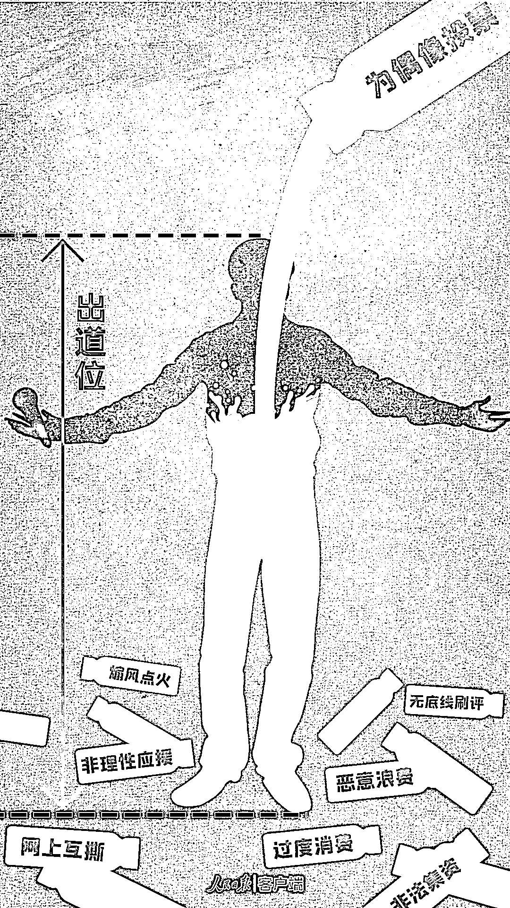
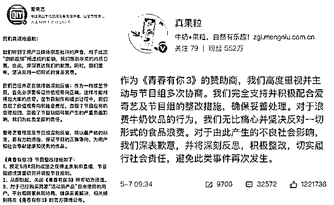
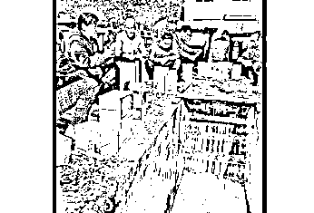
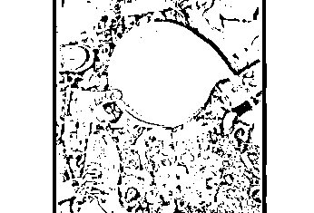
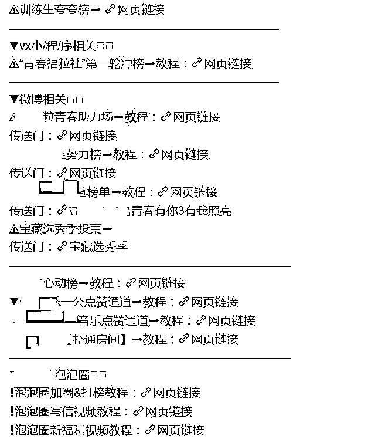
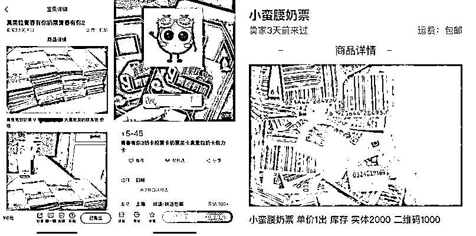
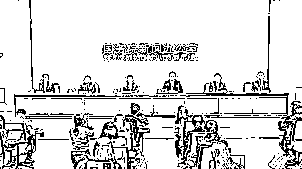
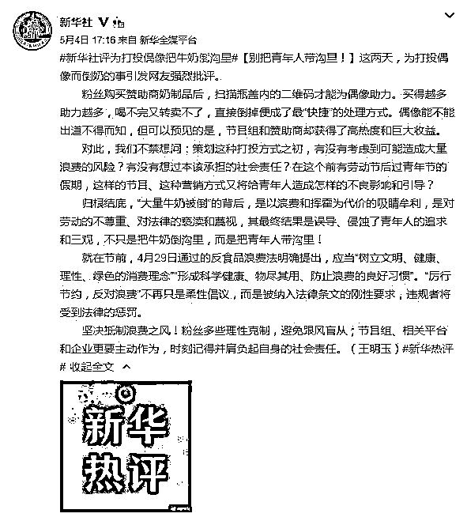
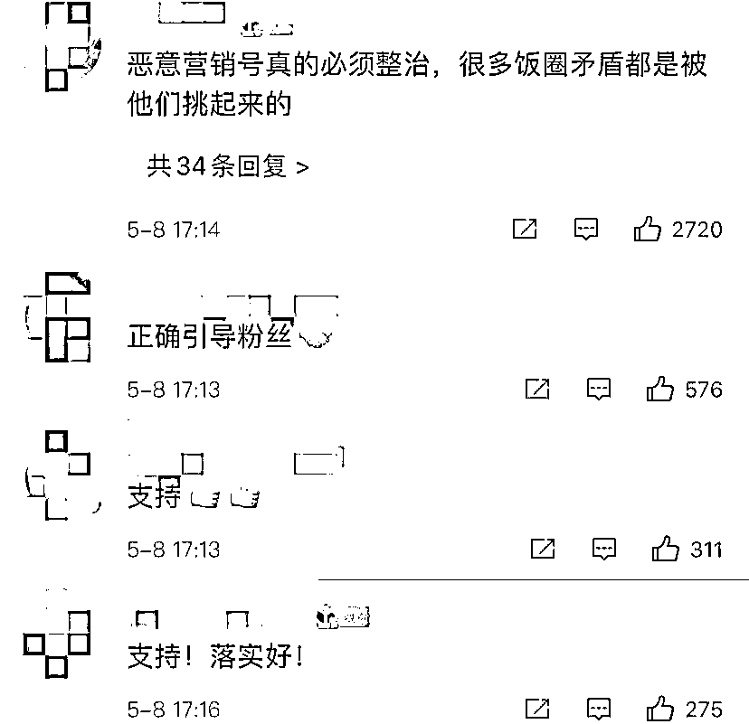

# 打榜倒牛奶：《青春有你 3》，彻底凉凉！

> 原文：[`mp.weixin.qq.com/s?__biz=MzIyMDYwMTk0Mw==&mid=2247514033&idx=6&sn=c0c40fe0c0fba23900d4b00ef0f6efeb&chksm=97cb7c89a0bcf59f0399e756fea66079ddcd5c366e601544e963c4dfbfa114863042a86c5ea9&scene=27#wechat_redirect`](http://mp.weixin.qq.com/s?__biz=MzIyMDYwMTk0Mw==&mid=2247514033&idx=6&sn=c0c40fe0c0fba23900d4b00ef0f6efeb&chksm=97cb7c89a0bcf59f0399e756fea66079ddcd5c366e601544e963c4dfbfa114863042a86c5ea9&scene=27#wechat_redirect)

图片来源：人民日报客户端

选秀节目打榜倒牛奶事件再把“饭圈”乱象置于聚光灯下先是《青春有你 3》后续录制被叫停后又因为追星“倒奶事件”激起千层浪浪费行为引起众怒爱奇艺、蒙牛真果粒先后发文致歉**5 月 8 日****国家网信办也点名回应“倒奶事件”**

疯狂的打投：

你不花钱偶像就没未来

《青春有你 3》原本要在 5 月 8 日举行总决赛按照往年惯例最终将有 9 名选手成为今年选秀的又一批幸运儿

微博截图

而今年频频爆发的负面新闻中止了这场“造梦之旅”**5 月 4 日，北京市广播电视局责令爱奇艺****暂停《青春有你 3》后续节目录制****5 月 6 日，爱奇艺发文致歉****调整节目规则，关闭所有助力通道****5 月 7 日，真果粒道歉****同时发布产品退货方案**

动图来源：央视网

“倒奶事件”，也让粉丝成为众矢之的尽管外界对饭圈的各类疯狂行为已经见怪不怪但如此大肆浪费还是刷新了人们的认知底线

动图来源：央视网

粉丝群体完全将资本和市场的逻辑内化甚至还形成了以集资金额为标准的鄙视链**为督促粉丝集资打钱****还发明了插旗、拔旗****集资 battle、集资 PUA 等方法**这背后是如今饭圈的一贯逻辑：
“你不花钱偶像就没未来”“你不花钱就没资格说话”“不花钱追星就是白嫖”对于追选秀的“秀粉”来说更是如此在他们看来集资是粉丝购买力和粉丝黏度的直接量化表现

复杂的节目规则：

粉丝销量决定选手去留

以《青春有你》为例

粉丝只要购买真果粒

就可额外获得助力机会

买得越多，投得越多

因此花钱买奶票也被认为是

拉开差距最好的方法

除了正式榜单

还有音乐榜单、品牌榜单、微博榜单

还要刷播放量，解锁各类“粉丝福利”

微博截图：粉丝总结的部分打投教程

 **复杂的规则，指向的是流量和收益**

**名目繁多的营销套路，不断压榨着粉丝的钱包和精力**

**不少粉丝自嘲为“数据劳工”“打投女工”**

粉丝的甜美噩梦：

滋生灰色产业链

平台和品牌的联合

粉丝们的积极参与

让选秀这盘棋越下越大

也让越来越多的粉丝被收割

**投不完的票**

**买不够的奶**

**打不完的榜单**

**成为“秀粉”们的甜美噩梦**

交易平台截图

由此，在选秀买奶领域

还产生了一条灰色产业链

比如代喝奶、代刮奶票、收奶等

在二手交易平台，这样的需求不在少数

**看似繁荣的粉丝经济背后**

**隐藏着随时失控的危险**

“65 万奶票下落不明”

“粉头卷款跑路喜提海景房”

“粉丝卷款 20 万跑路”

等消息不少见

**花钱追星的风气对青少年的影响更是恶劣****甚至还出现了学生省吃俭用****不惜借花呗、网贷来投票的情况**到今天，“倒奶事件”反噬闹剧中没有谁是真正的赢家

非理性应援？

国家网信办回应

国新办 5 月 8 日举行 2021 年“清朗”系列专项行动发布会。国家网信办网络综合治理局局长张拥军在回答记者提问时表示，“饭圈”乱象确实是当前网络上比较突出的问题。“饭圈”突出乱象主要表现是一些组织群体为了自身利益诱导青少年无底线追星，造成的结果是青少年在网上谩骂、互撕，包括人肉搜索、造谣攻击、不当消费，造成了不良网络文化，也误导和侵蚀了青少年的三观，引起广大家长的忧心、痛心甚至痛恨。张拥军指出，今年“清朗”系列专项行动把这项行动列入治理重点。主要从三个方面开展工作：**一是聚焦问题，处置清理有害信息。**针对当前网站平台上存在的“饭圈”谩骂互撕、挑动对立、刷量控评，包括教唆过度消费甚至大额消费、网络暴力等不良行为和现象，第一是清理有害信息，第二是坚决处置职业黑粉、恶意营销的群组账号，第三是坚决处置纵容乱象的网站平台，特别是对屡教不改的网站平台从严从重处罚。**二是压实平台主体责任，加强日常管理。**按照谁经营谁管理，谁受益谁负责的原则，督导网站平台特别是“饭圈”较为集中的网站平台，组建专门团队加强日常研判，处置不良信息。建立粉丝社群管理机制，加强关键环节功能调整，同时对重点人、重点账号进行分类施策。对封闭管理类社区论坛，加强版块版主管理，对账号实施分类管理。**三是综合施策，力争治本治源。**结合开展的专项行动，进一步加强对“饭圈”群体行为模式和治理方式的深入研究，指导相关网站平台制定社区规则，规范粉丝群体网络行为，尽量从本源上解决问题，引导青少年理性追星。

人民日报评论：

“饭圈”乱象的账，该好好算一算了

 有自己喜爱的艺人，欣赏他们的作品，关注他们的动向，对他们表达支持，如果这些行为都在道德和法律范围内，那也并无不妥。现在的问题是，“饭圈”衍生的一些乱象大大超出了这个范围，不断引发纷争：诱导青少年“粉丝”网上互撕、制造网络暴力、非理性应援、无底线刷评，以及宣扬金钱崇拜甚至涉嫌非法集资……**“饭圈”的畸形发展已经影响到社会秩序，影响到青少年的健康成长，有关部门理应警惕并及时出手。**

**在“饭圈”乱象的不良诱导下，一些操盘手让追星变成了高成本之事，对涉世未深的青少年进行情感绑架、金钱“勒索”**，鼓吹“你一票，我一票，哥哥今天就出道；你不投，我不投，妹妹何时能出头？”更可恶的是，有些人还对青少年进行精神控制，毒害青少年的三观。把青少年从“饭圈”乱象的漩涡中拉出来，这是当务之急。

**消除“饭圈”乱象，关键在拿“圈头”开刀。**“饭圈”兴风作浪，是因为背后有坐镇指挥的组织者，有分工明确的架构设立，更有疯狂逐利的商业推手，他们把青少年当成提款机乃至“打手”。清除这些操盘手，挖掉其收割链条，封禁其套现的路径，就能让网络暴力、无底线打榜刷屏等行为逐渐减少。

**此外，消除“饭圈”乱象也需剑指有关平台。**毋庸赘言，一些平台在“饭圈”病态生长过程中，长期扮演很不光彩的角色。它们对营销号睁一只眼闭一只眼，唯恐“粉丝”不撕，一心只考虑平台流量，甚至有意推波助澜，从中寻觅商机，为“饭圈”乱象提供了最好的温床。对这一点，社会舆论已达成高度共识，各类平台当直面这种关切，“全力抓好自查整改”，清除“饭圈”乱象滋生的土壤。

**不容“饭圈”文化继续毒害青少年的精神世界，不容“饭圈”乱象败坏社会风气。**可以预见，这次集中整治“饭圈”乱象，打的是组合拳，求的是高效和实效。“饭圈”乱象的账，是时候好好算一算了。 

新华社评论：

别把年轻人带沟里！

微博截图

粉丝购买赞助商奶制品后，扫描瓶盖内的二维码才能为偶像助力。买得越多助力越多，喝不完又转卖不了，直接倒掉便成了最“快捷”的处理方式。偶像能不能出道不得而知，但可以预见的是，节目组和赞助商却获得了高热度和巨大收益。对此，我们不禁想问：策划这种打投方式之初，有没有考虑到可能造成大量浪费的风险？有没有想过本该承担的社会责任？在这个前有劳动节后过青年节的假期，这样的节目、这种营销方式又将给青年人造成怎样的不良影响和引导？**归根结底，“大量牛奶被倒”的背后，是以浪费和挥霍为代价的吸睛牟利，是对劳动的不尊重、对法律的亵渎和蔑视，其最终结果是误导、侵蚀了青年人的追求和三观，不只是把牛奶倒沟里，而是把青年人带沟里！**网友：支持整改！

对此，网友纷纷表示：

“支持整改”

来源：共青团中央，中国青年网

← 向右滑动与灰产圈互动交流 →

