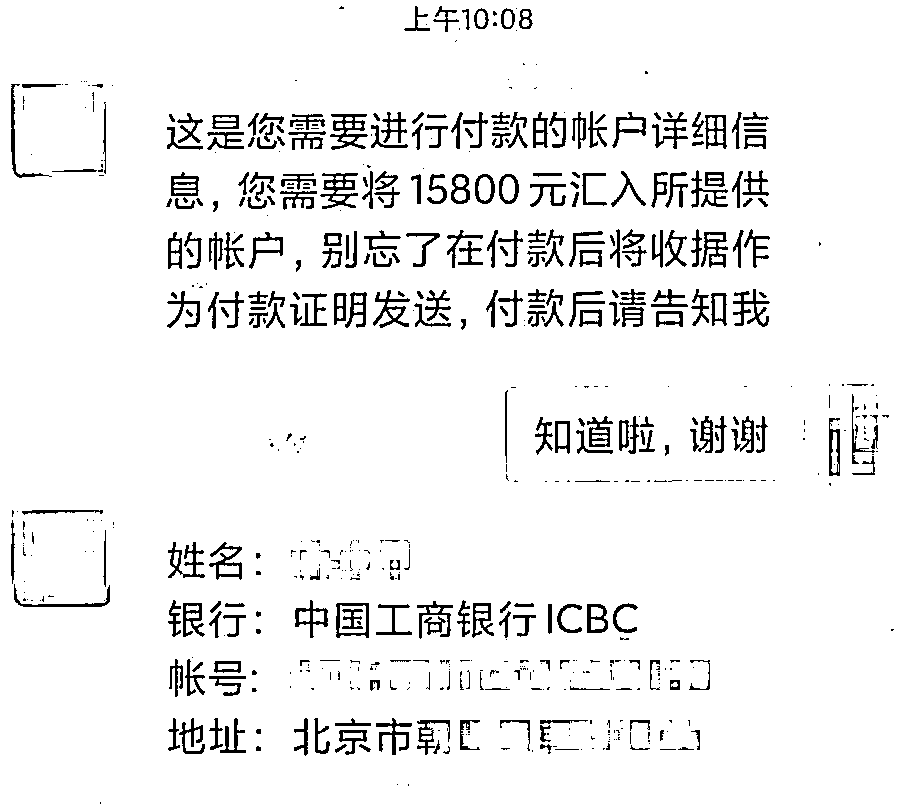

# “洋美女”“美国军官”，全是精心策划的骗局！

> 原文：[`mp.weixin.qq.com/s?__biz=MzIyMDYwMTk0Mw==&mid=2247514033&idx=7&sn=0498c6a9cf474f88e081f03ac90dfe08&chksm=97cb7c89a0bcf59f6d34f863cc7ffcaf6c1283132480bf59213c48d26ace98cf977943990e6b&scene=27#wechat_redirect`](http://mp.weixin.qq.com/s?__biz=MzIyMDYwMTk0Mw==&mid=2247514033&idx=7&sn=0498c6a9cf474f88e081f03ac90dfe08&chksm=97cb7c89a0bcf59f6d34f863cc7ffcaf6c1283132480bf59213c48d26ace98cf977943990e6b&scene=27#wechat_redirect)

近日，江苏男子连续被骗 4 次的经历
受到广泛关注**这一切皆因****男子在微信上添加了一名****自称是英国籍的“洋美女”而起**诈骗分子利用人们追求爱情的心理 布下各种陷阱将网恋变成一场让人心碎的骗局不少人因此掉入感情陷阱还不自知

今年 3 月

江门的刘女士通过微信添加了

自称是美国军官的男子为好友

并与其发展为网恋关系

美国军官和刘女士成为“恋人”关系

没多久男子称自己在执行任务中受伤住院希望趁此机会休假，到刘女士身边疗养**但需要刘女士帮他按休假天数支付保险金**于是刘女士向男子上司“将军”申请休假“将军”告知休假 30 天需交 15800 元保险金刘女士信以为真，连忙到银行转账银行工作人员听刘女士说要转给美国男友的上司后立即阻止她并报警民警随即赶到银行告知刘女士这是网络诈骗 在民警的耐心劝导下 刘女士终于醒悟过来并感谢民警和银行工作人员的帮助刘女士幸运地避免了损失然而珠海有一位受害者却被骗子的连环套路骗得团团转今年 4 月离婚多年的李大妈在交友 App 上认识了一名自称**在国外执行任务的军官**两人很快发展为恋人关系有一天军官男友说他执行任务受伤住院了并发来一张大腿中枪的图片 还说自己领到了**100 万美元**的退休补贴想寄给李大妈买房付首付男友说让一个认识的快递员把这 100 万美元带回国还叮嘱李大妈**千万不能让海关打开检查****否则会有高额税费**可没过几天快递员说包裹被香港海关查扣了**需支付 25000 元办理海关通关证书****才能免检查**李大妈转账了然而，过了两天快递员说因香港海关还是不放行**自己与海关打起来导致进监狱了****需要 43000 元赎金**男友让李大妈先垫付赎金回头还给她李大妈答应了**结果快递员说****到北京海关又被扣押了****要 68000 元通关费**可是李大妈已经没有钱了只好问儿子借钱儿子一听来龙去脉就说李大妈被骗了 李大妈还不信 直到被男友和快递员都拉黑了李大妈才如梦初醒可能有人觉得他们都是被爱情冲昏了头脑只要自己不网恋就不会被骗到了但就在去年 11 月广州一位老人执意要转 10 万元给网上认识不久的朋友老人在微信认识了一位自称在美国的朋友**该朋友称寄了一个包裹给老人****但中途被扣留在香港****让老人先帮忙交手续费****之后会高息还钱**于是老人到银行转账银行工作人员发现老人对转账对象并不了解资金用途也很可疑情况与警方在防诈骗宣传中讲的很像于是报警在民警、辅警与银行工作人员的劝说下老人才意识到自己遇到了骗局表示不会转账了

上述的案例，故事开头虽然不尽相同，但结局都一样，受害者均是通过网络结识“外籍人士”，再通过接收国外邮寄的包裹一步步落入骗子的圈套。这种骗局的厉害之处在于，每个环节都设置得非常精密：

首先，对方提出**从国外****邮寄一笔现金或重要包裹**过来，而且千叮万嘱不能打开，财不外露，这很合理。 

到了海关之后，工作人员又必须要开箱检查。这是合情合理的，也是规矩，但如果开箱检查就要缴纳巨额税费，这就让受害者陷入了两难。

于是，**受害者为了得到巨额财富，选择先垫付“通关费”“手续费”等。**所有的环节都是环环相扣，让人在不知不觉中掏钱。

警方提醒对于网络交友尤其自称是外国人交友涉及资金往来的一定要擦亮双眼认真核实对方的身份提高警惕捂紧钱包来源：深圳市反电信网络诈骗中心、福田警察、广东公安、平安广州、珠海刑侦、江门公安

← 向右滑动与灰产圈互动交流 →

