# 技嘉，下架！

> 原文：[`mp.weixin.qq.com/s?__biz=MzIyMDYwMTk0Mw==&mid=2247514103&idx=1&sn=b5fd530f1766bca618c1c66b2fe6f119&chksm=97cb7ccfa0bcf5d93a061bd7f591998c1b3b8e1ead52f912d17c94bc092ac7ee4bbaa6428867&scene=27#wechat_redirect`](http://mp.weixin.qq.com/s?__biz=MzIyMDYwMTk0Mw==&mid=2247514103&idx=1&sn=b5fd530f1766bca618c1c66b2fe6f119&chksm=97cb7ccfa0bcf5d93a061bd7f591998c1b3b8e1ead52f912d17c94bc092ac7ee4bbaa6428867&scene=27#wechat_redirect)

技嘉为污蔑中国制造道歉，京东、苏宁已屏蔽相关产品。

公然将台湾和中国并列，还在大陆官网上污蔑中国制造，被发现之后又删除，今天，台湾电脑硬件生产商技嘉的这一操作让大陆网友看呆了，这难道就是又怂又作吗？

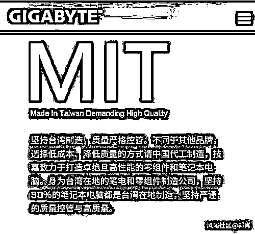

技嘉创立于 1986 年，是台湾地区的电脑硬件生产商之一，以主板、显卡产品为主力，也有电脑、笔记本等整机业务，但后者一直表现平平，所以被调侃为“无人问津嘉”。

昨天，有网友注意到，技嘉的官网上出现了这样的字眼：**坚持台湾制造，质量严格管控，不同于其他品牌选择“低成本、降低质量的方式请中国代工制造”，不仅污蔑中国制造，还将台湾地区和中国并列。**

更有仔细的网友发现，**这一幕仅仅出现在技嘉在大陆的官网上。**

此外，技嘉的网站，有“大陆版”“台湾版”“香港版”和“全球版”。

选择大陆版本的“认识我们·认识技嘉”的卓越制造一栏，写着设厂于台湾地区、宁波和东莞。

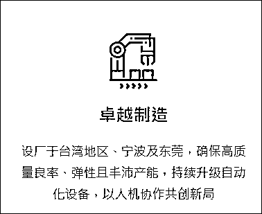

而香港版、台湾版中都将“地区”二字去掉了。

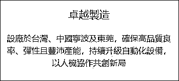

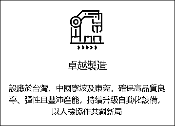

“全球版”的这一页面，同样将台湾和中国并列。

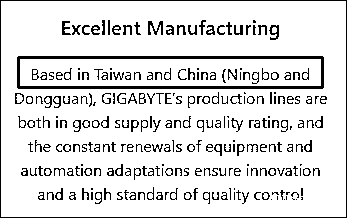

如此碰瓷，让一众大陆网友看呆，这是“明狼”了？

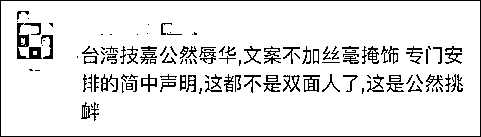

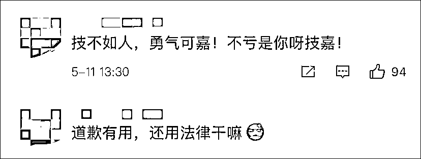

@共青团中央 也怒斥：谁给你的勇气？

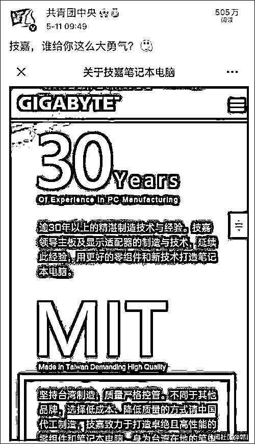

事情发生后，京东、苏宁下架了技嘉的所有产品。

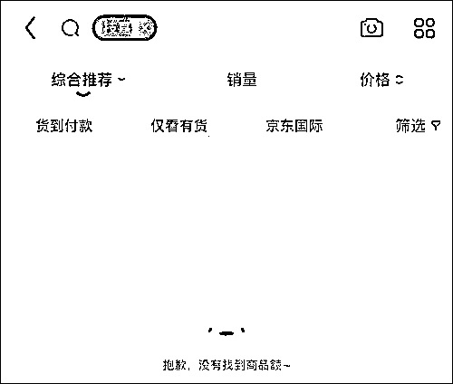

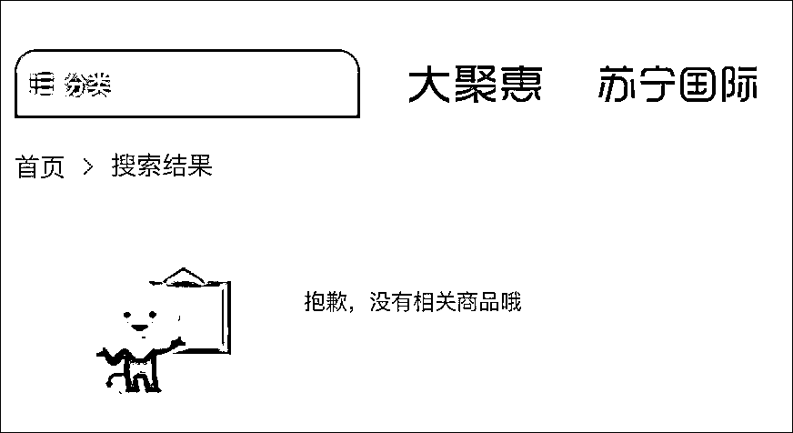

今天中午，@技嘉电竞 以技嘉科技的名义发布致歉声明书，称官网发布的部分文字内容与事实严重不符，系公司内部管理不善所致，对此给大家带来的不适致以诚挚的歉意。

声明中该公开了一组数据：技嘉在大陆开展业务已有 20 多年，板卡、笔记本电脑、电脑周边配件等生产线遍布大陆，产能占比高于 90%。

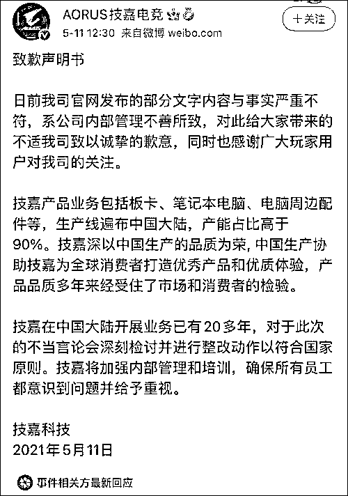

该公司在 B 站也写道：技嘉全体中国员工，坚决维护祖国和平统一！

下午 1:30，@技嘉电竞 再次发帖，表示技嘉坚持一个中国的立场，反对任何形式的分裂行为和言论。

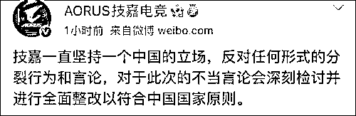

值得注意的是，**@技嘉电竞 在 B 站的认证属于宁波中嘉科贸有限公司，启信宝显示，该公司由宁波技嘉国际贸易有限公司全资控股。**

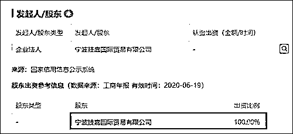

目前，**技嘉官方没有给出任何说法，其 Facebook 和 Twitter 账号仍在宣传新产品。**

来源：观察者网

← 向右滑动与灰产圈互动交流 →

