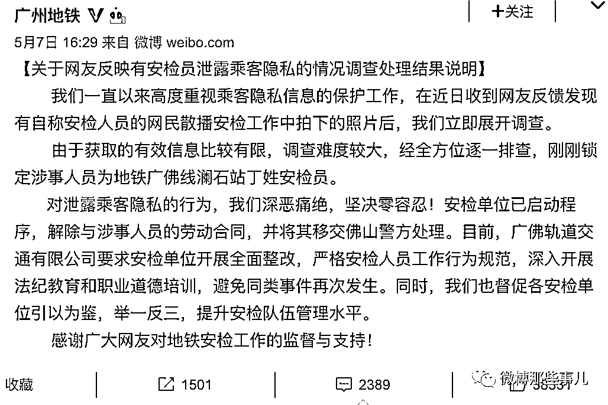

# 地铁安检员私拍泄露乘客隐私被网友举报，自称“广州最后的纯洁了”！

> 原文：[`mp.weixin.qq.com/s?__biz=MzIyMDYwMTk0Mw==&mid=2247514103&idx=2&sn=469201622dedf34bfb725321a9cbf471&chksm=97cb7ccfa0bcf5d9eb761cf4fdf81c7bfc1e7134fe95219bc9735b8bb7a2fae72212f6fcbbf2&scene=27#wechat_redirect`](http://mp.weixin.qq.com/s?__biz=MzIyMDYwMTk0Mw==&mid=2247514103&idx=2&sn=469201622dedf34bfb725321a9cbf471&chksm=97cb7ccfa0bcf5d9eb761cf4fdf81c7bfc1e7134fe95219bc9735b8bb7a2fae72212f6fcbbf2&scene=27#wechat_redirect)

5 月 7 日，网友“三千院雨”在地铁族微信群爆料称广州地铁安检人员对乘客携带的没有违禁违规的隐私物品拍照留存，并发布到群聊中调侃。 5 月 7 日下午，广州地铁发布通报称，锁定涉事人员为地铁广佛线澜石站丁姓安检员，安检单位已启动程序，解除与涉事人员的劳动合同，并将其移交佛山警方处理。后来，爆料博主@三千院雨 Official 收到了一位自称当事人的私信道歉：

* * *

豆沙包专卖店：千万别删  这件事也是给那些猥琐男们的警告

i 以为只是 u 以为：作为一个普通路过吃瓜的人，我就特别纳闷。还以为你是那个行李箱的当事人，搞了半天你是在 Q 群看到的，得饶人处且饶人吧，曝光的主要目的是希望得到整改，不是不依不饶不喜勿喷，纯个人观点

榴莲味的喵喵：岗前培训了吗，基本的职业操守都没有……

来源：微博那些事儿

← 向右滑动与灰产圈互动交流 →

