# 1000 元变 1.6 亿元？"SHI"币太火了！交易所突然“崩了”，暂停提款！刚刚，回应来了…

> 原文：[`mp.weixin.qq.com/s?__biz=MzIyMDYwMTk0Mw==&mid=2247514103&idx=4&sn=93300ad8909c69dd98f65e2fe0746498&chksm=97cb7ccfa0bcf5d9b9f5d3e43f79a482bb95861a49cab51de545db7806eeb526a72a40f2e490&scene=27#wechat_redirect`](http://mp.weixin.qq.com/s?__biz=MzIyMDYwMTk0Mw==&mid=2247514103&idx=4&sn=93300ad8909c69dd98f65e2fe0746498&chksm=97cb7ccfa0bcf5d9b9f5d3e43f79a482bb95861a49cab51de545db7806eeb526a72a40f2e490&scene=27#wechat_redirect)

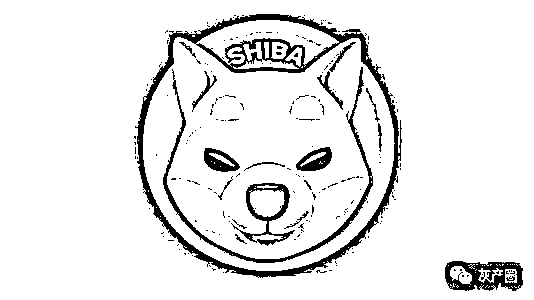

5 月 10 日晚 7 点，短短两三个月涨幅超万倍的柴犬币 SHIB 上线币安交易所。结果上线仅 10 分钟，SHIB 大涨超 100%之时，币安交易所就表示，暂停所有提款。 

到底发生了什么？小编来给你捋捋……

SHIB 上线大涨超 100%

交易所宕机，回应称：平台流量过载

这几天，马斯克又带火了一个名为“柴犬币”（SHIB），也俗称“屎币”。不少交易所争相上线 SHIB 交易。

5 月 10 日晚 7 点，Binance (币安)交易所上线该币种交易。上线，仅十分钟，本来一路下跌的 SHIB 迅速反弹，上涨 100%。

就在大家交易得热火朝天的时候，币安突然宣布，所有提款都将暂时停止。币安表示，请放心，我们的团队正在努力解决这个问题。我们对造成的任何不便表示歉意，并感谢您的耐心等待。 

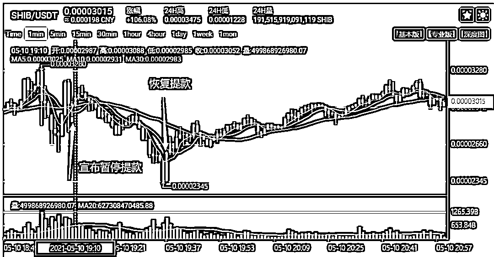

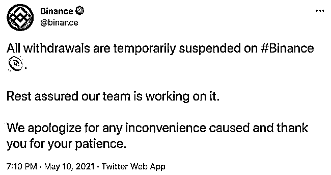

随后，火币价格从高位暴跌近 30%。 

5 月 10 日晚 7 点 34 分，币安更新状态称，所有提款已恢复。

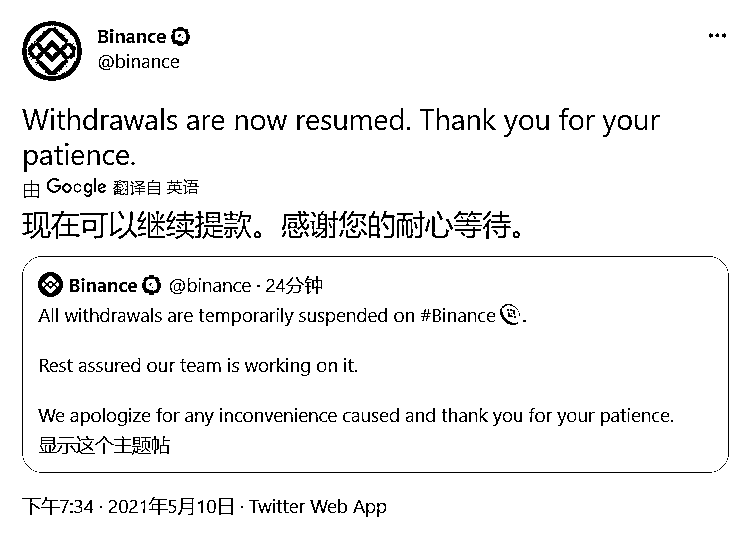

币安内部人士表示，因流量过载，币安交易平台今日暂停所有提款，技术团队已进行修复，目前，平台已经恢复提现功能。

此后，柴犬币的价格再次反弹，截至发稿，柴犬币仍然上涨超 100%。 

“造富神话”再度上演

1000 元变 1.6 亿元？

5 月 8 日，加密货币 Shib（俗称柴犬币/屎币）价格一度狂涨超 251％，交易量达 403 亿元，随后有所回调，24 小时内暴涨 236%，登上微博热搜。柴犬币超话甚至超过狗狗币，坐上币圈热度第二把交椅。

无论是比特币、狗狗币，还是柴犬币的暴涨，背后都有马斯克的身影，他仅用一两句话，就在币圈掀起腥风血雨。

当地时间 7 日，特斯拉独立董事、日本养老基金前首席投资官水野弘道(Hiromichi Mizuno)在社交媒体上表示：“投资者可以短线交易柴犬币，但不要这样对待自己的柴犬宠物狗。”

马斯克随即回应：“我正在寻找一只柴犬。”

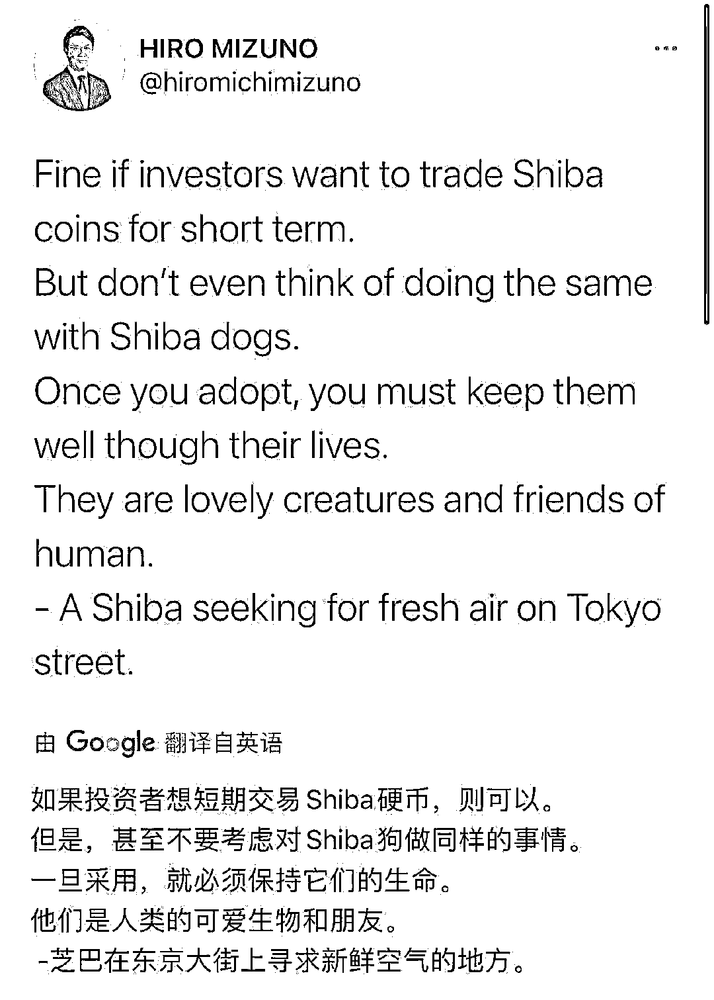

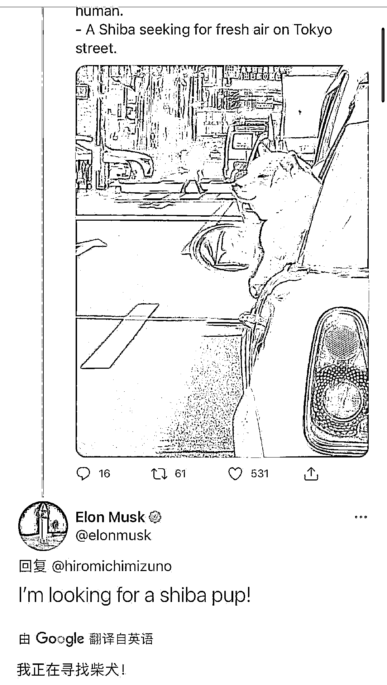

同一日，一位名为“Shib Father”的用户透露，马斯克将在其主持的《周六夜现场》（Saturday Night Live）综艺节目上讨论柴犬币，并称其要涨到 1 美金。

随后，柴犬币（Shib）短时一根超级大阳线，日内涨超 251%，暂报 0.0000183 美元，约合人民币 0.0001 元，登上各大交易所涨幅榜榜首。截至 5 月 9 日，柴犬币一日交易量达 403 亿元，暴涨 1297.64%，市值暴涨 359.31%。火热的行情，一度使各大交易平台遭遇短暂宕机。

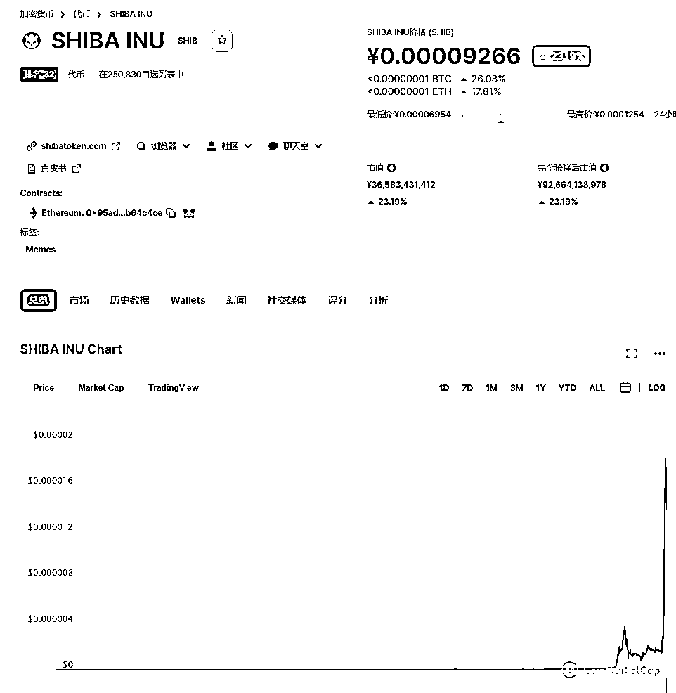

近期，有网友晒出截图，去年花 1000 元买进的 7200 亿个柴犬币，5 月 8 日时，持有市值已经超过 8000 万。如果按照今天日内高点 0.00003475 美元计算，这 7200 亿个柴犬币的持有市值已经超过了 1.6 亿元。 

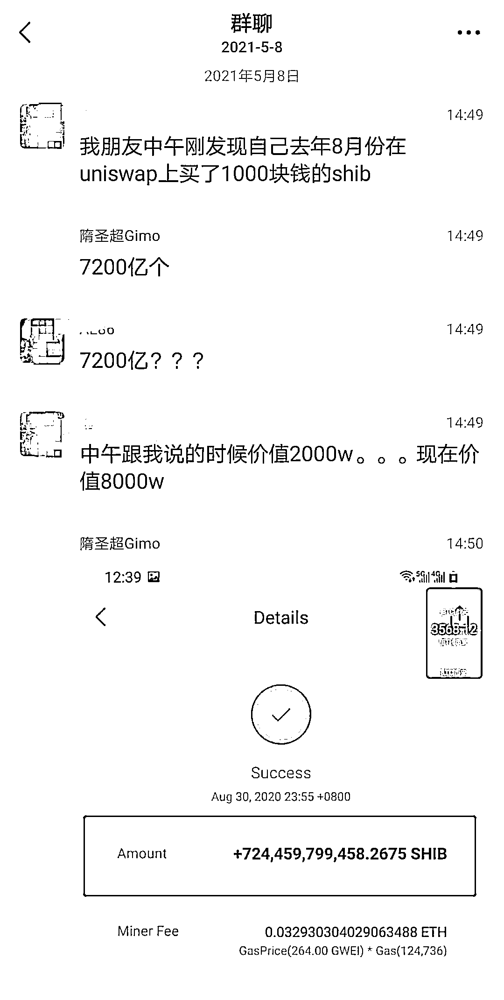

下一个狗狗币？

300 万瞬间爆仓？

从廉价的山寨币走向炙手可热的全球涨幅第一加密货币,柴犬币(Shib)仅用了 2 天。5 月 9 日,SHIB 柴犬币单日最高暴涨 500%,两日上涨 3 倍,这是一种十分熟悉的味道。 

就在马斯克高喊 SHIB 能涨到 1 美元时，还表示自己之前一直“带货”的狗狗币是一场骗局。随后狗狗币当日暴跌 39%，这引发了不少投资者在狗狗币上惨遭爆仓。

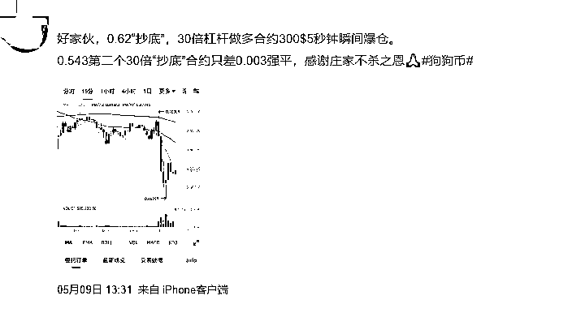

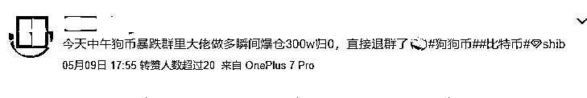

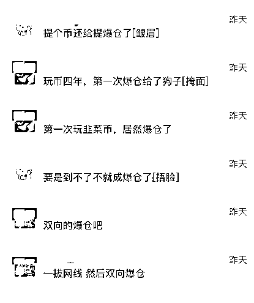

**英国央行行长：**

**买加密货币就要做好血本无归准备**

****

****英国央行行长安德鲁-贝利（Andrew Bailey）在比特币、以太币和狗狗币等加密货币资产大幅上涨后表示，人们只有在准备好损失所有钱的情况下才应该购买加密货币。****

****贝利周四表示，他认为比特币等加密货币没有内在价值，“我只想强调我近年来多次说过的话，恐怕它们没有内在价值。”****

****“这并不意味着人们不重视它们，因为它们可以具有外在价值。但它们没有内在价值。”****

****贝利补充称：“很抱歉，我要再次非常直率地说：只有在你准备好赔光所有钱的时候才能买它们。”****

****贝利说，他不相信加密货币是真正的货币，他说：“货币和加密货币这两个词对我来说恐怕是毫不相干的。”贝利的言论呼应了今年早些时候英国金融市场行为监管局（FCA）的观点。****

****FCA 今年 1 月表示，与加密货币相关的投资和贷款产品“风险非常之高”。如果消费者投资这类产品，“他们应该做好赔光所有钱的准备。”****

****尽管贝利发出了警告，但这位英国央行行长表示，他没有看到资产出现任何可能给整体金融稳定带来问题的波动迹象。****

****来源：中国基金报  ****

****************

****← 向右滑动与灰产圈互动交流 →****

********