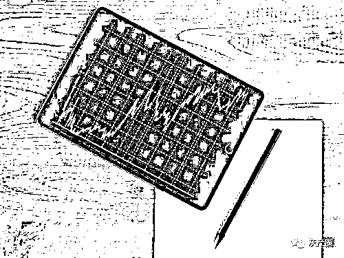

# 湖南一女子沉迷网络炒股，7 个月挪用公款 776 万余元！她怎么做到的？

> 原文：[`mp.weixin.qq.com/s?__biz=MzIyMDYwMTk0Mw==&mid=2247514103&idx=7&sn=5cf64c54f03617a6033ebead2a971350&chksm=97cb7ccfa0bcf5d94eff1ccf5780d93b2235fd4562a7ce1622c1bd69c9d8bc0aa8f40c4632ba&scene=27#wechat_redirect`](http://mp.weixin.qq.com/s?__biz=MzIyMDYwMTk0Mw==&mid=2247514103&idx=7&sn=5cf64c54f03617a6033ebead2a971350&chksm=97cb7ccfa0bcf5d94eff1ccf5780d93b2235fd4562a7ce1622c1bd69c9d8bc0aa8f40c4632ba&scene=27#wechat_redirect)

“办案人员告诉我，这些骗子就像写小说一样，先把套路都写好，让你们一步一步往里面走，我这才知道是网络诈骗。”吉首市新兴城乡公路建设投资有限责任公司原出纳彭某花，因沉迷网络炒股，7 个月挪用公款 776.52 万元。

这 7 个月彭某花究竟遭遇了什么？她为何又能挪得这笔公款？4 月下旬，吉首市纪委监委披露了这起案情细节。

资深股民遭遇网络诈骗

彭某花曾在吉首市公路管理局工作，后被抽调至市新兴城乡公路建设投资有限责任公司担任出纳 10 年，2015 年 8 月退休后继续被该公司返聘，可以说兢兢业业工作了大半辈子。

作为一名资深股民，彭某花曾在股市中如鱼得水。2019 年 3 月，经朋友介绍，彭某花加入一个微信群，群中授课人员积极动员大家去炒某高档酒。彭某花听了很动心，在对方的指导下安装了某国际贸易交易中心的平台进行操作，投了一点钱“试水”，发现果然来钱很快。

**利欲熏心之下，彭某花认为多投钱收益也越多，就向亲友借、向银行申请贷款。不到一个月，她发现自己和借来的钱全都亏掉了。**

思来想去，彭某花终于找到一条好路子：刚好有一笔修路工程项目的质保金在公司账户上，还没到付款日期。为何不用公款来大赚一笔，一次性还清亏空，然后再将钱还回公司账户？

于是，2019 年 4 月，彭某花从公司账户转了 9.1 万元到自己账户，然后转入交易平台，但这笔钱很快亏损了。在授课人员的鼓励下，在群友大手笔投入的刺激下，连续几天，彭某花陆续从公司账户挪用 28.7 万元，依然是血本无归。

随后，彭某花在另一个微信群又认识了一名授课人员，对方极力推荐她到某资本平台炒杠杆股票。由于之前的失败，彭某花变得稍微谨慎一些，但看到群里大家纷纷说，“可以买涨也可以买跌，无论股票涨跌，纯粹是捡钱。”彭某花胆子越来越大，先后挪用公款在该平台投入 97.4 万元，公司账户成了她的提款机。

走投无路之下选择自首

为了不让挪用一事暴露，彭某花联系外聘的负责公司会计业务的记账人员，以公司业务少、资金交易不多，对账单提取比较麻烦为借口，把一月一对账的制度私下改为一季度一对账。

这下，彭某花更加肆无忌惮，从一次挪用几万元到后来一次挪用 68 万元。每次都想能大赚一笔，将之前的漏洞补上，然而投入越多，越炒越亏。

2019 年 4 月到 10 月，彭某花疯狂挪用公款 776.52 万元，全部用于在多个网络平台购买股票、港币、TO 币及清偿债务等。

其间，会计人员多次联系彭某花进行第二季度的对账，她以在外地治病为由，一直拖着不办。等她将平台的投资处理了，归还一部分公款后，才提交对账单和财务发票进行审核。

会计人员发现彭某花用借备用金的方式，从公司账上划拨一笔笔大额资金转到个人账户，也没有领导签字，便将这一异常情况向公司领导反映。领导基于对彭某花的信任，并未及时作出处理。

2019 年 10 月，彭某花发现这些网络平台接连关闭，她像热锅上的蚂蚁一样急着回收资金，但每个平台都以各种借口无法取出钱，她终于感到上当受骗，来到派出所报案。民警告诉她，这些都是虚拟平台，是典型的网络诈骗。

彭某花曾 4 次向公司归还 100 余万元，但剩下的 600 余万元根本无力偿还。同年 11 月，她走进湘西州纪委监委自首。

挪用巨款为何未被发现

7 个月挪用公款 776 万余元，为何没有被发现？

“一方面，彭某花对法纪毫无敬畏之心，将公款随意转往自己的账户用于营利；另一方面，公司的财务管理松懈，制度形同虚设，监督流于形式，给了她作案的空间。”办案人员说。

专案组调查发现，**公司制单、复核的两个 U 盾都放在彭某花手中，给她提供了随时挪用公款的条件。公司的对账制度流于形式，按规定应该日清月结，但彭某花和会计人员私自改为按季度对账，给了她作案的时间。**公司的廉政风险防范意识极为薄弱，会计人员和公司领导发现账目存在问题，却没有及时采取措施。

最终，彭某花被开除党籍、取消退休待遇，其涉嫌犯罪问题及涉案款物移送司法机关依法处理。2020 年 12 月，彭某花被判处有期徒刑 10 年，追缴公款 653.101 万元。吉首市新兴城乡公路建设投资有限责任公司相关责任人分别受到责任追究。

来源：湖南日报

← 向右滑动与灰产圈互动交流 →

