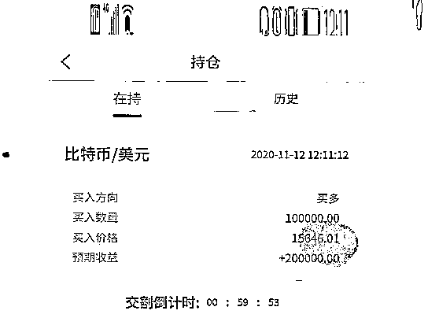
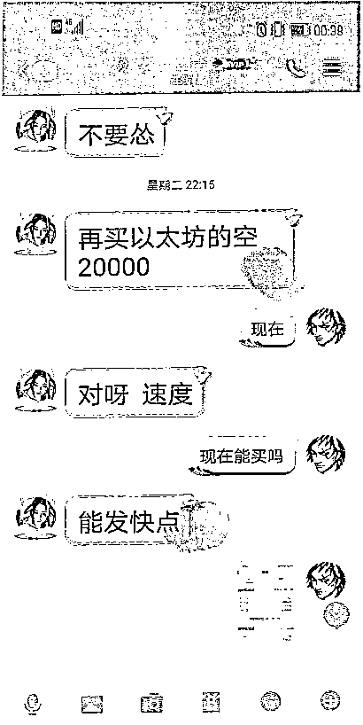
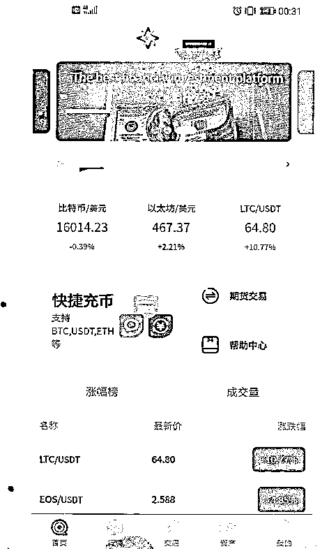

# 在柬埔寨开店不景气转行做理财诈骗，一小姐姐被骗百万

> 原文：[`mp.weixin.qq.com/s?__biz=MzIyMDYwMTk0Mw==&mid=2247514103&idx=8&sn=79afffcf5f45af70bc1ebd8b0124f1c3&chksm=97cb7ccfa0bcf5d989453888fd197ed599208d9628f3d896e160ec020dfc391c0ac794cd4326&scene=27#wechat_redirect`](http://mp.weixin.qq.com/s?__biz=MzIyMDYwMTk0Mw==&mid=2247514103&idx=8&sn=79afffcf5f45af70bc1ebd8b0124f1c3&chksm=97cb7ccfa0bcf5d989453888fd197ed599208d9628f3d896e160ec020dfc391c0ac794cd4326&scene=27#wechat_redirect)

2020 年 11 月的一天，蕾蕾来到公安机关报案,称自己在网络交友平台与名为“思思”的女子发展成恋爱关系后，被其诱导进行比特币投资，随后发现比特币无法提现。

截至报案，蕾蕾已被诈骗人民币 105 余万元。

警方展开侦查后，**很快找到了这个藏身于柬埔寨菩萨省的跨国诈骗窝点**，并随即进行抓捕，将该诈骗窝点中 7 名犯罪嫌疑人逮捕归案(其余成员在逃)。

经审查讯问，警方发现与蕾蕾发展成恋爱关系的那名女子“思思”原名徐梦琴，仅是这一诈骗团伙中的一名“小兵”。

被害人的持仓截图。

**入伙诈骗集团，分工有序套路多多******

****出生于福建的徐梦琴在柬埔寨开了一家小店，但小店生意冷清，2019 年 11 月就倒闭了，她不得不另寻生计。****

****就在这时,她听说自己的“发小”王芬从戒毒所出来了,并且也在柬埔寨发展得不错。****

****于是，徐梦琴立刻联系上了王芬。****

****二人相见后，王芬告诉徐梦琴，自己是经别人介绍来柬埔寨 A 集团工作，并且表示愿意将徐梦琴也介绍进这一集团。****

****于是，徐梦琴跟着王芬来到菩萨地区一个工业园区内。****

****与这一集团的其他成员见面后，徐梦琴才知道这家 A 集团公司主要工作是开发运营多款网络赌博 App 和投资 App。****

****而徐梦琴、王芬等人的工作就是利用网络交友平台寻找目标对象，引导其在该集团开发运营的 App 上进行投资或赌博，平台后方可以通过操作，让目标对象输钱，这样徐梦琴等人就可以拿到提成。****

****“**每月底薪 6000 元，做满 10000 元业绩后便能转正，转正后每月底薪涨幅为 500 元，最高能够涨至底薪 9000 元，此外还按照业绩来抽成,最高可抽成 15%。**”****

****徐梦琴明白，这一行为的本质就是诈骗，但负责人的许诺仍让她心动不已，于是徐梦琴决定加入。****

****2019 年 12 月，一款投资 App 软件正式投入运行。****

****集团内部分工有序，共分为三组，每组设一名小组长以及若干名下属，相互形成竞争关系。****

****徐梦琴和王芬等人跟随一名叫李云的小组长，李云安排徐梦琴在 QQ、“Soul”等交友软件上扮演“事业成功的女性”和“开服装店的美女”等角色，添加好友后和对方聊天建立信任和感情，随后拉拢对方进行投资赚钱。****

****他们的惯用套路是：先让对方充值几次赚到甜头，再劝说对方加大投注,然后进行暗箱操作，使被害人亏钱。****

****徐梦琴很快便熟悉了流程，小赚了几笔，直到 2020 年下半年，徐梦琴回到国内，也依旧通过该手段实施诈骗。****

******循序渐进诱导投资，一月之内诈骗百万******************

******2020 年 10 月，徐梦琴在某社交平台添加了蕾蕾为好友，聊了几句后，老练的徐梦琴便获得了蕾蕾的好感。******

******几天内，徐梦琴与蕾蕾迅速发展成为恋人关系。对于两人的关系，徐梦琴称，感情诈骗时不分男女。******

******10 月 21 日，徐梦琴称自己有一可靠渠道，能够投资赚钱，并引诱蕾蕾下载注册了 A 集团的投资 App，让蕾蕾通过此软件进行比特币投资交易。******

******蕾蕾试探性地投入 500 元，两天后便提现得到 579 元，她又投入 1500 元，两天后提现得 1668 元，随后投入 50000 元，不到一周便提现得到 60000 余元。******

******这样的投资回报率令蕾蕾喜出望外，并对徐梦琴倍感信任，随之陆续投入大笔资金。******

******蕾蕾本想进行短期投资获得高收入回报，但现实却给了她当头一棒。******

******至 2020 年 10 月底，蕾蕾试图将投资的钱款进行提现，却发现系统提示需要缴纳一定手续费，而该笔手续费甚至高于目前的收益。******

******诈骗集团的骗术******

************

******蕾蕾询问徐梦琴，徐梦琴称只需要投入更多的金额，就能够使收益高于手续费，甚至免除手续费。******

******蕾蕾听信，不断累加投资金额，直至投入 105 余万元。******

******当她决定要将投资一次性提现时，却发现，系统再次提示需要缴纳此前未曾出现过的高额个税,蕾蕾这才恍然大悟，意识到自己被骗了。******

******指导公安调查取证，检察机关提起公诉******************

******A 集团的投资 App 界面。******

************

******蕾蕾报案后，公安机关将相关侦查资料提交至检察机关，检察机关指导公安机关将徐梦琴所在的犯罪集团小组成员抓获，同时抓获另两组部分成员，其他成员正在进一步抓捕中。******

******经统计，仅徐梦琴所在的犯罪小组诈骗金额就达到 200 余万元，被害人达数十人，遍布全国各地。******

******经查，2019 年至 2020 年间， 李云、徐梦琴、王芬等人先后由中国境内至柬埔寨王国菩萨省加入当地电信网络诈骗集团，利用境外社交软件伪造身份，编造发展恋情等理由，诱骗中国境内的被害人在虚假网络平台进行比特币等形式的投资,骗取被害人钱款 200 余万元。(其余两组的部分成员仍在追逃中，金额暂时无法确定。)******

******经指导公安机关全面调查取证,检察官获取了十余名被害人的陈述笔录,以及相关聊天记录、转账记录等,卷宗、证物堆积如山,最终确定了李云、徐梦琴、王芬等 7 人以非法占有为目的，采用虚构事实、隐瞒真相的方式，利用电信网络，针对不特定多数人实施诈骗的犯罪事实。******

******2021 年 4 月 28 日,上海市青浦区检察院以涉嫌诈骗罪对李云等 7 人提起公诉。******

******来源：潇湘晨报******

************************

******← 向右滑动与灰产圈互动交流 →******

************