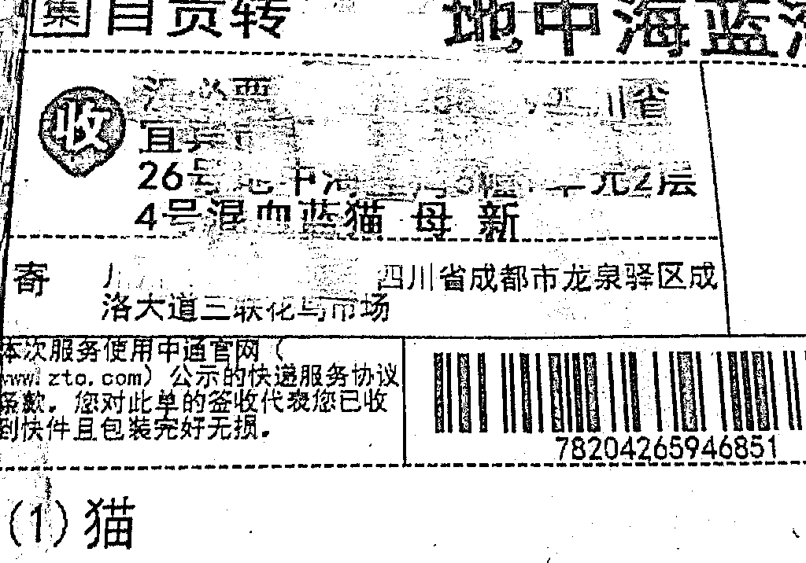
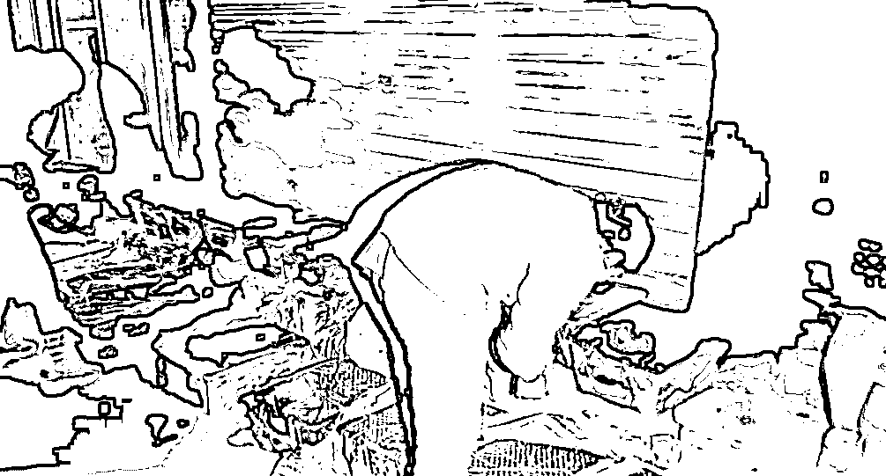
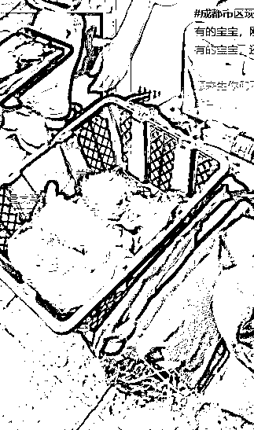
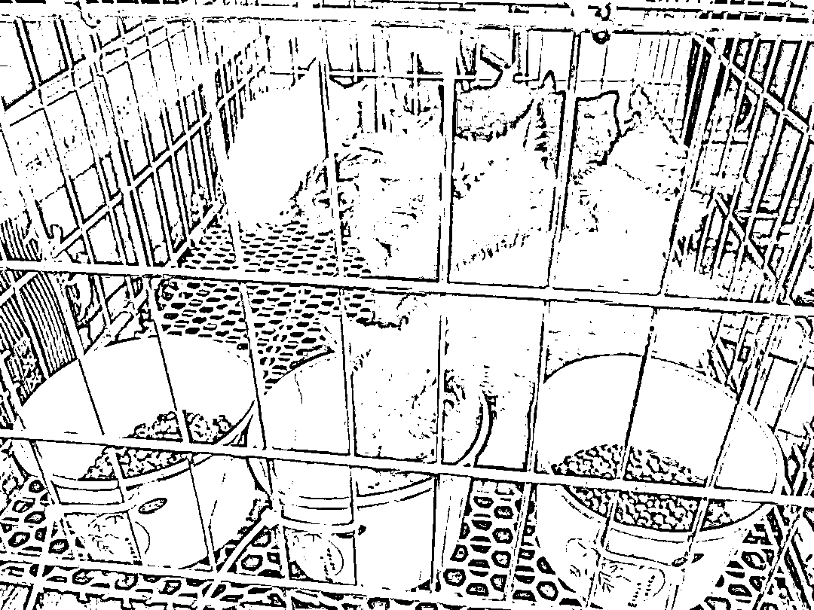
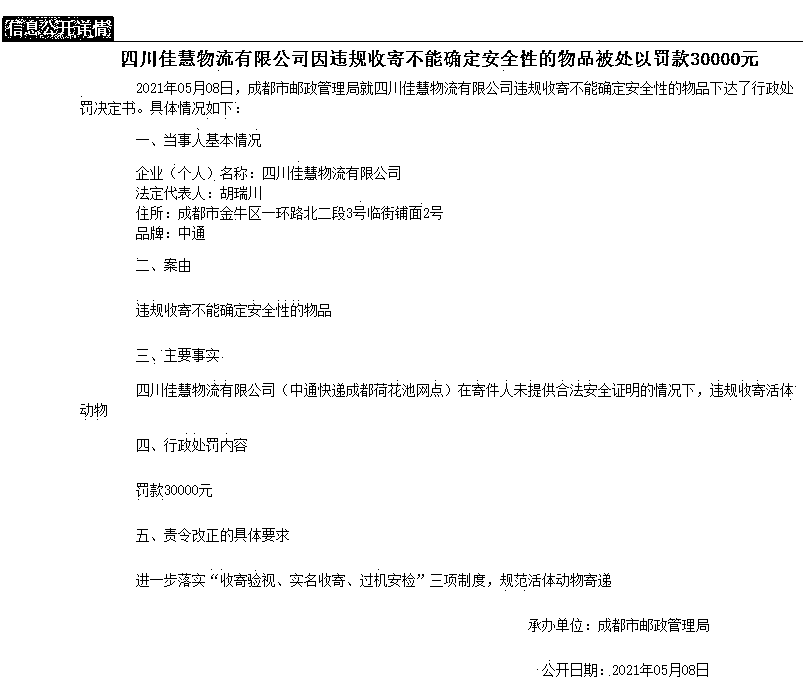

# 被约谈后！中通又现宠物盲盒

> 原文：[`mp.weixin.qq.com/s?__biz=MzIyMDYwMTk0Mw==&mid=2247514151&idx=3&sn=dcd6c5659e5267cc9a37d92b02ae80fb&chksm=97cb731fa0bcfa09f3b5e15b7ba716bc286577111cd8866385bb73865a60c662de8e0be4c9a3&scene=27#wechat_redirect`](http://mp.weixin.qq.com/s?__biz=MzIyMDYwMTk0Mw==&mid=2247514151&idx=3&sn=dcd6c5659e5267cc9a37d92b02ae80fb&chksm=97cb731fa0bcfa09f3b5e15b7ba716bc286577111cd8866385bb73865a60c662de8e0be4c9a3&scene=27#wechat_redirect)

## 

[`v.qq.com/iframe/preview.html?width=500&height=375&auto=0&vid=w3245v82pvf`](https://v.qq.com/iframe/preview.html?width=500&height=375&auto=0&vid=w3245v82pvf)

苏州市邮政管理局 5 月 12 日发布《关于苏州中通宠物盲盒的情况通报》：5 月 11 日下午，接到群众举报苏州中通快递中转站出现宠物盲盒后，苏州市邮政管理局执法人员第一时间赶赴现场调查。**下午三点到达现场时，发现宠物盲盒快件 13 件，动物已死亡。**根据面单信息显示，该批快件于 2021 年 5 月 5 日发出，寄件人地址为邳州市官湖镇双沟村，**于 7 日到达成都中转部，8 日被成都中转部退回至寄件人，因错分被发往苏州中转部。**目前，苏州市邮政管理局正在对案件情况进行详细调查，后续将尽快根据调查情况依法处理并通报结果。苏州市邮政管理局已要求苏州中通对该批动物进行妥善处理，目前苏州中通已完成无害化处理。下一步将进一步加大《动物防疫法》、《禁止寄递物品管理规定》等法律法规的宣传力度，督促企业严格落实禁止限制寄递物品规定，严格规范受保护的野生动物以外的活体动物寄递行为。

**相关报道：**

5 月 3 日

四川成都志愿者解救了

上百只被邮寄的小猫小狗

其中不少奄奄一息

数百只猫狗被当“盲盒”售卖

现场救助的义工向媒体表示，这些猫狗发货地是成都三联花鸟市场，**商家以售卖盲盒的名义将活体宠物快递至买家。**这些猫狗未出成都，即被志愿者解救。

经查询，部分电商平台确实有宠物盲盒售卖行为。为了吸引客户，开出高价值的品种猫狗的噱头，实际上进行非品种宠物的售卖，有些甚至是病猫病狗。

动物救助中心拦下货车

派出所及动检部门已经介入

据@成都爱之家动物救助中心 微博显示，4 日凌晨，这批正在被运送的“宠物盲盒”已经被爱心人士拦下来并转移，派出所及动检部门已经介入。

据视频画面显示，一些货箱里全是小猫小狗的惨叫声，货箱门在关闭的情况下，完全没有空气流通。而在箱子里，已有不少猫狗奄奄一息，甚至死去。死去的小猫小狗，则直接被丢在了路边。

据悉，目前动检部门已对所有猫狗依法暂扣，并将其临时安置、留检。

**两家“宠物盲盒”涉事企业被罚******

****5 月 8 日，成都市邮政管理局就四川佳慧物流有限公司违规收寄不能确定安全性的物品下达了行政处罚决定书。四川佳慧物流有限公司（**中通快递成都荷花池网点**）在寄件人未提供合法安全证明的情况下，违规收寄活体动物，**被罚款 30000 元。******

****同日，成都市邮政管理局就成都中竞物流有限公司未按规定实行统一管理下达了行政处罚决定书。成都中竞物流有限公司（**中通快递四川省管理中心**）在快件安全保障方面对四川佳慧物流有限公司（中通快递成都荷花池网点）未实行统一管理，**被罚款 50000 元。******

********

****来源：苏州市邮政管理局官方微信、央视新闻、成都市邮政管理局官网****

****************

****← 向右滑动与灰产圈互动交流 →****

********