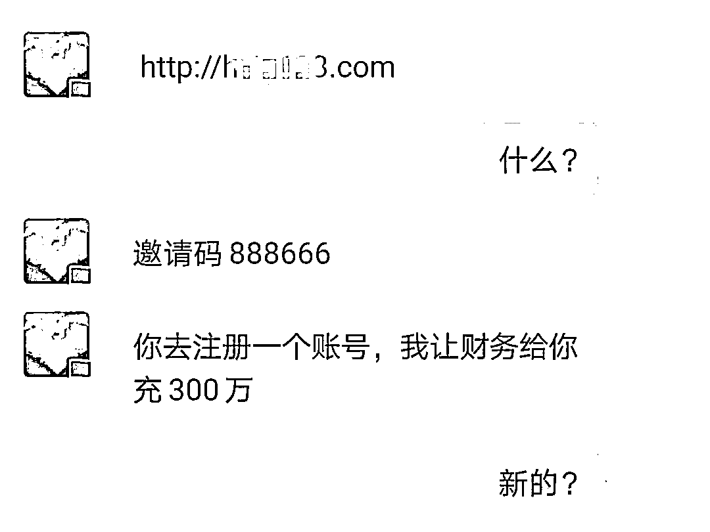

# 同一人，去年被骗 100 万，今年又被骗 285 万…

> 原文：[`mp.weixin.qq.com/s?__biz=MzIyMDYwMTk0Mw==&mid=2247514151&idx=4&sn=83de945d8efee9796d1360359da16d8d&chksm=97cb731fa0bcfa0968ec6093708d506ce5ef36cab2c8c96afdd356f5e1511139cf4280307581&scene=27#wechat_redirect`](http://mp.weixin.qq.com/s?__biz=MzIyMDYwMTk0Mw==&mid=2247514151&idx=4&sn=83de945d8efee9796d1360359da16d8d&chksm=97cb731fa0bcfa0968ec6093708d506ce5ef36cab2c8c96afdd356f5e1511139cf4280307581&scene=27#wechat_redirect)

**普陀一女士**
**去年被人骗了 100 余万****今年又被这人骗了 285 万**到底是怎么回事罗某就职于普陀某船厂，去年 7 月，她在刷抖音时结识了一位“李老师”，**跟着他在“彩神 V”平台上投资，最终被骗 100 万。**万万没想到今年 1 月罗某又和这位“李老师”联系上了“李老师”让罗某在“亨通网”博彩平台上试玩，2 月 22 日，罗某将信将疑地充值了几笔小钱后，发现基本都是盈利的。一个月后，平台推出“包赔”活动，罗某便一次性充值了 50 万元，第二天便获得了巨额盈利，并成功提现。**“50 万充值进去都提现出来了，难道还会有假吗？”**罗某犯起了嘀咕。就这样，罗某在该平台陆陆续续投资了两个月，期间基本都是盈利，并且能成功提现。
4 月 24 日，李老师说帮罗某预约了一个 300 万的“包赔”单子，罗某深信不疑，立刻向亲朋好友筹借资金，**一共借到了 250 万元。**而“好心”的李老师还主动提出**帮她垫付剩余的 50 万元。**罗某本以为这次能赚得盆满钵满，把去年输掉的 100 多万都赢回来，没想到第二天，她发现自己累计投入的 283 万元已经亏得精光，**这时罗某才发觉自己又被骗了！**（账户上的 280 多万资金只剩下了 9000 元）办案民警原以为罗某连续两次被骗已经是极限了，但深入了解后发现，她之前居然还有两次投资 P2P 平台被骗的报案记录。2019 年 6 月，罗某购买“甬 E 贷”平台理财产品被骗 7 万余元； 2020 年 4 月，罗某投资“惠财”平台被骗 15 万元。都说人不要在同一个地方摔倒两次可有些人却摔得一次比一次重**投资理财有风险，别被利率迷了眼。** **天上不会掉馅饼，稳赚不赔必是骗。**

小编再次提醒您：不要被暂时的高利率迷惑双眼，切勿相信稳赚不赔的买卖，以免落入网络投资理财诈骗陷阱。切勿随意下载或点击陌生投资理财 APP 或者网站，更不要向陌生银行卡账号汇款转账。

来源：红网、普舟山广电、93 反诈、普陀公安

← 向右滑动与灰产圈互动交流 →

