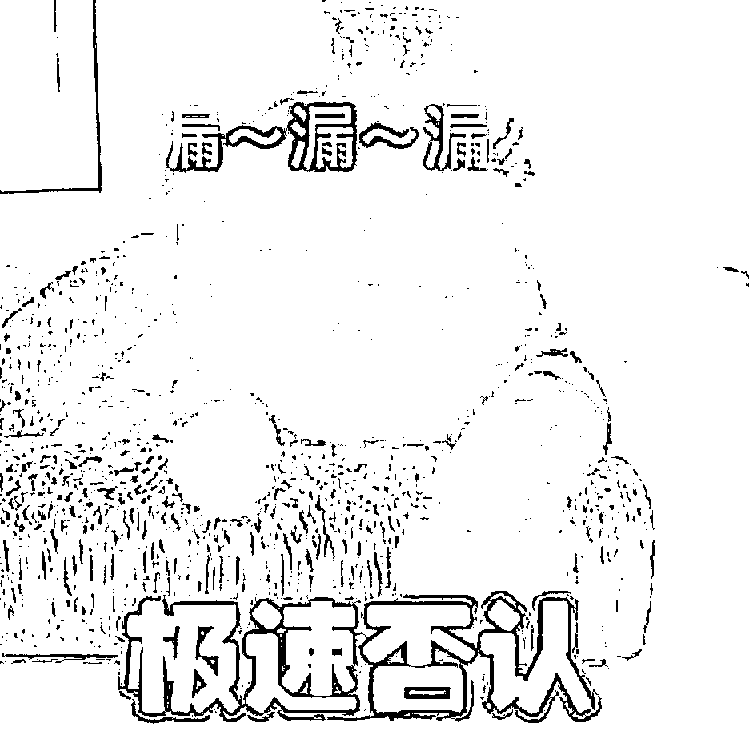
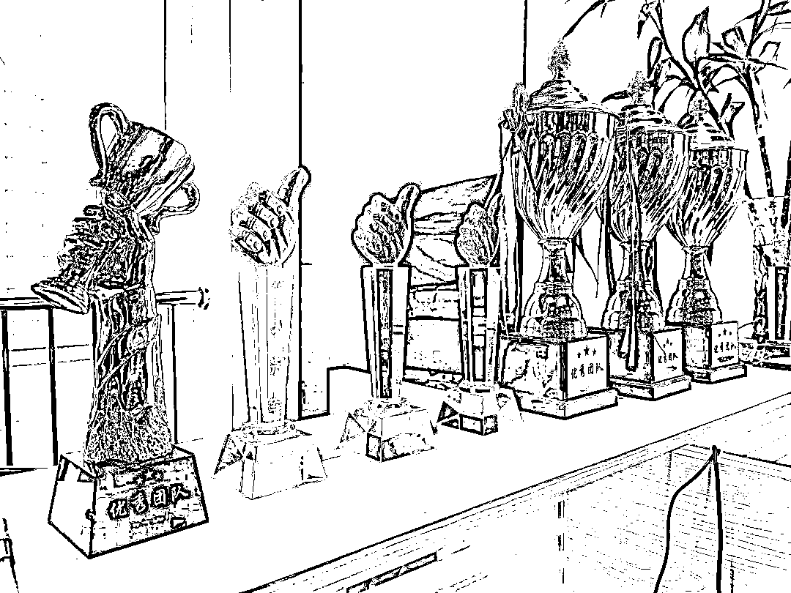
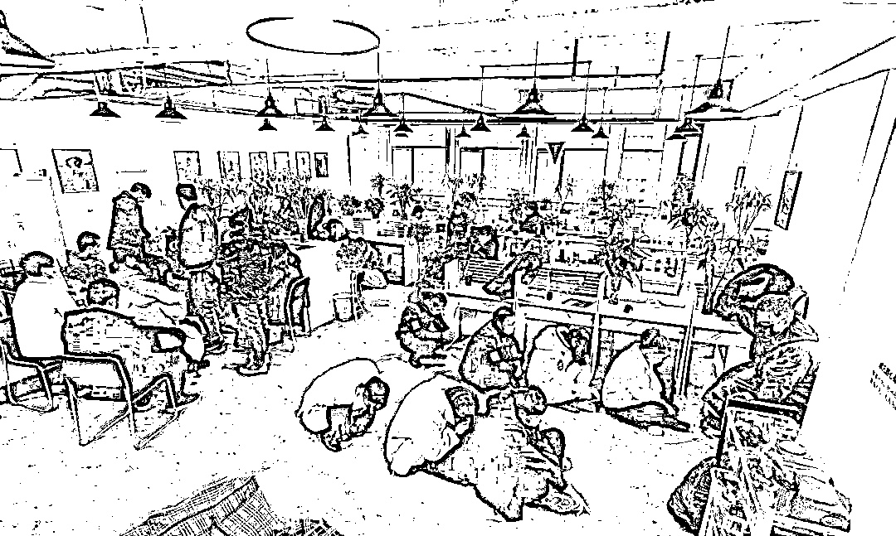
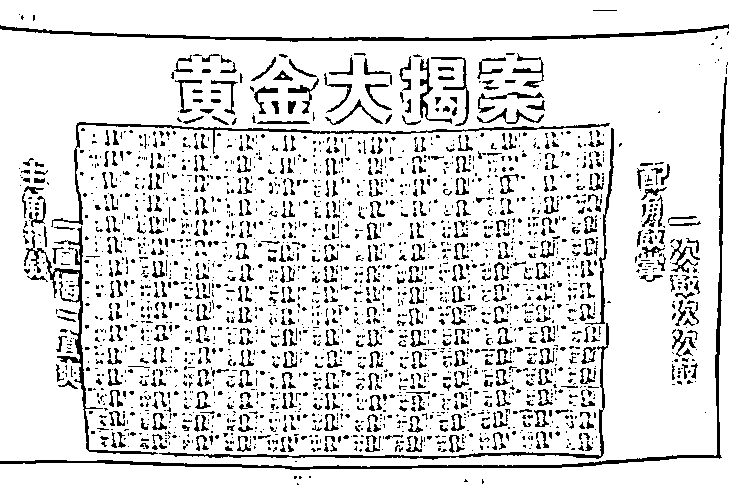
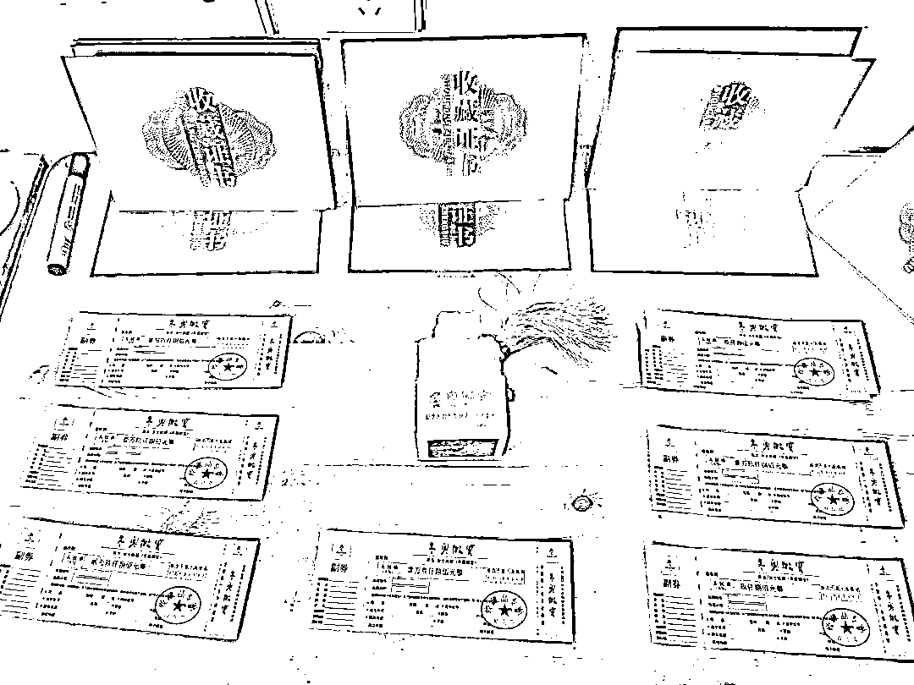

# 墙上挂着“优秀团队”红旗，桌上摆满各式样奖杯，看骗子有多拼？

> 原文：[`mp.weixin.qq.com/s?__biz=MzIyMDYwMTk0Mw==&mid=2247514151&idx=5&sn=ec39fd889cd110cf05d7d255a4feb679&chksm=97cb731fa0bcfa09ab6355ece976ef6492a03ba2507e698afbfda66ff9670b41760316dfca23&scene=27#wechat_redirect`](http://mp.weixin.qq.com/s?__biz=MzIyMDYwMTk0Mw==&mid=2247514151&idx=5&sn=ec39fd889cd110cf05d7d255a4feb679&chksm=97cb731fa0bcfa09ab6355ece976ef6492a03ba2507e698afbfda66ff9670b41760316dfca23&scene=27#wechat_redirect)

[`mp.weixin.qq.com/mp/readtemplate?t=pages/video_player_tmpl&action=mpvideo&auto=0&vid=wxv_1863158076095168522`](https://mp.weixin.qq.com/mp/readtemplate?t=pages/video_player_tmpl&action=mpvideo&auto=0&vid=wxv_1863158076095168522)

墙上挂着“优秀团队”的红旗

桌子上摆满了各式各样的奖杯

你以为这是一个积极向上的公司？

其实这是一个诈骗团伙

他们以老年人为目标

推销假收藏品

**进价 200 元的“玉玺”**

**竟能卖上万元**

2021 年 2 月

梁溪公安分局

在办理一起侵犯公民个人信息案件的过程中

循线追踪

发现一个**以投资“玉玺”收藏品为名**

**实施诈骗的犯罪团伙**

经过深入研判

逐渐摸清了该团伙的人员构成等信息

近日

60 余名警力远赴河北廊坊

开展集中收网行动

先后**抓获 27 名犯罪嫌疑人**

查获 3 万余条公民个人信息

34 箱假收藏品

据团伙头目景某供述

**为了激励大家提高“业绩”**

他将成员分组为“追梦队”“冠联队”“孤狼 B 组”

进行竞争考核

开展各类团建活动

**打造“企业文化”**

△诈骗团伙按照“业绩”排名进行抽奖活动

经查

该团伙通过非法手段取得个人信息后

**专门针对老年人**

通过电话推销假收藏品实施诈骗

累计诈骗金额达**1000 余万元**

目前案件正在进一步办理中 

相关嫌疑人已被依法批准逮捕

**诈骗手段**01

谎称公司的“抗美援朝玉玺”等各类收藏品有正规发行渠道，骗取受害人信任。

02

谎称“玉玺”为天然玉石打造，抬高假收藏品价值。

03

冒充拍卖公司打掩护，衬托“玉玺”投资价值和收藏价值。

04

谎称藏品是从他人手中“抢购”回来的，塑造假藏品价值，引诱受害人购买。

05

以帮助转卖为由，提醒客户不要让身边家人知道买“藏品”的事，以此达到掩饰诈骗行为的目的。

**警方提醒**

理性看待收藏价值，不要轻信收藏品公司业务员的推销，在购买收藏品时一定要对藏品价格进行正确的评估。小心“高额返利”的陷阱，更不要轻信“天上掉馅饼”的投资项目。

来源：平安无锡

← 向右滑动与灰产圈互动交流 →

