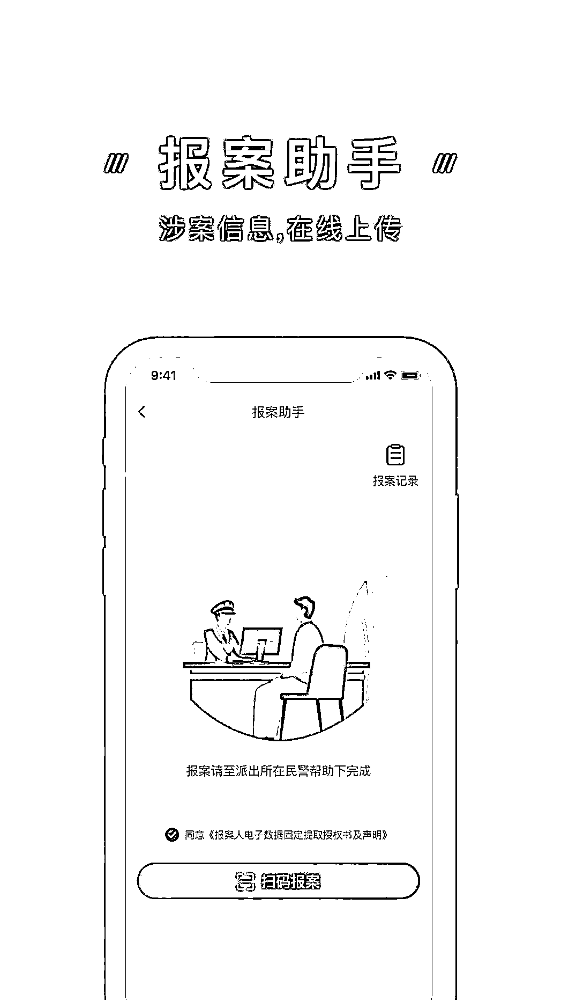

# 客服极致诱惑，你定力够吗？

> 原文：[`mp.weixin.qq.com/s?__biz=MzIyMDYwMTk0Mw==&mid=2247514151&idx=6&sn=cc3c3da8718aa8aa674c9fd07d666ef3&chksm=97cb731fa0bcfa09ed10e6d5bde203979da6d82d5e456d60ed6762c369c7d56ec521a4d6c354&scene=27#wechat_redirect`](http://mp.weixin.qq.com/s?__biz=MzIyMDYwMTk0Mw==&mid=2247514151&idx=6&sn=cc3c3da8718aa8aa674c9fd07d666ef3&chksm=97cb731fa0bcfa09ed10e6d5bde203979da6d82d5e456d60ed6762c369c7d56ec521a4d6c354&scene=27#wechat_redirect)

话说某天

C 先生接到了一个陌生手机号

其自称是**“天猫客服”**

听声音还是位**人美声甜的小姐姐**

“天猫客服”小姐姐说因操作失误

把 C 先生的支付宝绑定了

“天猫”代理商服务

** 不取消每月就要自动扣费 **

要取消的话**需要银行授权**

随后

“天猫客服”把电话转接给

另一位自称银行工作人员的

“银行客服”小姐姐

银行需要 C 先生**转账到指定银行账号**

才能核实清楚 C 先生的个人信息

并授权取消已绑定的服务

事后再原路返回所有资金

就这样

C 先生被两位人美声甜的

客服小姐姐一步步诱导

**竟转账 20 多次**

**共计 130 多万元**

【左右滑动查看部分**转账截图**】

各位看官可能会觉得 C 先生笨

这种事都能相信

但 C 先生的经历**并不是个案**

……

据鹏哥了解

∨

骗子有全套“攻心”话术，且专门设计剧本。加上“客服”甜美的声音，让人自然而然放下戒备心理，从而被洗脑，多次转账。这种方法屡试不爽。

那么，怎么办呢？

有一个神器可以有效避免被骗

Ⅴ

给大家隆重介绍

** “国家反诈中心”APP **

手机安装此 APP 后

收到可疑诈骗分子来电、短信

或登录可疑网址、可疑 APP 时

可**智能识别骗子身份**

提前预警，**大大降低被骗风险**

而且还可以**身份验真**

接到可疑电话时

可要求对方在此 APP 上

进行验证身份真实性

防止对方冒充身份进行诈骗

就如上述 C 先生的经历

如果他手机安装了**“国家反诈中心”APP**

这通电话就很大可能被拦截了

即使拦截失败了

C 先生还可以要求对方启用

“身份验真”功能

这位人美声甜“客服”小姐姐的骗局

就会不攻自破

来源：中山市反诈骗

← 向右滑动与灰产圈互动交流 →

