# 涉案金额 7 亿余元！奶茶店大排长龙，背后竟有犯罪套路？

> 原文：[`mp.weixin.qq.com/s?__biz=MzIyMDYwMTk0Mw==&mid=2247514196&idx=1&sn=7ff10db831629201df6f4b97a53b278e&chksm=97cb736ca0bcfa7aa818871348f249e738827da32f20644fa3f849de687066e7357da8362885&scene=27#wechat_redirect`](http://mp.weixin.qq.com/s?__biz=MzIyMDYwMTk0Mw==&mid=2247514196&idx=1&sn=7ff10db831629201df6f4b97a53b278e&chksm=97cb736ca0bcfa7aa818871348f249e738827da32f20644fa3f849de687066e7357da8362885&scene=27#wechat_redirect)

一些奶茶店门前突然生意火爆

顾客大排长龙

背后竟然可能涉嫌犯罪？

近日，上海警方在河北、广东等地公安机关的大力协助下，成功侦破上海首例**以虚假品牌奶茶招商网站吸引加盟商、虚构履约能力骗取加盟费的“套路加盟”合同诈骗案**，抓获金某、王某等 90 余名犯罪嫌疑人，捣毁多个虚假招商网站，查获大量虚假授权文书、合同文书、话术清单、贴牌奶茶等涉案物品，**涉案金额 7 亿余元。**

[`mp.weixin.qq.com/mp/readtemplate?t=pages/video_player_tmpl&action=mpvideo&auto=0&vid=wxv_1867008284310683653`](https://mp.weixin.qq.com/mp/readtemplate?t=pages/video_player_tmpl&action=mpvideo&auto=0&vid=wxv_1867008284310683653)

新民晚报“上海时刻”出品 

2020 年 5 月，市民王先生在互联网上看到一则某知名品牌奶茶招商加盟的广告后，萌生了加盟创业的想法。进入网站留下联系方式后不久，客服人员便主动来电，为王先生详细介绍了管理方式和盈利前景。

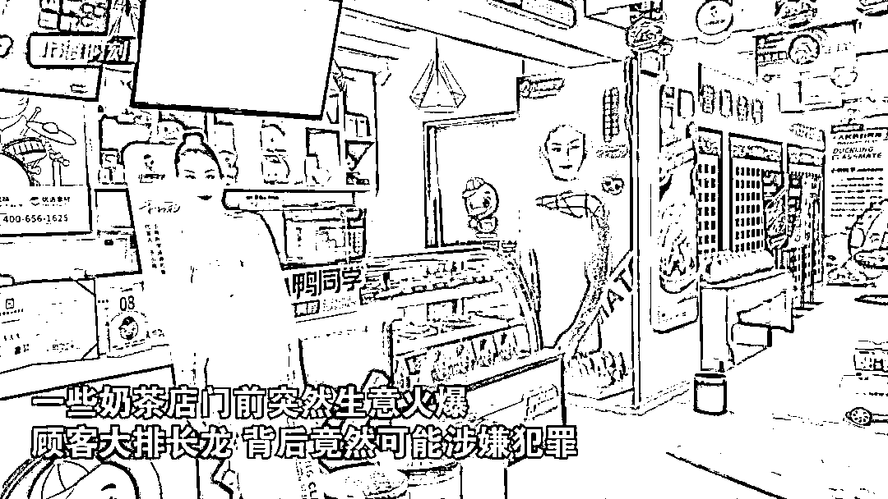

但几番洽谈后，客服又以该品牌奶茶加盟名额已满为由，转而向王先生推荐了一个名为“茶芝兰”的奶茶品牌。客服称，“茶芝兰”是与名牌奶茶同属一个集团的第三代品牌，并邀请王先生前往公司实地考察。

在公司，招商经理张某热情地接待了王先生，向其出示了奶茶品牌的招商授权书，同时展示了“茶芝兰”品牌奶茶的宣传视频。张某向王先生承诺，加盟后公司会统一安排选址筹建，配发生产设备，供应产品原料，并提供培训指导、技术支撑、运营管理、广告宣传等全方位配套服务，王先生只要加盟就能轻松盈利。很快，王先生便与公司签订协议，并**支付了 10 万元加盟费**。

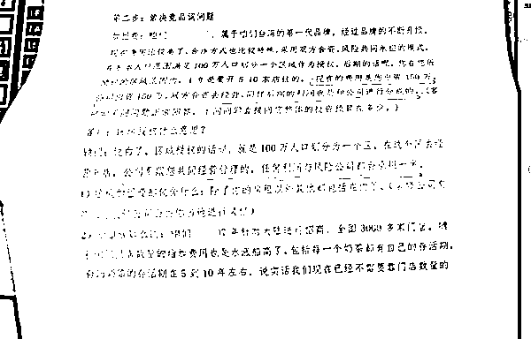

加盟之后，公司承诺的“全方位配套服务”并未兑现，张经理也不知所终。王先生的店铺生意惨淡，仅仅开张 3 个月就面临关停的窘境。气愤的王先生找到公司讨要说法，公司却以王先生经营不善为由，对其诉求置之不理。

2020 年 12 月，上海警方依托大数据分析，发现了大量奶茶店铺加盟商户“异常关停”的风险，认为可能涉嫌经济犯罪。市公安局经侦总队即会同松江公安分局组成专案组开展侦查，并于今年 3 月 23 日将以犯罪嫌疑人金某、王某为首的诈骗团伙一网打尽。

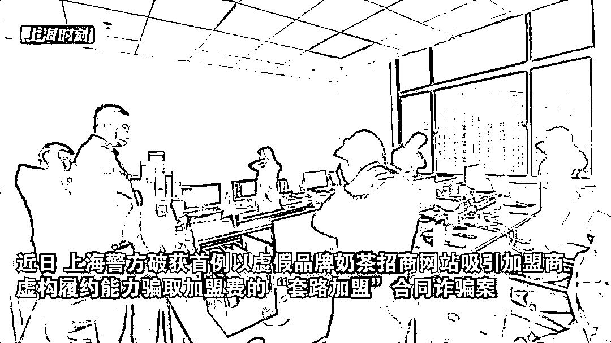

经查，犯罪嫌疑人金某、王某等人为牟取非法利益，成立某餐饮公司，并在公司内部设立网络部、话务部、商务部、运营部等多个部门，在未经权利公司授权许可的情况下，搭建多个虚假知名品牌奶茶招商加盟网站，设计发布带有**“品牌加盟”**字样的招商广告，吸引获取潜在加盟商联系方式；随后，收购或注册“花点点”“茶芝兰”等**50**余个奶茶品牌，通过设计**“知名品牌旗下产品”“全程一站式服务”“大数据科学选址”“投资加盟稳赚不赔”**等宣传话术，安排话务员对外推销加盟业务。事实上，公司对外宣称的专业培训讲师根本不具备奶茶行业从业经验，各项服务也是无稽之谈。

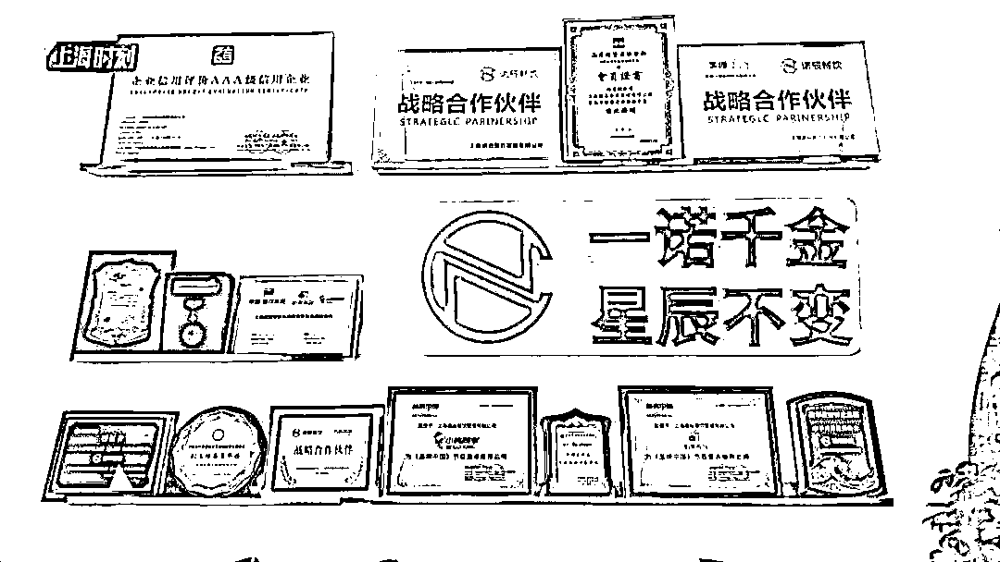

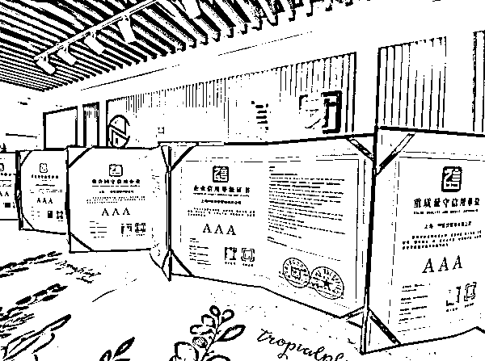

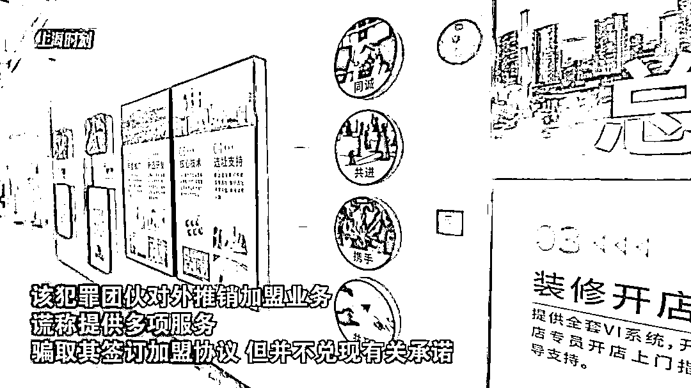

为获取加盟商信任，犯罪嫌疑人还伪造了多个品牌的授权文书，并设计编印大量宣传材料。

甚至在加盟商实地考察时，犯罪团伙还以**每人每日 40 至 80 元不等的价格，雇佣人员冒充消费者，在奶茶店铺前循环排队，营造生意火爆假象，以层层铺设的加盟套路骗取加盟商的信赖。**

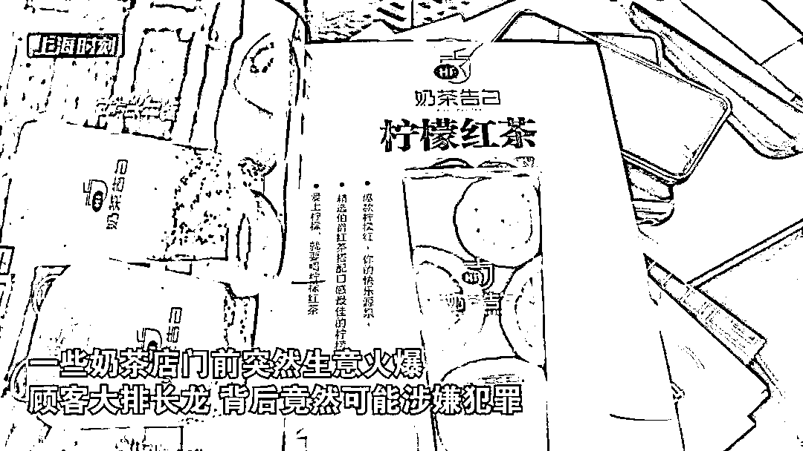

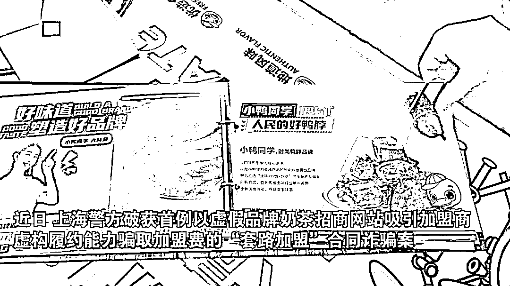

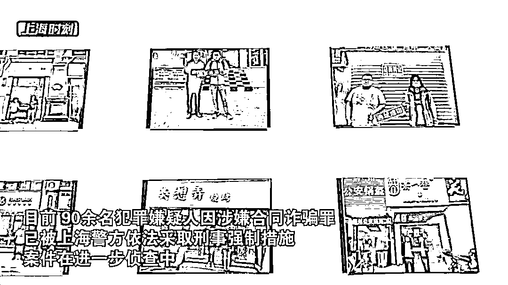

而在加盟商交纳加盟费用后，犯罪团伙则通过拖延门店选址时间、翻看地图随机选址、抬高装修采购报价、供应原料以次充好等方式消极履约，直接导致大量加盟店经营惨淡甚至关门停业，有的加盟店每月营业额仅有几千元，远不足以冲抵运营成本。为逃避追责，犯罪团伙还频繁更换公司、品牌和收款账户。

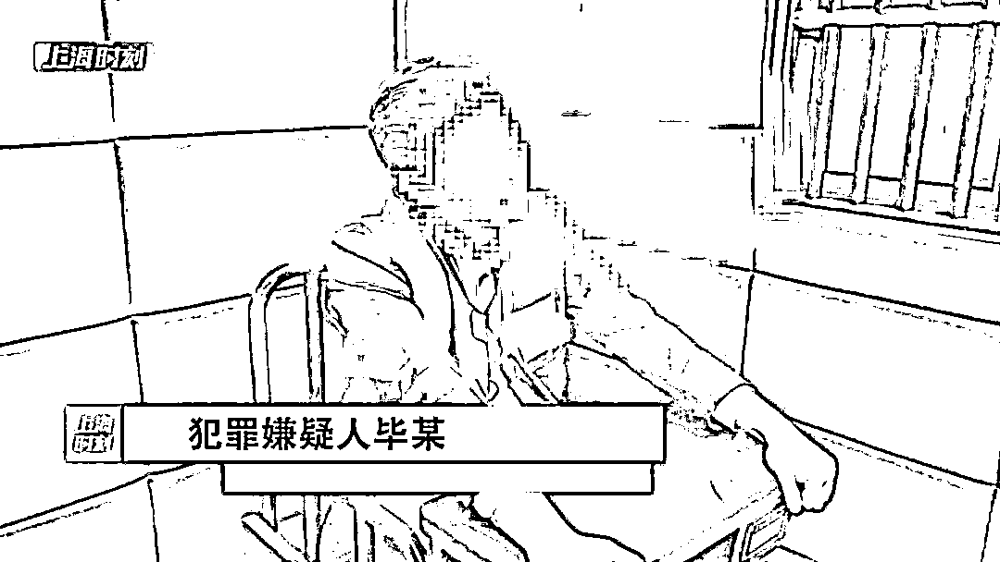

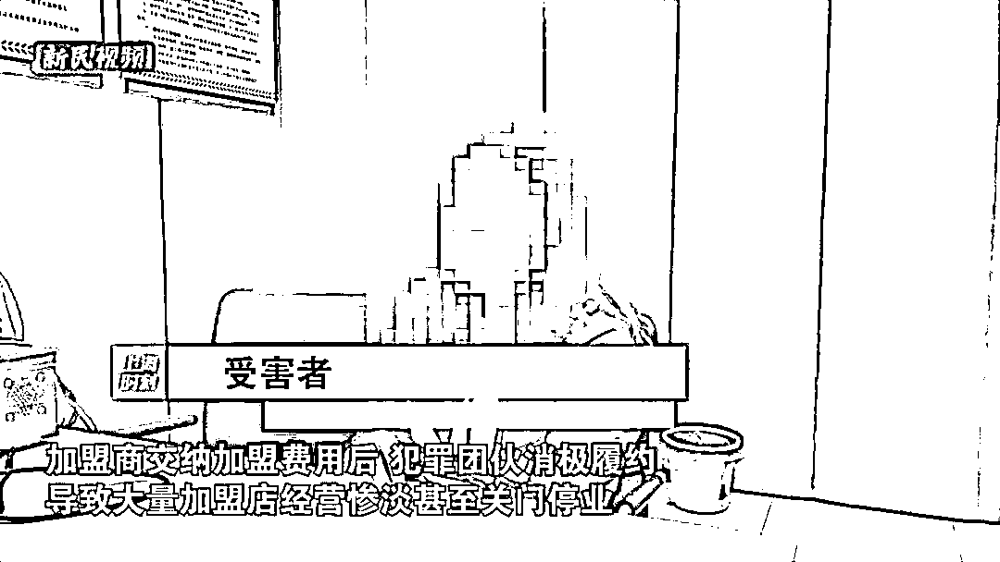

目前，90 余名犯罪嫌疑人因涉嫌合同诈骗罪已被警方依法采取刑事强制措施，案件在进一步侦查中。

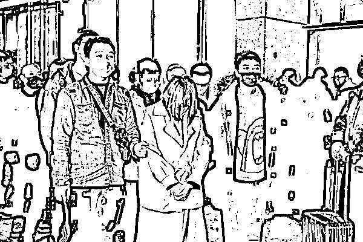

警方提示

广大市民在投资加盟时应审慎考察合同标的的真实性、加盟品牌的盈利能力和对方的履约能力，切勿轻信不法分子低投入、高回报的谎言。若发现此类情况，请及时前往公安机关报案。

来源：新民晚报，红网

← 向右滑动与灰产圈互动交流 →

