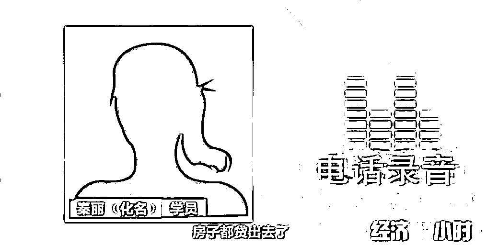

# 声称帮助企业上市，实则画百亿元“大饼”！“成功学”洗脑式骗局曝光！

> 原文：[`mp.weixin.qq.com/s?__biz=MzIyMDYwMTk0Mw==&mid=2247514196&idx=2&sn=5091c80339edc70d8676e1ac1a384aae&chksm=97cb736ca0bcfa7a9deec95ae18387b7fdf036c024a634aac011f76d7c1bf3f677a7159a90bc&scene=27#wechat_redirect`](http://mp.weixin.qq.com/s?__biz=MzIyMDYwMTk0Mw==&mid=2247514196&idx=2&sn=5091c80339edc70d8676e1ac1a384aae&chksm=97cb736ca0bcfa7a9deec95ae18387b7fdf036c024a634aac011f76d7c1bf3f677a7159a90bc&scene=27#wechat_redirect)

在我们身边，有很多人都渴望成功。可是如果有人告诉你，可以帮你走一条捷径获得成功，那你可一定要小心了，因为这样的人很有可能是披着“成功大师”的外衣，来掏空你的钱包。

**三年被骗一千万，只因相信“成功学”**

[`mp.weixin.qq.com/mp/readtemplate?t=pages/video_player_tmpl&action=mpvideo&auto=0&vid=wxv_1864600027428356104`](https://mp.weixin.qq.com/mp/readtemplate?t=pages/video_player_tmpl&action=mpvideo&auto=0&vid=wxv_1864600027428356104)

△央视财经《经济半小时》栏目视频

2019 年 10 月，深圳市公安局龙岗分局刑侦大队收到了一封举报信，称一位女士卖了房子，花了巨额学费接受了所谓成功学培训。收取高额学费和服务费的，是一家名为舟山震古烁今品牌运营公司。

这些学员主要是什么人，课程又是如何收费，有没有存在违法犯罪活动呢？为了深入了解，一名警员在缴纳了 980 元的入门费之后，被邀请进入了会场。发现这个以姚成伟为首的震古烁今集团，以成功学为幌子，通过开设培训课程，和为企业策划等手段，骗取他人钱财，已经涉嫌诈骗犯罪。

2019 年 12 月 7 日，深圳龙岗警方组织了 200 多名警力，对涉案人员进行收网。震古烁今公司的四名高管姚成伟、姚成光、汪烈、徐强（音）被警方刑事拘留。调查中，警方发现参加培训的学员，大部分都是交了几十万或者上百万的学习和策划费用，但对他们的公司经营并没有实际帮助。

一位叫小雅的学员想开一家自主品牌的护肤品企业，但是由于学历不高，她很想提升自己。为此小雅开始到全国各地参加培训，也是在这个过程中，别人推荐小雅到深圳参加震古烁今的培训班。

参加完培训没多久，姚成伟告诉小雅，他的公司有专业的市场调查、设计、宣传、品牌落地团队，并称之为全息品牌策划，但是要获得这项服务，还需要再缴纳 108 万元的策划服务费，并且要在培训现场交。

小雅当场交了 50 万元，剩下的 58 万元双方约定半年后交清，可是转账之后，在签订合同时，小雅才得知，策划服务费变成了 308 万元，其中的 200 万是作为入股公司的股权。

五年时间，姚成伟通过各种名目收费，非法敛财超过五千万元。2020 年 1 月 13 日，姚成伟等四人因涉嫌诈骗罪，组织领导传销活动罪被检察机关批准逮捕。

深圳一家名叫中网时代的公司，同样在做类似的企业培训。警方在一名员工的微信聊天记录中，发现了“人傻钱多”这样的信息。

另外民警还发现了一些合同，合同签订的时间从 2014 年到 2019 年，签订培训、策划，以及股权投资合同的人不在少数，金额从几千到数百万元不等。

2020 年 1 月 20 日，深圳龙岗警方将公司法定代表人严兆海控制住。

受害人米兰（化名）同时参加了震古烁今和中网时代的培训。她先是交了 2980 元的报名费，跑去天津参加了一个学习论坛。在被严兆海现场“洗脑”后，她和另一位从事医疗行业的学员美林（化名）动心了。

米兰和美林当时都觉得一定要跟严兆海学本事，成为他的弟子。当然，成为弟子要交 10 万元学费。交费之后，双方签的合同书上有这样的约定，作为甲方的深圳中网时代，网络科技服务有限公司，完成 IPO 时，也就是首次公开募集股份之后，会回馈乙方学员学费额度 5 倍价值公司股票额度做教育慈善，为甲方赠与乙方的未来收益权益。

不仅如此，严兆海还对弟子许诺，可以帮助弟子的企业策划，辅导公司上市。在交了 10 万元之后，米兰被安排来到深圳。在了解到米兰出身中医世家，手上掌握着一些医疗行业的渠道和资源后，严兆海给她策划了一个互联网加医疗的公司。

严兆海在几张 A4 纸上写写画画，几分钟的时间策划方案就出来了，一共 5 页纸共 12 项。定位私人医生，中国唯一的疑难杂症治疗平台，公司为某私人医生网络科技服务有限公司，商业模式是打造一个沟通医生和患者的互联网平台。公司价值潜力 1 年 3 个亿到 10 个亿，5 年将达到 100 至 300 亿。米兰没想到 10 万策划费，换来的就是这样 5 页纸的策划方案。

为了将策划方案落地执行，米兰与美林在深圳注册了公司，租了办公室，招聘了员工，准备建一个互联网医院，前后投入了好几百万元。没过多久，在一次课堂上，米兰又缴纳了 100 万元，成了严兆海的终极弟子，还另外交了 100 万元的项目款。

三个月后，米兰认清了严兆海以及中网时代公司的真面目，跟严兆海的关系也闹僵了，米兰只好另外找人策划，就去参加了震古烁今集团的培训。三年来米兰前后投入了 1000 多万元，被骗得所剩无几。

在培训中，严兆海把自己包装成了 E 时代企业家导师，对外宣称有海外留学背景、博士学位，还是知名高校的访问学者。不仅出了书，还录制了光盘教程，被摆在机场的书店里销售，内容都与互联网相关。

在中网时代公司进门的地方，也摆放着诸多荣誉，既有国家高新技术企业称号，又是 2016 年最具影响力民族品牌重点推广单位。

而在警方的审讯中，严兆海承认，这都是子虚乌有的骗局。

受骗上当的不止米兰和美林，在西安卖服装的秦丽在一次次的培训和策划中，先后投入了 200 多万元。

所有的投资人都在期待自己的公司能够如严兆海许诺的那样成为上市公司，可是等的时间越长，越失望。警方调查发现，大部分投资人都是陷入困境的企业主，他们参加了所谓成功学培训，不但没有扭转企业的经营状况，还让原本就困难的经营变得雪上加霜。

目前警方已经查实的涉案资金近 2000 万元，案件正在进一步侦查当中。

**警惕“成功学”的洗脑式骗局**

每个人的内心都渴望成功，这是人之常情。《经济半小时》节目中那些披着成功学大师的外衣，以策划费、原始股、高额返利等手法实施诈骗的团伙，正是抓住了人们急于成功的特点，实施犯罪。事实证明，他们不仅无法给公司的发展提供有效帮助，反而让一些企业主的经营雪上加霜。犯罪嫌疑人固然会为他们的行为承担法律责任，但希望这些被害人的经历，能给更多的人带来警示，成功没有捷径，脚踏实地才能走上阳关大道。

来源：央视财经

← 向右滑动与灰产圈互动交流 →

