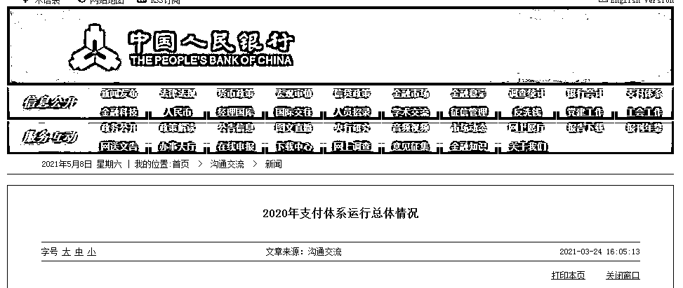
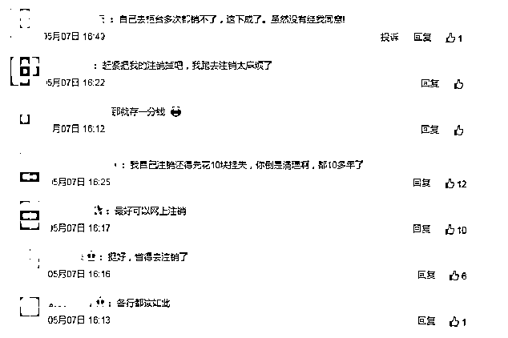

# 提醒！事关你的银行卡！又有大行最新通知

> 原文：[`mp.weixin.qq.com/s?__biz=MzIyMDYwMTk0Mw==&mid=2247514196&idx=3&sn=4ae497454c564de8014675da6978cd8e&chksm=97cb736ca0bcfa7afa45cb3856067c5315c00fb2458456e79c7bd176428a2c99c7beb9c63a3e&scene=27#wechat_redirect`](http://mp.weixin.qq.com/s?__biz=MzIyMDYwMTk0Mw==&mid=2247514196&idx=3&sn=4ae497454c564de8014675da6978cd8e&chksm=97cb736ca0bcfa7afa45cb3856067c5315c00fb2458456e79c7bd176428a2c99c7beb9c63a3e&scene=27#wechat_redirect)

根据央行数据，截至 2020 年末，人均拥有银行账户数达 8.9 户，**全国人均持有银行卡 6.4 张，其中有部分，就成为了“睡眠账户”。** 

数据来源：中国人民银行

中国工商银行发布通告，**今年 7 月起将对长期不用的个人银行账户开展清理工作，对符合清理条件的账户限制部分金融服务功能。**

更早之前，包括建行、邮储等国有大行，以及中信等股份行也已经展开类似清理行动。

**1**

* * *

多家银行开始清理“睡眠账户”

近日，包括中信银行、建设银行、邮政储蓄银行在内的多家银行发布公告，开始清理“睡眠账户”。 

中信银行明确，自 2021 年 1 月 8 日开始：

> **对账户余额低于 10 元人民币（含）以下以及截至每年 10 月底，账户连续两年（含）以上未发生任何非结息交易的个人结算账户，将被限制交易。**
> 
> **同一客户在该行持有一百个及以上正常或未激活的个人结算账户，也将被限制交易。**

建设银行称，将在 2021 年 1 月 21 日至 2021 年 2 月 28 日，对长期不使用的个人银行账户进行销户清理，范围包括：

> **截至 2020 年 10 月 31 日，连续三年以上（含三年）未发生存现、取现、转账等主动交易，账户余额为 0，且无信用卡约定还款、个人贷款还款等签约关系的借记卡、准贷记卡、活期存折账户。**
> 
> **金融社保卡、公积金卡、军人保障卡等个人银行账户不纳入本次销户清理范围。**

邮政储蓄银行公告显示：

> **将于 2021 年 6 月 30 日（含）前逐步分批对同一客户名下个人结算账户超标准(即Ⅰ类户 1 个、Ⅱ类户 5 个、Ⅲ类户 5 个）数量进行清理。如账户存在上述情况，本人持有效实名证件，尽快到该行任意网点进行合理性登记、降级以及销户处理。逾期未清理的账户，该行将限制金融服务。**

根据工行公告，工行将于 2021 年 7 月起实施长期不动个人银行账户清理工作。

> **截至 2021 年 6 月 30 日，凡连续三年以上（含三年）未发生客户主动交易，账户余额为 0，且未签订信用卡、个人贷款还款及其他代收代付协议的账户（借记卡和活期存折，下同），其账户功能将调整为非柜面业务只收不付。其中金融社保卡、军人保障卡、武警军人保障卡、退役军人拥军优抚卡、公积金联名卡等政策类账户；理财金账户卡、财富理财金卡等特色账户不纳入清理。**

工行表示，如账户在上述清理范围内，且希望继续使用，请于 2021 年 6 月 30 日前完成一笔动账交易（包括存取款、汇入汇出、转账、消费、缴费等主动动账交易，不包括结息、查询、司法冻结、司法扣划等非客户主动发起的动账交易，下同）即视为激活账户。

**2**

* * *

为什么要清理？

对于清理个人长期不动户及个人开立多个结算账户的原因，中信银行、邮储银行都在公告中明确表示，**清理行动是为了加强账户管理，防范电信诈骗风险。**

虽然人均账户数量增多，但是其中有部分成为了“睡眠账户”，无形中成为不法分子实施电信欺诈的重要工具，对社会和个人带来极大危害。

此次多个银行开始清理包括“睡眠账户”和超量账户在内的异常账户，对个人用户来说有助于防范个人风险，避免自身账户被不法分子利用，也为银行账户安全筑起一道防线。

**3**

* * *

如何保护我们的银行账户安全

除了银行对“睡眠账户”进行清理以外，个人用户也应提高防范意识，积极清理“睡眠账户”。

一是，增加账户盘点意识，定期梳理个人名下账户及资产状况，养成查账记账的良好习惯。

二是，加强风险管理意识，在密码设置、账户登录管理等方面加大保护措施，对冗余账户及时注销，以避免被不法利用的风险。需要特别强调的是，千万不要出租、出售、出借自己的银行卡或支付账户。目前大部分银行都已支持异地网点注销银行卡。

三是，对于不希望被冻结的银行卡，只要每年通过 ATM、网上银行或手机银行等任意渠道办理一笔业务或者进行转账等交易，就不会被银行认定为是“睡眠账户”。

四是，如果发现自己的账户被冒用，及时和银行反馈并报警，避免更大损失。

多位网友社交媒体上评论表示，希望银行能注销自己不用的银行卡。 

来源：央视财经（ID：cctvyscj）、央视新闻客户端

← 向右滑动与灰产圈互动交流 →

