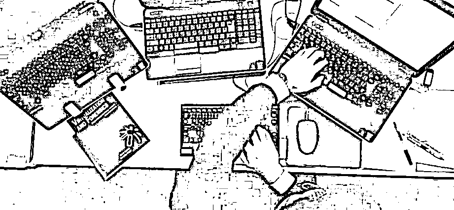
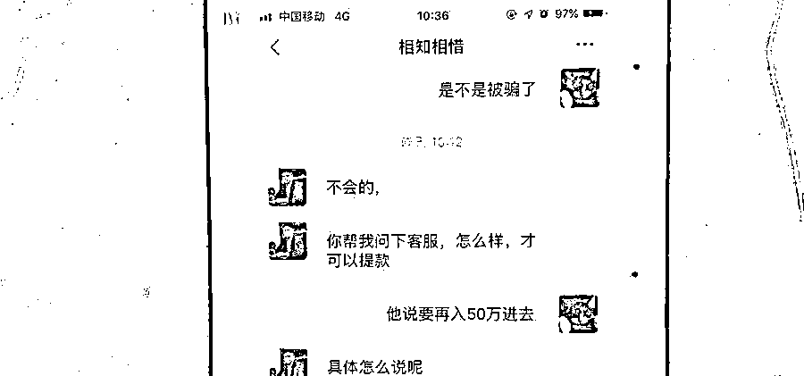
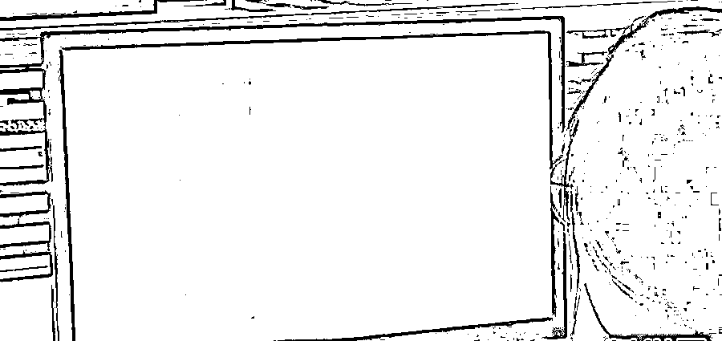
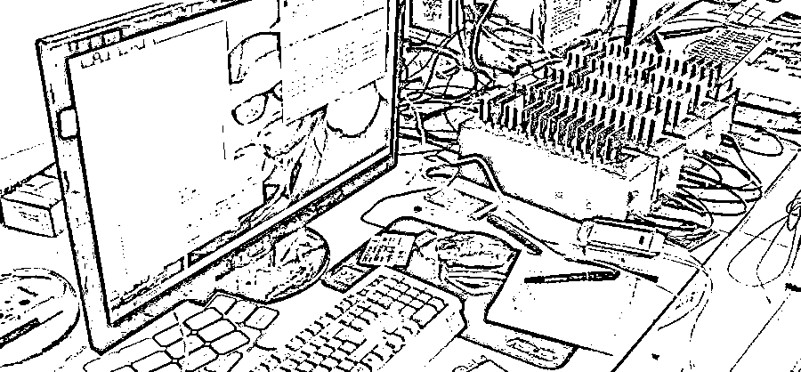
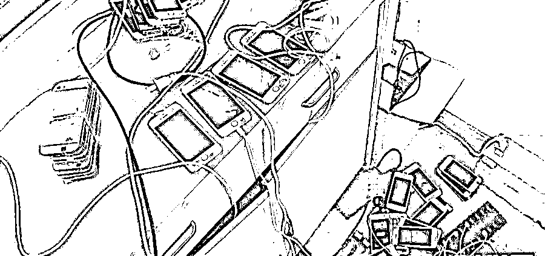
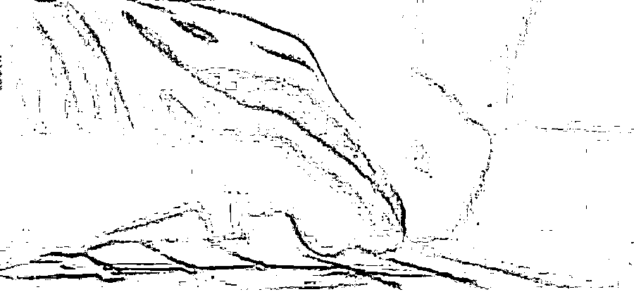
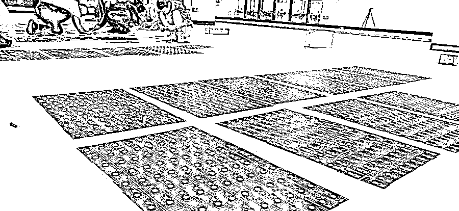
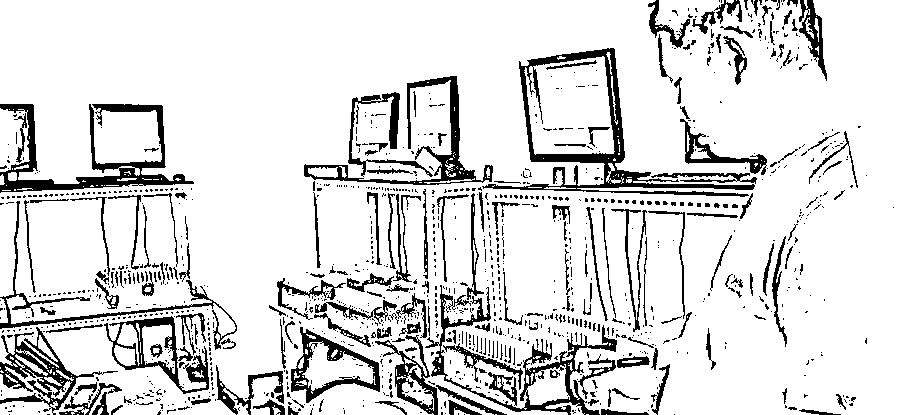
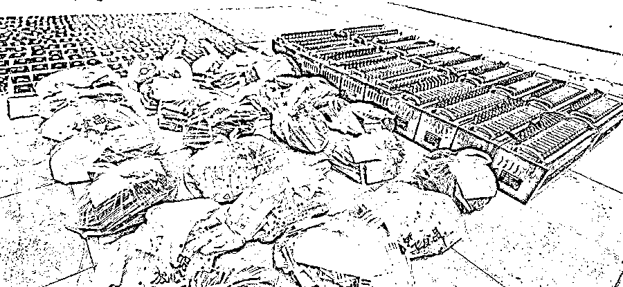
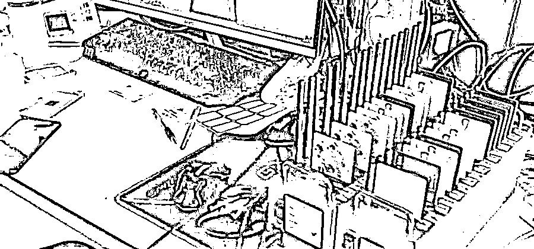

# 警方揭秘电信网络诈骗，看完不再被骗！

> 原文：[`mp.weixin.qq.com/s?__biz=MzIyMDYwMTk0Mw==&mid=2247514196&idx=4&sn=dd7f91773ab94024a38783445fc28ed4&chksm=97cb736ca0bcfa7a312f08a8a346c957320c22efbd80c7252b30a5a4a78d3cdbc41ad4bfab43&scene=27#wechat_redirect`](http://mp.weixin.qq.com/s?__biz=MzIyMDYwMTk0Mw==&mid=2247514196&idx=4&sn=dd7f91773ab94024a38783445fc28ed4&chksm=97cb736ca0bcfa7a312f08a8a346c957320c22efbd80c7252b30a5a4a78d3cdbc41ad4bfab43&scene=27#wechat_redirect)

从第一句搭讪聊天，到最后钱被层层转账流往境外，诈骗分子是怎么得手的？

随手点击的中奖信息又怎么套取了个人信息？杀猪盘、套路贷、刷单购物、微信中奖等各类电信网络诈骗的本质是什么？背后又有哪些秘密？

**第一章：一旦搭话，诈骗分子就有了可乘之机**

网恋求助、刷单兼职、资金冻结、高额返利……无论哪款诈骗手法都会有人受骗，这并不是骗子手法高明，而是在骗子利用境外服务器广泛撒网，群发各类消息，弹出各种网站的背后，总有一些心怀好奇或有潜在欲望的人想点进网站了解。一旦在网络上结识了“意中人”，犯罪分子就会利用人们对感情或者金钱的渴望心理伺机下手，在建立信任和感情后，骗取受害人钱财。

**第二章：角色多样，量身定做诈骗剧本**

每个诈骗剧本，陷进去的人都会发现是为自己量身定做的。当你渴望无微不至的关怀时，他们就是中年多金的“暖心大叔”；当你向往旷世之恋的爱情，他们就是青春靓丽的“小萝莉”；当你心想打通门路创大业，他们就是手眼通天的“内部人”。其实，他们只是一群躲在房间内，拿着诈骗剧本的“话务员”，在幕后老板的指挥下，他们按照剧本一一出演。

**第三章：虚构的身份，为什么深信不疑？**

如今，电话卡已经实名制，QQ、微信、虚拟交友、游戏账号等虚拟身份都需要电话卡进行注册，而背后对应的就是一个真实的人。诈骗分子正是利用人们弃用的电话卡，制定虚拟身份实施诈骗。

骗子使用的虚拟身份是用自己的电话号码注册的吗？找到虚拟身份注册，是不是就能找到骗子了呢？这可不一定。在撒网寻找猎物的过程中，骗子会使用不同的身份信息注册不同的虚拟身份，在行骗成功后，原来的虚拟身份就不再使用。追查过去，虚拟身份的注册信息可能是正在工地干活的工人，也可能是在校读书的学生，而真正的行骗者早已遁入网络大海中。

**第四章：虚拟身份也分三六九等**

不同的诈骗剧本需要不同的虚拟身份，而每个虚拟身份背后的网络生活痕迹，更加使被骗者对对方身份深信不疑。

使用多年的 QQ、微信等虚拟账号，丰富多彩的朋友圈、说说、日志等内容，再加上骗子的精心包装，对方可能就变成了受骗者喜欢的男朋友、女朋友、成功人士、人生导师。活跃的群聊气氛，光鲜靓丽、功成名就的群成员们，群聊中积极向上的创业正能量，指日可待的成功之路……其实真相却是，除了受骗者，里面全是骗子成员。

**第五章：电话卡怎么到了骗子手中？**

电信网络诈骗需要用到大量的虚拟身份，也就需要用到大量的电话卡。购买电话卡，然后注册虚拟身份，这是常人想到最简单直接的办法，然而这对于电信网络诈骗庞大的“业务量”来说，只是杯水车薪。有需求就有市场，于是一条拿手机卡，盗取虚拟账号，制作盗号软件，提供群发信息设备的黑灰产业链条就这样相互连接起来了。

不法分子为了获得电话卡想出了各种办法，许多不明真相的群众甚至还成为了“帮凶”，这其中便有诸如开卡送油、开卡送洗衣粉等方式。田间地头、乡间集市……热情的工作人员们送洗衣粉、送食用油、送香皂毛巾，只需带上身份证，顺便再随手拍一张本人照片，便将各种小礼物送到手上。而此时，自己的身份信息已被别人掌握，自己的无心之举已经成了犯罪分子的“帮手”。

在网络上，各种中奖、领红包、转发接力、爱心传递等也可能在盗取个人的电话号码、身份证号等注册信息。这些线上线下活动真假难辨、鱼目混珠，只有擦亮双眼，才能看清背后的真相。

**第六章：电话卡背后的黑灰产业链浮出水面**

弃用的手机卡到底能不能丢？答案是不能丢。因为这可能成为违法犯罪链条上的关键一环。

生活中，我们的电话卡在使用过程中注册过各类平台，办理过相关业务，这些虚拟身份和信息都和电话卡关联在一起。“回收卡”应该经过一定时间的沉淀，然后再重新进入市场销售，但一些不法虚拟运营商或行业“内鬼”直接将“回收卡”出租或销售给产业链下游的虚拟身份变造者，也就是“盗号”团伙。

“盗号”团伙利用技术手段将“回收卡”中的个人信息提取出来，并破解相关虚拟身份的账号和密码，破解后的虚拟身份又卖给产业链下游的诈骗团伙实施诈骗。

（警方查获现场）

而另外一条歪路就是违规出售手机卡。一些不法运营商或“内鬼”利用手中资源和权限便利，违规大量出售手机卡，跳过实名认证和通信管理权限。这些手机卡大量涌入电信网络诈骗背后的黑灰产业链条中，用于注册虚拟身份、群发消息、跳转诈骗链接等等。

在破获的案件中，不法运营商或“内鬼”提供的非法电话卡不像是办卡送油、个人买卡几张几十张的小数量，而是动辄以吨计的电话卡，可谓电信网络诈骗犯罪中的大帮凶、保护伞。

**第七章：电信网络诈骗的真相是什么？**

电信网络诈骗从本质上讲就是利用受骗者贪欲、恐惧、好奇的心理，运用各种诈骗手法使人相信其所说的话都是真的，最终将钱转到骗子手中。

骗子之所以成功，关键一点就是其出演的身份，核心之一就是电话卡。通过电话卡可以注册出不同的虚拟身份；通过“回收卡”可以找回原有的虚拟身份，包装出骗子需要的优质虚拟身份；通过电话卡可以群发消息、广发链接、组团忽悠、建群坑人……电信网络诈骗的另一核心就是银行卡，这里不作详解。

**第八章：怎么保护自己的电话卡？**

电话卡关联自己的个人信息，保护电话卡就是保护自己的信息，保护自己的隐私，也能使自己免受不法侵害和损失。

第一、不要随意相信问卷调查、贷款投资、参与抽奖、开卡送油等各类线上线下的优惠活动，也许其中有的活动是真实有效的，但自己仍要擦亮双眼，辨别真假。

第二、不要随意登记自己的身份信息，更不要随意将自己的信息交给别人办理电话卡。在需要提供自己的身份证复印件时，要注明用途，加盖水印等，不要将自己的个人身份信息交给不熟悉的人。

第三、弃用的手机卡不能直接丢。即使注销了也不能直接丢，这之前还有一个步骤要做，不要忘了！那就是要将与之前注册登记过的虚拟账号、平台、银行卡等进行解绑注销，之后再将电话卡进行注销，这样才安全。

第四、不要为了一点蝇头小利出售自己的身份信息、手机卡、银行卡，这样的行为不但涉及违法犯罪，还将对自己以后的个人信用、账号安全、就业务工等造成不利影响。

如何防范电信网络诈骗？

**谨记“三不一多”原则****:**

未知链接**不**点击

陌生来电**不**轻信

个人信息**不**透露

转账汇款**多**核实

来源：石家庄市反诈中心

← 向右滑动与灰产圈互动交流 →

