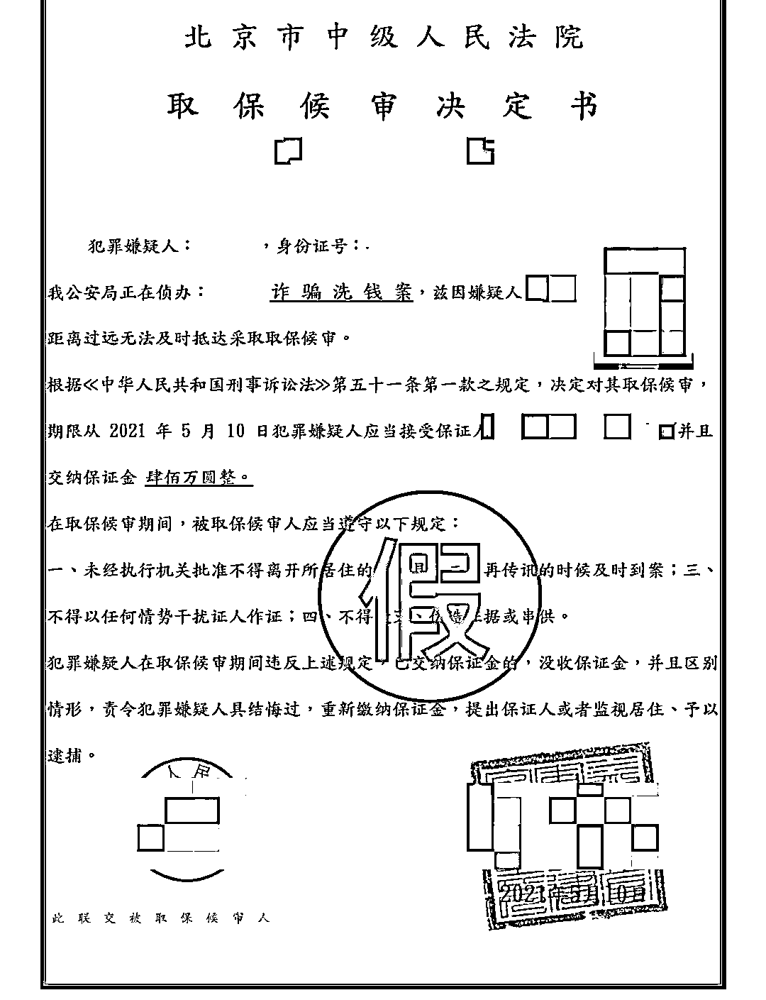
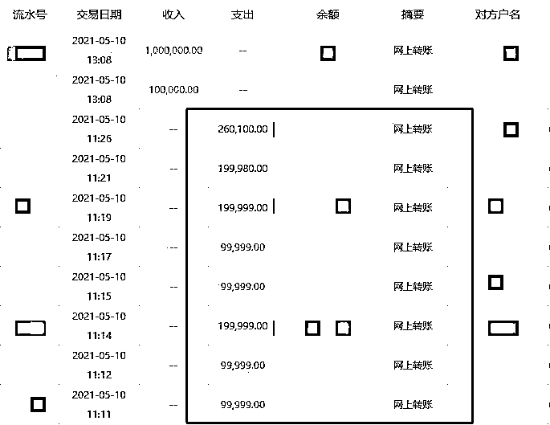

# 女子为“自证清白”，被骗 885 万元

> 原文：[`mp.weixin.qq.com/s?__biz=MzIyMDYwMTk0Mw==&mid=2247514196&idx=6&sn=cc9cdb4e67d0d1587dd1933cf66ee763&chksm=97cb736ca0bcfa7a25f1091c1d52923fd60298ff633b81990cff4805c6fc66a690d1e2ac3c54&scene=27#wechat_redirect`](http://mp.weixin.qq.com/s?__biz=MzIyMDYwMTk0Mw==&mid=2247514196&idx=6&sn=cc9cdb4e67d0d1587dd1933cf66ee763&chksm=97cb736ca0bcfa7a25f1091c1d52923fd60298ff633b81990cff4805c6fc66a690d1e2ac3c54&scene=27#wechat_redirect)

因误信所谓的“广东省公安厅的警察”，以为被卷入一宗洗黑钱案件，广东佛山市南海区一女子“自证清白”，陷入电信诈骗团伙早已设计好的连环骗局，共被骗 885 万元。

诈骗分子给阿美发来“取保候审决定书”。佛山南海警方  供图

5 月 12 日晚，澎湃新闻从佛山市公安局南海分局获悉，5 月 9 日中午，家住广州的阿美（化名）接到一个“0036”开头的来电，电话那头一名男子声称自己是“广东省公安厅的警察”，因阿美涉嫌一宗洗黑钱的案件，要求阿美到广州市越秀区某地领取逮捕通知书。 

“这会不会是诈骗？”起初，阿美拒绝了对方。对方不依不饶，将电话转给了“队长”，“队长”称阿美的案件，北京已成立了专案组，如果阿美不能到北京，就要添加北京专案组人员的 QQ 接受调查。 

这时，阿美有点慌了，随即添加“专案组”人员 QQ，并接受对方发来的视频聊天邀请。视频中，一名身穿“警服”，戴着口罩的男子要求阿美下载一款叫 Teamlink 的 App 进行沟通，并以查案情为由，要求阿美回到位于盐步的公司。

阿美的部分转账记录。佛山南海警方  供图

回到公司后，阿美打开自己的工作电脑，按照对方要求在电脑下载了 Teamlink 软件，删除了电脑上的安全防护软件，并用 U 盾登陆了自己的网上银行。随后，为了证明自己的钱都有合法来源，阿美打开了对方发来的显示为“中华人民共和国最高检察院网站”的网址链接，并在网站上填写了自己的银行卡号及密码。之后，对方便要求阿美关闭电脑屏幕，同时保持手机屏幕常亮。此时，阿美发现自己的网上银行已由对方操作，不久，手机也收到了银行发来的验证码，但她没有在意。直至当晚 9 时许，阿美发现自己银行账户被转走了 53 万元，询问对方，对方称要做阿美的资金来源分析，阿美也就没有深究。 

等到第二天早上 9 时许，男子再次联系了阿美，这次声称要证明阿美有生活收入来源，让其在账户内留存 216 万元；13 时许，对方又发来一张《取保候审决定书》，要求阿美在银行卡内存入 616 万元以缴纳保证金，三天后全额退还，阿美便向朋友借来 616 万元转入账户中。而这两次，男子均让阿美打开 Teamlink 软件，插上 U 盾，打开网上银行，由其直接操作。 

直至当天下班时，阿美向同事提及此事，才发觉自己被骗，银行账户上的 885 万元悉数被骗子转走。目前，案件仍在侦办中。 

据佛山市公安局南海分局工作人员介绍，此案发生在佛山南海区，阿美被骗的 885 万元一部分是自有资金，一部分是其从朋友借来的资金。 

警方表示，具体到本案，阿美碰到的骗局并不难识破。首先，她接到的 00 开头的电话，多数为诈骗电话，若接到此类电话，要留个心眼。其次，对方让阿美安装的 Teamlink 软件，可以进行屏幕共享远程控制操作，阿美发现对方在远程操作自己的网上银行时，就应立即退出软件，查看银行账户，如果发现异常立即报警求助。警方提醒，公安机关不会电话、网上办案，只要提到钱，一律挂掉。

来源：澎湃新闻

← 向右滑动与灰产圈互动交流 →

