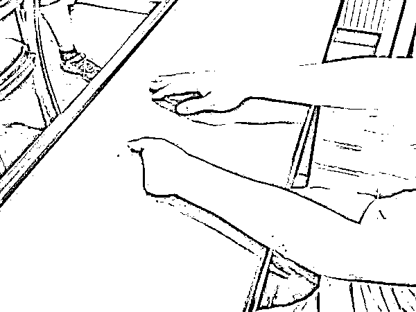

# “底薪 8000 元，你来芒市当网管”！21 岁小伙被骗到缅北 剁断 4 根手指！

> 原文：[`mp.weixin.qq.com/s?__biz=MzIyMDYwMTk0Mw==&mid=2247514230&idx=1&sn=e1556f0ce8c3f2ec2cbd67e92de06eab&chksm=97cb734ea0bcfa58102560d78e4f8d69c00b37a19b94891e29a3611a2e3be6380b60c5b27b1b&scene=27#wechat_redirect`](http://mp.weixin.qq.com/s?__biz=MzIyMDYwMTk0Mw==&mid=2247514230&idx=1&sn=e1556f0ce8c3f2ec2cbd67e92de06eab&chksm=97cb734ea0bcfa58102560d78e4f8d69c00b37a19b94891e29a3611a2e3be6380b60c5b27b1b&scene=27#wechat_redirect)

“给你三个选择：要么跟着我们搞电信诈骗，要么家里拿 12 万元赎人，或者一根手指 3 万元。”

四川 21 岁小伙张某被网友以高薪工作诱骗至缅北，他不想当骗子，更不想连累家人，无奈地选择了第三个。在数十人的围观中，被一刀剁掉 4 根手指...

被网友骗到境外

2 月 2 日，沙市区居民李某被网上投资理财 APP 骗走 93000 元。荆州市公安局通过信息研判，李某的被骗钱款转进张某名下的银行卡。警方当即对其上网追逃。

4 月 15 日，锁定张某在四川省泸州市泸县，民警迅速赶往，在当地警方配合下将其抓获，并押解回荆。

“手指都被他们砍断了，还不放过我的银行卡。”拿着“四级残疾证”的张某在荆州市公安局沙市区分局，无言地诉说着缅北噩梦。

张某初一辍学踏入社会，自学计算机维护，一直在深圳打工，生活也算过得去。去年 12 月 25 日，张某认识两年的网友雷某主动伸出“橄榄枝”：“我在云南芒市开了一家互联网公司，你过来当网管，底薪 8000 元，还有五险一金。”

12 月 31 日，张某拿着雷某给他买的机票飞往云南。按照雷某的指令，张某前往瑞丽一家旅馆等待。1 月 2 日下午 4 时许，一辆面包车来酒店接他，驶向的不是芒市，而是境外。

被关“小黑屋”十多天

面包车中途停靠多个旅馆，陆续上来 7 名年轻人，大家相顾无言。行驶一个多小时后，透过车窗看到外面的深山，张某心生疑惑。

“这是去哪呀？” 一句话打破车内平静。

一开始没人回答，张某又问了一句，邻座一男子小声告知：“已经偷渡出境到了缅甸。”张某意识到不对，准备打开车门，发现已被反锁。

中途分流换乘车辆，继续行驶 3 个多小时，张某到达缅甸木姐，在一家酒店内和雷某第一次见面。“不到 30 岁，头发梳得油光水滑，旁边还有 2 名随从。”

没有任何交流，雷某直接收走张某的身份证、手机、银行卡和随身衣物，让他在酒店等几天。房间门从外面反锁，所有窗户都被木板封堵，一日三餐定点送来。

过了两天，雷某带着一名持枪壮汉，将张某摁倒在地，用枪抵着头，逼问银行卡密码和手机支付密码。得到回复后，雷某开门见山：“我公司规模很大，有洗钱的、诈骗的，你想做什么都可以。”

被吓懵的张某表示需要考虑。接下来的十多天，张某每天都在计划逃跑，趁着深夜慢慢摇晃固定在窗户上的木板。

被网友雷某剁断四指

1 月 18 日凌晨 3 时许，木板被成功拿下，张某从二楼跳下。翻过院墙就有机会逃走，就在这时，数名持枪大汉将张某围住，戴上手铐押走。

张某被带到一个类似宿舍的地方，里面住着很多持枪大汉，说着听不懂的语言。

当日上午 10 时许，雷某和两名随从来到张某面前说：“给你三个选择！一跟着我们搞电信诈骗发财，二是支付 12 万元赎金，三是一根手指 3 万元。”

说完，把手机丢给张某。张某拨通父亲的电话，说明事情来龙去脉。电话那头的父亲心急如焚，本就困难的家庭，短时间内根本无法筹集 12 万。

“不想连累家人，更不想因为犯罪毁了一生，我只有选择第三个。”张某说，来到这边每天都听得到枪声，即便交了赎金也不一定能回去。

一大汉过来摁住张某的左手臂，将手掌平铺在一张木桌上。雷某接过旁人递来的一把长约 70 公分的武士刀，手起刀落，一刀砍中张某左手的掌指关节处，顿时鲜血四溅，四根手指完全断离。

案件仍在深挖中

“这一刀真狠！”说到此处，张某抬起左手，用仅剩的大拇指拭去眼角的落泪。

张某说，当时没有哭、没有喊，整个人是一种很呆滞的状态。旁边围着 40 多个人，有些人还在笑。

手指被砍后，张某被送往当地一个诊所治疗。当地医疗条件有限，没有断指接种技术，医生只能缝针包扎。由于失血过多，张某再醒来时已是两天后。还没等张某稍微恢复，1 月 21 日下午 4 时许，他就被强行带上一辆车，拖到弄岛口岸边境自首点。

自首后，张某踏入国门，被送往隔离点。当地医生和民警悉心照顾，张某伤情得到有效救治。隔离结束，张某回四川老家养伤，直到被荆州警方抓获。

民警介绍，李某被骗期间，张某正在云南隔离，排除作案嫌疑，目前已无罪释放，案件仍在深挖中。

“不后悔当初的决定。”张某说，如果加入诈骗团伙，丢的不只是手指，而是整个人生和生命。经过几个月的训练，他已熟练掌握断指后的计算机操作，以后只想努力工作，好好生活。

警方提示

外出务工请通过正规、合法的劳务中介，切勿轻信赴缅北地区的招工信息。随着国内对电信诈骗的重拳打击，国内的电信诈骗团伙大多数转移到国外。缅甸，特别是缅甸北部区域已成为电信诈骗团伙的主要栖身之地。

诈骗主要类型为杀猪盘、裸聊、投资理财等。由于诈骗主要对象是国内民众，诈骗团伙需要大量的诈骗“打工人”，他们以高薪招聘广告吸引或是直接诱骗，从国内引诱一些年轻人偷渡到缅甸进行诈骗，诈骗团伙为他们勾勒出发财的美梦，只是聊聊天就可以月入数万，等这些人到了缅北，才发现就是做电信诈骗，不仅工作环境恶劣，而且人身自由受到严格的限制，稍有不从便会被殴打、电击、泡水牢。如果后悔想要离开，至少要交 3 万元的“赎身费”，反抗强烈的便会被卖去贩毒、卖淫甚至被打死。

而且，根据《刑法》第三百二十二条之规定，违反国（边）境管理法规，偷越国（边）境，情节严重的，处一年以下有期徒刑、拘役或者管制，并处罚金。

当前，国外疫情形势复杂，请广大群众切勿抱有侥幸心理，出入境要按照规定办理相应手续，不要触碰法律红线，以免得不偿失。

[`v.qq.com/iframe/preview.html?width=500&height=375&auto=0&vid=m3245kzqzif`](https://v.qq.com/iframe/preview.html?width=500&height=375&auto=0&vid=m3245kzqzif)

来源：荆州日报，国家反诈中心，利箭在行动

← 向右滑动与灰产圈互动交流 →

