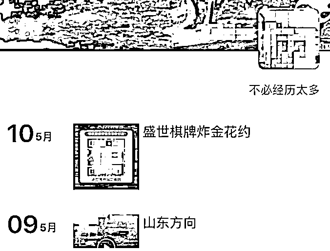
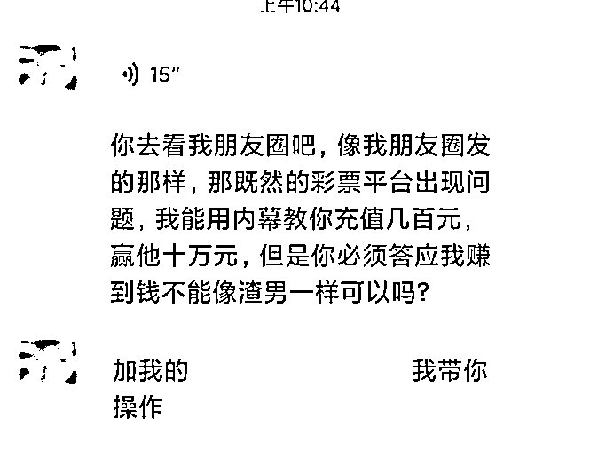
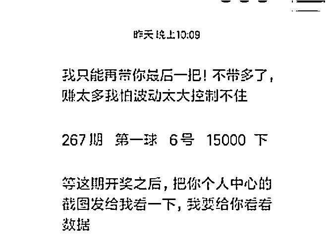
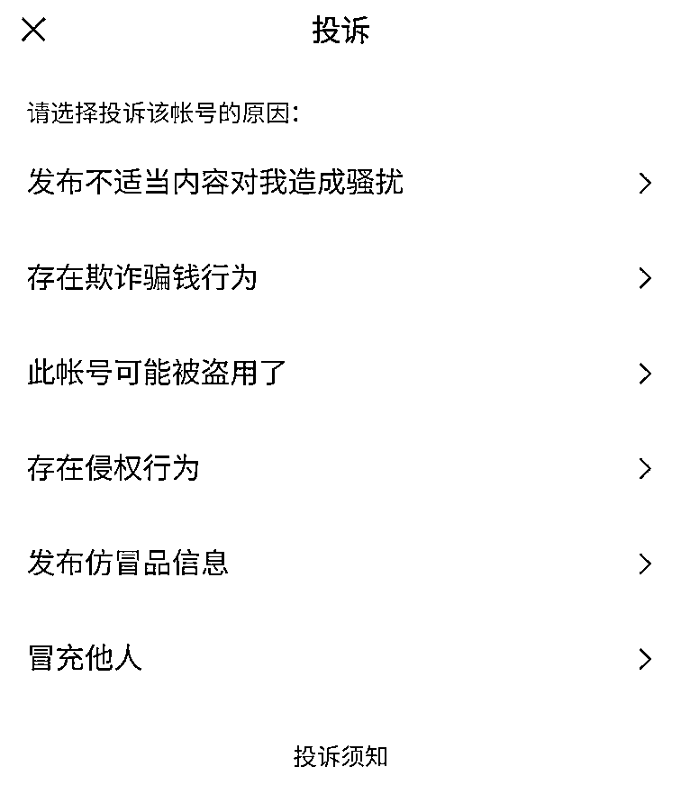
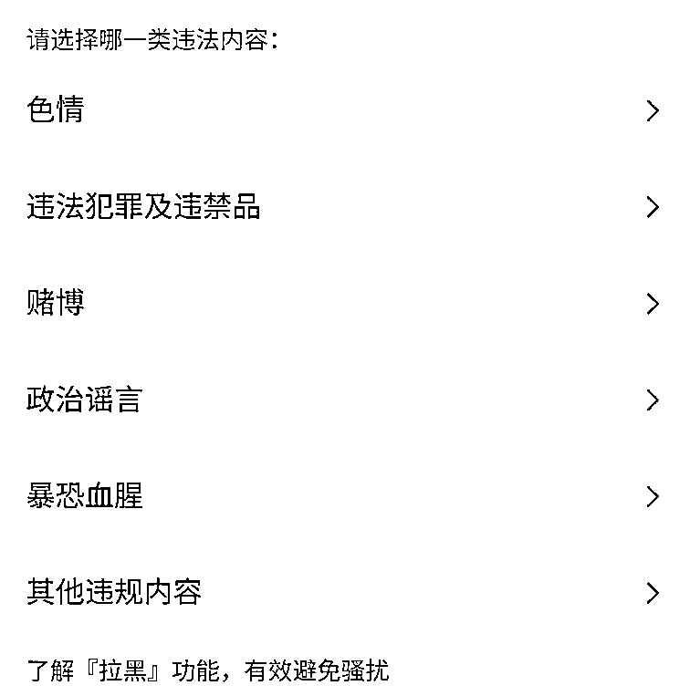
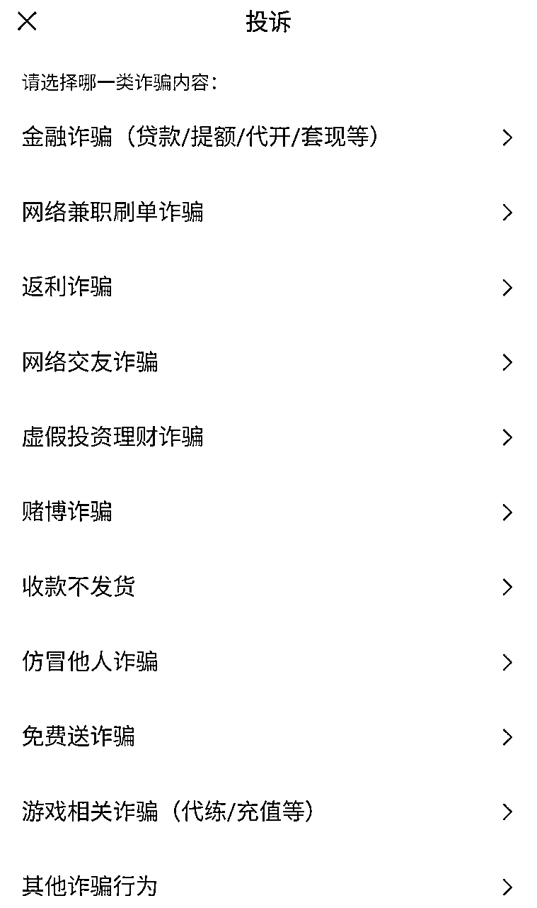

# 微信大批量封号！原因是这个

> 原文：[`mp.weixin.qq.com/s?__biz=MzIyMDYwMTk0Mw==&mid=2247514230&idx=2&sn=d04972d7d1c72263a2340e6f35dbf877&chksm=97cb734ea0bcfa58f377781498149b8f68bafa703545b056c4d029a5f98b8b54b663a933662e&scene=27#wechat_redirect`](http://mp.weixin.qq.com/s?__biz=MzIyMDYwMTk0Mw==&mid=2247514230&idx=2&sn=d04972d7d1c72263a2340e6f35dbf877&chksm=97cb734ea0bcfa58f377781498149b8f68bafa703545b056c4d029a5f98b8b54b663a933662e&scene=27#wechat_redirect)

微信安全中心昨日发布了针对网络赌博类违法违规行为的治理公告。

官方表示，网络赌博，作为跨境赌博活动最常见的形式之一，不仅违法，还极易衍生欺诈等恶意行为，严重危害网络生态环境。

微信近期加大了专项整治力度，依照国家相关法律法规以及微信相关协议，视严重程度对违规帐号采取阶梯式处罚，包括但不限于： 

*   对参与或组织赌博的帐号限制支付能力

*   对参与或组织赌博的帐号进行封号处理

*   对涉赌微信群限制群功能与支付能力

今年 1 月至今，微信团队共**打击赌博收款帐号逾 20 万个**，**限制超过 1.5 万个涉赌微信群的支付能力**，**涉及资金 2 亿左右**。

同时，微信公布了涉及赌博的违规示例以及部分被处理账号名单：

微信团队表示，后续将持续深入推进打击治理，响应国家打击治理跨境赌博工作。然而良好的平台秩序要靠大家公共维护。

在此，微信团队呼吁广大用户：拒绝赌博，不要参与或组织任何形式的网络赌博活动，**不要随便点击陌生链接或下载来路不明的应用程序**，以免落入博彩诈骗陷阱。

微信安全团队提示大家，**如发现疑似网络赌博等违法违规行为，请第一时间通过客户端或“腾讯 110”微信小程序进行投诉**。

IT 之家了解到，在微信用户名片右上角点击“三个点”按钮，选择“投诉”→“发布不适当内容对我造成骚扰”→“赌博”，即可对发布赌博信息的账号进行投诉。

针对存在明显赌博诈骗行为的账号，**在投诉页面选择“存在欺诈骗钱行为”→赌博诈骗**，即可进行投诉操作。

来源：IT 之家

← 向右滑动与灰产圈互动交流 →

