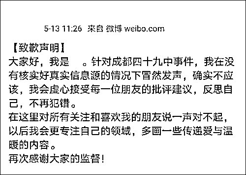
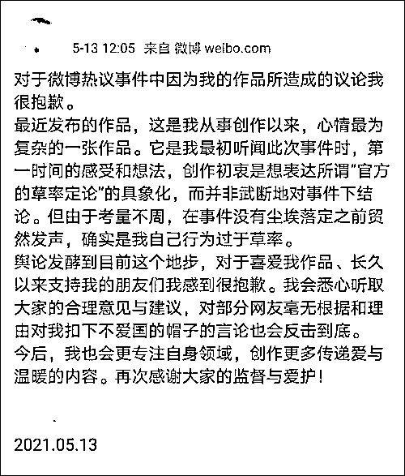
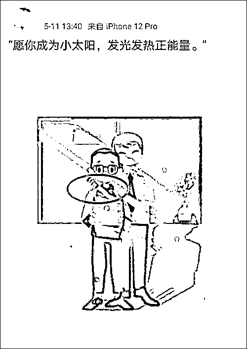
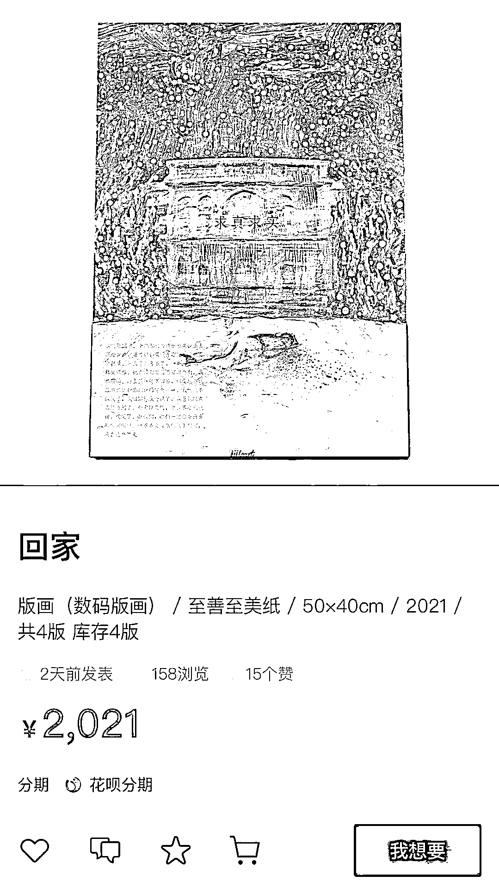
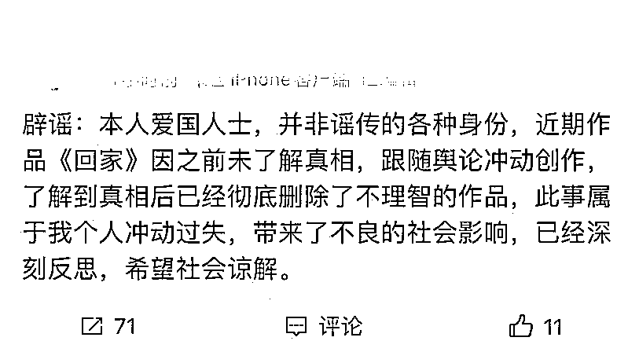
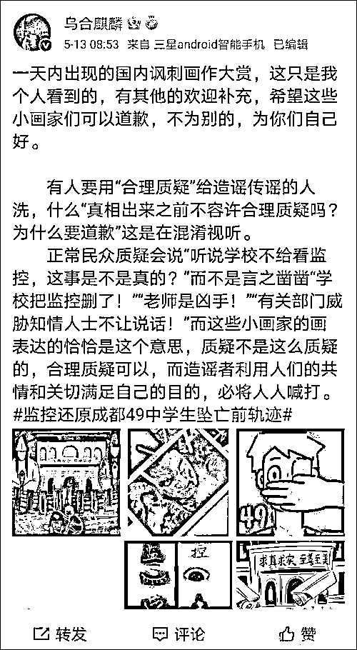
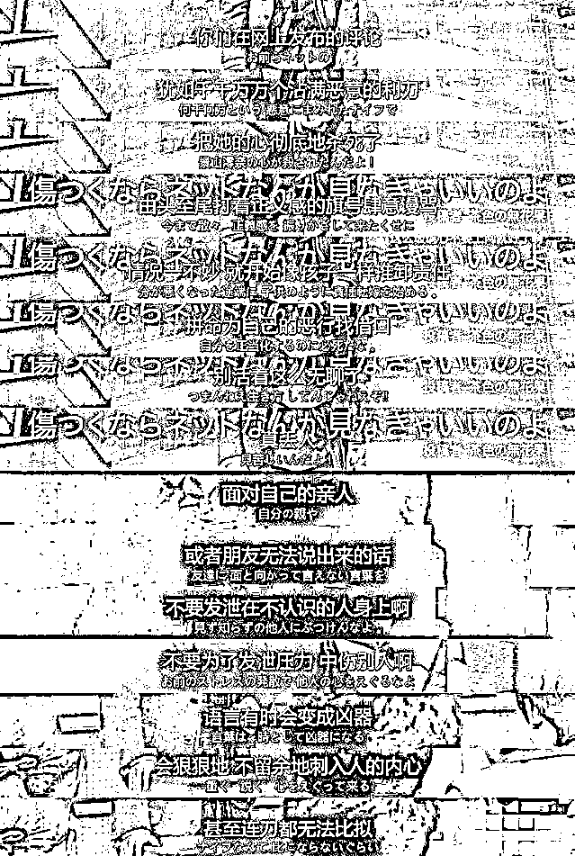

# 炮制成都 49 中“画作”？还挂在网上卖！漫画博主道歉

> 原文：[`mp.weixin.qq.com/s?__biz=MzIyMDYwMTk0Mw==&mid=2247514230&idx=3&sn=9d19c0995f2088124f09585691dce57c&chksm=97cb734ea0bcfa585a68ee0c7c27ed48f5ae90a37b89f1dc364c93331d872debab10d01e3f1a&scene=27#wechat_redirect`](http://mp.weixin.qq.com/s?__biz=MzIyMDYwMTk0Mw==&mid=2247514230&idx=3&sn=9d19c0995f2088124f09585691dce57c&chksm=97cb734ea0bcfa585a68ee0c7c27ed48f5ae90a37b89f1dc364c93331d872debab10d01e3f1a&scene=27#wechat_redirect)

13 日上午，“成都 49 中学生坠楼离世”事件水落石出。 

## 

紧接着，不断有画手在微博**道歉↓↓↓**

据了解，在坠楼事件引热议后，部分画手开始“创作”，甚至炮制**有剧情的条漫。**

更让人迷惑的是，一画手还**公开售卖**自己的作品，这幅**标价 2021 元**的画作在水印中映射不实传闻。

事后，该画手清空了自己的微博，并且**辟谣。**

此前，@乌合麒麟 就发声，**希望他们可以道歉。**

5 月 13 日，@四川网警 置顶了一张**影视剧台词截图↓↓↓** 

网络是开放自由的，但开放不等同于无法无天，自由不等同于肆无忌惮，任何漫骂、侮辱甚至人身攻击的言论，都不是我们要的自由，脱离真相的情绪化和道听途说的愤怒，更不是制造网络谣言和发动网络暴力的理由。

**兼听则明，偏听则暗**

**网络不是法外之地**

来源：中国青年报，央视网

← 向右滑动与灰产圈互动交流 →

