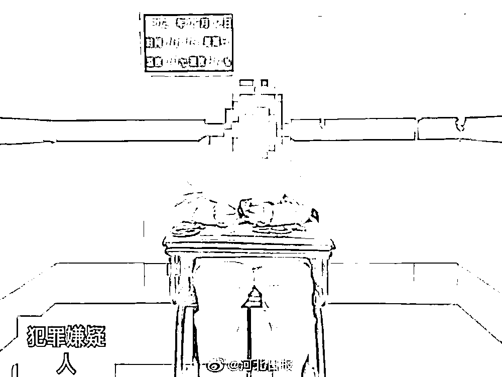

# 谁给你的胆？女子派出所“顺手牵羊”，偷走民警 4500 元现金

> 原文：[`mp.weixin.qq.com/s?__biz=MzIyMDYwMTk0Mw==&mid=2247514230&idx=4&sn=585bd818d539d8687985a5b6cbff4696&chksm=97cb734ea0bcfa587e1f5f524ec7a7108d7a72e6c82570f3b69a7a665f90aa666826b3f0c17f&scene=27#wechat_redirect`](http://mp.weixin.qq.com/s?__biz=MzIyMDYwMTk0Mw==&mid=2247514230&idx=4&sn=585bd818d539d8687985a5b6cbff4696&chksm=97cb734ea0bcfa587e1f5f524ec7a7108d7a72e6c82570f3b69a7a665f90aa666826b3f0c17f&scene=27#wechat_redirect)

5 月 11 日，河北省张家口市公安局崇礼分局石嘴子派出所户籍员小冯在工作过程中丢了 4500 元现金。究竟是何方神圣，又是怎样的脑回路，才能驱使一个人在公安派出所内实施盗窃？

5 月 11 日 10 时许，家住崇礼区石嘴子乡的程某（女）在派出所办理身份证时，趁户籍员小冯去另一间办公室复印相关证件屋内无人之际，盗走小冯背包内的 4500 元现金。正当小冯回来继续为其办理业务时，做贼心不虚的程某谎称需要使用卫生间，到卫生间后，竟将盗窃来的现金不慌不忙的逐张清点了一遍。

小冯在办理完业务后，忽然发现其放在户籍室内的背包有些“奇怪”，明明今天早上一上班就放在桌子上没有打开，为什么现在突然敞开了口呢，而且背包里的钱包也掉在了地上，再仔细查看，钱包内的 4500 元现金也不翼而飞！

此时，胆大包天的程某，从派出所大摇大摆走了出来之后，立马到附近的小超市将盗窃来的 4500 元现金兑换成微信零钱，并且把转账记录都删除了，她想着，如此一来就没人能发现自己。

殊不知，与此同时，在所的办案民警已经针对这起发生在派出所内的盗窃案件展开了侦查工作。民警通过调取派出所内监控，确定当日前来办理业务的程某有重大作案嫌疑，民警立即将其传唤至派出所。经讯问，程某对其到派出所偷盗的违法犯罪行为供认不讳。

目前，案件正在进一步侦办中。

来源：河北日报、潇湘晨报、红网

← 向右滑动与灰产圈互动交流 →

