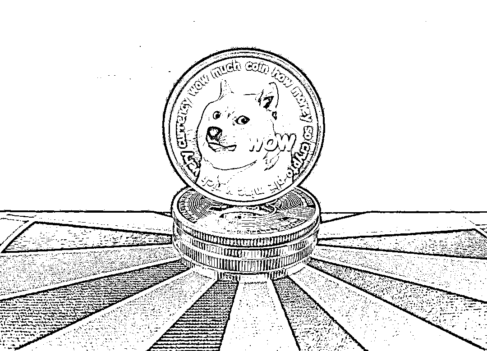
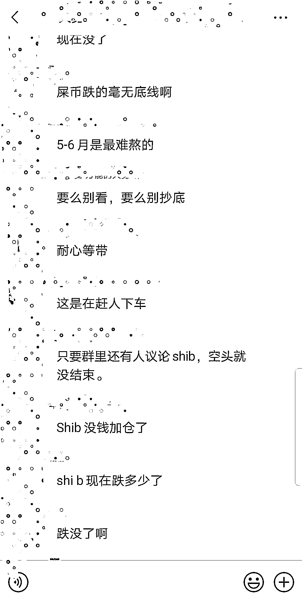

# 狗狗币“追星场”：有人握 7 万枚赌涨，大 V 收费万元群推潜力币

> 原文：[`mp.weixin.qq.com/s?__biz=MzIyMDYwMTk0Mw==&mid=2247514280&idx=2&sn=6352df63e764c60df7840c71f6875d89&chksm=97cb7390a0bcfa86f6253ec74247d9d77967c90604475c78147edcd465ae28c89fb8c6ee8270&scene=27#wechat_redirect`](http://mp.weixin.qq.com/s?__biz=MzIyMDYwMTk0Mw==&mid=2247514280&idx=2&sn=6352df63e764c60df7840c71f6875d89&chksm=97cb7390a0bcfa86f6253ec74247d9d77967c90604475c78147edcd465ae28c89fb8c6ee8270&scene=27#wechat_redirect)

大 V 从微博引流效果明显，4 个免费群已满。

狗狗币涨势一骑绝尘，搅动币圈人“路转粉”。

年初上车的王岩（化名）已在这场狂欢中收获了一波，随即成了狗狗币的“安利粉”。“我早就给公司的同事们全部推荐投资狗狗币，当初买入的现在基本都翻倍了”，采访中聊起生意经，王岩立即向记者开启狂推模式：“赶紧上车，不然财富与你无缘。”

不过，两个月时间，王岩早已抛售五万枚，拿回成本，手握 2 万枚继续押注。

今年 1 月 1 日早上 8 点，狗狗币的价格为 0.0047 美元/枚，而后迅速飙升至约 0.07 美元/枚。这还远远不是终点，到了 4 月中旬，价格开始飞涨，4 月 20 日早 8 点已涨到 0.41 美元/枚，短短半个月后再度涨至 0.7 美元/枚。

截至 5 月 13 日晚 9 点 47 分，狗狗币价格跌回 0.42 美元/枚，即便如此，今年以来狗狗币价格也翻了 88 倍，最高峰时年内涨幅一度高达 148 倍。

狂热之下，币圈大 V 也有了生财之道。新京报贝壳财经记者调查发现，不少大 V 开通付费小密圈，表面分享各大主流币、山寨币行情，实为付费推荐潜力币，年费从几百元到万元不等。

记者看到，有的大 V 粉丝已经挤满 4 个免费群，新建的免费群也已有 100 多人“追随”。

而狗狗币行情大起大落，并非所有投资人都是赢家。杨燕（化名）跟风投资了几万块，已经亏了一万多。

**暴涨破圈，90 后、00 后成“追星一族”******

****狗狗币大涨消息刷屏，王岩认为自己嗅到投资绝佳机会，2 月时果断建仓。****

****“2 月初我在狗狗币低谷期持续加仓，坚信会翻倍上涨，买了 7 万枚狗狗币。当时，狗狗币价格才 0.03 美元/枚，到了 3 月份，其他币都上涨，唯独狗狗币是震荡行情。”王岩进场也并非坐收投资收益，直到 4 月~5 月份，狗狗币开始暴涨——从 0.07 美元/枚上涨到最高 0.7 美元/枚。****

****“其实，我买完就忘记了，一直拿着，翻倍之后，抛了五万枚狗狗币，拿回成本。”王岩手里剩下 2 万枚狗狗币，准备长期持有。****

****记者算了一笔账，即便以狗狗币价格“起飞”前的 0.07 美元/枚成本价计算，0.3 美元/枚时卖出，王岩从狗狗币此轮疯长中赚到了 1 万多美元。****

****王岩并非“币圈新人”，此前曾试水持有 2 枚以太坊，在价格翻十倍之后卖出。此后以太坊继续上涨，从年初的 1000 美元上涨到目前的 4000 多美元，他又在 3000 多美元时重新买入以太坊。目前，投资了一篮子虚拟货币，关注币圈动态已是日常。****

****不过，王岩坚定看好狗狗币，身上有着明显的狗狗币投资者特质：被马斯克圈粉。****

****贝壳财经记者采访了解到，不少年轻人“入场”正是源于特斯拉公司首席执行官埃隆·马斯克为狗狗币带来的流量加持。****

****“如果要给狗狗币划分一个板块的话，那么它应该属于 MEME 币，你可以理解成‘梗’币。狗狗币的诞生源自两个程序员的恶作剧，连标志都是一个常被用作表情包的柴犬。一开始，狗狗币主要作为小费或直播打赏使用，但应用仍较少。尽管如此，狗狗币依然获得了很多反骨赛博朋克年轻人的支持，无厘头的狗狗币算是这批人对于功利性世界观和精英主义的一种嘲笑，理所当然获得了许多年轻人的流量。”资深币圈人士赵宇（化名）介绍称。****

****诞生于 2013 年的狗狗币虽然源于一场恶作剧，但在“世界顶流”马斯克的带动下，已成为国际上用户数量仅次于比特币的数字货币。目前市值突破 500 亿美元，远在推特、福特汽车等大牌公司之上。****

****早在 2019 年 4 月份，马斯克曾发推文称，狗狗币可能是自己最喜欢的数字货币。当时，他还将自己的推特简介改成了“狗狗币 CEO”。今年 2 月，马斯克表示已经给自己的孩子买了一些狗狗币，这样他就能成为一个蹒跚学步的持币人。随后，美国摇滚歌手吉恩·西蒙斯、说唱歌手史努比·道格等多位演艺圈名人也相继在推特上发布狗狗币相关的图片。****

****受益于名人“站台”，狗狗币价格也一路狂飚。****

****在币圈，比特币显然更为公众熟知，与比特币相比，狗狗币交易过程更为便捷，确认时间只要 1 分钟，且价格低廉。与比特币有总量上限不同，狗狗币并没有总量上限，第一年便挖出 1000 亿枚，往后每年少挖 50 亿枚。****

****与比特币动辄数万美元一枚不同，狗狗币的“上车”门槛极低，数百元便可跻身“币圈人”，这或许也是吸引年轻人参与的原因之一。****

****赵宇对记者说：“投资狗狗币的不仅有币圈老人，也有新加入的年轻人，整体年龄段偏年轻化。”****

****记者在一个狗狗币投资群看到，1800 位群成员中，90 后占比高达 49%，00 后占比则为 19%，两者占比合计达 68%，与狗狗币在年轻群体中“破圈”的形象基本相符。****

********

******大 V 开付费小密圈：******

******年费 1.5 万元，利用社交媒体引流******

************

********狗狗币成了香饽饽，粉丝也成了被“收割”的对象。********

********贝壳财经记者在社交平台看到，有币圈大 V 开通付费小密圈，年费为 299USTD（泰达币），按目前价格折合人民币约 1900 多元。大 V 宣称，会分享各大主流币、山寨币的走势及行情，为投资者每日推荐翻倍潜力币，此外每天会推荐第二天必涨币，指导抄底、减仓、加仓、出仓等。********

********记者搜索发现，这样的付费群或者小密圈并不难找，大 V 主要在微博等渠道频繁发布币圈最新消息，甚至会发实战经验。吸引散户关注后，通过免费进群的方式，将微博渠道粉丝聚集在微信群中。********

********在大 V 建立的免费群内，记者看到，其会选择性回答群友提出的问题，包括现在是否能买入某种币，某种币价格后续是否还能回升等。不过，随后便会在群里发布付费群的推广消息，引流至付费群。********

********据贝壳财经记者了解，这种付费群一般并不会专门针对某种币做分析，而是更为综合的币圈投资，涉及币种较多，教授的投资方式也比较多样，如维克托的专业投机原理，蔡森的形态学等。********

********一位大 V 为记者介绍称，加群后会有几位老师，只要付费，群成员能随时咨询老师以及与老师进行一对一交流。除此之外，群里还会提供一些实战思路，买入币种、卖出点位提醒等。********

********记者咨询数位大 V 了解到，目前可按季度收费，有的则收取年费，金额从几百元到上万元不等。记者以投资者身份咨询了一位大 V 获悉，其 VIP 群要按季度付费，3800/季度，也就是说年费高达 1.52 万元。********

********目前这位大 V 从微博引流效果明显，4 个免费群已满，第 5 个免费群也已有 100 多人，不过，从其截图来看，付费群人数并不多，一个群大约只有 20 多人。********

********对于这些付费群，一些“小白”认为跟着大 V 学成长更快，而且他们通常有内幕消息，跟着投比什么不懂就去投，赚钱概率更大。不过，也有投资者并不买账，认为大 V 水平参差不齐，进群容易被大 V 和庄家联合割韭菜，最后没准不赚钱还亏得很惨。********

********张岩告诉记者，付费群主要是一些团队或者牛散根据历史经验、未来趋势判断币的走势。“这种圈子确实有真才实学的人，对币圈很精通，但也不可能保证每天都赚钱。当然，也有割韭菜的群，比如庄家会和群主沟通，让群里的散户集体在某个时间入场，然后庄家趁机卸货，这样一来散户就被割了。我建议大家还是自己去研究，自己去体验一下，多加一些交流群，现在币圈获取消息还是比较方便的。” ********

******** 狗狗币大涨数十倍，还能进场吗？********

****************

**********马斯克持续关注狗狗币，这也被币圈人士视作仍有上涨空间的主因之一。**********

**********5 月 11 日，有社交媒体做了一个主题为“你想让特斯拉接受狗狗币支付吗？”的投票。结果显示，超 7 成用户支持特斯拉用狗狗币支付。**********

**********而在此之前，美国太空探索技术公司 SpaceX 证实，他们将接受狗狗币，并将于 2022 年第一季度进行首次由这种加密货币支付的卫星发射任务。**********

**********虽说狗狗币今年以来已大涨 80 多倍，但由于大起大落，也并非所有投资人都赚到了钱。投资人杨燕（化名）对记者表示：“最近跟风花了几万块钱投狗狗币，成本价是 0.6 美元/枚，后来跌到 0.5 美元/枚，12 日凌晨清仓了一波，亏了一万多。”**********

**********对于狗狗币而言，可谓成也马斯克，败也马斯克。他一句话往往能左右狗狗币“生死”。**********

**********当地时间 5 月 8 日，马斯克参与主持美国老牌娱乐综艺节目周六夜现场，直播秀还没开始，狗狗币价格已站上 0.7 美元/枚。节目最后，主持人开玩笑式地问：狗狗币是一场骗局？马斯克无奈一笑：“嗯……好吧，它是骗局。”**********

**********随后，狗狗币暴跌，跌幅一度近 40%。**********

**********赵宇接受记者采访时表示，这波下跌主要因为之前涨得太多，抛压比较严重，大多数年轻人买狗狗币还是为了投机。**********

**********贝壳财经记者采访了解到，除了散户投资，一些资深加密货币团队也建仓了狗狗币。赵宇所在的团队成员此前均在传统金融机构从事量化交易，已有十余年从业经验。2016 年起，他们开始交易比特币和其他加密货币，可以监控全市场大多数的币品种，目前已实盘交易五年，可以说是圈内交易时间较长的团队。**********

**********“我们的量化系统可以对市场上绝大多数的币做趋势监控，3 月 14 日监控到狗狗币有强烈的上涨趋势就建仓了。”赵宇团队认为，狗狗币会获得不错的流量支持。“可以说，狗狗币已经成为币资产领域反骨赛博朋克年轻人眼中对抗传统世界的代表品种。同时，马斯克频频为狗狗币发声，这也给狗狗币未来的应用创造了许多遐想。因此，我们认为狗狗币会得到流量支持，这源于我们长期对新新人类的观察和理解。”**********

**********不过，她也表示，这一趋势到底能维持多久不一定，短期应仍存在流量支持。**********

**********与年初相比已大涨数十倍的狗狗币是否还能进场？对此，王岩比较乐观，认为狗狗币会涨到 1 美元/枚，长远看甚至能涨到 10 美元/枚。**********

**********不过，行情火热，有虚拟货币投资经验的杨文（化名）比较谨慎，“近期打算入场，但是会少量买，感觉风险还是挺大的。”而资深币圈人士明亮（化名）认为目前狗狗币价格还在高点，会持续关注。**********

**********来源：新京报**********

****************************************

**********← 向右滑动与灰产圈互动交流 →**********

********************