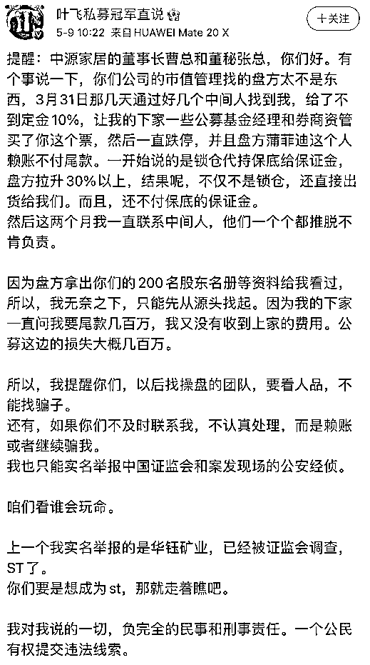

# A 股大瓜！杀猪盘坐庄"反咬"？昔日私募冠军爆料：人跑了钱没收到！更有公募券商接盘？

> 原文：[`mp.weixin.qq.com/s?__biz=MzIyMDYwMTk0Mw==&mid=2247514280&idx=3&sn=e684e7c3ff00367446fb98c755b3fcb1&chksm=97cb7390a0bcfa866d21776ec15a155e58892c6e24715993968056a0ed3ef2ff9f9e5d0d1eea&scene=27#wechat_redirect`](http://mp.weixin.qq.com/s?__biz=MzIyMDYwMTk0Mw==&mid=2247514280&idx=3&sn=e684e7c3ff00367446fb98c755b3fcb1&chksm=97cb7390a0bcfa866d21776ec15a155e58892c6e24715993968056a0ed3ef2ff9f9e5d0d1eea&scene=27#wechat_redirect)

三天前的 A 股，受到隔夜美股暴跌影响，全线低开，盘中创业板一度翻红，但最后还是微跌收盘。 

截至收盘三大指数集体收跌，其中沪指下跌 0.96%，收报 3429.54 点；深证成指下跌 1.05%，收报 13917.65 点；创业板指下跌 0.57%，收报 2943.62 点。两市合计成交 8017 亿元，北向资金净流出 56.4 亿元。

除了盘面之外，今天 A 股还出现了大瓜！昔日的私募冠军叶飞，在微博上演了一场坐庄上市公司“狗咬狗”的大戏，而这家上市公司也非常有名，就是之前基金君报道的，曾经出现杀猪盘的中源家居！ 

杀猪盘坐庄“狗咬狗”？

近日，私募大佬叶飞在微博上发文称，中源家居市值管理找的盘方赖账不付尾款，同时，上市公司股价下跌导致其下家的一些公募基金经理和券商资管出现了较大损失。“因为我的下家一直问我要尾款几百万，我又没有收到上家的费用。公募这边的损失大概几百万”。叶飞表示，如果中源家居董事长、董秘等不及时联系他，不认真处理，而是赖账或者继续骗他，他将向中国证监会实名举报。

全文如下： 

基金君注意到，这条微博是在 9 日发出的，不过到了 13 日才在投资圈刷屏。 

**不过，据每日经济新闻报道称，中源家居相关人士跟记者表示，经过自查，公司没有参与任何的市值管理。公司不认识叶飞所称的盘方蒲菲迪；公司自查了银行账户往来，没有跟任何投资公司或者叶飞、蒲菲迪等有任何往来。在上述相关人士看来，叶飞没有拿出任何有力的证据材料，有点碰瓷的意味。**

关注基金君的小伙伴应该对中源家居这家上市公司不陌生。今年 4 月份开始，中源家居连续 4 天闪崩大跌。

当时公司表示：“我们有关注近期股价波动。目前公司经营一切正常，业绩相对稳定，我们也不清楚具体是什么情况。”

而这样杀猪盘的手法，类似的走势已经出现过 2 次。

2020 年 4 月 29 日，连续大涨 3 个月的中源家居开始狂跌，此后连收 3 个一字跌停，较最高点股价近乎腰斩。有投资者在股吧留言称， 在“带票老师”、“微信股票群”推荐下买入该股后遇到跌停。

之后仅仅过去 4 个月，中源家居再次上演拉升后跌停的剧情。据了解，自 2020 年 8 月 21 日，中源家居连续 4 个交易日拉涨，一度上涨 34.43%。但自 8 月 27 日起，中源家居连收 3 个跌停板。据当时股吧投资者爆料，有“老师”在微信群或直播间中推荐“学生”全仓买入中源家居。有投资者禁不住诱惑跟进买入，随后迅速被拉黑或踢群。

**再回头说说叶飞。** 

叶飞 1994 年踏入证券市场，2003 年进军私募投资，2007 年获得中国股市民间高手大赛第一名。他被业内认为是草根派的代表人物，投资风格上偏爱短线操作。

倚天投资成立于 2010 年，注册资本 1000 万元，一度成为阳光私募行业的“黑马”。2015 年，倚天投资旗下“倚天雅莉 3 号基金”收益 351%，被机构评为阳光私募基金股票策略组 2016 年上半年度冠军。

2015 年 9 月 18 日，证监会新闻发言人邓舸表示，叶飞涉嫌于 2015 年 5 月 13 日至 6 月 30 日集中资金优势，在尾盘阶段连续买入信威集团（600485.SH）、晋西车轴（600495.SH）、江淮汽车（600418.SH）、奥特迅（002227.SZ）、中青宝（300052.SZ）等五只股票，影响价格与交易量，继而反向卖出，构成操纵市场。证监会决定没收其违法所得 663.8 万元，并处以 1991 万元罚款。

据《扬子晚报》报道，叶飞还曾担任浙江某大学 EMBA 总裁班“股票特训班”讲师，跟随他上课的 23 名 EMBA 学员巨亏逾亿元。

据当地报道，2015 年 6 月份，叶飞曾担任浙江某大学 EMBA 总裁班“股票特训班”讲师，但跟随他上课的 23 名 EMBA 学员却巨亏逾亿元。

学员们说，叶飞上课内容很简单，除了普通股票知识，就是讲实际操作。股灾连续暴跌，学员割肉离场亏损过亿。 “少的亏了两三百万，多的亏了一千多万元。”

而上叶飞的课，门槛并不低。学员介绍，如果要参加的话，500 万元到 1000 万元的资金，“培训费”是 15 万元；1000 万元以上，“培训费”是 29.8 万元。虽然说这样的收费高得离谱，但还是有不少学员心动了。事后统计，20 多个人，总资金量达到 2.5 亿~3 亿元。

## **贾跃亭回国？乐视发布会邀请函出现贾跃亭剪影**

近日，乐视向媒体发布邀请函，宣布将于 5 月 18 日举办乐视智能生态发布会，通过乐视超级电视、乐视视频直播。

值得注意是，邀请函上有一个招手人形轮廓，与贾跃亭极为相似。海报上方还写着“我回来了！”。  

对此，网友有期待的：

也有并不相信贾跃亭回国的： 

来源：中国基金报

← 向右滑动与灰产圈互动交流 →

