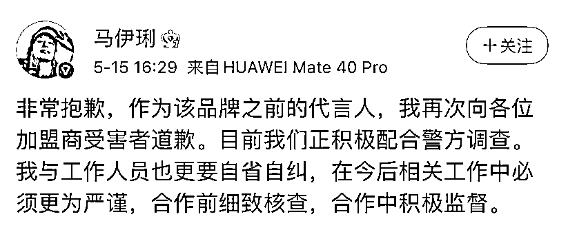
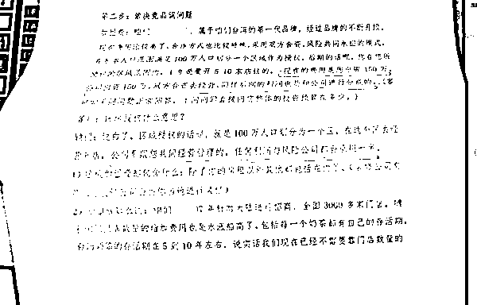

# 代言品牌涉嫌违法，马伊琍：正配合调查

> 原文：[`mp.weixin.qq.com/s?__biz=MzIyMDYwMTk0Mw==&mid=2247514280&idx=4&sn=9768b86a6c3b1312aba361041f84577c&chksm=97cb7390a0bcfa8696cfb9993c262b301163daa1ca998c89945b275c26fcf6d94bcd4dfa6d75&scene=27#wechat_redirect`](http://mp.weixin.qq.com/s?__biz=MzIyMDYwMTk0Mw==&mid=2247514280&idx=4&sn=9768b86a6c3b1312aba361041f84577c&chksm=97cb7390a0bcfa8696cfb9993c262b301163daa1ca998c89945b275c26fcf6d94bcd4dfa6d75&scene=27#wechat_redirect)

5 月 15 日，马伊琍工作室发表致歉声明，其代言的品牌“茶芝兰”因涉及违法犯罪正在接受调查。

马伊琍工作室就代言品牌涉嫌违法犯罪在微博发表声明称：近日，我方工作人员接到上海经侦总队通知，告知我方演员马伊琍女士代言品牌茶芝兰因涉及违法犯罪，正接受公安机关调查。我方于第一时间向该品牌提出解约通知，并积极配合经侦工作，提供线索及信息。同时，我方向受骗消费者、加盟商致以最诚挚的歉意。

随后，马伊琍也在其个人微博转发声明并道歉：“非常抱歉，作为该品牌之前的代言人，我再次向各位加盟商受害者道歉。目前我们正积极配合警方调查。我与工作人员也更要自省自纠，在今后相关工作中必须更为严谨，合作前细致核查，合作中积极监督。” 

新闻延伸

日前，上海警方在河北、广东等地警方的大力协助下，成功侦破本市首例以虚假品牌奶茶招商网站吸引加盟商、虚构履约能力骗取加盟费的“套路加盟”合同诈骗案，抓获金某、王某等 90 余名犯罪嫌疑人，捣毁多个虚假招商网站，查获大量虚假授权文书、合同文书、话术清单、贴牌奶茶等涉案物品，涉案金额 7 亿余元。

上海警方成功侦破本市首例“套路加盟”合同诈骗案。本文图片均由经侦总队供图

2020 年 5 月，市民王先生在互联网上看到一则某知名品牌奶茶招商加盟的广告后，萌生了加盟创业的想法。进入网站留下联系方式后，客服人员便主动来电，为王先生详细介绍了该知名品牌奶茶的管理方式和盈利前景。 

然而，在几番洽谈后，客服却以该知名品牌奶茶加盟名额已满为由，转而向王先生推荐了一个名为“茶芝兰”的奶茶品牌。客服称，“茶芝兰”是与该知名品牌同属一个集团的第三代品牌，并邀请王先生前往公司实地考察。 

在公司里，招商经理张某接待了王先生，向其出示了该知名品牌的招商授权书，并展示了“茶芝兰”品牌奶茶的宣传视频。

品牌奶茶的管理方式和盈利前景 

张某向王先生承诺，加盟后公司会统一安排选址筹建，配发生产设备，供应产品原料，并提供培训指导、技术支撑、运营管理、广告宣传等全方位配套服务，王先生只要加盟就能轻松盈利。很快，王先生便与公司签订协议，并支付了 10 万元加盟费。 

然而，加盟之后，公司向王先生承诺的“全方位配套服务”并未兑现，张经理也不知所终。王先生的店铺生意惨淡，仅仅开张 3 个月就面临关停的窘境。气愤的王先生找到公司讨要说法，公司却以王先生经营不善为由，对他的诉求置之不理。 

2020 年 12 月，上海警方依托数据分析，发现大量奶茶店铺加盟商户“异常关停”的风险，可能涉嫌经济犯罪。市公安局经侦总队即会同松江公安分局组成专案组开展侦查，并于 3 月 23 日将以犯罪嫌疑人金某、王某为首的诈骗团伙一网打尽。

“伪装”品牌包装手段

“伪装”品牌包装手段

经查，犯罪嫌疑人金某、王某等人为牟取非法利益，成立某餐饮公司，搭建多个虚假知名品牌奶茶招商加盟网站，设计发布带有“品牌加盟”字样的招商广告，吸引获取潜在加盟商联系方式；随后，收购或注册“花点点”“茶芝兰”等 50 余个奶茶品牌，通过设计“知名品牌旗下产品”“全程一站式服务”“大数据科学选址”“投资加盟稳赚不赔”等宣传话术，安排话务员对外推销加盟业务。 

事实上，公司对外宣称的专业培训讲师根本不具备奶茶行业从业经验，各项服务也是无稽之谈。 

甚至在加盟商实地考察时，犯罪团伙还以每人每日 40 至 80 元不等的价格，雇佣人员冒充消费者，在奶茶店铺前循环排队，营造生意火爆假象，以层层铺设的加盟套路骗取加盟商的信赖。 

目前，上述 90 余名犯罪嫌疑人因涉嫌合同诈骗罪已被警方依法采取刑事强制措施，案件在进一步侦查中。

综合自澎湃新闻资深记者 朱奕奕、新浪微博等

← 向右滑动与灰产圈互动交流 →

