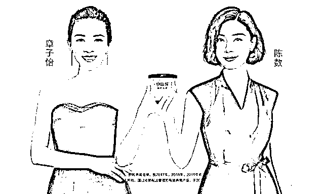
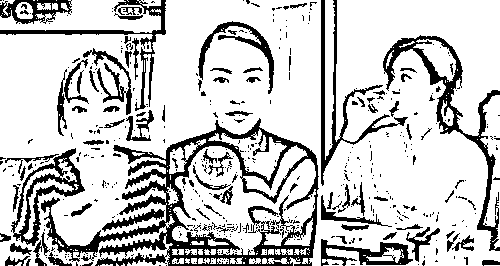
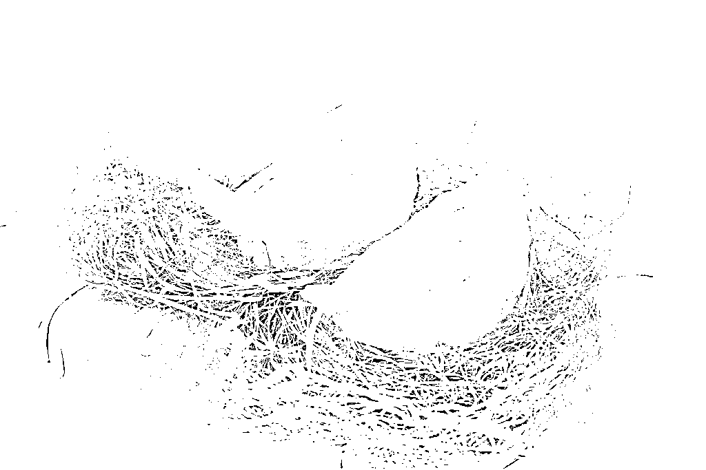

# 小仙炖，摊上事了！

> 原文：[`mp.weixin.qq.com/s?__biz=MzIyMDYwMTk0Mw==&mid=2247514280&idx=5&sn=6d954ea917fa2c5a1004c4705dd451e5&chksm=97cb7390a0bcfa86681636cd2c9fe4148814cf2d4838452993334e3d60fb18135dfb4360765f&scene=27#wechat_redirect`](http://mp.weixin.qq.com/s?__biz=MzIyMDYwMTk0Mw==&mid=2247514280&idx=5&sn=6d954ea917fa2c5a1004c4705dd451e5&chksm=97cb7390a0bcfa86681636cd2c9fe4148814cf2d4838452993334e3d60fb18135dfb4360765f&scene=27#wechat_redirect)

原料用了燕盏和燕条，却说只有燕盏；声称每瓶干燕窝含量为 2.5 克（含）-5 克（不含），实际却只有 3.5 克……

因虚假宣传，章子怡、陈数代言的网红燕窝品牌小仙炖近日被有关部门罚款 20 万元。北京市朝阳区市场监督管理局公布的一则罚单显示， 小仙炖公司存在与实际使用原料不符标注、干燕窝含量未准确标示、标示的原料信息误导消费者、标示的商品产地欺骗消费者等违法事实。**5 月 13 日，小仙炖回应称，前述行政处罚主要是针对小仙炖此前在电商平台中的宣传不严谨，目前其已经对相关公开信息进行全面排查和整改。**

此次罚单显示，小仙炖涉及虚假宣传的指标包括：2020 年中至 2021 年初，在天猫店产品参数界面宣传“即食燕窝原料：燕盏”，但实际使用原料包含燕盏和燕条；2020 年 3 月起，在天猫店中，70g 鲜炖燕窝的销售参数界面显示的干燕窝含量为“2.5 克(含)-5 克(不含)”，实际干燕窝投料量为定量 3.5g/瓶等。

此外，其还存在原产地标注不清，虚假宣传等情况。罚单显示，2019 年 5 月至 2020 年 6 月，当事人在京东商城店铺“小仙炖官方旗舰店”鲜炖燕窝商品参数界面，将商品产地标注为印度尼西亚，经核查，该产品的实际产地为河北廊坊(先后为固安和霸州)。

据悉，小仙炖目前已修改天猫和京东官方店 70g 鲜炖燕窝产品标注，干燕窝添加量修改为 3.5g/瓶。据了解，小仙炖背后有多位明星及企业家为其站台，章子怡、陈数不仅为其代言，同时还是该品牌的投资人。而小仙炖创始人更是曾公开表示，小仙炖“成为影响了半个娱乐圈的一碗燕窝”。张雨绮、张柏芝、陈数在社交媒体分享该产品 就在今年 3 月，小仙炖完成了 C 轮融资，该轮融资由 IDG 资本、CMC 资本、正心谷领投，琥珀资本跟投，具体融资规模未披露。小仙炖方面表示：“小仙炖本轮融资将主要用于完善供应链体系，科研实验室建设与研究，新零售用户体验打造及升级，组织中台化建设等方向。”

**吃燕窝能保护卵巢、提高人体抵抗力？**

**小仙炖此前曾在其官方旗舰店的产品直播中介绍，燕窝能起到保护卵巢的作用，同时具有促进细胞再生、提高人体抵抗力、平衡内分泌等功效。该公司官方微博也在宣传文案中称，“长期规律服用燕窝，身体由内而外焕发自然健康好状态。”**

**燕窝真有这么神吗？记者注意到，市场上对于燕窝的功效颇具争议，有人认为吃燕窝对皮肤好，长期服用可以起到美容的效果；也有人称燕窝就是“智商税”，是“富人收割机”。**

****

**图源：视觉中国** 

**对此，科信食品与营养信息交流中心科学技术部主任阮光锋介绍，燕窝是海鸟金丝燕的巢穴，100 克干燕窝内含有蛋白质 49.9 克、钙 42.9 毫克、碳水化合物 30.6 克、磷 3.0 毫克、铁 4.9 毫克。**

**“从营养素数据来看，其蛋白质含量不如同等数量的牛肉、鸡肉等常见的肉制品。而且，它所含的蛋白质主要是胶原蛋白，属于不完全蛋白质，缺乏人体所需的必须氨基酸（色氨酸），在某种程度上来看，燕窝的营养价值甚至还不如鸡蛋、普通肉类。”阮光锋表示。**

**阮光锋提到，**现在流传的燕窝的保健功能功效，都只是一些动物实验结果**。但是动物实验跟人正常饮食相差很大，比如在果蝇、小鼠身上使用的唾液酸剂量都是非常大的，而**我们普通人只是偶尔吃吃，量非常少，几乎无法获得什么健康益处**。**

**来源 | 广州日报、中新经纬客户端**

********

**← 向右滑动与灰产圈互动交流 →**

****