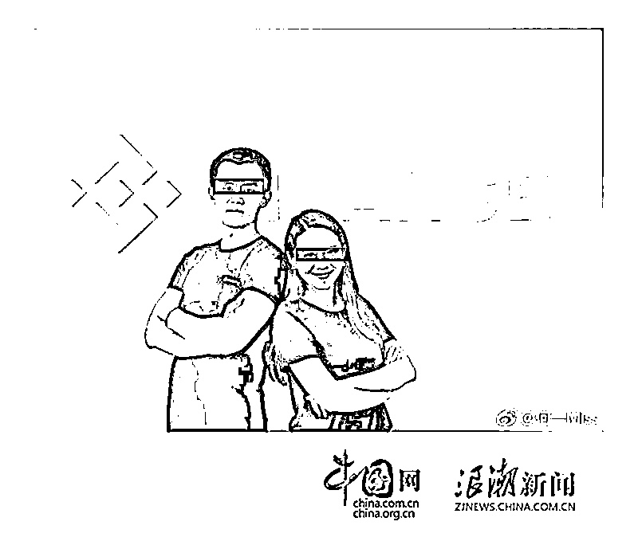
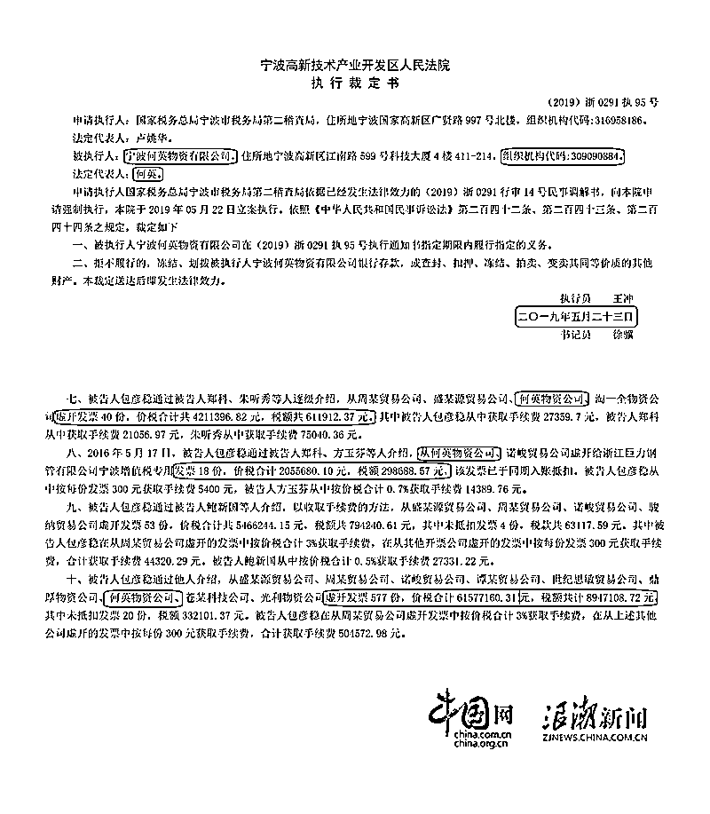

# 币安 你在肆无忌惮挑战国内的法律监管吗？

> 原文：[`mp.weixin.qq.com/s?__biz=MzIyMDYwMTk0Mw==&mid=2247514335&idx=2&sn=1b67e753cea33e6da832e396123726e2&chksm=97cb73e7a0bcfaf149aec4dc6d718cbada4562980ece9f9cf4507f9014457e9c26a482c88667&scene=27#wechat_redirect`](http://mp.weixin.qq.com/s?__biz=MzIyMDYwMTk0Mw==&mid=2247514335&idx=2&sn=1b67e753cea33e6da832e396123726e2&chksm=97cb73e7a0bcfaf149aec4dc6d718cbada4562980ece9f9cf4507f9014457e9c26a482c88667&scene=27#wechat_redirect)

　世界上有两件事不能干，在中国贩毒，在美国逃税。

　　美国税务局有独立的军队、法庭、监狱等一整套的措施，让你感受来自美国人民的愤怒。如果您侥幸逃到了越南、菲律宾、柬埔寨等国家，会有专门的税务局特工，拿着手铐和 POS 机，上门清缴。

　　币安，就是此次被调查清缴的对象。

　　据东方财富网消息，进入 5 月，美国司法部与国税局开始对币安展开调查，币安涉及洗钱及逃税行为，并约谈了币安内部相关人员。

　　经过权威的区块链取证公司 Chainalysis Inc 认定，去年一年，与犯罪活动有关的资金更多的选择了币安进行交易，洗钱嫌疑巨大。

　　洗钱嫌疑，需要等待美国方面调查结果。

　　逃税，中方已经给出了答案。

　　**一、逃税的何一与币安**

　　美国的税法制定的十分严格，经营所得税与资产税管控更严格，但是币安的注册地位于欧洲的岛国马耳他，调查取证的时间跨度很长，执法的难度很大，征收的成本很高。

　　美国国税局调查币安，应该没有中国税务局调查何一速度快。

　　何一，本名何英，1986 年 11 月 15 日出生于四川省，中国内地女主持人。

　　2014 年加入 okcoin 成为联合创始人，随后与赵长鹏出走 okcoin 创立币安。

　　2019 年 5 月 20 号，宁波税务局发布公告称：宁波何英物资有限公司涉嫌偷税漏税。

　　稽查文件显示：总计偷漏税额高达千万。

　　那么这个宁波何英物资有限公司与币安何一，有何关系呢？是同一个人吗？

　　点开关联企业，我们可以看到已经注销的上海币安网络科技有限公司。

　　偷漏税的何英物资公司，正是币安何一的全资公司。

　　在偷漏税的办案效率上，宁波税务局吊打美国国税局。

　**　二、与监管的战争**

　　2017 年 9 月 4 日，中国人民银行联合国家网信办与五部委发布了关于防范代币发行融资风险的公告，禁止各金融机构和非银行支付机构不得直接或间接为代币发行融资和“虚拟货币”提供账户开立、登记、交易、清算、结算等产品或服务。

　　自此，国内的加密货币交易所在法律意义上已经被界定。

　　近千家交易所倒下，这里面不乏一些加密货币领域上古的老牌交易所；火币与 Okex 关闭了中国大陆业务，流失大量用户。

　　币安借由海外身份，在 9 月 4 日之后，仍向中国大陆投资者提供加密货币买卖服务，导致业务量暴涨，当年逆袭。

　　可以说，币圈的 94 事件，让币安钻了一个空子，正是这种无视监管的运营风格，让币安活了下来。

　　这是一种错误的经验主义，你手举火把穿越炸药库，没被炸死，还获利颇丰。错误行为带来的正向反馈，会让人下次更倾向错误的行为。挑战全球的监管，成为了币安的一贯行事风格。

　　2019 年 11 月 25 日，东方卫视报道：币安的上海办事处被警方突查，之后关闭。

　　币安联合创始人，偷逃税专业户何一发声：上海并未设立办事处。警方证实与官媒报道，被矢口否认。

　　8 天之后，币安仍然在使用新浪微博，发布引导用户注册币安的内容，无视监管的行为异常嚣张。

　　币安不光通过微博进行线上宣发，还经由何一注册的 BABI 财经进行线下宣传，BABI 财经策划的《区块链百人全国行》活动，被业内人称为币圈传销化的典型，线下宣传意图明显。

　　何一在国内偷税漏税，币安在美国逃税。

　　多次在明令禁止之下，进行中国大陆的业务宣传，实际是在不断挑战中国的监管底线。

　　为了保护更多中国内地公民利益，监管部门该出手管管了。

来源  : 中国网 掮客老谭

← 向右滑动与灰产圈互动交流 →

