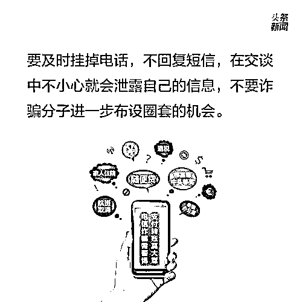

# 最新统计：2021 上半年网络诈骗十大高发骗术!

> 原文：[`mp.weixin.qq.com/s?__biz=MzIyMDYwMTk0Mw==&mid=2247514335&idx=4&sn=ce401cdc204cf8a82b63aefedb115f98&chksm=97cb73e7a0bcfaf1124c9ea951742d3289fbecd9a50695e30969de85ed1c1b684ad7a0368fcf&scene=27#wechat_redirect`](http://mp.weixin.qq.com/s?__biz=MzIyMDYwMTk0Mw==&mid=2247514335&idx=4&sn=ce401cdc204cf8a82b63aefedb115f98&chksm=97cb73e7a0bcfaf1124c9ea951742d3289fbecd9a50695e30969de85ed1c1b684ad7a0368fcf&scene=27#wechat_redirect)

根据最新统计，在网络诈骗案中被骗最多的并不是我们日常以为的社会资讯相对缺乏的中老年人，而是高度依赖互联网的 18 至 30 岁的人群，占总受骗人数的 60.7%。总体来说，受骗人群特征是：90 后被骗概率高；中老年人被骗金额高；男性受害者占比超 6 成。 

笔者所在的小区，4 月 21 日一天之内就发现两起网络诈骗：

一起是一名 26 岁的男性租客，接到自称蚂蚁金服客服的电话，以注销贷款为由，被骗 2.1 万元；

另一起是一名 69 岁的男性业主通过炒股 QQ 群内的链接，下载“新华国际”APP，在 APP 内“老师”的带领下买卖彩票，提现时多次被对方以需缴纳保证金为由，共计被骗取 29.18 万元。

同一天，另一个附近的小区，一名 30 岁的男性因为网上裸聊，被诈 6.85 万元。

（以上均为真实案件……看起来果然是男性受骗机率高……）

盘点一下，常见的网络诈骗套路有以下几种：

1、祼聊

常见套路为以祼聊为诱饵，让受害人注册 APP 获取电话号码，通过网络手段获取受害人手机通讯录、通过祼聊获取受害人祼照，以威胁发布祼照要求受害人转账。

祼聊受害人 90%以上是男性……

**此前发布：**

[裸聊？请先看这里！](http://mp.weixin.qq.com/s?__biz=MzIyMDYwMTk0Mw==&mid=2247514151&idx=2&sn=610acbbf87e30e444009fd13780d7f0b&chksm=97cb731fa0bcfa09410a42eb965e3bee51d6c65759ec32f7d6f32e7c4414be2f8e5dfe82cd3e&scene=21#wechat_redirect)

2、杀猪盘

与聊祼相反，杀猪盘针对的更多是女性。电视剧《精英律师》里对杀猪盘有很精确的比喻：

“这些实施诈骗的人，把自己扮演成各种各样的穷书生，专门邂逅那些特别缺爱的后花园小姐，把这些缺爱的后花园小姐称为‘猪’，把建立感情关系叫‘奍猪’，把怎么认识、怎么搭讪、怎么聊天叫‘猪饲料’，把最后实施诈骗叫‘杀猪’，这一整套骗术，就叫‘杀猪盘’。”

图片来源于网络

图片来源于网络

唉，叹息一声，男人容易被身体支配，女人容易被感情支配……

**此前发布：**

**[“杀猪盘”背后触目惊心！诈骗流程大曝光！](http://mp.weixin.qq.com/s?__biz=MzIyMDYwMTk0Mw==&mid=2247513745&idx=1&sn=b7279d964133573392ef0d4049e23140&chksm=97cb7da9a0bcf4bf50cf1d144a0d31b991e412309398aebac0dae989dc5cf30744ab279e197a&scene=21#wechat_redirect)**

3、投资理财、博彩

这种一般是陌生人通过各种平台或者微信群、QQ 群来加好友，在聊天中透露自己通过投资赚了多少钱，还会非常热情地把自己的赚钱截屏给受害人看，甚至还有专门的微信群、QQ 群来套路受害人，当然了，这种群里其他的“老师”、“投资人”都是一个诈骗团伙的骗子在演戏而已。为了诈骗更多钱，这种诈骗套路常常会让受害人尝一点投资赚钱或者中彩的小甜头，等到受害人投入更多钱时，骗子就会消失了，钱也被骗走拿不回来了。

记住：天上不会掉馅饼，掉陷阱倒是有可能的。

**此前发布：**

**[网络博彩，这名来自缅甸北部的“杀猪盘”骗子想对你说...](http://mp.weixin.qq.com/s?__biz=MzIyMDYwMTk0Mw==&mid=2247511326&idx=3&sn=097ca94d5a2385fa1c6bfcd2852b9e86&chksm=97cb6626a0bcef3079e9098bc7e7f33bfbff7531d73c86ca1ffad0d5f0c29b296576b280555a&scene=21#wechat_redirect)**

4、虚假征信

有些人可能因为各种原因，出现征信问题，导致不能正常使用支付宝、信用卡等，骗子会以能够变更征信为由，骗取保证金、手续费，甚至引导受害人贷款并骗取贷款款项，让这些借贷人本就捉襟见肘的经济更加雪上加霜。

**此前发布：**

**[先交钱的贷款：一律是诈骗！](http://mp.weixin.qq.com/s?__biz=MzIyMDYwMTk0Mw==&mid=2247510097&idx=5&sn=e18601f6af7605269f6e0f4ccbe4b064&chksm=97cb6369a0bcea7f855169d52d438dd101efab7329d033a2950819b9ab2c9ae0807a0d1e9944&scene=21#wechat_redirect)**

5、刷单、兼职、在家轻松赚钱

首先，刷单本身是违法的，根据《《中华人民共和国反不正当竞争法》，经营者不得对其商品作虚假或者引人误解的商业宣传，欺骗、误导消费者。所以，任何一个遵纪守法的公民，对“刷单赚钱”这件事不论真假都应该严词拒绝。

这一类诈骗通常以“在家动动手指就能赚钱”为诱饵，以“刷单返利”、“微商加盟”、或者其他网络兼职为形式，诱导受害人转帐保证金、投资金等，诈骗对象以退休人员、失业人员居多。要警惕的是，这种可能是诈骗，也可能是涉及非法集资、传销等，千万不要触碰，否则很可能自己也成为违法人员。

**此前发布：**

**[刷单套路到底是怎样的？](http://mp.weixin.qq.com/s?__biz=MzIyMDYwMTk0Mw==&mid=2247513745&idx=2&sn=b282bec01c2578b17ec0c0af6c21cecf&chksm=97cb7da9a0bcf4bfe795c9350c7536c41413b1bf0a87ab0e79d2d079c9ceaa6978f01899a478&scene=21#wechat_redirect)**

6、冒充公、检、法或其他机关单位

骗子打电话给受害人，自称政府机关人员，在报出受害者身份信息后威吓其涉嫌违法（这里谴责一下，现在个人信息泄漏实在是无孔不入，建议国家对这方面的违法一定要严查、严罚！），要求把账户内的钱转到“安全账户”上进行清查；或者也有可能是冒充其他机关单位，比如冒充税务机关以可以退税为由，要求支付保证金或手续费。

要知道，政府机关绝对不会要求你将私人的钱转到什么“安全帐户”或任何公家帐户，只要对方提出“安全帐户”，就一定是骗钱！

**此前发布：**

**[揭秘！诈骗团伙原来是这样！看完再说会不会被骗！](http://mp.weixin.qq.com/s?__biz=MzIyMDYwMTk0Mw==&mid=2247506023&idx=3&sn=5fe74f19e1aff2892c2346fcfc290f8e&chksm=97cb135fa0bc9a4931dc1fc7dab398c265623a79f3258d5082cb94b8b440c5fb476e88a33ee8&scene=21#wechat_redirect)**

7、冒充亲友、领导要求借钱或转账

盗取他人的微信号、QQ 号，获取通讯录，冒充亲友借钱、或者冒充领导让你转账。碰到这种，要第一时间电话和本人联系确认。

我的一个朋友在公司任总经理，她的 QQ 就被盗过，骗子用她的 QQ 让她公司的财务经理转账 200 万到某帐户。好在这位财务经理比较谨慎，立刻打电话给她确认，没有造成公司财务损失。

类似的另一种情况是骗子发来短信：“本人 QQ 号自即日起使用********（号码），原 QQ 号已注销，请加新号谢谢”，等你加了新号，号码的那一面就是骗子了。这种也要第一时间和对方联系确认。

**此前发布：**

**[一男子被领导骗走 20 多万，牵出 8 人洗钱团伙！](http://mp.weixin.qq.com/s?__biz=MzIyMDYwMTk0Mw==&mid=2247511326&idx=4&sn=a5f9b336fe5bb79b2bd62c43d4bcc317&chksm=97cb6626a0bcef307863905634b2a61cdc04b635a2efd990d75abcf63f73fc05e0e0b4c4f50e&scene=21#wechat_redirect)**

8、亲友、领导遇险

这种诈骗和前一种类似，不同之处是骗子不是冒充亲友或者领导本人，而是冒充公安、医院、路人，以亲友生急病、遇车祸等理由让你应急转钱。特别是关系非常亲近的直系亲属，往往可能因为过于关心而失去理智，受骗失财。

**此前发布：**

**[诈骗分子为何屡屡得逞？带您破解诈骗套路！](http://mp.weixin.qq.com/s?__biz=MzIyMDYwMTk0Mw==&mid=2247513871&idx=2&sn=f29d42de8bf8b48b3979d94f733ca381&chksm=97cb7c37a0bcf521b4b812052cac7647853fd9ce0c871581b5ea51a6a9565e371ab8393df41e&scene=21#wechat_redirect)**

9、购物退款

这种购物退款类的诈骗往往也涉及个人信息泄漏，因为你的消费信息是真实的，所以很容易信以为真。骗子以受害人购买的商品有质量问题、或者购买的旅游行程、机票取消为由，声称要给受害人退款，但是要求受害人先往指定帐户转一笔保证金以确认身份。

记住：如果是真实退货退款，一般都是原路退回的，支付宝付的就退回支付宝，银行卡付的就退回银行卡，不存在需要你自证身份。

**此前发布：**

**[电信网络诈骗，就在你身边！](http://mp.weixin.qq.com/s?__biz=MzIyMDYwMTk0Mw==&mid=2247502750&idx=4&sn=779f82355db62ad3312ddeb0e246e965&chksm=97cb00a6a0bc89b05f690084badac6509185a5ff916c539a8f0c622dc77a88a6cf36ff560af2&scene=21#wechat_redirect)**

10、网上勾搭、线下诈骗

过于无聊，加陌生人、加附近的人聊天，出去约会，然后被带到酒吧、咖啡馆、旅馆，引诱高额消费、或者上演捉奸拍照的戏码……

空虚无聊、情趣低下，不是自作自受是什么呢！

**此前发布：**

**[“我”在相亲网站掉进屠宰场，丢了 38.8 亿元！](http://mp.weixin.qq.com/s?__biz=MzIyMDYwMTk0Mw==&mid=2247500231&idx=1&sn=27c7495cfb3ac6657deb3015742e0c06&chksm=97cb0affa0bc83e9c1e7b624be15b5b71aa936cbc2908be68550dc321c81270e0b2b757d3606&scene=21#wechat_redirect)**

**防骗提醒：**

来源：天天防诈骗，每日防骗资讯

← 向右滑动与灰产圈互动交流 →

