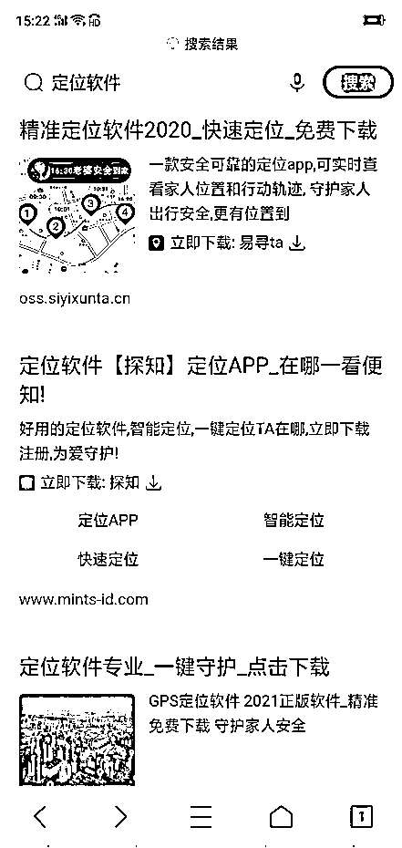
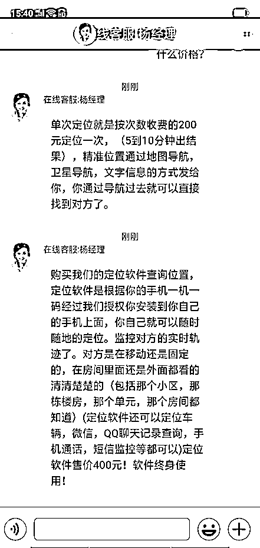
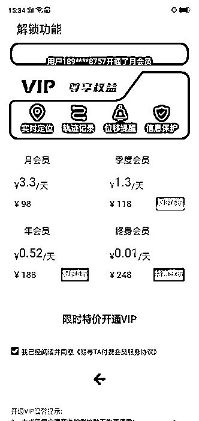

# 提供手机号就能查手机定位？别再上当了

> 原文：[`mp.weixin.qq.com/s?__biz=MzIyMDYwMTk0Mw==&mid=2247514335&idx=5&sn=55c507c692c13d35da3409781679cdfc&chksm=97cb73e7a0bcfaf1faac077d7f8df1b1d3c635bc5a0c7a39b435f411b823469d7b0ed4ea683d&scene=27#wechat_redirect`](http://mp.weixin.qq.com/s?__biz=MzIyMDYwMTk0Mw==&mid=2247514335&idx=5&sn=55c507c692c13d35da3409781679cdfc&chksm=97cb73e7a0bcfaf1faac077d7f8df1b1d3c635bc5a0c7a39b435f411b823469d7b0ed4ea683d&scene=27#wechat_redirect)

亲人走失无处找寻、债户跑路不知所踪、夫妻吵架离家出走……当你在现实生活中的遇到这些情形，是不是想立刻找到对方？有需求就有市场，这不，网上就有人宣称：提供手机号码就能定位追踪。这究竟是高科技服务，还是网络新骗局？ 

毋庸置疑，骗局！骗子以“提供定位软件服务”为饵，诱人转账或购买相关服务，最近一个月江苏已有多人被骗！5 月 9 日，江苏省公安厅反通讯网络诈骗中心就此发出防范提示。

5 月初，家住徐州的程先生不慎将手机遗失，他急着想找回手机，就上网搜索有没有办法能定位到自己手机现在的位置。不搜不知道，一搜“惊喜连连”，还真有办法！

程先生在网上搜到一条“黑客”信息，对方称只需提供手机号就可定位，他立即添加对方的ＱＱ后。对方称，需要程先生先缴纳服务费、押金。一心想找回手机的程先生并未觉得不妥，反而觉得有偿服务才靠谱，于是先后向“黑客”转款共计 13900 元。转完再联系对方时，消息却石沉大海，程先生这才发现上当，结果不但手机没找回，反而遭受更大的损失，于是到当地派出所报警。 

就在程先生被骗的前几天，苏州李先生和昆山熊女士也分别到当地派出所报警，称自己遭遇了诈骗。他们的遭遇跟程先生类似，也是想定位一部手机的位置，自己在网上找了一个自称可以提供“定位软件”的客服，加了对方微信并按要求支付了少额软件费、激活费后，客服发来一个二维码，让他们扫描二维码下载 APP。

然而，想真正使用这个软件可没那么容易。苏州李先生和昆山熊女士下载 APP 后，客服又让他们交注册费、服务器包月费等。只想赶紧拿到定位信息的这两人，又在微信群分别向对方发了 4780 元、4964 元红包，然而还是无法定位。就在对方继续以各种理由让李先生和熊女生转账时，他们才发现不对劲，要求对方退钱，对方却消失不见了。 

目前，上述案件皆在进一步侦办中。

**警方提示:**

定位骗局套路一般是这样的：让你下载某某 APP，或者进入某个网址页面，声称输入你想要定位的人的电话号码，就可以定位了，实际操作时却用各种理由骗你交钱，等你交费了也按照要求操作了，却依然不能成功定位。对于这些抱着侥幸心理、想定位手机的人，江苏警方郑重提醒：

1、“定位软件”的广告与服务不可信，寻人也要采取合法合理的方式，不要相信网上没有可靠来源的虚假信息，否则很可能会落入不法分子的陷阱。

2、定位是假，骗钱是真！网上所谓的“手机定位”是诈骗分子的陷阱，不要轻信。同理，“车辆定位”也是一场骗局。

3、手机号码、微信账号、家庭住址、位置轨迹均属于个人信息，非法查询、获取他人行踪涉嫌侵犯公民个人信息，系违法犯罪行为。

来源：江苏警方，利箭在出击

← 向右滑动与灰产圈互动交流 →

