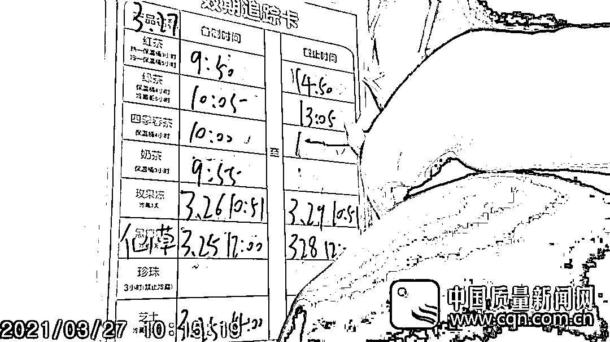

# 篡改日期、用隔夜食材、徒手抓珍珠…网红奶茶店翻车！很多湖南人也喝过

> 原文：[`mp.weixin.qq.com/s?__biz=MzIyMDYwMTk0Mw==&mid=2247514335&idx=6&sn=15e0ddad934002fa6961ec9aef0681c6&chksm=97cb73e7a0bcfaf177704a4c1496d0b46a3955e74a7b0072956113f896b6a7a058e84b4f3bd4&scene=27#wechat_redirect`](http://mp.weixin.qq.com/s?__biz=MzIyMDYwMTk0Mw==&mid=2247514335&idx=6&sn=15e0ddad934002fa6961ec9aef0681c6&chksm=97cb73e7a0bcfaf177704a4c1496d0b46a3955e74a7b0072956113f896b6a7a058e84b4f3bd4&scene=27#wechat_redirect)

随着天气逐渐转热
喝上一杯清爽的奶茶成为当下不少年轻人的时尚消暑选择然而近日不少消费者喜爱的网红品牌“蜜雪冰城”被曝出多项食品安全问题**蜜雪冰城被曝篡改食材日期**********近日，中国质量新闻网在实地调查过程中发现，蜜雪冰城个别门店存在篡改开封食材日期标签，随意更改或不记录食材“效期追踪卡”备制截止时间，违规使用隔夜冰淇淋奶浆、茶汤、奶茶等食材，柠檬表皮不清洗等卫生问题和食品安全隐患。纯牛奶、红豆罐头、燕麦罐头等是蜜雪冰城常见食材。按规定，开封后的食材应冷藏保存，并在规定时间内使用；但在“蜜雪冰城”郑州永安街店（编号：904365），**员工篡改开封纯牛奶、红豆罐头、燕麦罐头等食材的日期标签。******************另外，调查发现，该店店员还存在更改“效期追踪卡”（食材的备制时间和截止时间）的情况。****************按公司规定，门店的红茶、绿茶、四季春茶、奶茶、玫果冻、珍珠等半成品食材，从备制时间起均有规定的赏味期，过了时间应该“废弃换新”。********但在郑州永安街店店长坦言：“如果过了效期就倒掉的话，那得扔多少，谁愿意呀，及时更改时间就行了，如果气味和颜色有变化就真的不能用了，没变就可以用，过效期的还可以延用半天至一天，（改时间）也方便公司的检查。”********调查人员还发现，在蜜雪冰城济南大观园店，店里张贴的“效期追踪卡”长时间未经修改。店员表示，这是早先写的，一直没改。**********隔夜冰淇淋奶浆、茶汤、奶茶仍使用************************中国质量新闻网调查发现，在蜜雪冰城济南大观园店、武汉马湖商业街店存在使用过夜冰淇淋奶浆、切片柠檬、奶茶的现象。************在济南大观园店，店员连续多日使用过夜的冰淇淋奶浆、奶茶。对此，店员表示，备制好的奶浆、奶茶、绿茶、红茶、四季春茶等按照规定都不能过夜，但为了省钱，**一般过夜的都不会倒掉。**************************济南大观园店店员将前一天剩下的奶茶倒入新制作的奶茶中************************济南大观园店店员将新的奶昔粉掺入已过夜的奶浆中进行制作************在武汉马湖商业街店存在同样的问题。************************蜜雪冰城公司规定的物料储存标准************除了使用隔夜冰淇淋奶浆、奶茶等材料，蜜雪冰城多个门店还存在柠檬表皮不清洗，**徒手抓柠檬片，使用过夜切片柠檬、橙子，徒手抓珍珠放入锅中**，在没有盖子的垃圾桶旁边加工奶茶等现象。************值得注意的是，蜜雪冰城公司规定禁止切片鲜果叠杯，**但上述门店均存在切片水果叠杯的现象**。************************蜜雪冰城道歉：涉事门店停业整顿************************5 月 15 日，蜜雪冰城通过官方微博发布致歉声明称，已责令涉事门店停业整顿，相关话题登上热搜第一。************************声明称，此次事件发生后，公司积极配合各级政府的监督检查，并第一时间成立以总经理牵头的专项处理小组，**针对门店存在的严重违规行为进行调查整改。**************************5 月 15 日，蜜雪冰城通过官方微博发布致歉声明************“针对媒体报道中的涉事门店，**我们现已责令其停业整顿**。并按照相关法律规定以及我司《特许经营合同》中的相关约定，对涉事门店作出相应的处理，处理结果我们会另行通报。”声明说。************年内或冲刺上市******************

******公开资料显示，蜜雪冰城总部位于郑州，产品包括奶茶、果茶、冰淇淋等品类，其中不乏冰鲜柠檬水、摩天脆脆冰淇淋、摇摇奶昔、满杯百香果等畅销爆品。蜜雪冰城主打下沉市场，产品价格多在 10 元以下，目标用户为以大学生为代表的年轻消费群体，门店主要开设大学周边、步行街、商场周边等。******

******启信宝资料显示，蜜雪冰城股份有限公司成立于 2008 年 4 月，注册资本约 1.13 亿人民币，法定代表人为创始人兼公司董事长张红超，其持股 48.5%，为公司实际控制人；公司总经理张红甫持股同为 48.5%，与张红超同为公司最终受益人。******

******凭借着“低价策略”，平均客单价在 8 元左右蜜雪冰城受到消费者基数最大的下沉市场的欢迎，并在奶茶界迅速崛起，与近年来大热的喜茶、奈雪等新式茶饮相比，蜜雪冰城售价仅为前两者的三分之一。******

******据财联社，资料显示，蜜雪冰城目前门店数量已经接近 1.5 万家，预计年底将达到 2 万家。据媒体此前报道，2019 年，蜜雪冰城拥有约 7500 家门店，营收近 65 亿元。如以此推算，目前开店近 1.5 万的蜜雪冰城营收或已破百亿。******

******2021 年年初，《晚点 LatePost》报道称，新茶饮品牌蜜雪冰城持续三个多月的首轮融资完成，由龙珠资本、高瓴资本联合领投，双方各自投了 10 亿元。融资完成后，蜜雪冰城估值超过 200 亿元人民币。据了解，蜜雪冰城计划在 A 股上市，上市的筹备已到最后阶段，交表已经在倒计时中，预计年内完成上市流程。另据 36 氪，此轮融资或为蜜雪冰城 IPO 之前最后一轮融资。******

******中国食品产业分析师朱丹蓬指出曾指出，以长沙为例，蜜雪冰城的员工工资比茶颜悦色、喜茶或者其他的茶饮品牌要低 20%甚至 30%，“员工整体素养偏低造成整个运营风险增加”。******

******湖南也有多家“蜜雪冰城”************大家觉得怎么样？******

****来源：红网、新闻晨报、中国质量新闻网、澎湃新闻、每日经济新闻****

****************

****← 向右滑动与灰产圈互动交流 →****

********