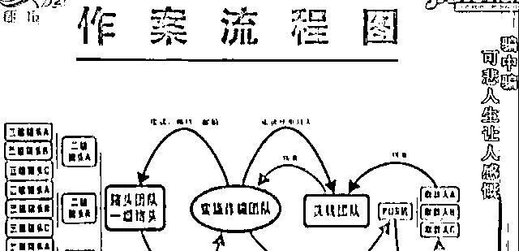

# 男子诈骗了四千多万，自己却只留下几十万，资金流向让人啼笑皆非

> 原文：[`mp.weixin.qq.com/s?__biz=MzIyMDYwMTk0Mw==&mid=2247514335&idx=7&sn=be80c4a7f580412f6a3cee13c69125da&chksm=97cb73e7a0bcfaf1d45a88b6a63443176eb4b5a9a8b8a751c6583fc41de0f2ba46cc1fb66b01&scene=27#wechat_redirect`](http://mp.weixin.qq.com/s?__biz=MzIyMDYwMTk0Mw==&mid=2247514335&idx=7&sn=be80c4a7f580412f6a3cee13c69125da&chksm=97cb73e7a0bcfaf1d45a88b6a63443176eb4b5a9a8b8a751c6583fc41de0f2ba46cc1fb66b01&scene=27#wechat_redirect)

不久前在公安部浙江省公安厅的指挥下，杭州警方经过缜密侦查，一举侦破了被骗群众多达五万多人，犯罪嫌疑人资金流水超过四千万元的诈骗大案。在破案之后，警方对没有主动报案的受害人上门取证，却意外地遭遇到了阻力。那么这究竟是一个什么样的骗局？受害人又为何如此执迷不悟呢？ 

民警要找的这位受害人总共被犯罪嫌疑人诈骗了一万余元，可是明明就在室内，他却不肯给民警开门。这位受害人的表现在这起案件中非常典型，犯罪团伙不仅骗走了他们的钱财，还牢牢控制着他们的思想。随后记者继续跟随办案民警前往其他受害人的家中，然而整整一下午的时间里，没有一位受害人肯配合警方取证。

更令人吃惊的是这是一个受害人多达五万多人的骗局，人员几乎分布于全国各个省市。在抓获犯罪嫌疑人之后，民警发现该涉嫌诈骗团伙在诈骗钱财的同时，还对受害人进行洗脑。居住在杭州市临安区的王阿姨今年六十八岁，平时没事时喜欢用手机聊天。两年前弟媳妇马某忽然把她拉进了一个名为中华爱心基金会的微信群，就是在这微信群里，黄阿姨一步一步地陷入诈骗团伙所涉的骗局里。

黄阿姨回忆刚进群的几天她每天都会和群友在群里聊天儿，而群里每天也都会有所谓基金会的领导给他们开会讲话。在这个微信群里所谓的领导声称福报都是国家秘密发放的一些扶贫的款项，特别是还有许多针对她这样的老年人的养老款项，而她只需要交十块钱的报单费就可以获得国家秘密发给她的十万元。这听起来十分的不可思议，但随后微信群里就展示了几份让受害人瞠目结舌的文件，上面盖着所谓政府的印章，王阿姨开始有点相信起来。

在这个群里嫌疑人方某平声称他被授权参与解冻高达数万亿元的海外资产，对于这套说辞，王阿姨起初也觉得十分的荒唐滑稽。然而加入微信群一段时间以后，他在群里各种消息的轰炸之下，在不知不觉中被洗脑了。没过多久，所谓的会长方某平在微信群里又推出了新的项目，声称有的项目可以得到五百万，而有的人则是可以得到一套房子之类的。虽然并没有得到任何的回报，但这时的王阿姨却如同着了魔，死心塌地地相信自己肯定能得到高额回报。她陆续参加了几个项目，而手续费也从十一元一直加到了几千元，直到警方找到王阿姨，她方才如梦初醒。那么看似拙劣的骗术，受害人为何会趋之若鹜呢？

通过侦查杭州警方摸清了这个团伙的组织结构和团伙成员，以方某平为首，他自称会长，下设了六个层级。方某平在群里发布了一套类似非法传销组织的管理办法，他们给每个层级都承诺了不同的收益比例，积极的发声，积极的拉会员就会得到更多的回报。在这套类似于传销的机制的刺激下，许多处在底层的会员就利用各种方式拉人头，希望获得更高的收入。正是如此，在短短一年时间里，受害人就急剧膨胀超过五万多人。

另一方面方某平冒用中华爱心基金会的名义，给微信群起名为中华爱心基金会，并谎称自己是总会长，同时还不忘把自己进行了一番包装，自己虚构的是说自己是名牌大学法律学系毕业的，对法律很专业。除此之外他们还在群里公开展示伪造的批文和文件，许多成员看到这些伪造文件之后都信以为真。

一年期间方某平总共诈骗四千多万元，然而让人大跌眼镜的是方某平等嫌疑人骗来的钱，他们只花销了几十万元，绝大部分流向了别处，案件背后还藏着另一伙犯罪嫌疑人。警方顺线追查，发现这伙犯罪嫌疑人来自广西凌源，他们不仅为方某平虚构了民族资产解冻的骗局，同时还把方某平诈骗来的赃款绝大部分收入囊中。

而方某平就是这批诈骗团伙口中的“猪头”，为了让方某平相信，这伙人中有人冒充了所谓民国老人李天龙，按照出生日期来算，竟然已经有一百三十多岁。可笑的是，此人还专门给方某平打电话，经常和他短信聊天儿，更是自称有好几百亿的资金，也没有什么子女，想认方志平作为干儿子来继承这笔遗产。就这样这些称呼他为猪头的人，在方某平这里却成了干爸爸，每笔诈骗得来的钱，方某平都要及时孝敬给干爸。

更让人哭笑不得的是发短信把方某平当作猪头的不止这一个团伙，当一伙人对方某平成功地割猪之后，就会将他的信息卖给另一个团伙。然后新的团伙又编造一个民国老人或海外大员，给方某平打电话再次割猪。最终在各地警方的紧密配合下，这条复杂而且完整的犯罪链条终于浮出水面，按照专案组的统一部署，这一链条当中与方某平案有关的近五十个犯罪嫌疑人均被抓获。

来源：浙江公安

← 向右滑动与灰产圈互动交流 →

