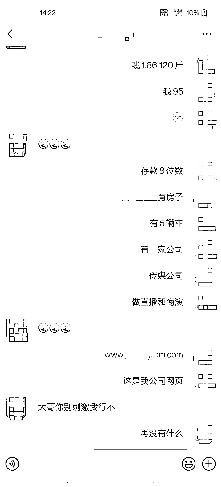

# 开顶级豪车住豪宅？南宁这个“富二代”专门骗取女性钱财

> 原文：[`mp.weixin.qq.com/s?__biz=MzIyMDYwMTk0Mw==&mid=2247514335&idx=8&sn=acf24c2fea9d0b88e0f7c161fa2cdfef&chksm=97cb73e7a0bcfaf14d946087e6efa62c761ee296aebc9a0d68e024ccde25c2725dbbe3f49d4a&scene=27#wechat_redirect`](http://mp.weixin.qq.com/s?__biz=MzIyMDYwMTk0Mw==&mid=2247514335&idx=8&sn=acf24c2fea9d0b88e0f7c161fa2cdfef&chksm=97cb73e7a0bcfaf14d946087e6efa62c761ee296aebc9a0d68e024ccde25c2725dbbe3f49d4a&scene=27#wechat_redirect)

（5 月 14 日），南宁市西乡塘警方通报一起交友诈骗案，抓获涉案的嫌疑人金某。经查，嫌疑人金某在 2018 年至今，骗取多名女性共计几十万元人民币。 

男朋友是“富二代”

还有特殊渠道能解决征信问题？

受害人小黄说，**她的男朋友是一名网络主播，今年 3 月份两人在某网络社交平台认识。两人交往期间，男朋友金某除了经常在网上晒出自己的豪车、名牌手表和包包之外，还给小黄看自己手机银行转账记录，每一笔都是大额数目，男朋友金某说，这些钱都是帮助朋友渡过难关的。**

小黄有个生活习惯，经常会使用自己的借呗和花呗。金某见状后表示，**可以用自己的公司通过特殊的渠道帮助小黄处理她的征信问题，**既可以保证日常消费，又可以提高个人的征信度，保障自己的征信不受影响。

于是，小黄把自己的个人信息给了金某。可令小黄意外的是，**金某借用小黄的信息在网贷平台贷出了 7 万 5 千元人民币，并转到了金某自己的账户里。**

小黄追问，可金某一直缄口不言。十几天过去了，金某一直以各种理由推脱。感觉自己可能是被骗了，小黄来到南宁明秀派出所报案，向警方寻求帮助。

数十人被骗，涉案金额 60 万

接到报案后，南宁市公安局西乡塘分局明秀派出所的办案民警立即对案件展开侦查。民警调查后发现，**这是一起把自己伪装成“富二代”专门骗取单身女性的系列诈骗案。**

截至目前，**南宁市区的受害人有数十人，涉案金额达到 60 万元左右。**今年 5 月，民警在南宁市教育路某酒店将金某抓获。

到案后，嫌疑人金某交代，他在网络社交平台的注册资料中，**上传了大量豪宅、跑车、名牌包包的照片，自称在自己是一名网络主播，有大量的粉丝，将自己伪装成“富二代”，以此吸引受害者上钩。**金某诈骗所得的钱财全部用于奢侈消费，购买奢侈品包装自己。

而除了去年自己用诈骗所得的钱买了一台二手的奥迪 A7 之外，**其他所谓的豪车和豪宅，都是网络图片。**

警惕杀猪盘！

**“杀猪盘”离你我并不遥远**

↓↓ 

**第 1 步**

** 寻找素材，包装身份 **

首先这种诈骗团伙里每个一线的“员工”都要建立自己新的身份，也就是人设。一般来说，男的就假装高富帅，阳光帅气，有豪车，爱健身；女的则假装是经营美容店失败的个体户，年轻貌美、命途多舛，容易博取同情。 

人设的建立需要大量的视频和照片素材，为此，犯罪团伙也做了大量的搜集、积累。此外，很多“员工”包装身份用的是同一套视频和图片素材，仅仅是换一下名字而已，“员工”之间也经常进行素材交流。

** 第 2 步 **

** 广泛撒网，猛加好友 **

包装完自己的“人设”后，这些团伙成员就开始大规模地在陌陌、抖音、婚恋交友等平台上添加好友。通过日常点赞、温馨问候、询问问题、挑逗搭讪等手段，让这些“客户”添加自己的微信。 

一般来说，女“员工”就添加男客户，男“员工”就添加女客户，分工明确。

** 第 3 步 ** 

** 培养感情，发展网恋 **

加完好友，最最重要的事情就是建立感情。按照剧本的流程，刚添加完好友，不可操之过急，只能蜻蜓点水般地进行日常问候，几天之后才开始往网恋方向去走。 

通过一来二去的嘘寒问暖以及情感问题上的“敞露心扉”，有些客户慢慢就中了这样的感情炮弹。

** 第 4 步 **

** 拉向深渊，投资诈骗 **

感情建立起来之后，员工就开始有意无意地将话题向所谓“赚钱”的路子上引，慢慢把裹藏在甜蜜炮弹里面的深渊揭开。

他们先是跟客户说自己平时在做资金盘的投资，并且通过各种手段（网站漏洞）可以稳赚。然后就引导客户小试牛刀，第一次或者第二次会真的返现给客户，让客户尝到一些甜头，随后怂恿客户追加投资。

到了这个时候，不管理财网站上的账户是否有盈利，客服都会以账户异常、平台异常等借口不让提现，有的时候骗够了钱，甚至会关停网站。就这样，“杀猪盘”里的“猪”，被杀得血本无归，甚至背负巨债。

网上交友涉及金钱往来的 

一定要注意多提防多查证

来源：930 老友记

← 向右滑动与灰产圈互动交流 →

