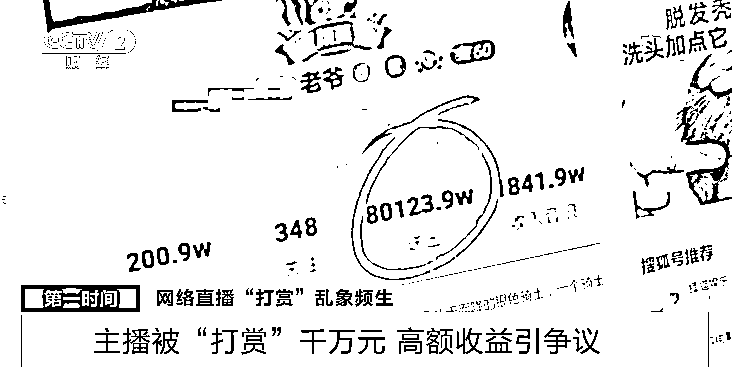
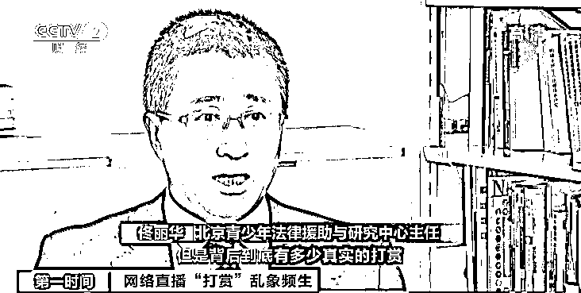

# 主播这么赚钱？一个礼物 1 万元，一场就收 30 个！一名粉丝送礼 8000 万！凭什么？

> 原文：[`mp.weixin.qq.com/s?__biz=MzIyMDYwMTk0Mw==&mid=2247514377&idx=2&sn=ad14e696fa24b02dfb64ecbf375bd1dd&chksm=97cb7231a0bcfb278e23d3b7bafad0385c5e43aff8b5edd8bccb4f1ac7621f6201d76508b3fa&scene=27#wechat_redirect`](http://mp.weixin.qq.com/s?__biz=MzIyMDYwMTk0Mw==&mid=2247514377&idx=2&sn=ad14e696fa24b02dfb64ecbf375bd1dd&chksm=97cb7231a0bcfb278e23d3b7bafad0385c5e43aff8b5edd8bccb4f1ac7621f6201d76508b3fa&scene=27#wechat_redirect)

近年来，随着越来越多的用户在网络直播平台分享生活、展示才艺、展开社交活动，网络直播平台的关注度也越来越高。但随之也暴露出不良表演、宣扬一夜暴富等问题。

最近，一篇描写某网络主播在短时间获得网友千万元打赏的文章流传，靠“打赏”致富引发争议。对此记者展开了调查。

主播被“打赏”千万元 高额收益引争议

某平台上某网络主播直播时，有观看者不断向她赠送虚拟礼物。**一个叫“至尊守护”的礼物折合人民币 1 万元，在一次直播中，该主播就收到了 30 个，总价值 30 万元。**

****

**不久前，一篇讲述该主播短时间获得千万元“打赏”的文章在网络热传，说到她**几年来共直播 600 多场，累计获得虚拟礼物折合人民币达 3000 万元。**自媒体提到的“打赏”，是指观众通过直播平台购买虚拟货币，再兑换成虚拟礼物赠送给主播。直播平台会折算“打赏”礼物的价值，并与主播分成。这是他们重要的收入来源。** 

****

**为了获得“打赏”，主播会想办法让粉丝“刷礼物”。这是某主播和另一名网络主播进行的网络擂台 PK 游戏，规则是比较两方粉丝在规定时间内赠送礼物的多少，输的人要接受游戏惩罚。一些粉丝为支持喜欢的网络主播，不断赠送礼物。在该网络平台上，**标价最高的是 66666 抖币的“至尊礼炮”，折合人民币 9523 元。****

********

****近几年，一些自媒体不断炒作这名网络女主播“最多一天赚 500 多万人民币”等有关巨额打赏的信息。在给她打赏的人员中，**一个名叫“老爷”的账号送出的礼物超过 8000 万人民币。**正当大家议论此人的真实身份时，该账号悄悄修改了网名，在网络销声匿迹。****

********

****虽然“巨额打赏获利”的真实性有待核实，但用这种“套路”吸引网友“打赏”牟利的行为和宣传频频在网络出现，冲击着社会心理。****

********

******网友**：过高的这种金额，可能会在社会上引起虚荣、攀比的风气。**** 

********

******网友**：一些主播赚打赏的方式比较极端，使用了一些言语上的 PUA（情感操控），甚至是谄媚的方式，这样的行为对消费者实际是不尊重的。**** 

********

******北京青少年法律援助与研究中心主任 佟丽华**：网上说几千万甚至上亿的打赏，但是背后到底有多少真实的打赏，这个信息是完全不准确的。在整个社会尤其在未成年人当中营造一种不劳而获、一夜暴富的虚假现象，对于整个未成年人的人生观的形成是非常有害的。**** 

****虚假手段炒作“网红” 诱导网民消费************

****记者在调查中发现，**有的网络主播和平台会用一些虚假手段获取“打赏”，比如找“托”冒充粉丝、伪造主播人气流量数据等**，诱导不知情的网民跟风消费。**** 

****“95 后”网络主播小王告诉记者，一些主播通过连麦 PK 刺激粉丝打赏的行为被叫做“骗票”，之所以叫做“骗”，是因为其中存在大量套路。比如运营团队会假扮粉丝刷礼物，营造紧张气氛，进而骗取网友跟风打赏。****

********

******网络主播行业知情人士 小王**：就是有运营团队，其实都是跟公司内部的人连线，然后假装不认识，做 PK。我在某直播平台上有好几个朋友，粉丝基本上都四五百万，**他们有时候开直播，我们也凑个热闹给刷点礼物，活跃活跃人气。******

****为提高主播热度，吸引观众，直播数据也会造假。在团队操作下，实时在线人数只需要后台改一下设置，就能把累计时间段内的全部流量都算进去。**此外还有“倍数化”操作，可使呈现人数是真实数据的 1000 倍甚至更多，以此提高主播价码，抬升粉丝刷礼物的心理价位。******

****多家网络平台存在性暗示等低俗现象************

****为了增加打赏金额，**还****有一些主播靠暴露的穿着、低俗的言语、承诺送礼物“给福利”等方式吸引用户，甚至用性暗示、软色情的方式诱惑“打赏”**，导致不良信息存在于网络直播平台之中。****

****在某直播平台上，记者随机进入其推荐的所谓“热门”版块，发现里面就含有性暗示、诱导用户打赏的直播。****

********

****网络主播衣着暴露、污言秽语，目的只有一个——让网友充值打赏。****

****有的主播并不露脸，而是将镜头一直对准身体的某一部位，有的则通过所谓的运动展示、游戏解说等方式，用暴露的衣着诱导用户浏览，进而成为所谓的“粉丝”。****

****有网络直播经历的小王表示，这类的“软色情”是网络直播获得打赏的快捷途径。****

********

****为追求收益最大化，网络主播们通过言语和肢体诱导网友关注。记者通过调查发现，如此的套路俨然已经成为一种行业规则，出现在许多网络直播平台中。****

********

******某网络直播经纪公司负责人 李先生**：我们不称之为不雅，都这样。**** 

********

******中国社会科学院社会发展战略研究院研究员 田丰**：很多的平台是和 MCN 机构是有签约的，然后 MCN 机构会选择可能能带来潜在巨大流量和打赏数额的这些主播。至于主播怎么播，平台和 MCN 机构之间可能往往是有一种默契和妥协，会让主播有一些打擦边球的行为。因为他们的目标很简单，就是带来流量和打赏金额。**** 

****据统计：自 2018 年至今，网络直播软件数量持续上升，目前仅苹果系统中的网络直播软件就超过 240 个。****

********

****记者在手机应用商店搜索“直播”二字，会看到其弹出大量应用软件推荐，“深夜美女”“私人视频”“风味撩人”…这些带有性暗示的字样直接被列入应用软件的名称，更有甚者直接打出“倮聊”的字样，诱导用户下载使用。****

****“打赏”乱象误导青少年 助长不良社会风气************

****针对网络直播存在的种种问题，专家表示，网络直播“打赏”的影响范围逐渐扩大，使一些未成年人误入歧途，影响青少年的价值观。这种金钱至上、攀比打赏的现象，容易助长社会不良风气。****

********

****记者调查发现，多家网络平台存在大量在校大学生主播。有的女生衣着暴露、卖笑撒娇“求打赏”，有的大学生在宿舍“组团”直播。**** 

********

****中国社会科学院青少年与社会问题研究室在对网络直播产业生态的调研中发现，**大量在校大学生对成为主播有强烈向往。**自媒体在网络炒作“主播获天价打赏”“主播成为致富捷径”等信息，使一些青年大学生形成靠卖笑撒娇就能赚钱的“畸形”致富观。****

********

******网友**：“网红致富”这件事情是挺不可思议的，这容易使当代的青年学生认为去做个网红比现在辛苦读书将来赚得多。**** 

****青少年认识能力弱、自控能力低，无法抵制主播“要打赏”“求打赏”的诱导，在自己虚荣心和攀比心的驱动下，对主播毫不吝啬地打赏。****

********

****不久前，**江苏南通一位 15 岁男孩，将外公外婆辛苦积攒的 8 万元治病钱，全部打赏给某网络平台主播，其中某一天的单笔充值金额就达到 1 万元。******

********

****近几年，**为打赏主播用掉积蓄，甚至挪用公款走向违法犯罪的例子时常出现。**《亡夫打赏主播 250 余万元》《贫困生贷款十几万打赏主播》《90 后男出纳挪用公款 4826 万 一年打赏主播 2000 万》，这些报道触目惊心。****

********

****为维系与主播的联系，部分网民不惜超出自己的财物能力“打赏”，给家庭或社会造成负面影响。****

********

******中国传媒大学教授 北京市网络法学研究会副会长 王四新**：宣扬一夜暴富，它对于青少年的价值观和人生观的冲击是非常大的，导致产生“通过这种方式可以暴富的话，我还去 10 年苦读干什么”的想法。**如果我们的直播或者说互联网不良内容，把未成年人的想法给带偏了，价值观给颠覆了，那将来家庭要承担这个后果，社会要承担这个后果，国家也是要承担这个后果。******

******齐抓共管 “打赏”乱象亟待系统整治******************

******互联网不是法外之地，网络直播不容胡作非为。让网络空间更清朗，让青少年拥有健康的互联网世界，对网络直播行业乱象必须“零容忍”，不能放纵。****** 

******这需要主管部门重拳出击，发起网络直播行业专项整治和规范管理行动。整治直播乱象，关键是规范直播行为，这就必须给网络直播平台、网络直播主播画底线、立规矩。******

******对违反底线者，要依法严惩，提高违法成本，遏制网络直播乱象。此外，还应畅通举报机制，发动公众，引导和奖励用户积极举报，让违法违规直播无处遁形。******

******来源：央视财经******

************

******← 向右滑动与灰产圈互动交流 →******

************