# “高富帅”嘘寒问暖式“杀猪盘”骗局！16 万变 100 万，却一分钱也拿不到...

> 原文：[`mp.weixin.qq.com/s?__biz=MzIyMDYwMTk0Mw==&mid=2247514377&idx=4&sn=1b656d0e758094cc21e4a70cbb89e190&chksm=97cb7231a0bcfb273233b8bcf02f3534ff27456c65b776519fc6e420f87b6643fb7a957eea32&scene=27#wechat_redirect`](http://mp.weixin.qq.com/s?__biz=MzIyMDYwMTk0Mw==&mid=2247514377&idx=4&sn=1b656d0e758094cc21e4a70cbb89e190&chksm=97cb7231a0bcfb273233b8bcf02f3534ff27456c65b776519fc6e420f87b6643fb7a957eea32&scene=27#wechat_redirect)

前不久，中宣部、公安部在北京联合启动了“全社会反诈总动员”全国反诈防诈系列宣传活动，引发广泛反响。电信诈骗犯罪是随着通信、互联网等技术发展而衍生出来的严重危害社会的行为，变着花样的诈骗方式令人防不胜防。

‍‍‍‍‍‍‍‍‍‍‍‍‍‍‍‍‍‍‍‍‍‍‍16 万变 100 万，哪知竟是诈骗陷阱‍‍‍‍‍‍‍‍‍‍‍‍‍‍‍‍‍‍‍‍‍‍

[`mp.weixin.qq.com/mp/readtemplate?t=pages/video_player_tmpl&action=mpvideo&auto=0&vid=wxv_1873330994972262404`](https://mp.weixin.qq.com/mp/readtemplate?t=pages/video_player_tmpl&action=mpvideo&auto=0&vid=wxv_1873330994972262404)

△央视财经《经济半小时》栏目视频 

2019 年年底，浙江湖州的沈女士通过微博认识了一名赵先生。赵先生事业有成、成熟温和，正是心目中标准的男朋友形象。随着两人交往越来越多，赵先生甚至向沈女士谈到了一些生活上的隐私。

  

赵先生说，自己能直接从后台看到赌博公司的中奖号码，让沈女士很是震惊，接下来，**赵先生称要到澳门出差，所以委托沈女士帮着维护几天自己在赌博网站上的账号。没想到充值 10 万元，竟然赚到了 30 万元。**

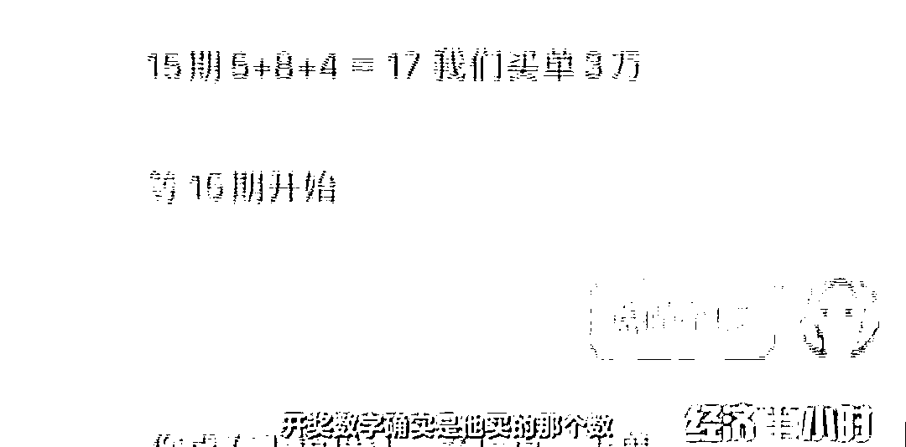   

等赵先生出差归来后，便说可以帮沈女士也开设一个账户。在赵先生的劝说下，沈女士东拼西凑了 16 万元，赵先生又帮他贴补了 4 万，直接充到她的账户里。

 

账户的钱充好以后，赵先生如约带着沈女士投注了三次。短短几分钟，账户里的钱就变成了 100 万，这让沈女士大喜过望，于是决定把本金先提取出来，用赢来的钱继续投注，而此时系统却出现一个新的提示。

  

无奈的沈女士打电话向朋友借钱，但朋友一听她借钱的缘由，不仅不借给她，而且让她马上报警，认为她一定是深陷“杀猪盘”。**所谓的杀猪盘，是指诈骗分子利用网络交友，诱导受害人进行投资、赌博等类型的一种电信诈骗方式。**

犹豫再三，沈女士最终选择了报警。沈女士向警方展示了她投资的这家网站，民警一看就发现了其中的问题。

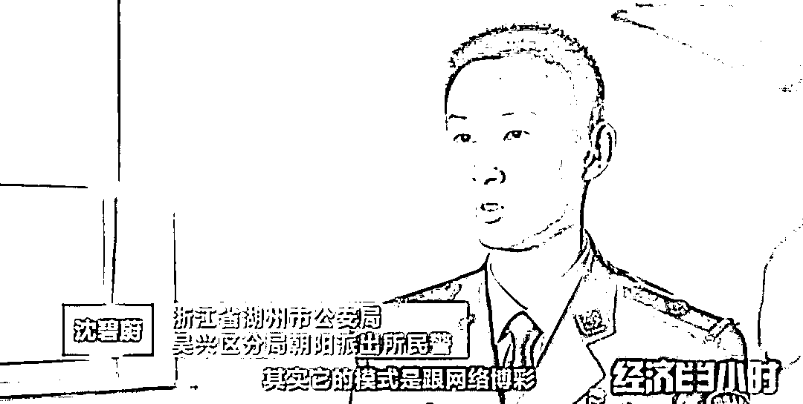 

通过案件分析，警方发现这是一个在国内盘踞的一个“杀猪盘”诈骗团伙。被骗资金经过多张银行卡转移后，汇集到了湖南郴州市桂阳县，并通过银行自助柜员机取现。**这些负责取款的人，在电信诈骗案件中被称为取款手，每次取款都会获得一定报酬。**

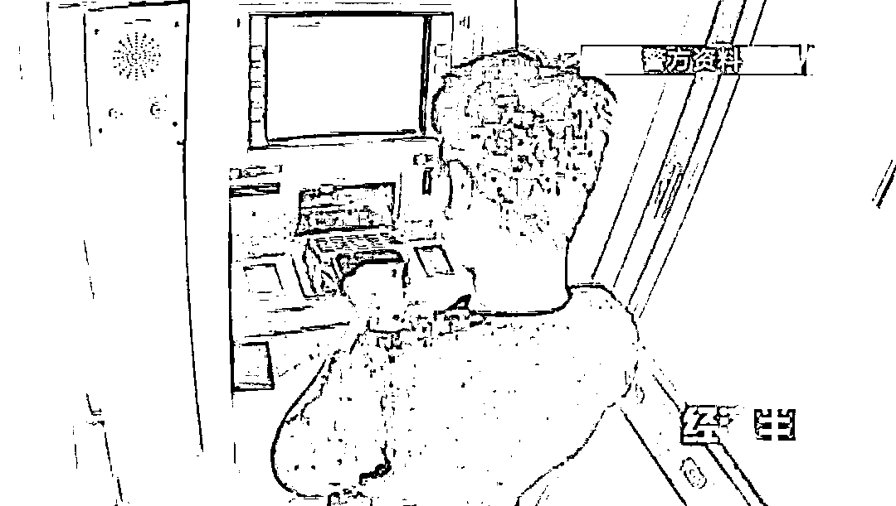

在掌握了这批取款手的相关信息以及相关轨迹之后，专案组赶赴湖南郴州等地，对这批取款手实施抓捕。**抓捕行动中，警方共抓获了 10 名取款手，查扣涉案银行卡 80 余张，手机 20 余部。**

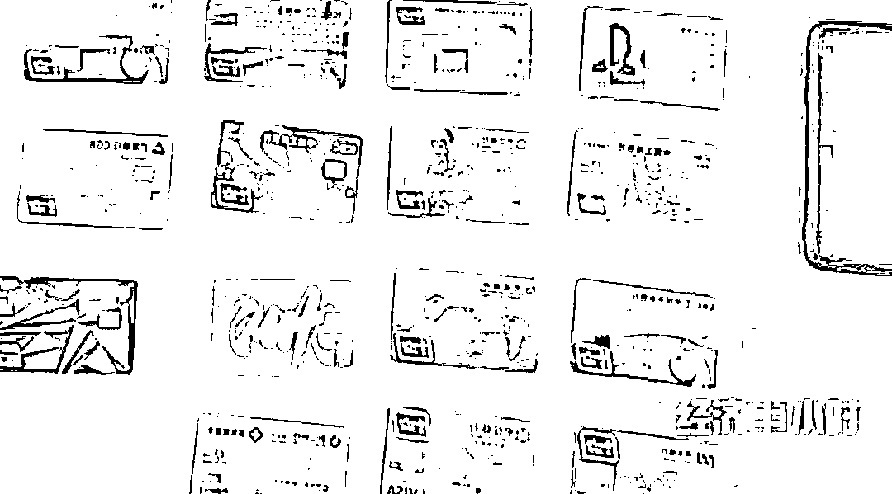

2021 年 3 月 8 日，涉案取款手头目嫌疑人洛某被警方抓获。随后，负责制作、维护诈骗网站的李某也在福建莆田落网。由于报警及时，沈女士拿回了自己被骗的 16 万元，不过警方调查发现，案件涉及的银行卡从 2020 年 12 月底至 2021 年 3 月初，流水达上千万，这说明还有很多人被骗，其中大部分赃款已经被嫌疑人挥霍一空，无法追回。

以为是生意临门，结果却是诈骗的手段

[`mp.weixin.qq.com/mp/readtemplate?t=pages/video_player_tmpl&action=mpvideo&auto=0&vid=wxv_1873331672184586251`](https://mp.weixin.qq.com/mp/readtemplate?t=pages/video_player_tmpl&action=mpvideo&auto=0&vid=wxv_1873331672184586251)

△央视财经《经济半小时》栏目视频 

除了“高富帅”嘘寒问暖的“杀猪盘”式骗局，还有一些不法分子，伪装成事业单位工作人员等社会信任度高的身份实施诈骗。

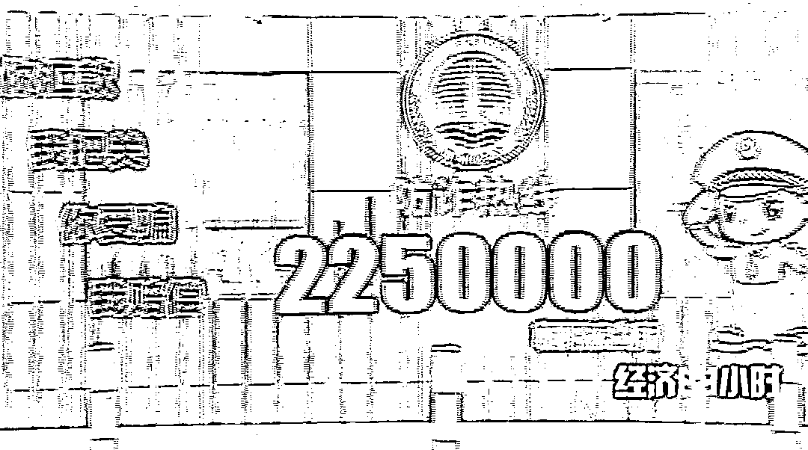

2020 年 5 月初的一天，在南方某市一个政府部门任职的李先生接到了一个用本地号码手机打来的电话。对方自称是市里某消防救援大队的教导员，与李先生曾有过一面之交。

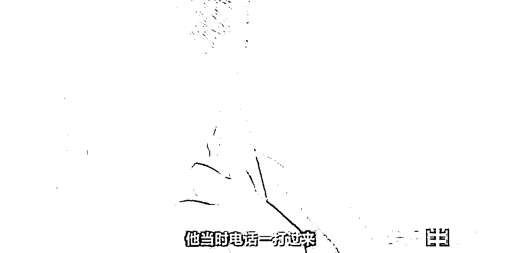  

对方告诉他，消防救援大队近日急需一批帐篷、发电机等设备，由于原先的供货商因故不能及时供货，因此决定另找一家供货商。考虑到李先生这方面的人脉比较广，想请李先生从中牵线搭桥，推荐一家。

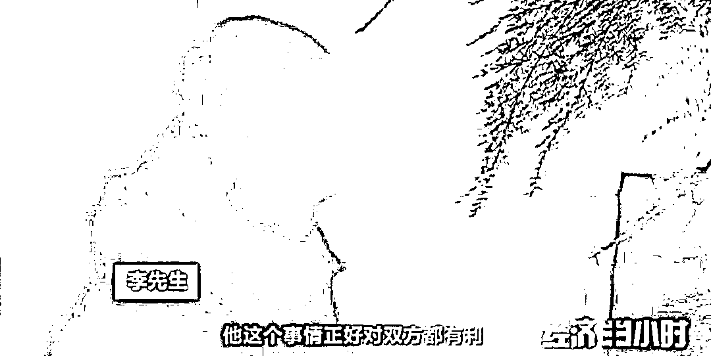 

于是，李先生把自己认识的一位朋友的联系方式给了电话里的那个人。没过多长时间，李先生的那位商人朋友便接到了这位“教导员”的电话，跃跃欲试想做这个生意。于是他按照“教导员”提供的线索，辗转通过供货商找到了生产厂家。

   

然而，当货款打过去之后，这名商人再联系那位消防救援大队的“教导员”、供货商和生产厂家时，却发现所有的电话都打不通了。再联系李先生，李先生也是一头雾水，两人这才意识到，自己肯定是上当受骗了，迅速向警方报案。

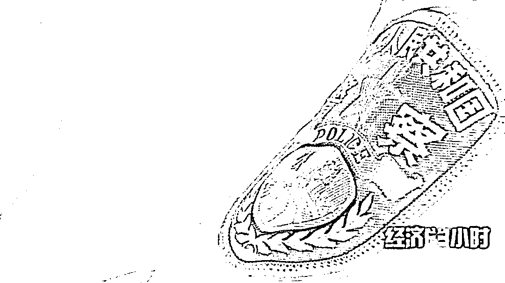

2020 年 5 月 17 日，安徽警方接到线索，有两个电信诈骗的手机号码，曾在安徽省亳州市出现过，说明这个犯罪嫌疑人就在亳州境内实施作案。但号码的存活时间最多两天，显然，这些手机号码，是嫌疑人专门用来进行电信诈骗的。

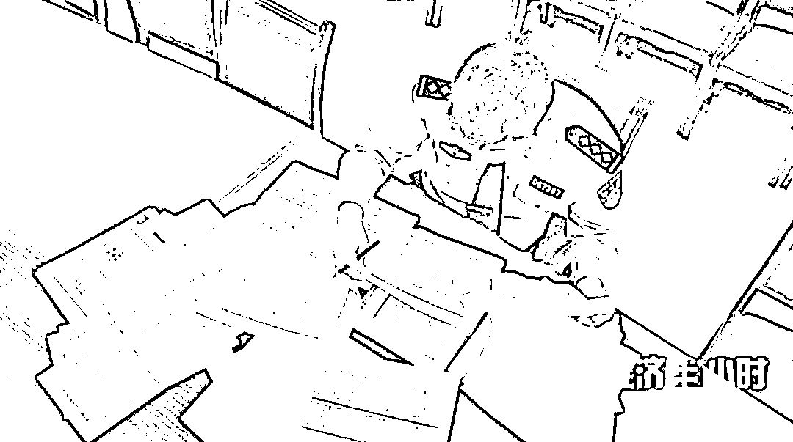

同时，警方也发现，这些手机号码，与登记的机主信息并不相符，通过涉案手机号码来追查嫌疑人线索的途径行不通。而通过他们收款所用的银行账号来追查赃款流向的侦查也同样遇到了困难。

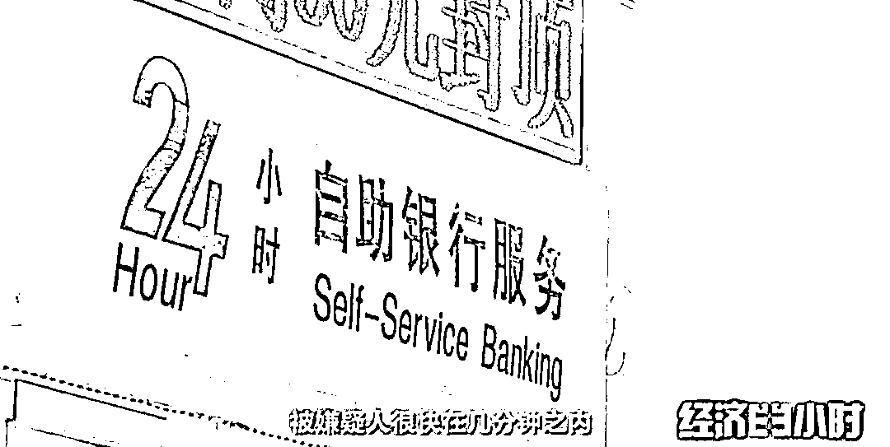    

功夫不负有心人，在经过长达两周的监控视频调取和分析研判之后，案件侦破工作终于有了初步进展，办案民警筛查出了几名可疑人员，并摸清了这个诈骗团伙的作案规律。

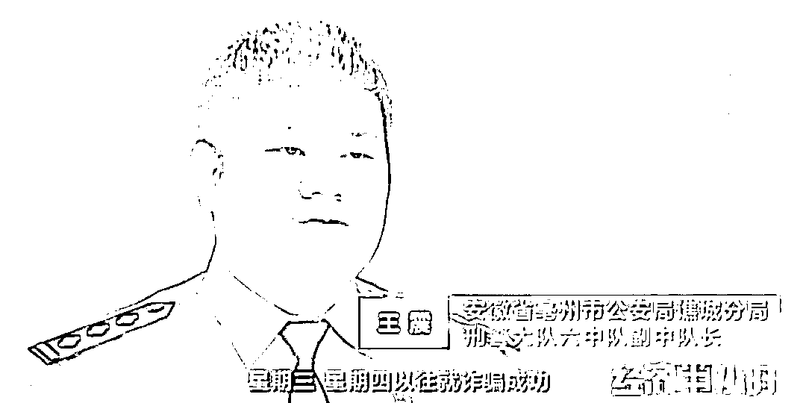 

根据嫌疑人的行动轨迹，办案民警顺藤摸瓜，锁定了他们位于河南省鹿邑县某小区的一处藏匿窝点。2020 年 6 月上旬的一天，这伙嫌疑人再次有所动作，他们行进的方向正是安徽省亳州市。

到达亳州市的第二天上午，嫌疑人选择了安溜镇一处临近河道、地势低洼且又人迹罕至的树林开始拨打电话，实施作案。下午两点多钟，通过拨打电话实施完诈骗活动的四名嫌疑人，被亳州警方成功抓获。在他们随身携带的物品中，警方查获了他们用来作案的手机、手机卡、充值卡以及记录有大量政府部门、机关企业负责人联系方式的涉案物品。

在随后的三个月内，亳州市警方又连续出击，分别在河南省林州市、广东省深圳市、福建省龙岩市抓获下游洗钱团伙犯罪嫌疑人 5 名。

以此案的突破为抓手，亳州市警方辗转全国多个省市，共捣毁电信网络诈骗窝点 18 个，抓获犯罪嫌疑人 37 名，缴获各类电信网络诈骗设备 126 台，破获涉及 17 个省、自治区的各类电信网络诈骗案件 90 余起。

来源：央视财经《经济半小时》

← 向右滑动与灰产圈互动交流 →

