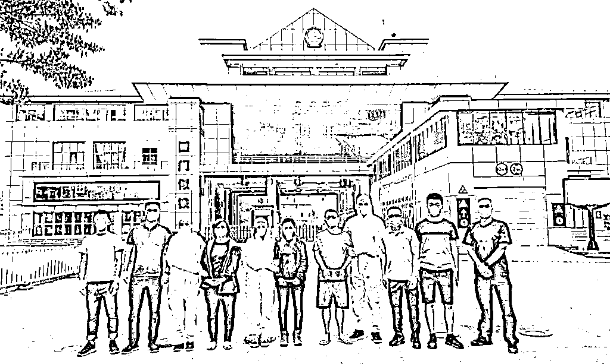

# 女承父业复制 " 圈钱帝国 "，这位 90 后白富美如此吸金 20 亿

> 原文：[`mp.weixin.qq.com/s?__biz=MzIyMDYwMTk0Mw==&mid=2247514377&idx=6&sn=079cb0eb9422fe61367cc0bf834f68a0&chksm=97cb7231a0bcfb274027e8c4d23fcf9e697eec2b50fda7f615b0f2b43f00d6369c90f593b6a7&scene=27#wechat_redirect`](http://mp.weixin.qq.com/s?__biz=MzIyMDYwMTk0Mw==&mid=2247514377&idx=6&sn=079cb0eb9422fe61367cc0bf834f68a0&chksm=97cb7231a0bcfb274027e8c4d23fcf9e697eec2b50fda7f615b0f2b43f00d6369c90f593b6a7&scene=27#wechat_redirect)

900 余名被害者，200 余册卷宗，1000 余份电子文档，数万条汇款记录，20 亿余元集资款…… 2 月 24 日，江苏省无锡市滨湖区检察院依法以集资诈骗罪、偷越国（边）境罪对朱某提起公诉，4 月 1 日，该案公开开庭审理。目前，案件还在进一步审理中。 

2020 年 3 月底，出逃至缅甸的朱某等 3 人在中缅警方通力合作下被抓获归案。

投资不成赔进百万身家

" 有专业分析师团队设计高中奖率方案，你只需加入会员投入资金，由公司集中下注竞彩并发放奖金，不仅确保本金回来，还能有比银行理财更高的稳定收益 "。2018 年，家住江苏无锡的王丽遇上了上述 " 天上掉馅饼 " 一般的好项目。她经朋友王申（另案处理）介绍，了解到江苏某体育发展有限公司和其 " 微风 100" 项目。

王申对她说，这个项目是国家认可的，会员投资的钱都存放在国家体育彩票站点机器所对应的资金池里，非常安全。听后王丽动了心，加入微信群成为会员。每天群里热火朝天地公开投注方案，频频传来中奖捷报。很快，王丽豪掷 60 余万元，购买了该公司原始股份额，不到一年她就投入 130 余万元。然而，没过多久，王丽听到了公司负责人朱某失联的消息，一算自己搭进去超百万元，心里一紧：坏了，不会是遇上骗子卷钱跑了吧。

像王丽这般受骗的不止一个。2020 年初，无锡市警方陆续接到 40 余人报案。无锡市滨湖区检察院提前介入该案后发现，该公司的核心人员、这个非法集资 20 亿余元涉嫌集资诈骗团伙的 " 掌权人 " 朱某竟是个 "90 后 "，才不过 31 岁。

女承父业复制 " 圈钱帝国 "

办案检察官介绍，朱某大学金融专业毕业后，跟随父亲在辽宁开公司，当时公司标榜 " 顶尖专业体育竞彩分析师团队提供下注方案，只盈不亏，月收益极高 "，以此来吸引投资人。同时，公司收取加盟费招募合伙人，再由合伙人扩散式发展会员，其本质是典型的 " 庞氏骗局 "。

不久，公司因资金链断裂崩盘，朱某父亲涉嫌犯罪被警方抓获。2017 年，朱某与之前公司老同事决定自立门户，在无锡成立了体育发展有限公司，在未经金融监管机构批准的情况下，套用过去父亲公司的模式，经营起同性质的 " 微风 100" 体彩代购项目。

公司运营初期，朱某找来四川成都一家数据公司合作，设计了一系列下注方案并用于宣传，同时，公司其他核心人员也开始以 75 万元加盟费的条件发展合伙人，打出月收益 15% 至 30% 的宣传语。就这样，万事俱备，2017 年 12 月，公司开始正式发展会员。

与承诺不同，朱某等人在实际运作中，仅将少部分会员投资款用于体彩下注，其余大量资金都集中在特定个人银行卡中沉淀形成资金池，用于个人挥霍、发放会员中奖奖金、赎回本金、发放员工工资等。朱某炮制频频中奖的火热假象，以吸引更多人进入，让这个泡沫为自己带来滚滚财富。

危机就在这一片红火景象里点燃导火线。"2018 年 5 月底，项目出现连续未中奖情况，一下子损失 2000 万元本金。为缓解合伙人和投资人的焦虑，隐瞒公司体彩方案已经无法归还巨额本息的事实，朱某伙同下属赵某开始用造假数据来伪造中奖结果，并继续使用后续加入会员的投资款填补之前的亏损窟窿。" 该案办案检察官介绍。

经办案检察官审查，通过上述种种方式，截至 2020 年 1 月初，朱某公司集资参与人损失已累计 3 亿余元。

内忧外患之下洗钱跑路

2019 年 4 月，为了维持资金链，朱某利用自己的金融专业知识又动起了歪脑筋：不如设计莫须有的上市来售卖股权再赚一笔。

随即，一场项目说明会在一家五星级酒店热烈召开，合伙人们应邀参加。会上，一身奢侈品牌职业装的朱某继续以 " 女强人 "" 白富美 " 的人设，激情描绘公司上市后的盛景，以此为诱饵，来售卖所谓的原始股：" 上市成功，股价可以翻 5 倍至 10 倍，持有股份在未上市期间每年有 8% 至 15% 左右的分红。" 这一番 " 洗脑 " 操作吸收了 3000 余万元资金，但与巨大的亏空相比，只是抔土巨壑，爆雷一触即发。

朱某可能也未料到，她信任的 " 左膀右臂 " 早已盯上了这块 " 大蛋糕 "。负责处理下注数据的赵主管，与人合谋，把集资款 700 多万元据为己有；负责管理公司资金账户的陈某，先后将集资款 1600 余万元 " 搬进 " 自己的 " 小金库 "。

2020 年 1 月初，公司已无钱维系运转，更别提补上会员损失。朱某找到路子广的黄某（另案处理），由他帮助自己 " 漂白 " 资金、变卖豪车、规划出逃。2020 年 3 月底，出逃至缅甸的朱某等 3 人在中缅警方通力合作下被抓获归案。

2020 年 8 月 24 日，朱某涉嫌集资诈骗案被移送至无锡市滨湖区检察院审查起诉。办案检察官加班加点，全面审查了 200 余册案件卷宗、900 余名被害人的报案笔录和登记表、1000 余份电子文档、180 余人的银行记录等大量证据，高效完成了审查起诉工作。同时，强化法律监督职能，深挖 " 案中案 "，依法开展线索移送、立案监督、追捕等工作，先后查出其他与该案关联的洗钱、偷越国（边）境、职务侵占、挪用资金、诈骗等多个新增犯罪事实，追究了 7 名犯罪分子的刑事责任，实现了全链条打击。

" 为老百姓追回损失也至关重要。" 办案检察官介绍，该院第一时间会同公安机关成立追赃挽损工作小组，全面加强对涉案资金流转、去向的审查和追踪，强化对洗钱犯罪的打击力度，依法及时有效地开展涉案款物的查封、冻结、扣押等工作。截至该案审理期间，追回各类款物价值近亿元。

对此，检察官提醒：打着 " 融资合买体育彩票高中奖、高回报 " 的幌子，本质上仍然是非法集资行为，朱某等人以高端、专业、国际化包装自己和团队，大肆圈钱，本质上是以非法占有为目的、虚构事实的集资诈骗行为。非法集资领域犯罪分子往往采用各种华丽包装诱使群众投资，识别非法集资陷阱，要高度警惕 " 有担保 "" 无风险 "" 高收益 "" 稳赚不赔 "" 海外上市 " 等蛊惑性宣传。在难以识别的情况下，要谨慎投资，将风险化解在前，牢牢守好自己的 " 钱袋子 "。

来源 ：潇湘晨报综合检察日报正义网

← 向右滑动与灰产圈互动交流 →

