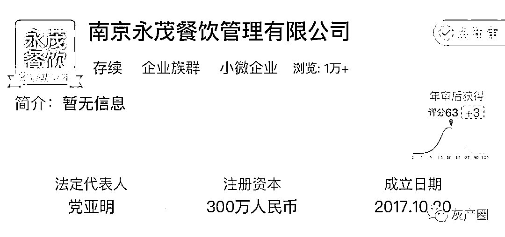
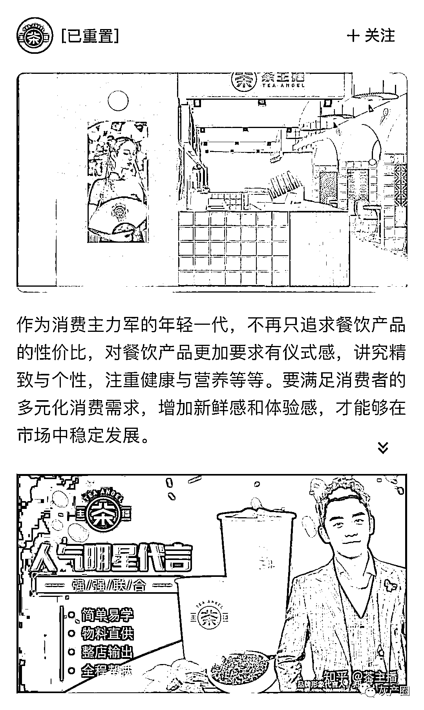
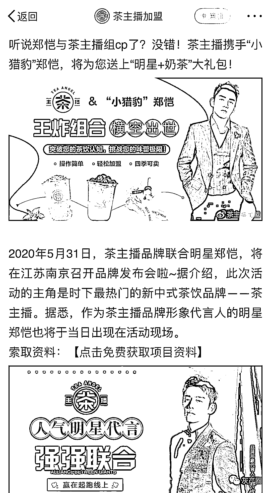
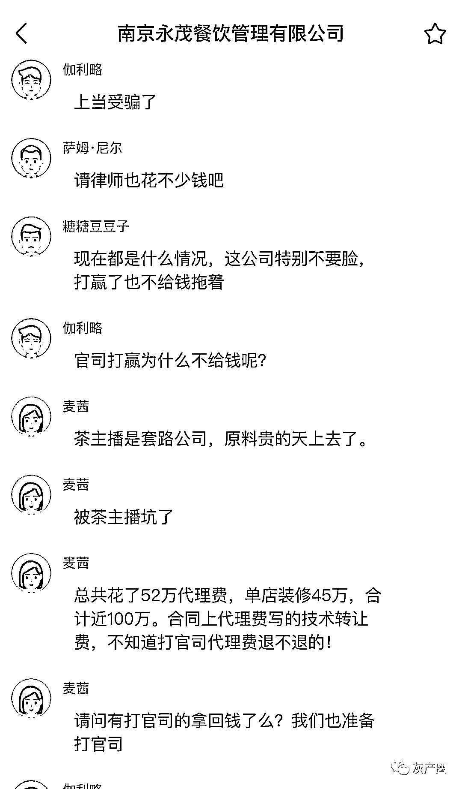
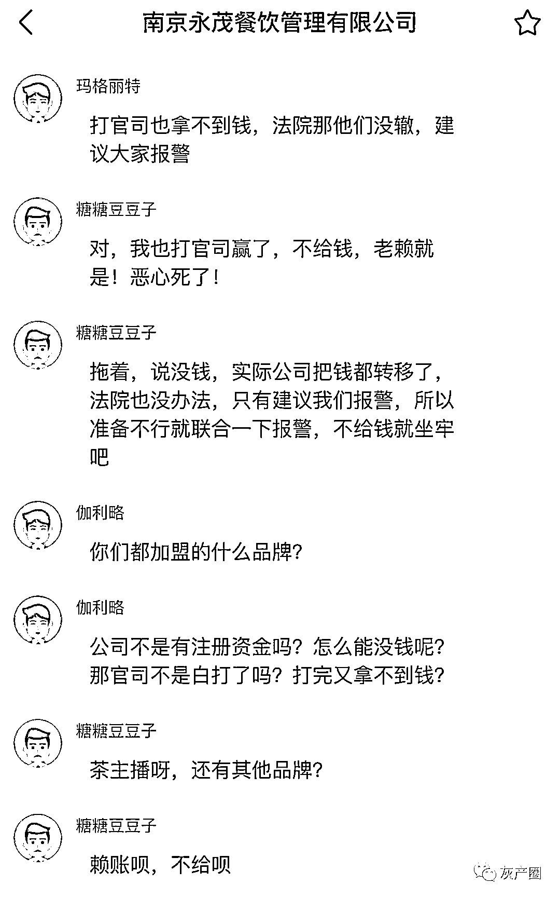
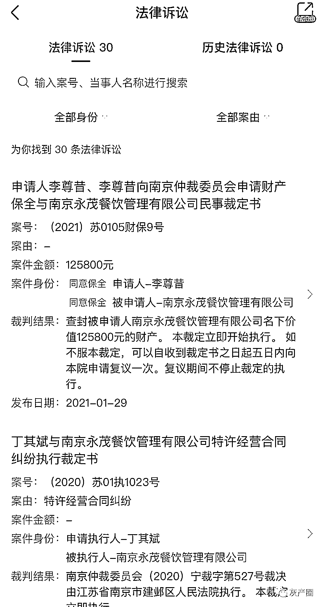
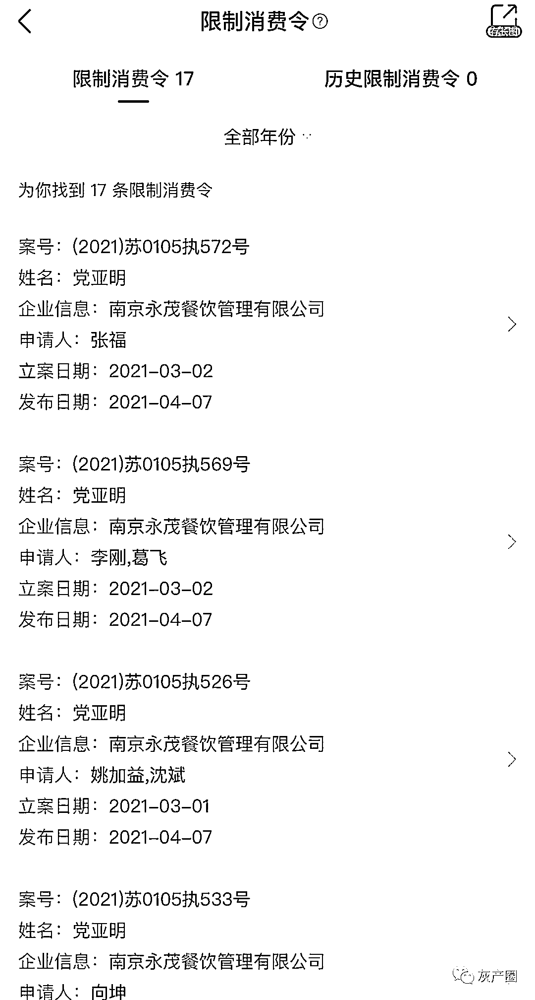
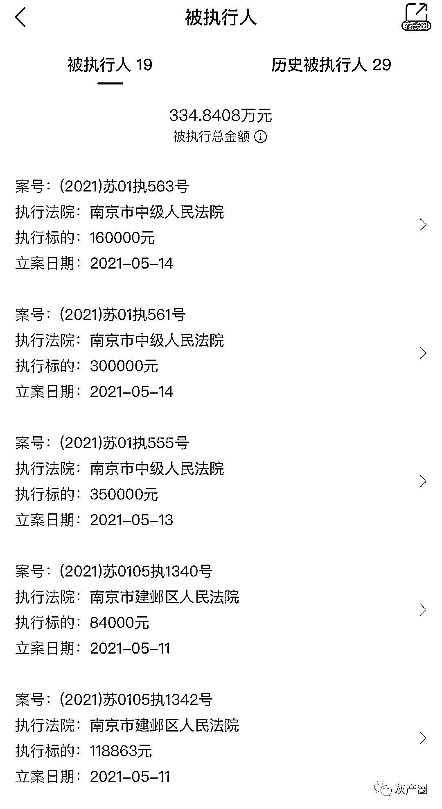
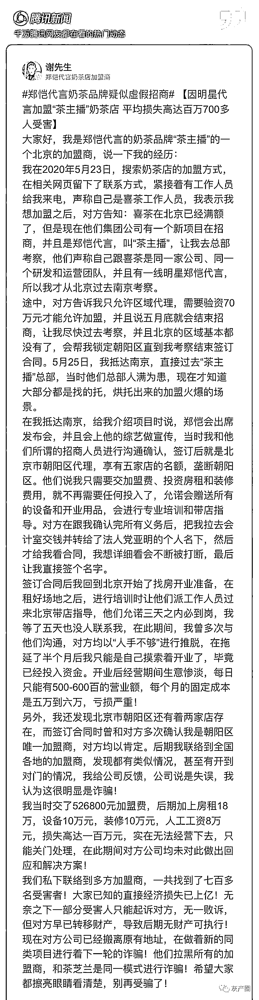

# 继马伊琍后，郑恺代言奶茶品牌被指诈骗：超 700 人上当，涉案金额过亿元

> 原文：[`mp.weixin.qq.com/s?__biz=MzIyMDYwMTk0Mw==&mid=2247514456&idx=1&sn=c2670e61cc579624652a61e94fd66a56&chksm=97cb7260a0bcfb7664e19765d1a2a4a78f58e592031730df4784b7fa59414f5da017e47049e4&scene=27#wechat_redirect`](http://mp.weixin.qq.com/s?__biz=MzIyMDYwMTk0Mw==&mid=2247514456&idx=1&sn=c2670e61cc579624652a61e94fd66a56&chksm=97cb7260a0bcfb7664e19765d1a2a4a78f58e592031730df4784b7fa59414f5da017e47049e4&scene=27#wechat_redirect)

此前报道：[代言品牌涉嫌违法，马伊琍：正配合调查](http://mp.weixin.qq.com/s?__biz=MzIyMDYwMTk0Mw==&mid=2247514280&idx=4&sn=9768b86a6c3b1312aba361041f84577c&chksm=97cb7390a0bcfa8696cfb9993c262b301163daa1ca998c89945b275c26fcf6d94bcd4dfa6d75&scene=21#wechat_redirect)

三言财经消息，今日，一位自称是艺人郑恺代言的奶茶品牌“茶主播”北京加盟商的网友爆料称**，“茶主播”疑似虚假招商，骗取巨额加盟款。**

该网友透露，2020 年 5 月，自己在网上搜索奶茶店加盟方式时，在相关网页留下了联系方式。随后接到一位自称是喜茶工作人员的电话，对方告知喜茶已在北京满额，但目前有一个新项目在招商。

**这名工作人员介绍称，这个新项目名为“茶主播”，是艺人郑恺代言。对方还一再强调自己和喜茶同属一家公司、同一个研发和运营团队，并且邀请网友前往南京总部考察。**

这名网友表示，考虑到对方的宣传介绍以及有一线明星郑恺代言，自己便决定前往南京。

2020 年 5 月 25 日，该网友抵达“茶主播”南京总部。考察过程中，对方表示郑恺会出席发布会而且会在相关综艺节目中为该品牌做宣传。

此外，招商人员确认双方签订加盟合作后，这位网友将会是北京市朝阳区代理，享有五家店名额，垄断朝阳区。只需要缴纳加盟费、投资房租和装修费用即可。“茶主播”方面会提供所需设备、培训以及带店指导。

于是这名网友与对方签订了加盟合同。但是，回北京后对方却一直以“人手不够”未能兑现提供之前承诺的带店指导服务。开业后生意惨淡，日营业额不足一千元，但每月固定成本高达五、六万，亏损严重。

**不仅如此，“茶主播”还违背了“垄断朝阳”的承诺。网友发现在北京朝阳还存在着其他两家加盟店，自己并非唯一加盟商。**

这名网友透露，自己当时一共缴纳 50 万余元加盟费，后期房租近 20 万元、设备 10 万元、装修 10 万元以及人工工资近 10 万元，总共损失高达一百万，最终无法维持经营只能关门。

据该网友调查称，一共有七百多位加盟商被骗，直接经济损失上亿。虽然很多受害者成功起诉“茶主播”并且胜诉，但是对方已经转移财产，导致无财产可供法院执行。

重点宣传郑恺代言，却屡被法院强制执行

成被执行人几十次，被执行总金额超 300 万

据天眼查，“茶主播”运营主体是南京永茂餐饮管理有限公司，法定代表人为党亚明，成立日期是 2017 年 10 月 20 日，注册资本 300 万元。

三言财经注意到，2020 年起，“茶主播”在各种社交平台中均重点宣传艺人郑恺为其代言，并以“国潮”之类的宣传词汇邀请加盟商入驻。

**然而，在社交平台中，有众多疑似“茶主播”加盟商组建的维权群控诉“茶主播”欺诈。**这些维权者均表示自己缴纳高昂加盟费用、店面运营费用等后，却没享受任何“茶主播”承诺的服务，而且亏损严重。

**此外，有多名维权者透露，虽然已成功起诉“茶主播”，但却因对方将资金转移而无法执行。**

**三言财经注意到，这家公司存在 30 起有关特许合同经营纠纷的法律诉讼，被告方均为“茶主播”；**其中，诉讼包括财产保全以及“茶主播”因未履行法院判决而被强制执行的仲裁决定等。此外，“茶主播”法人代表党亚明也被限制高消费 17 次。

“茶主播”运营主体还多次成为被执行人，被执行总金额高达 334.8408 万元。

**目前，曾为“茶主播”代言的艺人郑恺未对此事回应，并且其个人社交平台中也没有任何有关“茶主播”的宣传内容。**

**以下是全文：**

来源：三言财经

← 向右滑动与灰产圈互动交流 →

