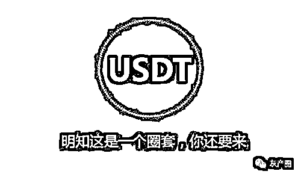
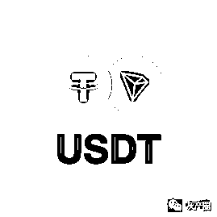
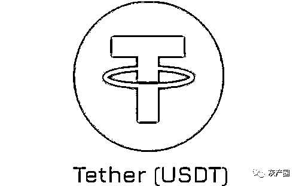

# 疯狂的“币圈”！3 天赚了 200 万，第 4 天就傻了……

> 原文：[`mp.weixin.qq.com/s?__biz=MzIyMDYwMTk0Mw==&mid=2247514456&idx=2&sn=395532e9e28652e10bc92b6b49444731&chksm=97cb7260a0bcfb76128189aa08417a64efad08eafbc4aa35935478c8cd8d514d364c5d5a17ce&scene=27#wechat_redirect`](http://mp.weixin.qq.com/s?__biz=MzIyMDYwMTk0Mw==&mid=2247514456&idx=2&sn=395532e9e28652e10bc92b6b49444731&chksm=97cb7260a0bcfb76128189aa08417a64efad08eafbc4aa35935478c8cd8d514d364c5d5a17ce&scene=27#wechat_redirect)

近年来

比特币的暴涨让币圈大火

炒币成为一种新型热门投资

不法分子也将目光投向这一领域

利用人们追求一夜暴富的心理

实施电信网络诈骗

浙江省玉环市的项先生就被诱骗

投资 USDT 泰达币

**4 天被骗走 300 多万元！**

近日，经浙江省玉环市检察院提起公诉，法院审理后以诈骗罪一审判处伍某、刘某等 4 人有期徒刑八年二个月至七年六个月不等的刑罚。

“孟老师”推荐的股票

全部涨势喜人

2020 年 8 月，家住玉环市的项先生被拉进一个叫“问鼎 21 孟学院”的股票微信群，群里有个叫“孟建中”的老师定期为群友讲课、推荐股票，还有专门负责为群友分析手头股票的老师。起初，项先生对群内动态也不太关注。

当年 8 月底，“老师助理”晒出一张群主“孟老师”近期买卖股票的靓丽“成绩图”。随后几天，项先生看到“孟老师”推荐的几只股票竟然都涨势喜人，不少群友也纷纷表示购买后赚到了钱，还在群内发了红包。见此情况，心动的项先生也拿出一些钱跟着一起炒股。几次买卖股票下来倒也赚了点小钱，心里对“孟老师”愈发信服。于是，项先生果断加“孟老师”和“老师助理”为私信好友，经常听“孟老师”讲各种投资心得。

为了避免上当受骗，项先生还加了群里的其他人为私信好友，经常联系沟通，似乎大家都跟着“孟老师”赚到了钱。再看群里的其他投资者虽然都是天南海北的人，但是因为共同的致富梦成了经常聊天的朋友，项先生渐渐放松了警惕。

“财富钱包”里的钱一夜蒸发

2020 年 10 月 4 日，“孟老师”向项先生介绍一个投资项目——USDT 泰达币。

出于谨慎，项先生上网查了一下，发现所谓的 USDT 泰达币是一种将加密货币与法定货币美元挂钩的虚拟货币，是一种保存在外汇储备账户、获得法定货币支持的虚拟货币。而且，从网上得知，当时的 USDT 泰达币总市值突破 240 亿美金，只有比特币和以太坊的市值比它高。项先生想到之前比特币的价格一月之间涨到 4 万美金，这回遇到贵人“孟老师”相助，也许 USDT 泰达币也能让他大赚一笔。

于是，项先生根据“孟老师”助理发来的下载链接，安装了一个叫“东方财富钱包”的 App。同年 10 月 13 日，他根据“孟老师”的介绍，试着充值了 2 万元投资泰达币，大概一个小时左右，他的账户上就多了 4000 元。项先生大喜过望，又充值了 8.2 万元，当天他就获利了 4 万多元。巨大的利润冲昏了项先生的头脑，他压根就没有去核实 USDT 泰达币的真实市场涨幅。10 月 15 日，“孟老师”说带他做单买涨跌，买中了就能获利，买不中也不怕，只要事先买个保险，就不会扣除亏掉的钱。

项先生一看：“好家伙，这不是稳赚不赔吗！太好了！”于是，从当天早上 10 点钟充值 20 万元人民币开始，这一天里他陆陆续续分 11 次往平台里充值了近 300 万元，最多的一次他还专门跑到银行去充值了 110 万元，当天下午他的账户上就多出了 60 万元。到次日下午，项先生在“东方财富钱包”这个平台上的账户余额已经达到了 495 万元。也就是说，从他第一天接触泰达币开始仅 3 天时间，就已经“赚到”了近 200 万元。

这个时候，“孟老师”跟他说：“明天带你做 500 万元的单，利润更高，账户里要准备 500 万元的资金。”项先生当晚就又充值了 5 万元，凑足了 500 万元。

准备第二天继续“大干一票”的项先生像往常一样，在晚上 9 点多跟“孟老师”沟通交流的时候，却发现平时秒回的“孟老师”迟迟不回微信，他又找“老师助理”和之前群里加的那些好友，无一例外，没有一个人回他微信，都联系不到了。这时，项先生这才幡然醒悟，赶紧报警。

诈骗团队跨境操盘

接到报案后，警方迅速抽调警力对该案进行立案侦查。随后，以伍某为首的投资诈骗团伙各成员被抓获归案。

原来，这个以炒泰达币为名的诈骗组织由国内和国外诈骗团队相互协作，国外诈骗团队负责搭建框架，提供人设、思路给国内诈骗团队学习操作。

伍某就是国内诈骗团队的负责人，据他和他的同伙交代，这是一个电信网络诈骗的升级版。

诈骗手法大揭秘：

1.专人负责将潜在的被害人拉进微信群；

2.诈骗人员在群里扮演各自的角色，利用 P 图虚构老师推荐股票盈利等手段，让群友相信荐股老师实力；

3.骗取信任后，再引导客户去“东方财富钱包”App 上投资泰达币；

4.国外诈骗团队登场，虚构了一套稳赚不赔的保险机制吸引被害人投资，只要客户往里面充钱，钱就马上被转到国外去了，而被害人看到的只是平台上虚假赢利数字。

据侦查，除了项先生之外，还有 6 人合计被骗 400 多万元。

检察官提醒

投资理财要选择正规的渠道和平台，切莫贪图所谓的高额回报，而落入犯罪分子的陷阱。

无论何时何地，切记：

**➤ ****不要随意透露自己的个人信息**

****➤ **不要轻易接受别人的理财推荐**

****➤ **不要轻易相信所谓的高利诱惑**

****➤ **不购买、不转账、不汇款**

来源：玉环检察、检察日报正义网、利箭在行动

← 向右滑动与灰产圈互动交流 →

