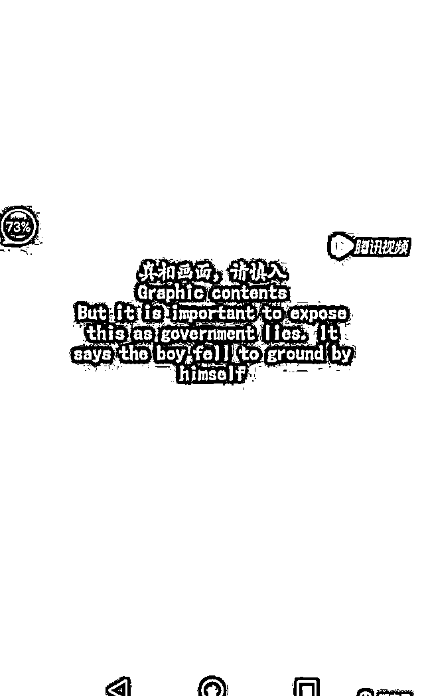

# 境外势力如何介入中学生自杀事件

> 原文：[`mp.weixin.qq.com/s?__biz=MzIyMDYwMTk0Mw==&mid=2247514456&idx=3&sn=c2c46d2ad88ae8b59df405d6080e75e0&chksm=97cb7260a0bcfb76bfb14c3e917e86ed938a470d7a466b5086a9f05238ba50d45076e71a90b0&scene=27#wechat_redirect`](http://mp.weixin.qq.com/s?__biz=MzIyMDYwMTk0Mw==&mid=2247514456&idx=3&sn=c2c46d2ad88ae8b59df405d6080e75e0&chksm=97cb7260a0bcfb76bfb14c3e917e86ed938a470d7a466b5086a9f05238ba50d45076e71a90b0&scene=27#wechat_redirect)

昨天深夜，@四川网警巡查执法 发布文章《警钟长鸣——泸州太伏中学事件，境外敌对势力是如何进行介入的？》，以下是全文。

2017 年 4 月 1 日上午 6 时，四川泸州市泸县太伏镇初级中学初二学生赵某被人发现死在宿舍楼外。经公安机关现场勘验、尸表检验和调查走访，赵某损伤符合高坠伤特征，现有证据排除他人加害死亡。

该事件迅速引发热议，后因当地政府处置不当，导致谣言四起，群情激愤，事态短时间失控，造成恶劣影响，引起全国关注。

与此同时，境外敌对势力抓住时机，大肆介入，反华组织疯狂进行造谣，推动太伏事件向反面和极端发展。

下面逐图进行解析，为大家再现泸州太伏学生坠亡事件中境外敌对势力的介入情况。

图一：太伏事件网上舆论发酵初期，境内外个别网站开始流传出一段视频，后经查实，**境内个别网站和自媒体传播的该视频源头来自境外。**

图二：视频称此次案件为五名校霸打死学生，其中一校霸为镇长之子。事实上，**该谣言已被公安机关辟谣。**

图三：经过仔细甄别，该视频出自一个电视台，电视台的台标为类似篆书体的很像”唐“字的图案，并有一串英文字母 ntdtv。

图四：搜索英文字母"ntdtv"发现，该电视台名为新唐人电视台。没错，就是那个臭名远扬的邪教组织的电视台，这个由美国豢养的反华组织，一直都在利用各种机会大肆抹黑中国，该视频就是一个活生生的例子。

图五：第 2 个视频出现了，一上来就是故弄玄虚的中英文双语的警示语：真相画面，请慎入。

图六：这个视频同样使用了流传在境内的谣言，该视频原本发生在武当山，后被造谣者移花接木修剪掉 11 秒后发布，称该男生为坠亡学生，与第 1 个视频相同，**公安机关早就进行了辟谣**，在剪掉的 11 秒对话中，正好提到了两名被打少年的名字，跟坠亡学生赵某并不相同。

图七：视频最后附有这样一段话，视频来自网上，有线索者可投稿至 8381234@gmail.com，可获得奖励 1000 美元。

图八图九：搜索发现，**图 7 中提到的邮箱原来是美国《反海外贿赂法》专用举报邮箱，该邮箱是美国国家反贪局海外事务部在全世界搜集情报的工具之一。**

图十：第三个视频出现，视频中是一段采访，被采访者据称是在美国读硕士研究生的华人，跟之前两个视频一样，每一句话都在编故事，而且仿佛亲临其境。

图十一：通过视频可以看到台标“VOA 卫视”，该卫视隶属于美国知音旗下，**代表美国官方声音的政府机构亲自下场了。**

图十二：“美国之音”从建立时起，就开始了旷日持久的反 G 宣传，自 1949 年中华人民共和国建国以来，美国之音中文部一直是对中国进行心理战的工具。

成都四十九中学生坠亡事件发生后，舆情热度迅速升温，引发大量媒体和网民关注。**跟太伏事件如出一辙，境内外敌对势力同样进行了介入**，下一期四川网警将为大家梳理四十九中事件中境外敌对势力制造的各种谣言和宣传套路，敬请关注。

前事不忘，后事之师。

警惕啊，朋友们。 

来源@四川网警巡查执法 

← 向右滑动与灰产圈互动交流 →

