# 68 岁的薛蛮子怎么了？发虚拟币、请女优站台，还被讨债

> 原文：[`mp.weixin.qq.com/s?__biz=MzIyMDYwMTk0Mw==&mid=2247514456&idx=4&sn=3b87a2e7407e8a9077b96d45354bbad9&chksm=97cb7260a0bcfb76396018f553775f655683ef243b77f41c363d1d2c6d9b17ff43a5b47e96c4&scene=27#wechat_redirect`](http://mp.weixin.qq.com/s?__biz=MzIyMDYwMTk0Mw==&mid=2247514456&idx=4&sn=3b87a2e7407e8a9077b96d45354bbad9&chksm=97cb7260a0bcfb76396018f553775f655683ef243b77f41c363d1d2c6d9b17ff43a5b47e96c4&scene=27#wechat_redirect)

最近随着马斯克喊单狗狗币所带来的连环效应，各种动物币层出不穷，群魔乱舞，空气币满天飞。而有着“中国天使投资第一人”称号的薛蛮子也忍不住再次出动了。要知道，薛蛮子在币圈也算是老人，当年 ICO“风口”时，薛蛮子便投资站台了不少项目。但随后 ICO 被叫停，空气币泡沫破裂，薛蛮子就去搞了民宿和房地产，也被投资者追债。**最近，薛蛮子又在币圈活跃了起来，已经 68 岁的人，早已“财富自由”的薛蛮子一把年纪不安享晚年，折腾什么？**

请女优站台发币

薛蛮子被指花样割韭菜

这次薛蛮子重新回到币圈，还要从 4 月说起。今年以来，马斯克发布了多条有关狗狗币的言论，点燃了投资者的热情。此种景象似乎也点燃了薛蛮子的“热情”，开始关注狗狗币，并悄悄酝酿着其他计划。薛蛮子开始在微博里为狗狗币以及其他虚拟币等喊单，发微博的频率也明显快了很多。薛蛮子还投资其中一个虚拟币矿池，公开招募所谓“矿机合伙人”。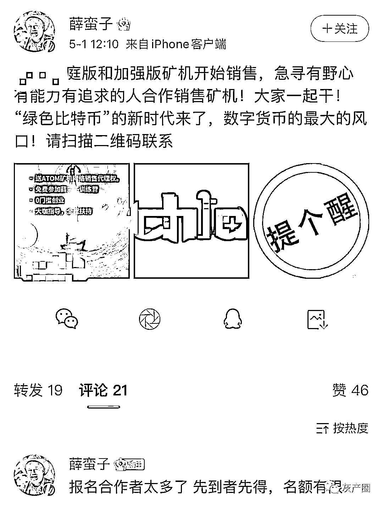但是看来喊单没有发币更有赚头，随后薛蛮子便筹划发布新币。5 月 11 日，薛蛮子第一次公布“狗 X 大陆”的消息，并称它将会成为一项“伟大”的实验。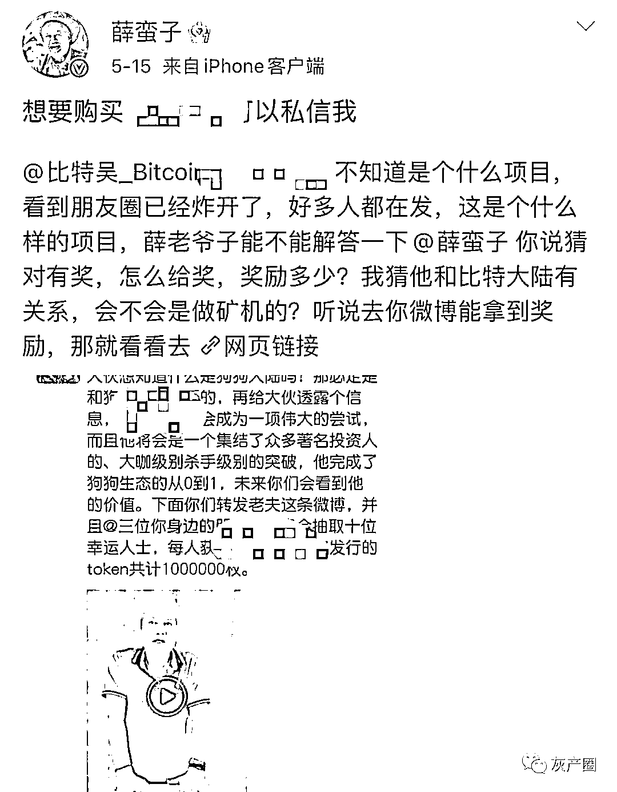仅仅 4 天后，薛蛮子又宣布 5 月 18 日将推出另一款币“狗 X 金融”。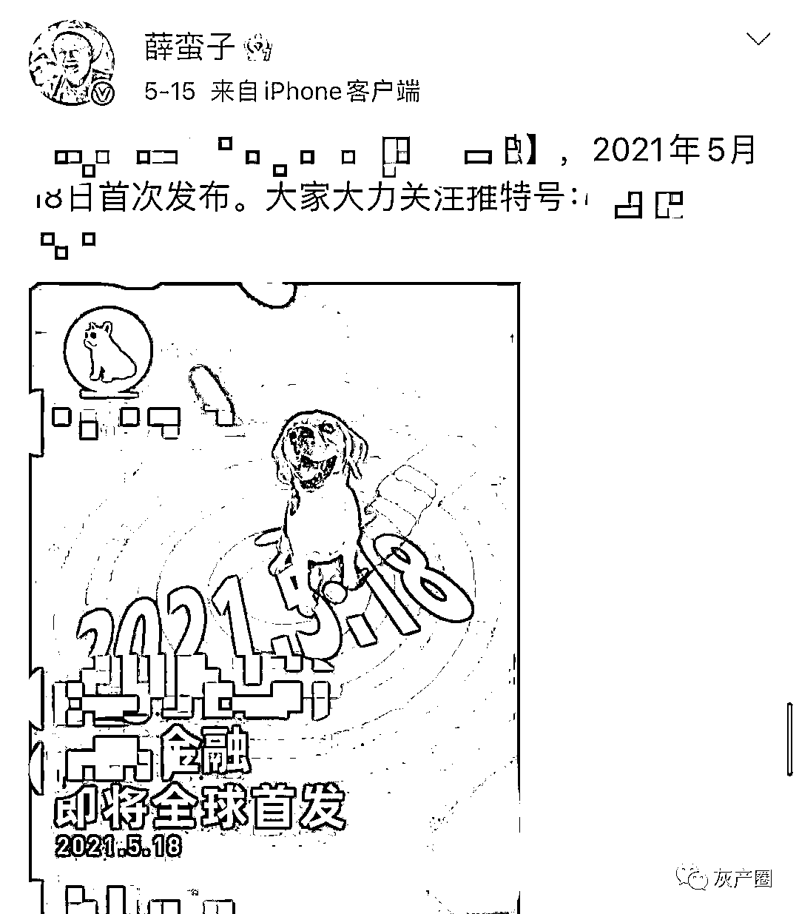从名字上看，两款币显然都是蹭狗狗币的热点。就在昨日，薛蛮子声称两个项目全部私募超额完成。**为了发布狗 X 金融，薛蛮子也是费尽心机，请了日本女优泷泽萝拉当主持人。**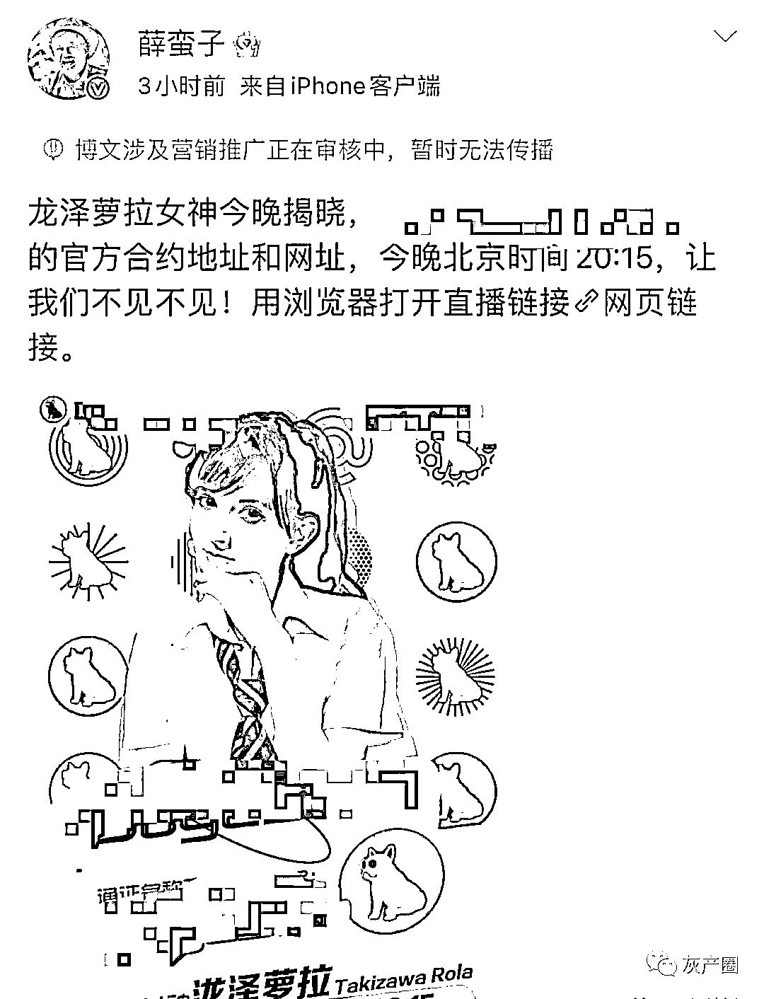**有网友评论，“这是黄赌毒三缺一，就还差一个毒了”。要知道，当年薛蛮子嫖娼被抓可引起了不小的轰动。**为了推销新币，薛蛮子把握住了投资者的心态，极力强调低投资，制造财富美梦。但是他的这些币和其他动物币又有什么区别呢？**这不过又是一波击鼓传花的割韭菜游戏，抓住了部分人投机取巧的心态。****在薛蛮子的微博评论中，可以发现总有不少人能看出这是骗局，但还是有人“情愿”上当，背后便是金钱的诱惑。**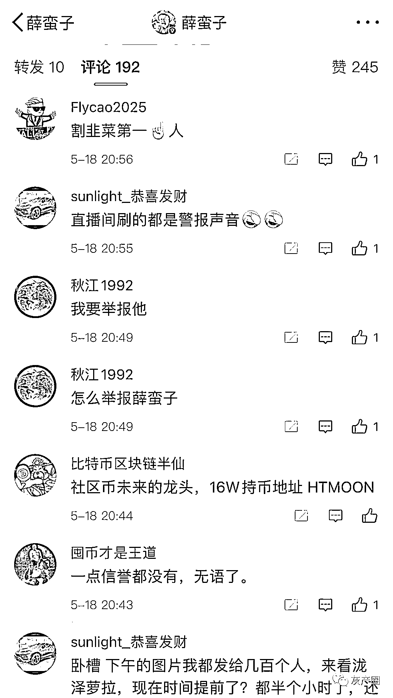事实上，在 2017 年的 ICO 浪潮时，薛蛮子便搭上了李笑来。薛蛮子也迅速掌握了财富密码，短短时间便参与了数十个 ICO 项目，比如 xmx、spc、mlgb 等等。不过 2017 年 9 月 4 日后一切戛然而止，根据央行等七部委出台的联合文件，ICO 被定性为“未经批准非法融资行为”，泡沫破裂。也许薛蛮子还没来得及收割，之后他很少再发有关区块链和 ICO 的相关消息。薛蛮子转身将精力投入到民宿和房地产行业，但却再次被指是骗局。

投资人纷纷讨债

民宿、房地产也是骗局？

**或许是担心国内对 ICO 的严查，薛蛮子跑去了做民宿，时不时就晒一下，顺便招募投资者。**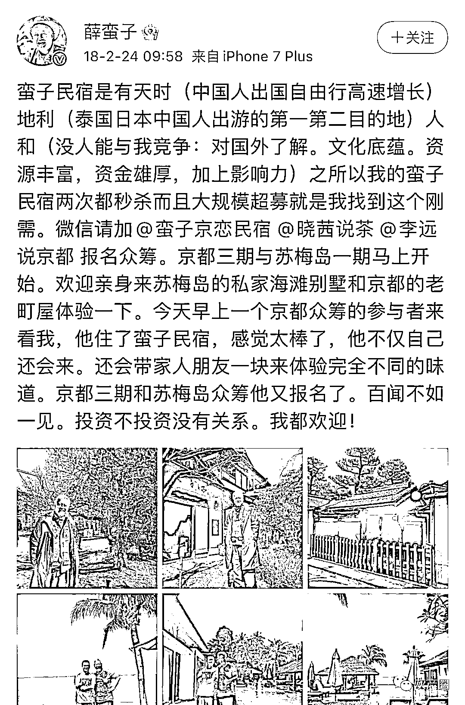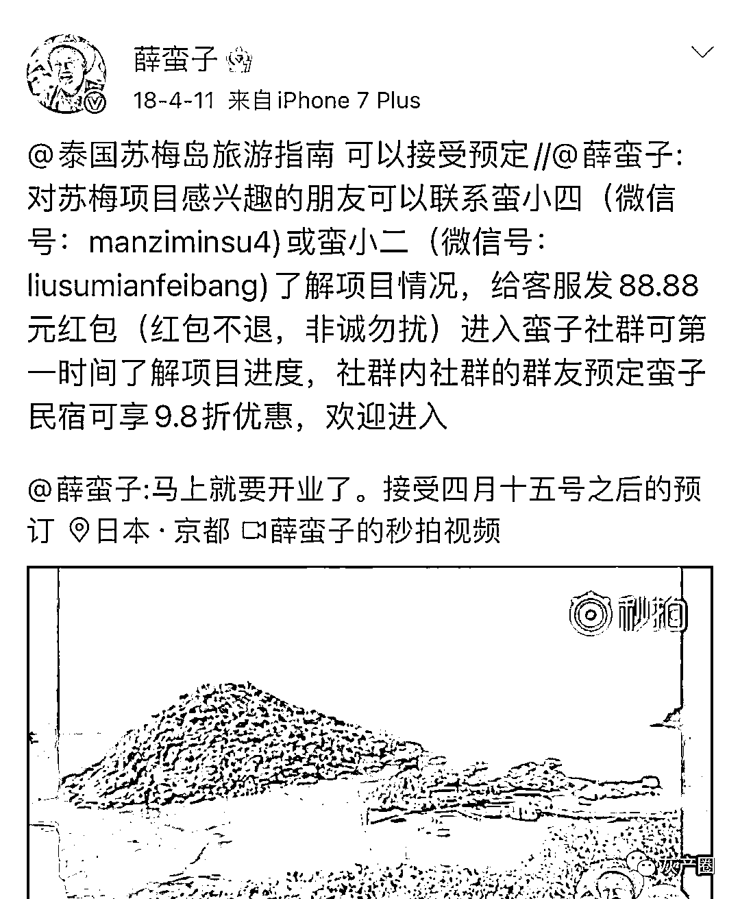2018 年初，薛蛮子在接受采访时曾提及其民宿事业。他表示，自己在日本东京买下了一条民宿街和 40 个老町屋。此外在泰国苏梅造了一百个海滩别墅。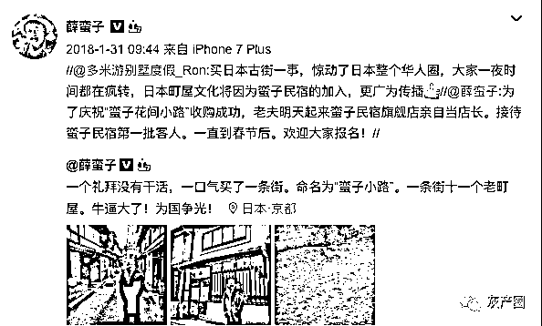薛蛮子还自豪地表示 all in 了“蛮子民宿”不到半年，就已经是海外民宿的第一品牌了。“中国人出游的第一第二目的地我都是第一品牌，我用几个人和很少的资本撬开了一个高山”。民宿后，薛蛮子还表示在柬埔寨投资买地。有消息称，2019 年 4 月，蛮子基金在柬埔寨当地宣布将联合柬埔寨自由女神像集团成立专注柬埔寨市场的天使投资基金——中柬蛮子基金，并且由薛蛮子携手团队亲自操刀。还有消息称，薛蛮子在柬埔寨买了上万亩地，并计划成立民宿旅游基地。还收购柬埔寨最大基础建材公司百川实业，并投入巨资扩建 30 条免烧砖生产线，4 条加气块生产线，1 家玻璃深加工厂，1 个建材城。薛蛮子本人也转发了相关报道。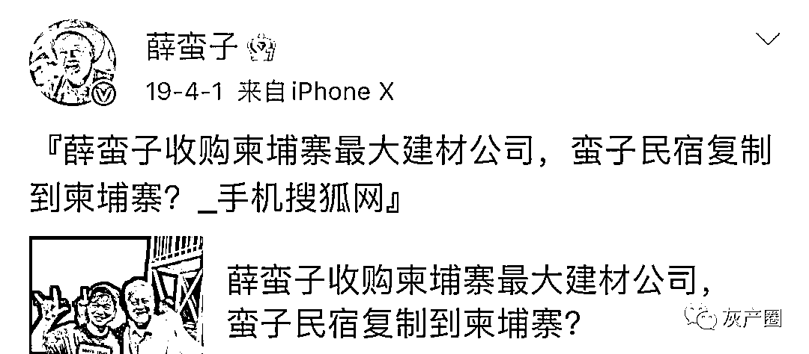从上面这些消息看，似乎薛蛮子生意做得风生水起，但是事实真的如此吗？首先，很多项目的情况都来自薛蛮子的单方面消息，无法交叉认证。**甚至不少人对其民宿和房产项目持怀疑态度，认为其在投资上存在夸大或作假可能。****此外，薛蛮子做民宿、房产不都是用自己的钱，有不少个人投资者参与。**甚至有投资者公开发文要求薛蛮子退款。2019 年 10 月 23 日，微信公众号“徽剑”发布《寻人启事：寻找薛蛮子》，文章指出，薛蛮子曾经在柬埔寨西港居住近一年，最近在金边出现，现在不知下落。文章称，多名曾经委托其投资的投资人，现在无法联系到其本人，希望其本人看到此消息后，尽快与投资人联系，协商投资款退款事宜。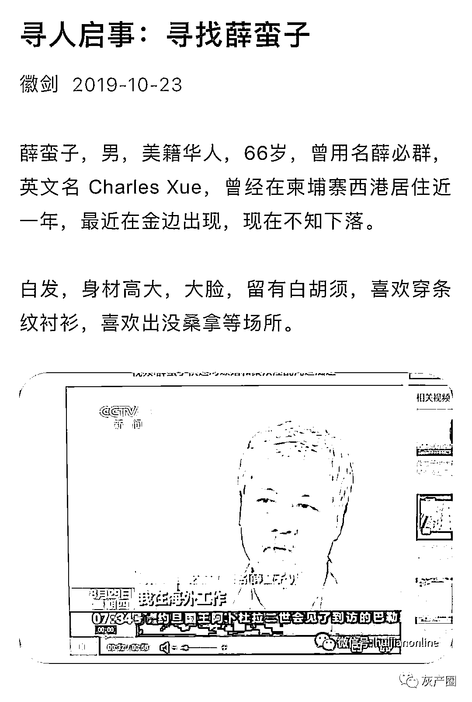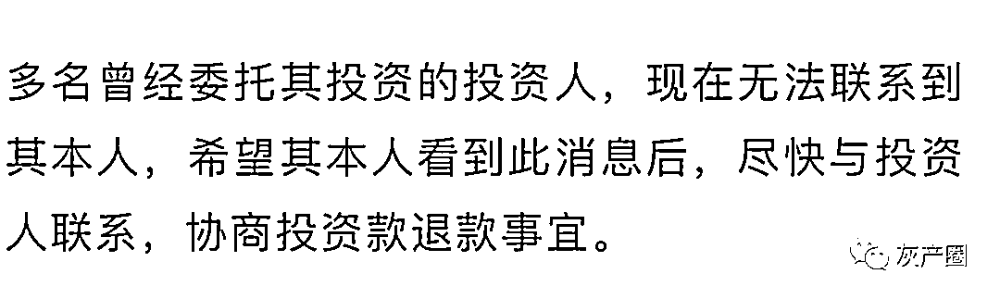当时这件事被各大主流媒体都报道了。不过后来薛蛮子发文否认失联，称肇事者蹭流量。据了解，“徽剑”一直在关注薛蛮子，发布了多条关于薛蛮子“骗人”的文章。**不过最近三言财经发现，又有投资者向薛蛮子讨债。**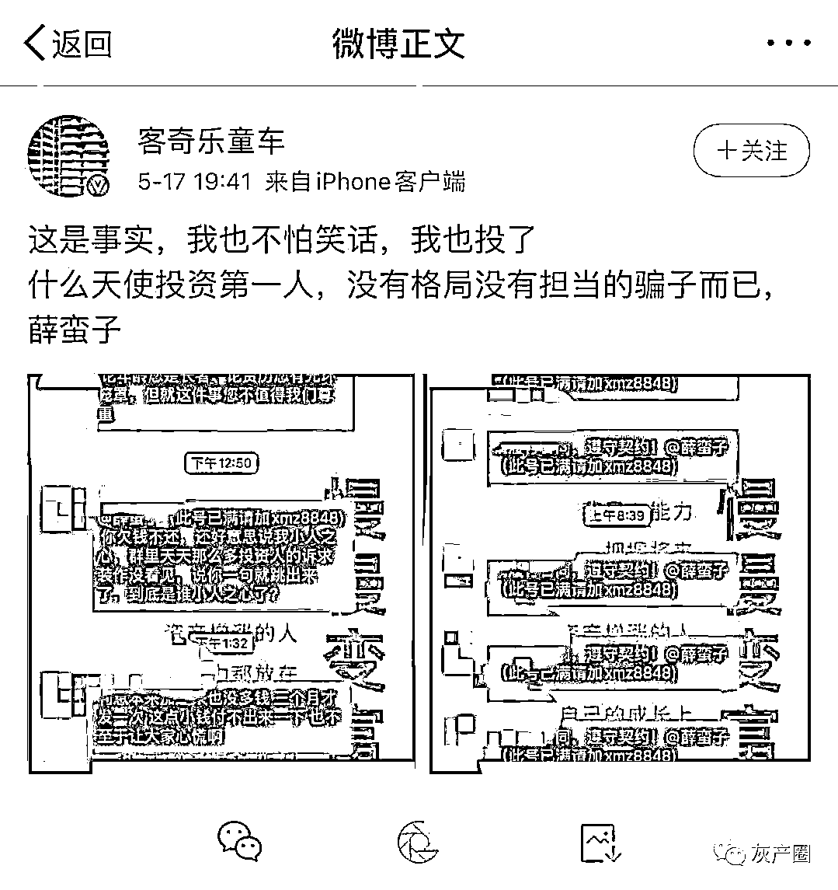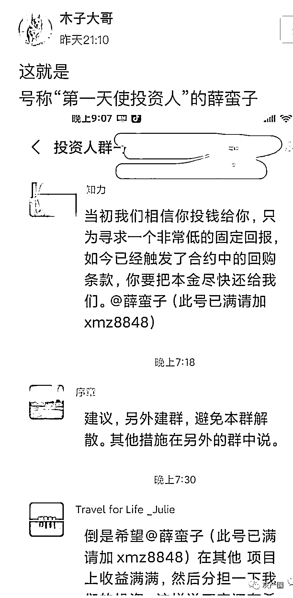**有投资者向三言财经透露，自己投资了薛蛮子的日本民宿项目，但是近一年的时间原先约定的固定收益却没收到。**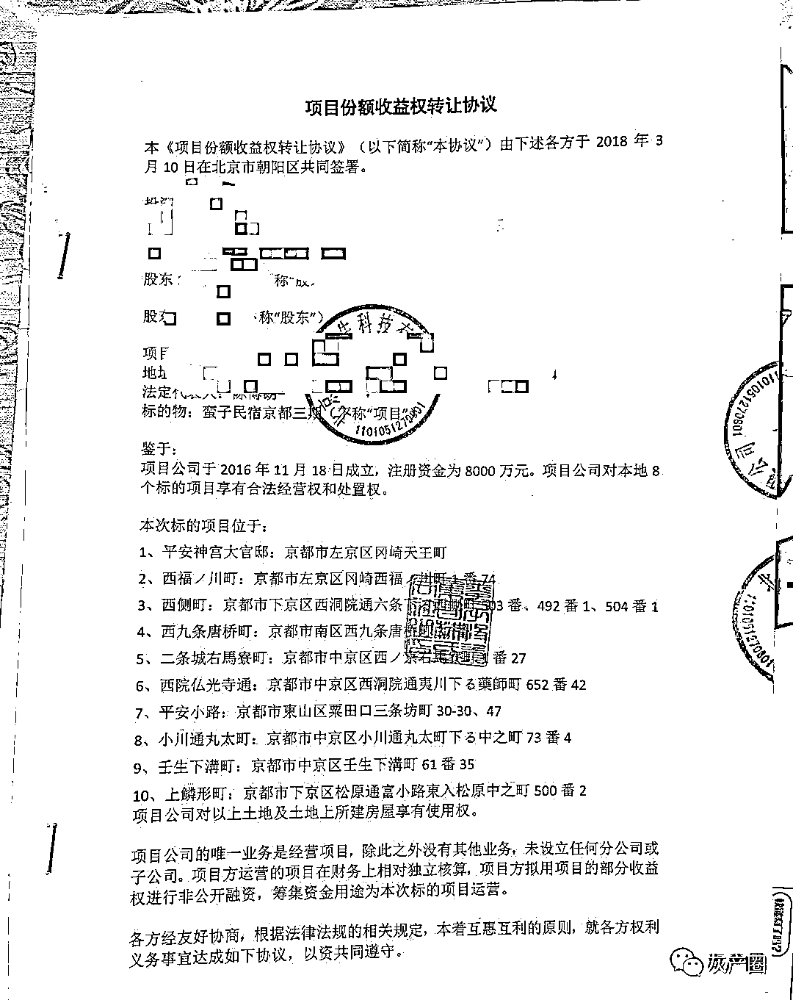该投资者表示还有数百位投资了薛蛮子的民宿项目，包括日本京都和泰国苏梅岛的。原先双方签订了合同，规定有每季度发放 8%的固定收益，并约定了回购期限。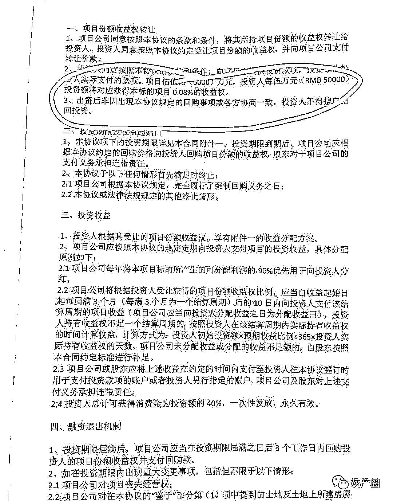投资金额从 5 万到数百万不止，回购期限也不尽相同。**该投资者向三言财经反映，从 2019 年底疫情爆发口，薛蛮子就以疫情影响为由，停止支付收益，本金也不退。**在投资者群中，众多投资者@薛蛮子，希望对方履行合同。不过据投资者称，薛蛮子消极回避，没有给出解决方案。值得注意是，在疫情之前收益是能正常收到。**当然也有人质疑，薛蛮子的民宿、房产项目只是套钱的手法，讨债者基本都是个人投资者，很多都是从薛蛮子的微博了解到了投资信息。**试问，一个整天炫富的天使投资人，却热衷于个人投资者，难道这不值得怀疑吗？事实上，在 2013 年以前，薛蛮子还是较为完美的个人形象，一件事彻底改变了一切。

薛蛮子的第一次“堕落”

从投资大佬到嫖娼被抓

薛蛮子出身根正苗红，1953 年出生于中国广东。不过他后来加入了美国国籍，在美国有 20 年投资房地产生意，后来回国发展。回国后，他的身份开始慢慢转变。他投资 UT 斯达康，最终以 25 万美金成本获得了 1.2 亿美金回报。他曾担任中国电子商务网 8848 董事长、中华学习网董事长等职务。后来他还投资了汽车之家、泡泡网、雪球财经等项目，开始在投资界有了一定的名声。2011 年，在过 58 岁生日的时候，周鸿祎送上了一句评价：“薛蛮子是中国天使投资第一人。”**从此薛蛮子便有了中国天使投资第一人的称号，这也是他最高大上的标签。**不过薛蛮子的名气很大程度上还和他在社交网络的活跃有关，他在微博上极其活跃，但是起初粉丝并不多，也只有 10 万左右。但是薛蛮子还懂得经营之道，他参加了微博的打拐活动，身上多了一个“微博打拐发起人之一”的标签，粉丝迅速飙升到 200 万。后来，薛蛮子宣布了自己患癌症的消息，更是塑造了一个抗癌斗士的形象。这也是其个人形象最高大的瞬间，直到现在其微博个人标签还写着“乐观的癌症斗士、地震救助、微博打拐、8848、天使投资”等。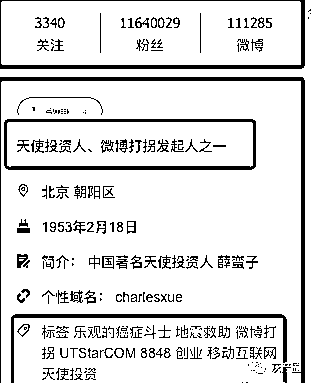这些标签构成了薛蛮子光辉的个人形象，但是 2013 年，薛蛮子嫖娼被抓事件轰动全国，一日之间个人形象崩塌。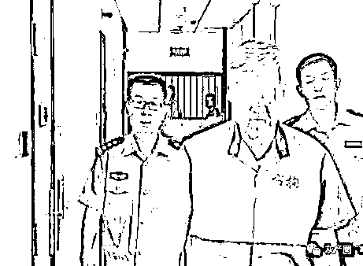**在三言财经看来，嫖娼事件似乎是一个薛蛮子的一个转折点，是其公开的第一次堕落。**有了第一次，或许第二次就不远了。忽悠者还是天使投资人？近几年，薛蛮子已经鲜有能拿到出手的投资案例了。直到他遇到了 ICO 的狂潮，一下子就被吸引了，但也陷入骗局的争议之中。而我们回头再看看薛蛮子的这些操作，有项目了就在微博里喊喊单，吸引一波粉丝“充值”，项目不行了就调转方向到下一个。凭借其 1000 多万粉丝，薛蛮子一会炒币，一会投资民宿，一会又投资地产，一个循环过去，最终又回到了炒币。**那么如果现在给薛蛮子新的标签，你又会写上什么呢？**他曾经有过辉煌时刻，被奉为中国天使投资第一人。但是他站台空气币是事实，被投资者讨债是事实，嫖娼是事实，再次推销虚拟货币也是事实。如果非要加个分界线，那么在 2013 年前，他是个光辉的天使投资人。现在他更像一个为了金钱和欲望，慢慢失去底线的投机者。**（注：炒币有风险，投资需谨慎！）**

← 向右滑动与灰产圈互动交流 →

