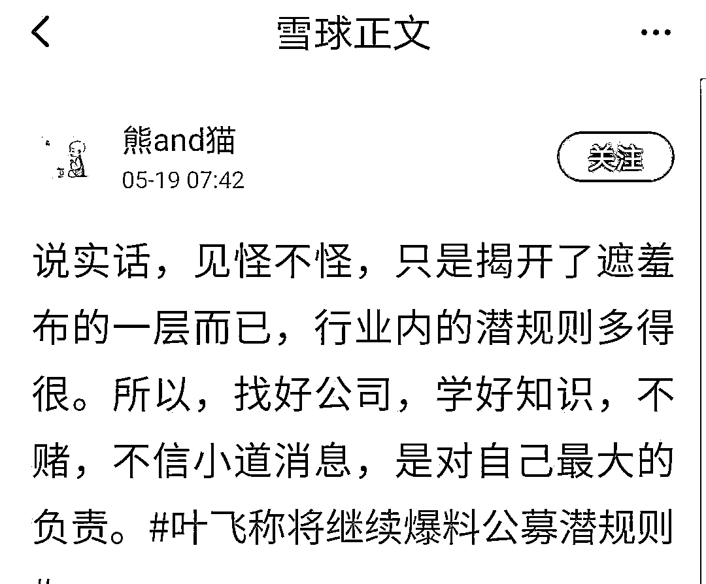

# 叶飞再爆猛料！公募基金也有潜规则？内部人士：性价比极低，实际操作难度大！

> 原文：[`mp.weixin.qq.com/s?__biz=MzIyMDYwMTk0Mw==&mid=2247514456&idx=5&sn=6dcafcbafa6796c593f709940fff1360&chksm=97cb7260a0bcfb765e757d01bbe07573d9fa6650b2b1586d84ab10501959969c860fd1347131&scene=27#wechat_redirect`](http://mp.weixin.qq.com/s?__biz=MzIyMDYwMTk0Mw==&mid=2247514456&idx=5&sn=6dcafcbafa6796c593f709940fff1360&chksm=97cb7260a0bcfb765e757d01bbe07573d9fa6650b2b1586d84ab10501959969c860fd1347131&scene=27#wechat_redirect)

爆料完庄股之后，叶飞再爆惊人猛料，称公募基金也有潜规则。

叶飞表示：应施加雷霆手段，持续提高违法违规成本，除让违法违规主体倾家荡产外，更要通过司法责任追究，让情节严重者锒铛入狱，从而更好发挥监管威慑力。此外，还可以通过建立激发内部人举报的机制，利用市场力量来打击伪市值管理，形成市场监督合力。

公募基金的潜规则到底是什么？叶飞爆料门事件持续发酵后，部分公募已开启自查，摸查基金经理的投资情况。

01

**叶飞再发文**

**募基金也有潜规则？**

继庄股之后，叶飞再度发文爆料公募潜规则： 

其表示，公募基金的两个潜规则！

1、公募和券商资管一样的合作模式，只要几个点的费用。

2、公募和盘方合作，公募交出自己的股票池，然后盘方选出认可的股票，盘方先买。比如买三亿，那么，其中拿出 3000 万的市值作为帮公募基金经理买的。

接下来，公募负责拉升，盘方每赚 10%就提现给公募。

这样，外边看起来很合规，因为盘方没有操纵股价，而是公募在操纵。

叶飞对记者解释：“盘方买了底仓，如果自己要拉升股价的话，一方面可能涉嫌操纵股价，另外可能要花大量的钱，通过公募基金完成从建底仓到抬轿到出货一条龙服务。例如，盘方买了三个亿，按 10%算，将其中 3000 万的收益分给基金经理，出货时再按照 3%、5%的比例来分成。”

并且，由于股票是从公募的股票池里挑出来的，经过层层尽调，基本上不会踩雷，所以这类情况很难查出来。

对此，多位基金人士表示，这种情况不是普遍现象。

不过近日连续爆料的叶飞已成老赖，天眼查 App 显示，近日，叶飞及其关联公司淮北市倚天投资有限公司等已成为被执行人，截至目前，叶飞及其公司被执行总金额已超 836 万元。同时，该公司多次被列为失信被执行人（老赖），涉及多则终本案件及限制消费令。

02

**理论上可行**

**实际操作难度大**

对于叶飞所言，一位私募人士直言，“理论上讲，叶飞所说的潜规则是可以操作的。参与市值管理的返利对于一些管理规模比较小、收入相对不高的基金经理还是比较大的诱惑，并且小市值股票的交易量不算大，其波动对基金净值影响也不大，所以理论上来看，只要这只股票在公募基金的股票池里，是有一定的可操作空间的。”

“不过，现实中要真正达成类似的合作，是具有一定门槛和难度的。”据另外一位金融人士分析，首先，有可靠的盘方、资方，且能彼此信任。其次，能够和上市公司形成同步互动，比如说在拉升股价的时候，公司不能突然出现利空消息。最关键的是，能够吸引到散户入场，这就需要有相关研报强有力推荐或“韭菜群”，才能形成闭环。

“需要调动的资源太多，并且坦白讲，如果业绩表现优秀，基金经理的薪酬也较为可观，做这种事情还是很不值得的。”

与此同时，某公募人士表示，一般公募基金公司的股票进池需要经过四层筛选，即研究员、基金经理、风控部门、投委会，能够入池的股票大概率市值不会太小，一些基金公司更是对入池公司市值有明确的要求，所以基金经理进行上述违规操作难度比较大。

另一公募人士表示，且不论投资经理是否会为百来万葬送自己的职业生涯，对管理规模较大的基金经理来讲，做这种事更是性价比极低的选择。单纯从投资流程来看，投资决策流程有很长的链条，有小报告大报告，还有投研会议上的汇报，跟踪一只股票的时间周期是很长的。假如选择了非股票池之外的股票，那更是需要层层签字，现在不是过去那种“基金经理想怎样就怎样”的时代了。

03

**基金经理：不会买极小市值股票**

某基金公司资深基金经理表示，经过叶飞这事后，部分基金公司的风控肯定会有所改变，也会更严。“同业群里听人说，有部分基金公司直接出了小票不让碰的规则，尤其是前十大重仓股中不允许出现小票的情况。”

但也有基金经理表示，“小市值股票并不一定会导致风险，很多公司都是从小市值成长起来的，如果一棒子打死，也会错失很多投资机会。”但他也不会买极小市值的股票，如果股票体量过小，交易量也很小，本身流动性就存在问题。

不仅是基金公司风控层面，还有多位基金经理就此对自身投资进行反思，他们表示，即使是市场中部分上市公司参与了市值管理，对于持长期投资理念的基金经理而言，无非也就是让股价产生一时波动，在对基本面没有重大影响下，不会过度关注。但针对微博叶飞所说，无论是否真有公募基金经理参与，在此后投资中，也会将部分短期影响股价因素，纳入选择标的的因素之一。

某公募基金经理明确表示，股票池构建很严格：若我们发现某一标的不错，在经过财务等基本面分析后，会安排研究员进行实地调研，若标的质量不错，则进入公司一级股票池，但若想要进入二级或三级股票池，需基金经理跟公司提交调研报告，由研究员团队组织多次调研，并撰写多篇深度报告，所以并不是基金经理单个人可以操纵全过程。

经过这一流程后，提交公司全体投研会进行讨论。“很多票在这个过程中就被毙了，投研会中一堆基金经理会质疑，若投票通不过，根本没办法进入公司核心的股票池。”

04

**后记**

球友@熊 and 猫：说实话，见怪不怪，只是揭开了遮羞布的一层而已，行业内的潜规则多得很。所以，找好公司，学好知识，不赌，不信小道消息，是对自己最大的负责。

球友@villike：叶飞这个事情，再次证明了我们所处的世界，其实是充满了各种突发事件的，买股票做投资真的不容易，因为我们永远也不会知道，下一次会出一个什么突发事件，这个突发事件又会不会影响我们持有的公司。

虽然我一直说，分散的持仓是一种结果，而不是一种意图，但是，总归还是要扩大自己的能力圈，去适当做一些分散的持仓，这本质上，是对于自己能力有限的认知，以及对世界不可知的敬畏。

终归说到底，还是要看公司质地如何，如果公司本身没有问题，出现一些负面事件的时候，往往就是买入的良机了。

球友@不说真话的群众：叶飞事件让我明白，李大霄老师才是股市正道！正所谓：做好人，买好股，得好报！这是警示良言。

来源：雪球

← 向右滑动与灰产圈互动交流 →

