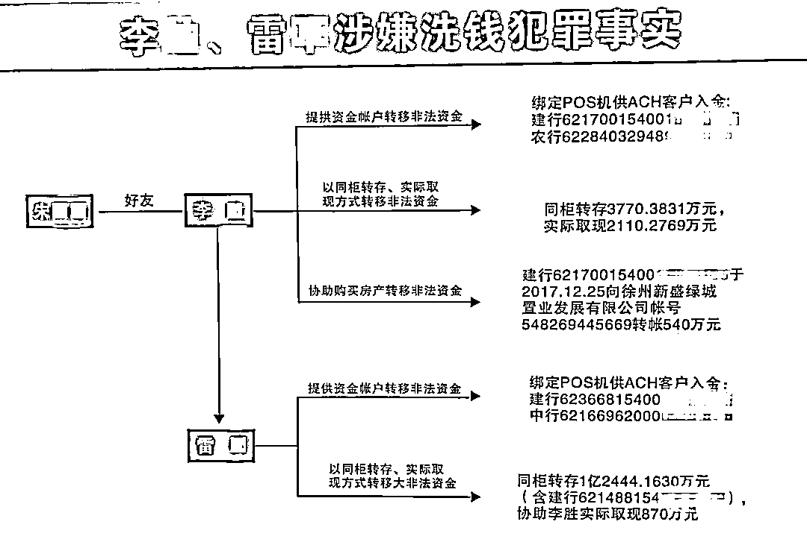
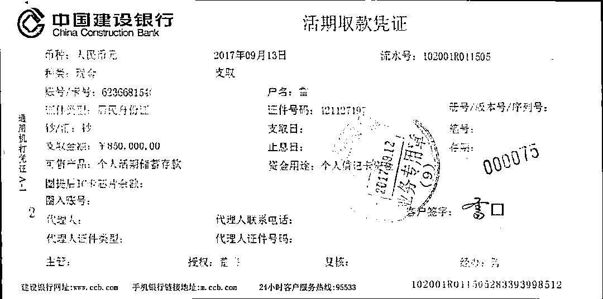
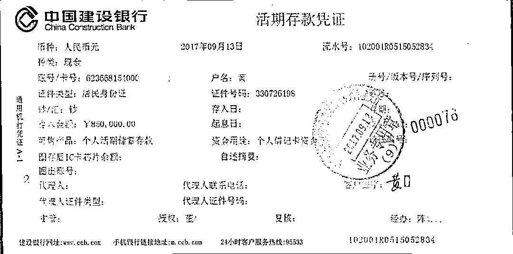
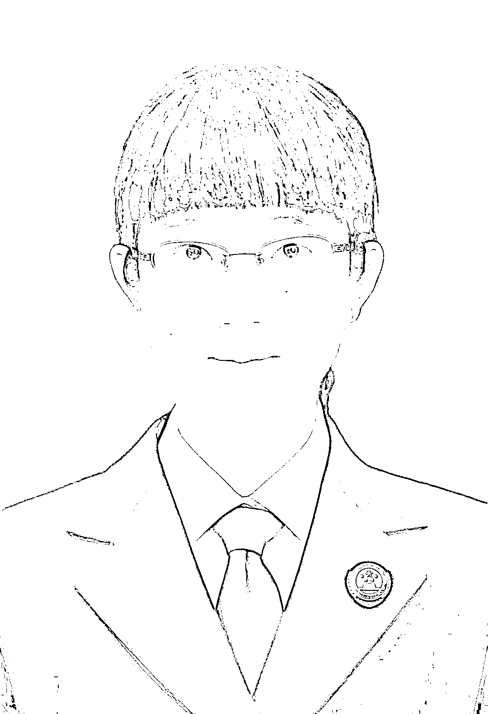

# P2P 爆雷，近亿赃款、“金融才女”去了哪儿？洗钱“案中案”浮出水面

> 原文：[`mp.weixin.qq.com/s?__biz=MzIyMDYwMTk0Mw==&mid=2247514456&idx=6&sn=26b0afc72ef222d9de5a4ba45079e900&chksm=97cb7260a0bcfb763cbdb71cd83a9a9e578721acc53c8e7c9650c5ed34fea6a74b46d38e88ca&scene=27#wechat_redirect`](http://mp.weixin.qq.com/s?__biz=MzIyMDYwMTk0Mw==&mid=2247514456&idx=6&sn=26b0afc72ef222d9de5a4ba45079e900&chksm=97cb7260a0bcfb763cbdb71cd83a9a9e578721acc53c8e7c9650c5ed34fea6a74b46d38e88ca&scene=27#wechat_redirect)

**P2P 爆雷后**

**美女老板卷款去了哪里？**

**巨额赃款是如何被洗白的？**

**在办理集资诈骗案的过程中**

**检察官顺藤摸瓜****查出**

**一起涉案金额近亿元的洗钱“案中案”**

**……**

2021 年 3 月 19 日，[最高人民检察院联合中央人民银行发布了惩治洗钱犯罪的 6 个典型案例，](http://mp.weixin.qq.com/s?__biz=MzA4MjQ5MzIxNQ==&mid=2650652629&idx=1&sn=b49badb832e2b8f422923b21b099b3f6&chksm=878df5a5b0fa7cb352765b5965ccaba8e9e47be27bc708379508dc9c074f6b7c70fce6ffd176&scene=21#wechat_redirect)雷某、李某洗钱案位列其中。因一起集资诈骗案的近亿元赃款去向不明，办案人员顺藤摸瓜发现了“案中案”，雷某、李某洗钱的犯罪行为才被发现。

经审理，浙江省杭州市拱墅区法院作出判决，认定雷某、李某犯洗钱罪，判处雷某有期徒刑三年六个月，并处罚金 360 万元，没收违法所得；判处李某有期徒刑三年，并处罚金 170 万元，没收违法所得。宣判后，雷某提出上诉。2020 年 6 月，杭州市中级法院裁定驳回上诉，维持原判。

2020 年 10 月 29 日，杭州市中级法院对集资诈骗案的被告人作出一审判决，认定朱某犯集资诈骗罪，判处无期徒刑，剥夺政治权利终身，并处没收个人全部财产；犯偷越国（边）境罪，判处有期徒刑一年，并处罚金 1.5 万元；二罪并罚，决定执行无期徒刑，剥夺政治权利终身，并处没收个人全部财产。2020 年 11 月，朱某提出上诉，目前该案二审尚未开庭。

一个电话

“金融才女”邀请加入“钱途”事业

70 后的李某是杭州本地人，2016 年底接到的一个电话，彻底改变了他的人生轨迹。打电话来的不是别人，是朱某。李某与朱某于多年前相识，朱某致电李某时，自称已成为一家知名金融理财公司的大老板，行内称其为“金融才女”。

朱某对李某颇为热情，不仅邀请他参观了自己的腾信堂公司，还向他介绍了公司对外发售的金融理财产品。几次联络之后，李某和朱某更加熟络，并称朱某为“干姐姐”。之后朱某拉李某加入了自己的金融事业，她在腾信堂公司旗下成立了一家商务咨询公司，让李某做执行董事兼法定代表人。因为业务需要，那时的李某时常要外出，眼看李某还没买车，朱某十分豪气地说：“你现在来帮我做事，我出 5 万元给你买车付个首付，以后到各处走动都方便些。”就这样，李某在朱某的“照顾”下，帮“干姐姐”做事更卖力了。

2017 年 6 月，朱某找到李某，对他说：“我一直都是把你当弟弟看的，只相信你。现在我外面的资金比较多，你帮我过一过。”**朱某提出，让李某办理一张银行卡，供她的公司走账使用，并承诺每月支付李某 1 万元的“好处费”，而且“准时到账”。**李某听到有如此“好”的条件，心动不已，不仅一口答应了朱某的要求，还拉来自己的同事雷某一起参与这份颇具“钱途”的事业。

理财平台爆雷

背后牵扯出一连串犯罪

该案同柜存取的凭证 

此后，腾信堂公司非法募集的大量社会公众资金被陆续存入雷某、李某的账户。根据朱某等人的指示，雷某、李某曾在杭州各银行的营业厅为朱某多次取现，每次金额都是几十万元甚至几百万元。每次，雷某、李某二人都是把现金装在塑料储物箱里，再抬到朱某的办公室当面交给她。

雷某、李某两人不仅大额提现，还以同柜取存的方式，协助腾信堂公司将巨额赃款流转给他人。

**什么是“同柜取存”？**据办案检察官介绍，就是由前后二人相互配合，在银行同一柜面办理取现、存款业务，达到转账的效果，但不留下转账痕迹的一种新型资金转移方式。腾信堂公司的财务人员从公司关联账户取现后直接存入李某或雷某的账户中，这样一来，就不会留下两个账户互相转账的痕迹，从而掩盖了资金去向，增加了追踪资金的难度。

就这样，雷某、李某二人通过帮朱某大额取现、同柜取存的方式，万元“好处费”每月轻松入账。但这样轻松赚钱的时间并没有持续很久。2017 年秋，在理财平台此起彼伏的“爆雷”声中，雷某和李某开始惶恐不安。因担心受朱某牵连，李某将原先由朱某出资首付的汽车过户到他朋友老婆的名下进行掩饰、隐瞒。李某还删光了自己与雷某、朱某的聊天记录，以求撇清关系。雷某则找到朱某，让她写了一张“走账与雷某无关”的字条，准备留着当“护身符”。

法网恢恢，2018 年夏，腾信堂公司因涉嫌非法吸收公众存款罪被立案侦查，此案是杭州市拱墅区 2018 年度“爆雷”的最大规模的非法集资案。当年 6 月，朱某在保镖的协助下，潜逃至泰国曼谷。拱墅区公安和检察人员意识到，非法集资领域涉及的犯罪，既有可能是破坏金融管理秩序犯罪中的非法吸收公众存款罪，也有可能是金融诈骗犯罪中的集资诈骗罪。根据刑法规定，这两类犯罪都是洗钱罪的上游犯罪。

**2019 年 1 月，经追逃，朱某被杭州拱墅警方从泰国押解回杭州，这起非法集资案告破。**而协助朱某外逃的保镖徐某和李某某等人也因涉嫌组织他人偷越国（边）境等罪同时被查处。

在办理这起涉嫌组织他人偷越国（边）境案中，办案人员发现李某某在案发前后曾多次提供相应银行卡账户，协助朱某将巨额非法集资款散存于多个银行账户，并在不同银行账户之间频繁划转，将资金转化为房产、汽车、珠宝等财物或参与其他投资活动，可能涉嫌洗钱犯罪，李某某对明知朱某进行非法集资活动的事实供认不讳。此后，李某某被拱墅区检察院以涉嫌洗钱罪等罪名批准逮捕。

2020 年 9 月 30 日，拱墅区法院依法作出一审判决，朱某的保镖团成员徐某犯组织他人偷越国（边）境罪，判处有期徒刑七年，并处罚金 2 万元。保镖团成员李某某犯洗钱罪判处有期徒刑二年，并处罚金 70 万元；犯窝藏罪，判处有期徒刑二年；二罪并罚，决定执行有期徒刑三年，并处罚金 70 万元。

抽丝剥茧

揭开“集资诈骗—洗钱”犯罪链

公安民警将李某抓获

李某某被捕后，雷某、李某涉嫌的洗钱“案中案”也随之逐渐浮出水面。经过检察官对案件抽丝剥茧、层层深入的办理，在人民银行反洗钱处的协助下，公安机关查清了雷某、李某采用同柜取存、大额取现、大额转账等多种方式协助转移近 1 亿余元非法集资款的犯罪事实，并于 2019 年 5 月将两人抓获归案。**2019 年 6 月，雷某、李某被拱墅区检察院以涉嫌洗钱罪批准逮捕。**

“当时办理雷某、李某的案件时，对于该案如何定性，在办案过程中存在两种不同的意见，一种意见认为应定非法吸收公众存款罪的共犯，另一种意见认为应定洗钱罪。”办案检察官说，该案的争议焦点在于如何区分洗钱罪和上游犯罪共犯，他们在办理过程中最终采纳了第二种意见。

“雷某、李某洗钱案洗钱金额大，持续时间长，社会危害性非常严重。对于在非法集资行为持续期间，帮助转移集资款的行为，应当认定为洗钱罪。”办案检察官表示，**一般情况下非法集资犯罪处于长期持续状态，对于集资期间帮助非法集资犯罪分子转移集资款，符合刑法第 191 条规定的行为，应当认定为洗钱罪。**上游犯罪是否既遂，不影响洗钱罪的认定。

在这起案件的办理中，除雷某、李某外还牵涉到了经办的金融机构。检察官在办案中发现，经办银行在客户身份识别、可疑交易报告等多个环节上，都存在反洗钱履职不到位的问题。最典型的就是，洗钱行为人通过银行柜面办理了大量同柜取存的伪现金业务，实际上并没有现金提取，很明显是为了切断资金流转痕迹。但是，经办的柜面一次也没有拒绝交易，一次也没有向银行内部的反洗钱岗位或者上级管理部门报告。**案发后，中国人民银行杭州中心支行对经办银行启动了反洗钱调查，最终确认了银行的违法事实，并且根据反洗钱法对经办行开出了 400 万元的罚单。**

在案件办理中，办案检察官基本摸清了该系列案件的脉络，组织他人偷越国（边）境案、洗钱案这一系列案件的上游都指向集资诈骗。承办该案的检察官介绍道，“在未经国家金融管理部门批准的情况下，腾信堂公司自 2013 年 11 月开始，以年化收益率 11%至 20%为诱饵，采用招揽业务员线下拉客户投资外汇理财的方式，向 1800 余名集资参与人非法集资 14 余亿元，造成 1200 余名集资参与人损失共计 8 亿余元。”2020 年 10 月 29 日，经杭州市检察院提起公诉，杭州市中级法院对被告人朱某作出一审判决。

同时，检察机关查明，2016 年年底，朱某出资成立了一家商务咨询有限公司，聘请雷某、李某为其从事商业调查工作，可实际上，雷某、李某干的是明知资金是集资诈骗、非法吸收公众存款犯罪所得，还向朱某提供多张本人银行卡用于接收腾信堂公司非法集资款的勾当。经查实，**2017 年 6 月至 2018 年 1 月间，雷某、李某通过同柜取存、实际取现、转账等方式协助转移非法集资款，分别共计 6300 余万元和 3200 余万元。**

2019 年 7 月，杭州市公安局拱墅分局以雷某、李某涉嫌洗钱罪将案件移送审查审查起诉。2019 年 8 月，拱墅区检察院以洗钱罪对雷某、李某提起公诉。11 月，拱墅区法院对雷某、李某洗钱案作出判决。

行政监管和刑事处罚相结合

促进金融行业治理

**浙江省杭州市拱墅区检察院**

**第一检察部 杜倩楠** 

为非法集资洗钱的犯罪分子，在明知他人实施非法集资犯罪的情况下，将巨额的非法集资款，以隐蔽的手段分别进行转移、掩饰、隐藏，不仅造成广大投资人的财产损失，也给司法机关查办案件制造了难度，这既是追赃挽损的关键环节，也是惩治犯罪的痛点难点。

洗钱犯罪手段多样，变化频繁，本质都是通过隐匿资金流转关系，掩饰、隐瞒犯罪所得及收益的来源和性质。本案被告人为隐匿资金真实去向，大额取现或者将大额赃款在多个账户间进行频繁划转；为避免直接转账留下痕迹，将转账拆分为先取现后存款，人为割裂交易链条，利用银行支付结算业务采取了多种手段实施洗钱犯罪。实践中除上述方式外，还有利用汇兑、托收承付、委托收款或者开立票据、信用证以及利用第三方支付、第四方支付等互联网支付业务实施的洗钱犯罪，资金转移方式更专业，洗钱手段更隐蔽。

洗钱犯罪的本质是破坏国家金融管理秩序，为非法资金披上合法外衣，逃避法律的追究与制裁。由于洗钱犯罪的社会危害性极大，司法理应对其重点打击。2021 年 3 月 1 日起，刑法修正案（十一）正式实施，新增“自洗钱”行为构成洗钱罪的规定，为贯彻新规定，最高检会同最高法研究修改洗钱罪，掩饰、隐瞒犯罪所得、犯罪所得收益罪的司法解释，对长期存在的法律适用难点和争议点予以明确，对不适应执法司法实际情况的部分规定进行调整。

2021 年 3 月下旬，最高检联合中央人民银行发布了惩治洗钱犯罪的 6 个典型案例，雷某、李某洗钱案为其中之一。该案件不仅在事实认定、法律适用上对司法办案工作具有重要指导作用，而且对金融行业的健康发展有一定教育警示意义。金融机构是预防洗钱犯罪的“第一道防线”，如果履职不到位，就会给犯罪分子提供可乘之机。**只有将行政监管和刑事处罚结合在一起，充分发挥金融机构、行政监管和刑事司法反洗钱工作合力，共同落实反洗钱义务和责任，才能更好地惩治洗钱犯罪和促进金融业发展。**

来源：最高人民检察院微信公众号、港南检察，利箭在行动

← 向右滑动与灰产圈互动交流 →

