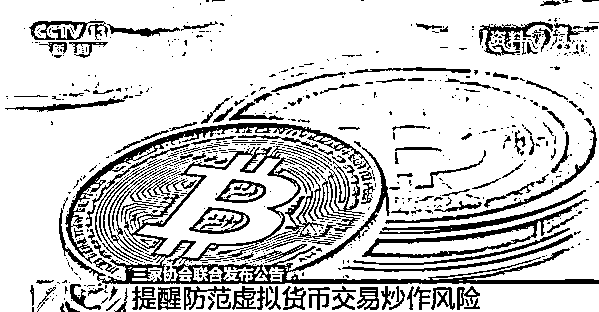
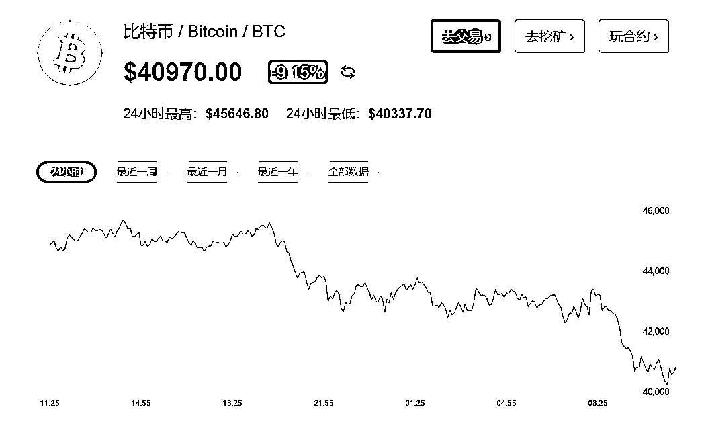
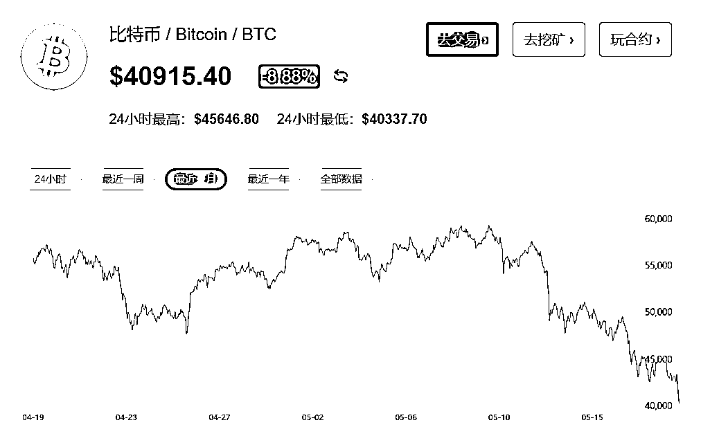

# 央行发文，中国三大监管机构联手“封杀”虚拟货币，加密货币大跳水，比特币跌穿 41000 美元

> 原文：[`mp.weixin.qq.com/s?__biz=MzIyMDYwMTk0Mw==&mid=2247514456&idx=7&sn=6afd5d85495fc9fc02399c45d7927a51&chksm=97cb7260a0bcfb76cd31754adf44052ec764a3af6e0285f759328b0868ce0516c97015c8a7a9&scene=27#wechat_redirect`](http://mp.weixin.qq.com/s?__biz=MzIyMDYwMTk0Mw==&mid=2247514456&idx=7&sn=6afd5d85495fc9fc02399c45d7927a51&chksm=97cb7260a0bcfb76cd31754adf44052ec764a3af6e0285f759328b0868ce0516c97015c8a7a9&scene=27#wechat_redirect)

 

18 日晚间，央行出手发文，金融业三大协会发声：提供虚拟货币交易服务涉嫌开展非法金融活动。 

中国互联网金融协会、中国银行业协会、中国支付清算协会联合发布公告，明确有关机构不得开展与虚拟货币相关的业务，同时提醒消费者提高风险防范意识，谨防财产和权益损失。 

公告宣布：

1、**虚拟货币不是真正的货币。**它只是一种特定的虚拟商品，不由货币当局发行，不具有法偿性与强制性等货币属性，不应且不能作为货币在市场上流通使用。

2、**交易、兑换是非法的。**开展法定货币与虚拟货币兑换及虚拟货币之间的兑换业务、作为中央对手方买卖虚拟货币、为虚拟货币交易提供信息中介和定价服务、代币发行融资以及虚拟货币衍生品交易等相关交易活动，违反有关法律法规，并涉嫌非法集资、非法发行证券、非法发售代币票券等犯罪活动。

3、**金融机构、支付机构不得开展与虚拟货币相关的业务。**不得用虚拟货币为产品和服务定价，不得承保与虚拟货币相关的保险业务或将虚拟货币纳入保险责任范围，不得直接或间接为客户提供其他与虚拟货币相关的服务，包括但不限于：为客户提供虚拟货币登记、交易、清算、结算等服务；接受虚拟货币或将虚拟货币作为支付结算工具；开展虚拟货币与人民币及外币的兑换服务；开展虚拟货币的储存、托管、抵押等业务；发行与虚拟货币相关的金融产品；将虚拟货币作为信托、基金等投资的投资标的等。

4、**有线索，要举报。**金融机构、支付机构发现违法违规线索的，要及时按程序采取限制、暂停或终止相关交易、服务等措施，并向有关部门报告。

5、**不得宣传、不得导流。**互联网平台企业会员单位不得为虚拟货币相关业务活动提供网络经营场所、商业展示、营销宣传、付费导流等服务，发现相关问题线索应及时向有关部门报告，并为相关调查、侦查工作提供技术支持和协助。

6、**重申“虚拟货币交易合同不受法律保护”。**公告说，虚拟货币无真实价值支撑，价格极易被操纵，相关投机交易活动存在虚假资产风险、经营失败风险、投资炒作风险等多重风险。从我国现有司法实践看，虚拟货币交易合同不受法律保护，投资交易造成的后果和引发的损失由相关方自行承担。 

目前，境内已经没有比特币等虚拟货币的交易场所，“翻墙”在境外买比特币没有消费者保护措施，投资者受到损失只能自负。尤其是参与比特币等虚拟货币的个人和企业不被法律保护，交易合同属于无效，投资者需自行承担风险。 

**为何此次联合公告不是监管机构发布而是由三协会发出**？ 

据科创板日报，北京大成律师事务所合伙人肖飒指出，币圈本身就是灰色产业，没有所谓监管机关，协会是行业自律组织，其公告或声明虽然不具有法律效力，但具有重要参考意义，重申了我国对虚拟货币的监管态度。 

尤其在民事判决中，对于协会的公告会当作“行业惯例”进行引用，因此，可以预见未来一段时间，虚拟币涉诉案件将受到此公告影响。再次，摸着石头过河，协会的公告是打预防针，让公众知悉虚拟币炒作的违法性，如果事态好转，则就此作罢；如果事态恶化，相关硬法就要登场。

新一轮币圈整顿或将来临

据了解，虚拟货币场外交易商和大部分交易所不受监管，虚构交易、操纵价格、侵吞客户资金的情况时有发生。

据华夏时报统计，中国裁判文书网数据显示，近年来，以虚拟货币为案由的案件不断增多，2016 年与虚拟货币相关的案件文件仅有 390 篇，至 2020 年已增长至 1761 篇。 

> 日前，安徽省安庆市公安局日前破获一起特大网络传销案，犯罪嫌疑人炮制概念，炒作“空气币”，以提供虚拟数字货币增值服务为幌子，进行网络传销。该平台在全国 12 个省市招募会员近 2000 人，累计涉案金额超过 2 亿元。 
> 
> 5 月 7 日，永嘉县人民法院一审判决一起非法获取计算机信息系统数据案。4 个 20 多岁的年轻人合谋创设发行“翡翠币”，计划以低价买入、高价卖出的方式进行营利。该案主犯钟某犯非法获取计算机信息系统数据罪，被判处有期徒刑四年六个月，并处罚金 10 万元人民币。

5 月 13 日发布的《2020 年度上海金融检察白皮书》显示，虽然涉网络借贷平台类非法集资案件量下降，但非法集资宣传手段却不断翻新，如不当使用"区块链""算力""虚拟币"等新概念迷惑投资人。 

近年来监管部门对虚拟货币领域的监管和整治从未停止。 

比如，2013 年中国人民银行等五部门发布《关于防范比特币风险的通知》显示，从性质上看，比特币应当是一种特定的虚拟商品，不具有与货币等同的法律地位，不能且不应作为货币在市场上流通使用。 

2017 年 9 月，在互联网金融风险专项整治工作框架下，人民银行等七部门联合发布《关于防范代币发行融资风险的公告》，明确虚拟货币交易和代币发行融资平台涉嫌非法发行证券、非法集资，指导各地集中取缔 173 家平台，此后保持监管高压态势，累计清退 38 家境内新增平台。 

加密货币又跳水

消息出来后，比特币、狗狗币均出现了跳水行情。而近日，“我卖了”，“我没卖”，马斯克一句话，便能引起加密货币市场的急涨急跌。

周三(5 月 19 日)亚市盘中，加密货币再度跳水，比特币、以太坊大跌。截至 19 日 11:32，比特币跌超 9%，失守 41000 美元，报 40970 美元。

从比特币最近一月走势看，比特币已跌入低谷。

华尔街多位技术分析师表示，**去年掀起加密货币热潮以来，比特币眼下所陷入的最严重抛售势将进一步加剧。**

当地时间 5 月 16 日，特斯拉创始人兼 CEO 马斯克(Elon Musk)在一则推特中暗示，特斯拉可能/可能已经抛售比特币持仓，导致比特币大跌。随后在 17 日，马斯克又表示，“特斯拉并没有卖出任何比特币。” 

从马斯克对特斯拉接受比特币支付的立场逆转以来，比特币跌将近 25%。

去年以来，比特币暴涨带动了整个币圈的疯狂。近期以狗狗币为代表的“动物园币”“山寨币”疯狂拉涨。在虚拟币“带货狂人”马斯克的鼓吹下，狗狗币半年暴涨了 260 倍。更有柴犬币在 30 天的时间涨了上万倍，3 个月涨了 10 万倍。

近日，中信银行官网发布公告称，从即日起，任何机构和个人不得将中信银行账户用于比特币、莱特币等的交易资金充值及提现、购买及销售相关交易充值码等活动，不得通过中信银行账户划转相关交易资金。一经发现，中信银行有权采取暂停相关账户交易、注销相关账户等措施。

来源：21Teh、中国基金报、华夏时报、新华社、科创板日报、FX168

← 向右滑动与灰产圈互动交流 →

