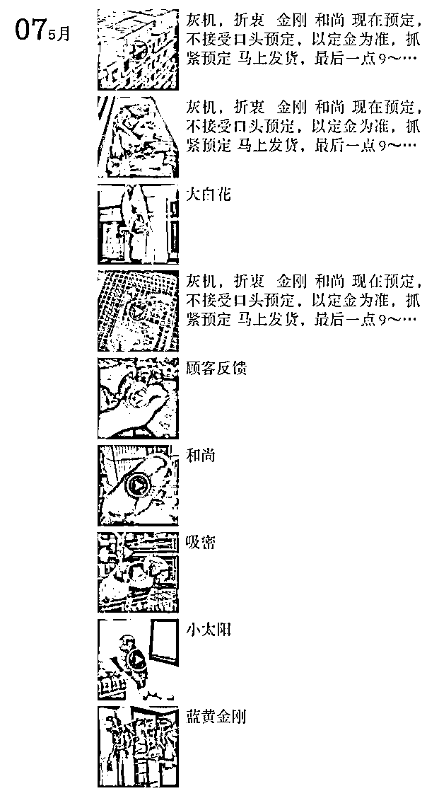
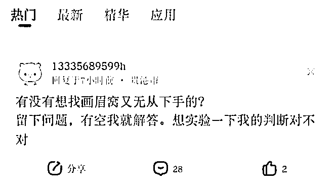

# “什么鸟都有”，淘宝贴吧闲鱼等成国保鸟类非法交易场

> 原文：[`mp.weixin.qq.com/s?__biz=MzIyMDYwMTk0Mw==&mid=2247514456&idx=8&sn=1800fd418433030405881494bcc2b16e&chksm=97cb7260a0bcfb768fd0d18b39666a144ab558128b6a1ba5ddec9799e3eee6f563bfc4b7bafc&scene=27#wechat_redirect`](http://mp.weixin.qq.com/s?__biz=MzIyMDYwMTk0Mw==&mid=2247514456&idx=8&sn=1800fd418433030405881494bcc2b16e&chksm=97cb7260a0bcfb768fd0d18b39666a144ab558128b6a1ba5ddec9799e3eee6f563bfc4b7bafc&scene=27#wechat_redirect)

近日，“宠物盲盒”引起了公众对于活体快递以及猫狗生命的讨论。实际上，除了猫狗，鸟类也是常见的宠物。澎湃新闻记者发现，一些人公然在淘宝、百度贴吧、闲鱼等平台发布信息，进行国家保护鸟类非法交易。 

 淘宝上有多家店铺标明出售国家保护动物。一家店铺名为“小鸟养殖场”的淘宝店售有“鹩哥幼鸟八哥鸟幼体会说话画眉活物鸟秀眼鸟百灵鸟喜鹊珊瑚鹦鹉鸟”等，其商品封面图上写着“什么鸟都有，联系客服”。客服称，仅支持支付宝交易，看鸟需要加微信。

该店铺客服的微信朋友圈里，有各种鸟的图片和价格介绍，包括国家二级保护动物鹩哥、画眉、百灵等，“三有”保护动物（即，有重要生态、科学、社会价值的陆生野生动物）八哥、秀眼、喜鹊等。

 客服称，画眉鸟有两种价格，4-6 个月的普通画眉是“刚抓回来，包公。价格 300 元一只包邮”，精品画眉是“养熟了，包公包叫。价格 450 元一只包邮”。

该店铺朋友圈截屏。 

一家名叫“证龟成鳖”的店铺，售有“小金太阳和尚心宠物凤梨黄边金凯蓝绿和尚吸蜜灰机活体大型鹦鹉”、“黄白蓝绿和尚金刚金太阳吸蜜金小太阳鹩八哥灰机鹦鹉引种证明鸟蛋”等。

添加了客服后，澎湃新闻记者看到其朋友圈有各类鹦鹉的视频，并附有“需要的联系”、“打包”、“有货”、“马上发货”等词。客服表示他们有合法养殖证明，灰鹦鹉 8900 元一只包邮。

这些鹦鹉都是国家重点保护动物，其中灰鹦鹉属于国家一级保护动物。

实际上，除了桃脸牡丹鹦鹉、虎皮鹦鹉、鸡尾鹦鹉（即玄凤鹦鹉）和红领绿鹦鹉以外，其他鹦鹉都位列《濒危野生动植物种国际贸易公约》的附录一和附录二，在我国分别相当于国家一级保护动物和国家二级保护动物。而红领绿鹦鹉是我国本土动物，属于国家二级保护动物。也就是说，个人合法养殖的只有桃脸牡丹鹦鹉、虎皮鹦鹉、鸡尾鹦鹉。

 此外，二手交易平台闲鱼上也有非法交易信息。在鹦鹉相关用品的评论区，买卖的信息直接而隐晦地发布，比如用“灰机”称呼灰鹦鹉。

与网络交易平台销售国家保护动物的隐晦相比，百度贴吧就明目张胆得多。比如“鹩哥吧”、“画眉鸟吧”、“和尚鹦鹉吧”、“灰鹦鹉吧”等存在大量有关捕捉、掏鸟窝、出售、收购等信息。

“画眉鸟吧”的截图。 

“除了这些平台以外，QQ 群和微信群现在卖鸟也比较严重，而且很难发现。” 一位从事反盗猎的鸟类保护人士对澎湃新闻记者表示，“举报也就是封群，没太大用。这对鸟贩子没有任何实质性的损害，因为那些‘鸟友’也就是他的资源都还在，他完全可以随时再建一个群。”

对于网络上国家保护鸟类的非法交易现象，中国生物多样性保护与绿色发展基金会新闻发言人王静对澎湃新闻记者表示，主要有三个原因：第一，利益驱动。贩卖的鸟类很大一部分来自野外盗猎，对卖家而言是无本、纯获利的买卖。第二，监管不够。一方面，平台没有进行有效监管，另一方面是交易的隐蔽性，比如私下的联系、视频和暗号。第三，违法成本太低。盗猎的违法成本、平台监管失职的责任成本、消费者非法购买的共同责任成本，都很低。这也让有效监管变得更加困难。

无论是国家重点保护野生动物，还是“有重要生态、科学、社会价值的陆生野生动物”都受到我国法律保护。

《中华人民共和国刑法》规定“危害珍贵、濒危野生动物罪”：非法猎捕、杀害国家重点保护的珍贵、濒危野生动物的，或者非法收购、运输、出售国家重点保护的珍贵、濒危野生动物及其制品的，处五年以下有期徒刑或者拘役，并处罚金；情节严重的，处五年以上十年以下有期徒刑，并处罚金；情节特别严重的，处十年以上有期徒刑，并处罚金或者没收财产。

 “非法狩猎罪”：违反狩猎法规，在禁猎区、禁猎期或者使用禁用的工具、方法进行狩猎，破坏野生动物资源，情节严重的，处三年以下有期徒刑、拘役、管制或者罚金。

 而在去年疫情的影响下，国家对野生动物的保护加强。2020 年 2 月，全国人民代表大会常务委员会关于全面禁止非法野生动物交易、革除滥食野生动物陋习、切实保障人民群众生命健康安全的决定，第一条：凡《中华人民共和国野生动物保护法》和其他有关法律禁止猎捕、交易、运输、食用野生动物的，必须严格禁止。对违反前款规定的行为，在现行法律规定基础上加重处罚。

 在这种非法的背景下，线上鹦鹉市场混乱。有买家表示自己付款后收到与预期不符的鹦鹉，甚至是被卖家拉黑。比如，杨午（化名）在微信上买小太阳鹦鹉时，卖家说好发“半毛”鹦鹉（即还没有长好羽毛的幼年鹦鹉），结果发来“全毛”鹦鹉。

 一些人希望这些宠物能够合法化，认为这在客观上促进人工养殖，从而增加其种群数量，起到保护作用。

对于这种观点，反盗猎鸟类保护人士总体持反对意见。他认为中国本土的画眉等鸟类几乎都来自野外抓捕，缺乏人工养殖技术，而鹦鹉则需要具体讨论。

 “费氏牡丹鹦鹉基本来自人工养殖，在各地的鸟市也特别多，但是它仍然算成国家重点保护动物，这是相关名录的待完善之处。而非洲灰鹦鹉虽然有人工养殖，但野外是非法盗猎依然大量存在。合法化了也可能难以满足市场需求，野外抓捕的个体可能混入。这也存在如何识别追踪的人工繁育的鹦鹉的问题。”

世界自然保护联盟濒危物种红色名录（IUCN red list）显示非洲灰鹦鹉处于濒危级，种群数量呈下降趋势。其面临的威胁包括当地的农业、林木业和猎捕，而猎捕是最主要的威胁。灰鹦鹉寿命长，善于模仿各种声音，因此它们被猎捕并贩卖到世界各地成为一些人的宠物。

 除了人工养殖技术以及相关监管问题，野生动物在野外本身的作用也需要考虑。王静表示，野生动物在野外发挥着重要的维护生态平衡的作用。

 “而从动物保护的角度来讲，对于一些濒危物种，当单纯依赖其野外种群不足以维持其物种存续的时候，可以采取迁地保护的方式。人工圈养从来不是恢复野生动物种群数量的首选，因为人工圈养的动物难以回归野外。因此有些物种实现了成熟的人工繁育后，其野外种群依然持续减少和濒危。”王静说。

 “目前还处于一个普法宣传期。” 反盗猎鸟类保护人士表示。

 不过，目前百度搜索国家保护动物的名称，页面广告链接标题有“出售”“多少钱一只”“价格”等，还有一些自媒体的“养”鸟介绍，这会对用户产生错误引导。

一些平台监管也不到位，前述反盗猎鸟类保护人士表示，建议相关部门进一步加大对此类平台信息的监管力度。

 “未来的市场应该更规范化。宠物市场是人和动物关系的一种表现，人类亲近自然、喜爱动物的因素也在其中有所体现。”王静表示。“我认为非常重要且迫切的一点是，明确提供这些交易的平台以及物流所应承担的法律责任，另一方面改变‘违法成本低、非法获利高’的情况，让法律对非法猎捕、交易、购买不合规来源和国家保护动物的行为起到震慑作用。”

来源：澎湃新闻

← 向右滑动与灰产圈互动交流 →

